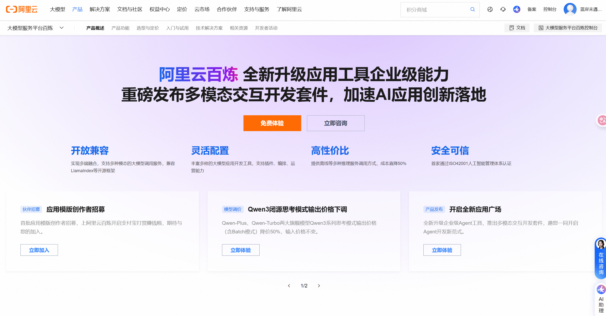
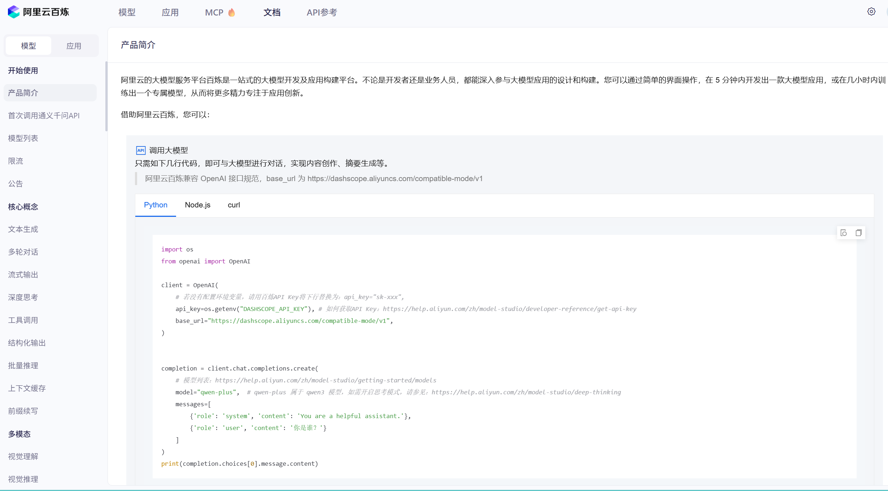
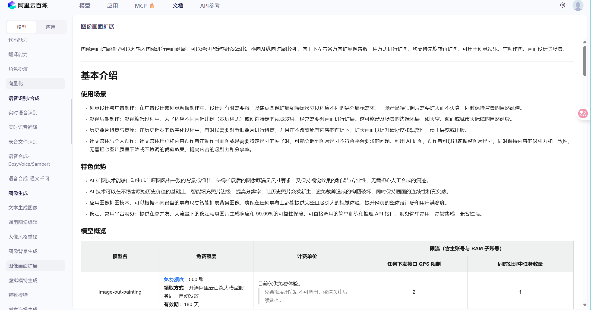
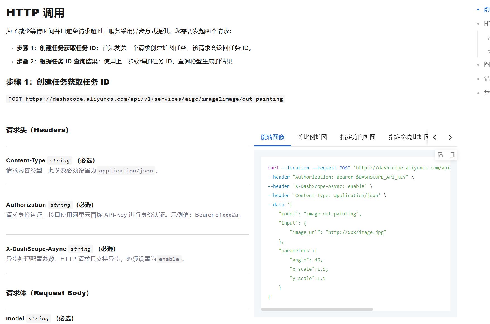
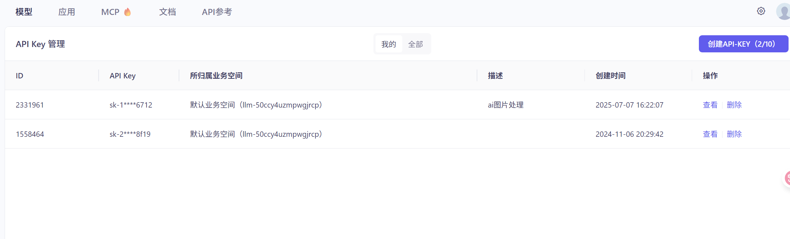
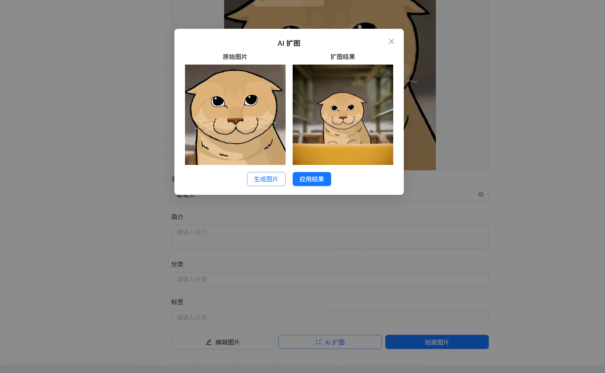

# Ai扩图

# 需求分析

### 需求分析

随着 AI؜ 的高速发展，AI 几乎可以应用到任何传统业务中，增强应用的功能，带给用户更好的体验。

对于图库网站؜来说，AI 也有非常多的应用空间，比如可以利用 AI 绘图大模型来编辑图片，实现扩图、擦除补全、图配文、去水印等功能。

以 AI 扩图功؜能为例，让我们来学习如何在项目中快速接入 AI 绘图大模型。用户可以选择一张已上传的图片，通过 AI 编辑得到新的图片，并根据情况自行选择是否保存。

# 方案设计

## Ai绘图大模型选择

AI 绘图؜大模型我们自己是搞不来的，可以选择一个市面上支持 AI 绘图的大模型。

选择 AI ؜大模型时，我们最关注的应该是生成效果、生成速度还有价格了吧？当然，对我们学习来说，最关注的还是价格，毕竟绘画大模型的费用不低。

国外比较知名的就是 Midjourney，不过不仅开发对接麻烦，价格也比较贵。国内的 AI 绘图大模型比较推荐 [阿里云百炼](https://click.aliyun.com/m/1000400273/) ，它是一站式的大模型开发及应用构建平台，可以通过简单的界面操作，在 5 分钟内开发出一款大模型应用，并在线体验效果。



创建好应用؜后，利用官方提供的 API 或 SDK，直接通过几行代码，就能在项目中使用大模型应用：



通过阅读文档发现，是支持ai扩图的，免费额度只有500张，不过用于学习是够用了



## 调用方式

通过阅读 [AI 图像扩展的官方文档](https://click.aliyun.com/m/1000400274/)，我们发现，API 只支持异步方式调用。



这是因为 AI 绘画任务计؜算量大且耗时长，同步调用会导致服务器线程长时间被单个任务占用，限制了并发处理能力，增加了超时和系统崩溃的风险。通过异步调用，服务器可以将任务放入队列中，合理调度资源，避免阻塞主线程，从而更高效地服务多个用户请求，提升整体系统的稳定性和可扩展性。

由于 AI 接口؜已经选择了异步调用，所以我们作为要调用 AI 接口的客户端，要使用轮询的方式来检查任务状态是否为 “已完成”，如果完成了，才可以获取到生成的图片。

**那么是前端轮询还是后端轮询呢？**

1. 前端轮询

前端调用后؜端提交任务后得到任务 ID，然后通过定时器轮询请求查询任务状态接口，直到任务完成或失败。示例代码：


```JavaScript
// 提交任务
async function submitTask() {
  const response = await fetch('/api/createTask', { method: 'POST' });
  const { taskId } = await response.json();
  checkTaskStatus(taskId);
}

// 调用
submitTask();

// 检查任务状态
async function checkTaskStatus(taskId) {
  const intervalId = setInterval(async () => {
    const response = await fetch(`/api/taskStatus?taskId=${taskId}`);
    const { status, result } = await response.json();

    if (status === 'success') {
      console.log('Task completed:', result);
      clearInterval(intervalId); // 停止轮询
    } else if (status === 'failed') {
      console.error('Task failed');
      clearInterval(intervalId); // 停止轮询
    }
  }, 2000); // 每隔 2 秒轮询
}

```

1. 后端轮询

后端通过循؜环或定时任务检测任务状态，接口保持阻塞，直到任务完成或失败，直接返回结果给前端。示例代码：


```Java
@RestController
public class TaskController {

    @PostMapping("/createTask")
    public String createTask() {
        String taskId = taskService.submitTask();
        return taskId;
    }

    @GetMapping("/waitForTask")
    public ResponseEntity<String> waitForTask(@RequestParam String taskId) {
        while (true) {
            String status = taskService.checkTaskStatus(taskId);

            if ("success".equals(status)) {
                return ResponseEntity.ok("Task completed");
            } else if ("failed".equals(status)) {
                return ResponseEntity.status(HttpStatus.INTERNAL_SERVER_ERROR).body("Task failed");
            }

            try {
                Thread.sleep(2000); // 等待 2 秒后重试
            } catch (InterruptedException e) {
                return ResponseEntity.status(HttpStatus.INTERNAL_SERVER_ERROR).body("Error occurred");
            }
        }
    }
}

```

显然，后端轮询容易因为任务阻塞导致资源耗尽，所以通常推荐 前端轮询。除非有明确的需求要求时，才考虑后端轮询，比如任务结果需实时返回且对网络请求数敏感。（或者学习时不想写前端）

此处我们也选择前端轮询方案实现。

💡 从这个方案设计؜中，我们也能感受到，如果你同时了解前端和后端，可以结合二者设计出更合理的方案，而不是把所有的 “重担” 都交给前端或者后端一方。所以企业中开需求评审会或者讨论方案时，前后端需要紧密协作。

下面进入开发。

# 后端开发

## 获取Ai扩图API

首先开发业务依赖的基础能力，也就是 AI 扩图 API。

1. 需要先进入 [阿里云百炼控制台](https://click.aliyun.com/m/1000400275/) 开通服务：



1. 开通之后，我们要在控制台获取 API Key，可 [参考文档](https://click.aliyun.com/m/1000400408/)

能够在控制؜台查看到 API Key，注意，API Key 一定不要对外泄露！

通过阅读文档发现，百炼支持通过 SDK 或 HTTP 调用。虽然官方写的支持 Java SDK，但 AI 扩图功能中对 SDK 的介绍非常少，此处考虑到兼容性，我们还是 使用 HTTP 调用。

1. 在配置文件中填写获取到的 apiKey：


```YAML
# 阿里云 AI 配置
aliYunAi:
    apiKey: xxxx
```

1. 新建数据模型类

在 `api` 包下新建 `aliyunai` 包，存放阿里云 AI 相关代码。

在 `aliyunai.model` 包下新建数据模型类，可以让 AI 根据官方文档中的请求响应信息自动生成，无需自己手动编写。

由于每个 ؜AI 图片处理操作的请求响应都有一些区别，所以单独给 AI 扩图功能编写具体的请求响应类。

创建扩图任务请求类：


```Java
@Datapublic class CreateOutPaintingTaskRequest implements Serializable {

    /**
     * 模型，例如 "image-out-painting"
     */private String model = "image-out-painting";

    /**
     * 输入图像信息
     */private Input input;

    /**
     * 图像处理参数
     */private Parameters parameters;

    @Datapublic static class Input {
        /**
         * 必选，图像 URL
         */@Alias("image_url")private String imageUrl;
    }

    @Datapublic static class Parameters implements Serializable {
        /**
         * 可选，逆时针旋转角度，默认值 0，取值范围 [0, 359]
         */private Integer angle;

        /**
         * 可选，输出图像的宽高比，默认空字符串，不设置宽高比
         * 可选值：["", "1:1", "3:4", "4:3", "9:16", "16:9"]
         */@Alias("output_ratio")private String outputRatio;

        /**
         * 可选，图像居中，在水平方向上按比例扩展，默认值 1.0，范围 [1.0, 3.0]
         */@Alias("x_scale")@JsonProperty("xScale")private Float xScale;

        /**
         * 可选，图像居中，在垂直方向上按比例扩展，默认值 1.0，范围 [1.0, 3.0]
         */@Alias("y_scale")@JsonProperty("yScale")private Float yScale;

        /**
         * 可选，在图像上方添加像素，默认值 0
         */@Alias("top_offset")private Integer topOffset;

        /**
         * 可选，在图像下方添加像素，默认值 0
         */@Alias("bottom_offset")private Integer bottomOffset;

        /**
         * 可选，在图像左侧添加像素，默认值 0
         */@Alias("left_offset")private Integer leftOffset;

        /**
         * 可选，在图像右侧添加像素，默认值 0
         */@Alias("right_offset")private Integer rightOffset;

        /**
         * 可选，开启图像最佳质量模式，默认值 false
         * 若为 true，耗时会成倍增加
         */@Alias("best_quality")private Boolean bestQuality;

        /**
         * 可选，限制模型生成的图像文件大小，默认值 true
         * - 单边长度 <= 10000：输出图像文件大小限制为 5MB 以下
         * - 单边长度 > 10000：输出图像文件大小限制为 10MB 以下
         */@Alias("limit_image_size")private Boolean limitImageSize;

        /**
         * 可选，添加 "Generated by AI" 水印，默认值 true
         */@Alias("add_watermark")private Boolean addWatermark = false;
    }
}
```

注意，上述代码中，某些字段打上了 Hutool 工具类的 `@Alias` 注解，这个注解仅对 Hutool 的 JSON 转换生效，对 SpringMVC 的 JSON 转换没有任何影响。

💡 这里有一个巨坑的地方！经过测试发现，前端如果传递参数名 xScale，是无法赋值给 xScale 字段的；但是传递参数名 xscale，就可以赋值。这是因为 SpringMVC 对于第二个字母是大写的参数无法映射（和参数类别无关），[参考博客](https://blog.csdn.net/JokerHH/article/details/88729590)。

解决方案是，给这些字段增加 `@JsonProperty` 注解：


```Java
/**
 * 可选，图像居中，在水平方向上按比例扩展，默认值 1.0，范围 [1.0, 3.0]
 */@Alias("x_scale")
 @JsonProperty("xScale")
 private Float xScale;

/**
 * 可选，图像居中，在垂直方向上按比例扩展，默认值 1.0，范围 [1.0, 3.0]
 */
 @Alias("y_scale")
 @JsonProperty("yScale")
 private Float yScale;
```

为什么 SpringMVC 要这样设计呢？这是因为 Jackson 在处理字段名与 JSON 属性名映射时，会依赖 Java 的 标准命名规范 和 反射 API。

举个例子，根据 JavaBean 的规范，属性名称与其访问器方法（getter 和 setter）之间的映射规则是：如果属性名以小写字母开头，第二个字母是大写（如 `eMail`），规范仍认为属性名称是 `eMail`，而访问器方法应为 `geteMail()` 和 `seteMail()`。但 Jackson 会尝试推断属性名为 `email`（因为 `eMail` 不常见），从而导致 JSON 中 `eMail` 或 `email` 可能无法正确映射。

创建扩图任务响应类：


```Java
@Data
@NoArgsConstructor
@AllArgsConstructor
public class CreateOutPaintingTaskResponse {

    private Output output;

    /**
     * 表示任务的输出信息
     */@Datapublic static class Output {

        /**
         * 任务 ID
         */private String taskId;

        /**
         * 任务状态
         * <ul>
         *     <li>PENDING：排队中</li>
         *     <li>RUNNING：处理中</li>
         *     <li>SUSPENDED：挂起</li>
         *     <li>SUCCEEDED：执行成功</li>
         *     <li>FAILED：执行失败</li>
         *     <li>UNKNOWN：任务不存在或状态未知</li>
         * </ul>
         */private String taskStatus;
    }

    /**
     * 接口错误码。
     * <p>接口成功请求不会返回该参数。</p>
     */private String code;

    /**
     * 接口错误信息。
     * <p>接口成功请求不会返回该参数。</p>
     */private String message;

    /**
     * 请求唯一标识。
     * <p>可用于请求明细溯源和问题排查。</p>
     */private String requestId;

}
```

查询任务响应类：


```Java
@Data
@NoArgsConstructor
@AllArgsConstructorpublic 
class GetOutPaintingTaskResponse {

    /**
     * 请求唯一标识
     */private String requestId;

    /**
     * 输出信息
     */private Output output;

    /**
     * 表示任务的输出信息
     */@Datapublic static class Output {

        /**
         * 任务 ID
         */private String taskId;

        /**
         * 任务状态
         * <ul>
         *     <li>PENDING：排队中</li>
         *     <li>RUNNING：处理中</li>
         *     <li>SUSPENDED：挂起</li>
         *     <li>SUCCEEDED：执行成功</li>
         *     <li>FAILED：执行失败</li>
         *     <li>UNKNOWN：任务不存在或状态未知</li>
         * </ul>
         */private String taskStatus;

        /**
         * 提交时间
         * 格式：YYYY-MM-DD HH:mm:ss.SSS
         */private String submitTime;

        /**
         * 调度时间
         * 格式：YYYY-MM-DD HH:mm:ss.SSS
         */private String scheduledTime;

        /**
         * 结束时间
         * 格式：YYYY-MM-DD HH:mm:ss.SSS
         */private String endTime;

        /**
         * 输出图像的 URL
         */private String outputImageUrl;

        /**
         * 接口错误码
         * <p>接口成功请求不会返回该参数</p>
         */private String code;

        /**
         * 接口错误信息
         * <p>接口成功请求不会返回该参数</p>
         */private String message;

        /**
         * 任务指标信息
         */private TaskMetrics taskMetrics;
    }

    /**
     * 表示任务的统计信息
     */@Datapublic static class TaskMetrics {

        /**
         * 总任务数
         */private Integer total;

        /**
         * 成功任务数
         */private Integer succeeded;

        /**
         * 失败任务数
         */private Integer failed;
    }
}
```

5）开发 ؜API 调用类，通过 Hutool 的 HTTP 请求工具类来调用阿里云百炼的 API：


```Java
@Slf4j@Componentpublic class AliYunAiApi {
    // 读取配置文件@Value("${aliYunAi.apiKey}")private String apiKey;

    // 创建任务地址public static final String CREATE_OUT_PAINTING_TASK_URL = "https://dashscope.aliyuncs.com/api/v1/services/aigc/image2image/out-painting";

    // 查询任务状态public static final String GET_OUT_PAINTING_TASK_URL = "https://dashscope.aliyuncs.com/api/v1/tasks/%s";

    /**
     * 创建任务
     *
     * @param createOutPaintingTaskRequest
     * @return
     */public CreateOutPaintingTaskResponse createOutPaintingTask(CreateOutPaintingTaskRequest createOutPaintingTaskRequest) {
        if (createOutPaintingTaskRequest == null) {
            throw new BusinessException(ErrorCode.OPERATION_ERROR, "扩图参数为空");
        }
        // 发送请求HttpRequest httpRequest = HttpRequest.post(CREATE_OUT_PAINTING_TASK_URL)
                .header(Header.AUTHORIZATION, "Bearer " + apiKey)
                // 必须开启异步处理，设置为enable。
                .header("X-DashScope-Async", "enable")
                .header(Header.CONTENT_TYPE, ContentType.JSON.getValue())
                .body(JSONUtil.toJsonStr(createOutPaintingTaskRequest));
        try (HttpResponse httpResponse = httpRequest.execute()) {
            if (!httpResponse.isOk()) {
                log.error("请求异常：{}", httpResponse.body());
                throw new BusinessException(ErrorCode.OPERATION_ERROR, "AI 扩图失败");
            }
            CreateOutPaintingTaskResponse response = JSONUtil.toBean(httpResponse.body(), CreateOutPaintingTaskResponse.class);
            String errorCode = response.getCode();
            if (StrUtil.isNotBlank(errorCode)) {
                String errorMessage = response.getMessage();
                log.error("AI 扩图失败，errorCode:{}, errorMessage:{}", errorCode, errorMessage);
                throw new BusinessException(ErrorCode.OPERATION_ERROR, "AI 扩图接口响应异常");
            }
            return response;
        }
    }

    /**
     * 查询创建的任务
     *
     * @param taskId
     * @return
     */public GetOutPaintingTaskResponse getOutPaintingTask(String taskId) {
        if (StrUtil.isBlank(taskId)) {
            throw new BusinessException(ErrorCode.OPERATION_ERROR, "任务 id 不能为空");
        }
        try (HttpResponse httpResponse = HttpRequest.get(String.format(GET_OUT_PAINTING_TASK_URL, taskId))
                .header(Header.AUTHORIZATION, "Bearer " + apiKey)
                .execute()) {
            if (!httpResponse.isOk()) {
                throw new BusinessException(ErrorCode.OPERATION_ERROR, "获取任务失败");
            }
            return JSONUtil.toBean(httpResponse.body(), GetOutPaintingTaskResponse.class);
        }
    }
}
```

注意，要按؜照官方文档的要求给请求头增加鉴权信息，拼接配置中写好的 apiKey

## 扩图服务

在 `model.dto.picture` 包下新建 AI 扩图请求类，用于接受前端传来的参数并传递给 Service 服务层。字段包括图片 id 和扩图参数：


```Java
@Datapublic class CreatePictureOutPaintingTaskRequest implements Serializable {

    /**
     * 图片 id
     */private Long pictureId;

    /**
     * 扩图参数
     */private CreateOutPaintingTaskRequest.Parameters parameters;

    private static final long serialVersionUID = 1L;
}
```

在图片服务中编写创؜建扩图任务方法，从数据库中获取图片信息和 url 地址，构造请求参数后调用 api 创建扩图任务。注意，如果图片有空间 id，则需要校验权限，直接复用以前的权限校验方法。


```Java
@Overridepublic CreateOutPaintingTaskResponse createPictureOutPaintingTask(CreatePictureOutPaintingTaskRequest createPictureOutPaintingTaskRequest, User loginUser) {
    // 获取图片信息Long pictureId = createPictureOutPaintingTaskRequest.getPictureId();
    Picture picture = Optional.ofNullable(this.getById(pictureId))
            .orElseThrow(() -> new BusinessException(ErrorCode.NOT_FOUND_ERROR));
    // 权限校验
    checkPictureAuth(loginUser, picture);
    // 构造请求参数CreateOutPaintingTaskRequest taskRequest = new CreateOutPaintingTaskRequest();
    CreateOutPaintingTaskRequest.Input input = new CreateOutPaintingTaskRequest.Input();
    input.setImageUrl(picture.getUrl());
    taskRequest.setInput(input);
    BeanUtil.copyProperties(createPictureOutPaintingTaskRequest, taskRequest);
    // 创建任务return aliYunAiApi.createOutPaintingTask(taskRequest);
}
```

## 扩图接口

在 Pic؜tureController 添加 AI 扩图接口，包括创建任务和查询任务状态接口：


```Java
/**
 * 创建 AI 扩图任务
 */@PostMapping("/out_painting/create_task")public BaseResponse<CreateOutPaintingTaskResponse> createPictureOutPaintingTask(
        @RequestBody CreatePictureOutPaintingTaskRequest createPictureOutPaintingTaskRequest,
        HttpServletRequest request) {
    if (createPictureOutPaintingTaskRequest == null || createPictureOutPaintingTaskRequest.getPictureId() == null) {
        throw new BusinessException(ErrorCode.PARAMS_ERROR);
    }
    User loginUser = userService.getLoginUser(request);
    CreateOutPaintingTaskResponse response = pictureService.createPictureOutPaintingTask(createPictureOutPaintingTaskRequest, loginUser);
    return ResultUtils.success(response);
}

/**
 * 查询 AI 扩图任务
 */@GetMapping("/out_painting/get_task")public BaseResponse<GetOutPaintingTaskResponse> getPictureOutPaintingTask(String taskId) {
    ThrowUtils.throwIf(StrUtil.isBlank(taskId), ErrorCode.PARAMS_ERROR);
    GetOutPaintingTaskResponse task = aliYunAiApi.getOutPaintingTask(taskId);
    return ResultUtils.success(task);
}
```

# 前端开发

可以参考基؜础编辑图片的交互流程，在编辑图片按钮旁边添加 AI 扩图按钮，点击之后显示弹窗进行 AI 扩图操作。

这样可以将؜ AI 操作的逻辑封装到单独的组件中，让创建图片页面的代码更精简。

## AI 扩图弹窗

1. 先复制؜之前开发好的裁剪图片弹窗，保留控制弹窗显示隐藏的逻辑，修改弹窗的标题：


```PlainText
<template>
  <a-modal
    class="image-out-painting"
    v-model:visible="visible"
    title="AI 扩图"
    :footer="false"
    @cancel="closeModal"
  >

  </a-modal>
</template>

<script setup lang="ts">
import { ref } from 'vue'
import { uploadPictureUsingPost } from '@/api/pictureController'
import { message } from 'ant-design-vue'

interface Props {
  picture?: API.PictureVO
  spaceId?: number
  onSuccess?: (newPicture: API.PictureVO) => void
}

const props = defineProps<Props>()

// 是否可见
const visible = ref(false)

// 打开弹窗
const openModal = () => {
  visible.value = true
}

// 关闭弹窗
const closeModal = () => {
  visible.value = false
}

// 暴露函数给父组件
defineExpose({
  openModal,
})
</script>

<style scoped>
.image-out-painting {
  text-align: center;
}
</style>
```

由于 AI؜ 扩图一定是对已有图片进行编辑，所以弹窗的属性可以不需要 spaceId。

1. 开发弹؜窗的内容，采用一行两列栅格布局，左边显示原始图片、右边显示扩图结果，下方展示扩图操作按钮。


```PlainText
<a-row gutter="16">
  <a-col span="12">
    <h4>原始图片</h4>
    
  </a-col>
  <a-col span="12">
    <h4>扩图结果</h4>
    
  </a-col>
</a-row>
<div style="margin-bottom: 16px" />
<a-flex gap="16" justify="center">
  <a-button type="primary" ghost @click="createTask">生成图片</a-button>
  <a-button type="primary" @click="handleUpload">应用结果</a-button>
</a-flex>
```

定义变量，用于存储图片结果：


```TypeScript
const resultImageUrl = ref<string>()
```

1. 编写创建任务函数：


```TypeScript
// 任务 idlet taskId = ref<string>()

/**
 * 创建任务
 */const createTask = async () => {
  if (!props.picture?.id) {
    return
  }
  const res = await createPictureOutPaintingTaskUsingPost({
    pictureId: props.picture.id,
    // 可以根据需要设置扩图参数parameters: {
      xScale: 2,
      yScale: 2,
    },
  })
  if (res.data.code === 0 && res.data.data) {
    message.success('创建任务成功，请耐心等待，不要退出界面')
    console.log(res.data.data.output.taskId)
    taskId.value = res.data.data.output.taskId// 开启轮询startPolling()
  } else {
    message.error('创建任务失败，' + res.data.message)
  }
}
```

任务创建成؜功后，要开启轮询。         ‌                  ‍     

1. 编写轮؜询逻辑。注意无论任务执行成功或失败、还是退出当前页面时，都需要执行清理逻辑，包括：

* 清理定时器
* 将定时器变量设置为 null
* 将任务 id 设置为 null，这样允许前端多次执行任务

代码如下：


```TypeScript
// 轮询定时器let pollingTimer: NodeJS.Timeout = null// 清理轮询定时器const clearPolling = () => {
  if (pollingTimer) {
    clearInterval(pollingTimer)
    pollingTimer = null
    taskId.value = null
  }
}

// 开始轮询const startPolling = () => {
  if (!taskId.value) return

  pollingTimer = setInterval(async () => {
    try {
      const res = await getPictureOutPaintingTaskUsingGet({
        taskId: taskId.value,
      })
      if (res.data.code === 0 && res.data.data) {
        const taskResult = res.data.data.outputif (taskResult.taskStatus === 'SUCCEEDED') {
          message.success('扩图任务成功')
          resultImageUrl.value = taskResult.outputImageUrlclearPolling()
        } else if (taskResult.taskStatus === 'FAILED') {
          message.error('扩图任务失败')
          clearPolling()
        }
      }
    } catch (error) {
      console.error('轮询任务状态失败', error)
      message.error('检测任务状态失败，请稍后重试')
      clearPolling()
    }
  }, 3000) // 每隔 3 秒轮询一次
}

// 清理定时器，避免内存泄漏onUnmounted(() => {
  clearPolling()
})
```

5）当任务执行成功؜后，可以得到图片结果，此时就可以点击 “应用结果” 按钮，调用图片 URL 上传接口。这段代码可以直接复制已开发的 URL 图片上传组件，补充 loading 效果：


```TypeScript
const uploadLoading = ref<boolean>(false)

const handleUpload = async () => {
  uploadLoading.value = truetry {
    const params: API.PictureUploadRequest = {
      fileUrl: resultImageUrl.value,
      spaceId: props.spaceId,
    }
    if (props.picture) {
      params.id = props.picture.id
    }
    const res = await uploadPictureByUrlUsingPost(params)
    if (res.data.code === 0 && res.data.data) {
      message.success('图片上传成功')
      // 将上传成功的图片信息传递给父组件
      props.onSuccess?.(res.data.data)
      // 关闭弹窗closeModal()
    } else {
      message.error('图片上传失败，' + res.data.message)
    }
  } catch (error) {
    message.error('图片上传失败')
  } finally {
    uploadLoading.value = false
  }
}
```

1）适当对页面做一些优化。

给生成图片按钮؜添加任务执行的 loading 效果，有任务 id 时，禁止按钮点击，可以防止重复提交任务。扩图结束后，会清理 taskId，就可以再次执行。


```PlainText
<a-button type="primary" :loading="!!taskId" ghost 
  @click="createTask">
  生成图片
</a-button>
```

2）添加应用结果（上传图片时）的 loading 效果：R7zfQ2yjmCwaGmgYTa9cW+7DK0YPbs0kpW2reaJf93o=


```PlainText
<a-button type="primary" :loading="uploadLoading" 
  @click="handleUpload">
  应用结果
</a-button>
```

3）有图片结果时才显示 “应用结果” 按钮：


```PlainText
<a-button type="primary" v-if="resultImageUrl" 
  :loading="uploadLoading" 
  @click="handleUpload">
  应用结果
</a-button>
```

## 创建图片页面引入弹窗

在创建图片؜页面使用组件，可以在编辑图片按钮右侧增加 “AI 扩图”，点击按钮后打开弹窗：


```PlainText
<a-space size="middle">
  <a-button :icon="h(EditOutlined)" @click="doEditPicture">编辑图片</a-button>
  <a-button type="primary" ghost :icon="h(FullscreenOutlined)" @click="doImagePainting">
    AI 扩图
  </a-button>
</a-space>
<ImageOutPainting
  ref="imageOutPaintingRef"
  :picture="picture"
  :spaceId="spaceId"
  :onSuccess="onImageOutPaintingSuccess"
/>
```

编辑点击按钮后触发的函数，打开弹窗：


```TypeScript
// AI 扩图弹窗引用const imageOutPaintingRef = ref()

// AI 扩图const doImagePainting = () => {
  if (imageOutPaintingRef.value) {
    imageOutPaintingRef.value.openModal()
  }
}

// 编辑成功事件const onImageOutPaintingSuccess = (newPicture: API.PictureVO) => {
  picture.value = newPicture
}
```

运行效果如图：




