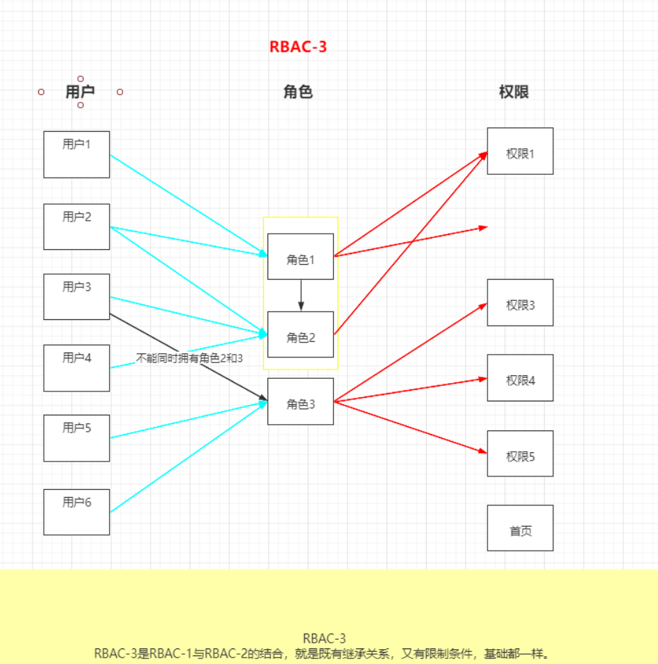
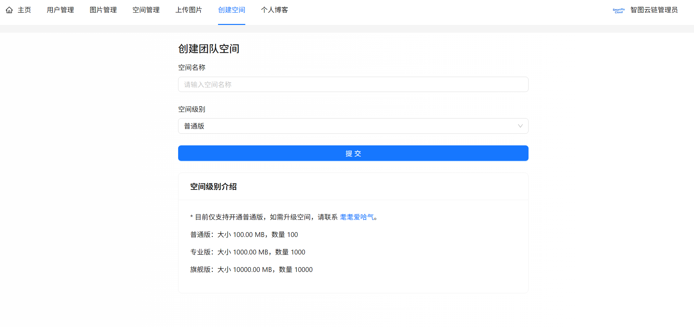
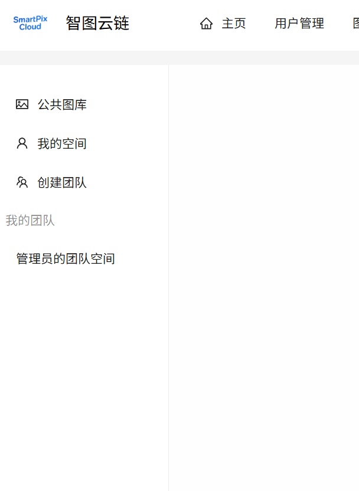
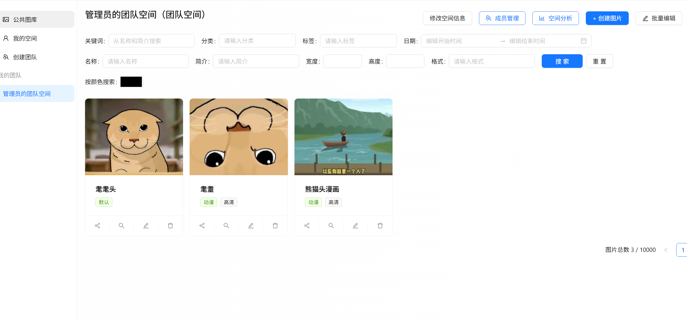
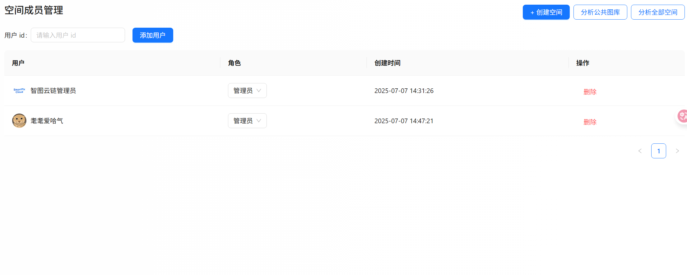

# 团队空间

我们现在将进行项目第三阶段 —— 团队空间的开发，让项目能够面向 B 端（企业）提供服务，比如作为团队共享素材、团队活动相册等，增强项目的商业价值。

本节先给项目增加团队共享空间的能力，大纲：

* 团队空间需求分析
* 团队空间方案设计
* 团队空间后端开发
* 团队空间前端开发

# 需求分析

之前我们已؜经完成了私有空间模块，团队空间和它类似，我们可以拆分为 4 个需求：

1）创建团队共享空间

用户可以创建 最多一个 团队共享空间，用于团队协作和资源共享，空间管理员拥有私有空间的所有能力，包括自由上传图片、检索图片、管理图片、分析空间等。

2）空间成员管理

* 成员邀请：空间管理员可以邀请新成员加入团队，共享空间内的图片。
* 设置权限：空间管理员可以为成员设置不同的角色（如查看者、编辑者、管理员），控制成员的权限范围。

3）空间成؜员权限控制：仅特定角色的成员可访问或操作团队空间内的图片。

4）空间数据管理：؜考虑到团队空间的图片数量可能比较多，可以对特定空间的数据进行单独的管理，而不是和公共图库、私有空间的图片混在一起。    

# 方案设计

让我们先依次分析上述需求，并思考对应的解决方案。

## 创建团队共享空间

之前已经开发了؜空间模块，团队空间可以直接复用私有空间的大多数能力。因此可以给空间表新增一个 spaceType 字段，用于区分私有和团队空间。


```SQL
ALTER TABLE space
    ADD COLUMN spaceType int default 0 not null comment '空间类型：0-私有 1-团队';

CREATE INDEX idx_spaceType ON space (spaceType);
```

## 空间成员管理

### 1、业务流程

为了让项目更容易扩展，减少原有代码的修改，我们约定 只有团队空间才有成员的概念。

1）成员邀؜请：空间管理员可以直接输入成员 id 来添加新成员，无需该用户确认，这样可以提高开发效率。

2）设置权؜限：空间管理员可以为已加入成员设置不同的角色，控制成员的权限范围，类似于编辑成员信息。

### 2、库表设计

由于空间和؜用户是多对多的关系，还要同时记录用户在某空间的角色，所以需要新建关联表：


```SQL
-- 空间成员表create table if not exists space_user
(
    id         bigint auto_increment comment 'id' primary key,
    spaceId    bigint                                 not null comment '空间 id',
    userId     bigint                                 not null comment '用户 id',
    spaceRole  varchar(128) default 'viewer'          null comment '空间角色：viewer/editor/admin',
    createTime datetime     default CURRENT_TIMESTAMP not null comment '创建时间',
    updateTime datetime     default CURRENT_TIMESTAMP not null on update CURRENT_TIMESTAMP comment '更新时间',
    -- 索引设计UNIQUE KEY uk_spaceId_userId (spaceId, userId), -- 唯一索引，用户在一个空间中只能有一个角色
    INDEX idx_spaceId (spaceId),                    -- 提升按空间查询的性能
    INDEX idx_userId (userId)                       -- 提升按用户查询的性能
) comment '空间用户关联' collate = utf8mb4_unicode_ci;
```

注意几个细节：

1. 给 spaceId 和 userId 添加唯一索引，确保同一用户在同一空间中只能有一个角色（不能重复加入）。由于有唯一键，不需要使用逻辑删除字段，否则无法退出后再重新加入。
2. 给关联字段添加索引，提高查询效率
3. 为了跟用户自身在项目中的角色 userRole 区分开，空间角色的名称使用 spaceRole

为保证逻辑的统一，创建团队空间时要自动将创建人作为空间管理员，保存到空间成员表中。

## 空间成员权限控制

仅特定角色的成员可访问或操作团队空间内的图片。

团队空间的权؜限管理可比私有空间的权限复杂多了，除了创建人外还有其他成员，涉及到查看图片、上传图片、管理空间图片、管理空间等多种不同的权限。

### 1、RBAC 权限控制

对于复杂的权限控制场景，我们可以采用经典的 RBAC 权限控制模型（基于角色的访问控制，Role-Based Access Control），核心概念包括 用户、角色、权限。

* 一个用户可以有多个角色
* 一个角色可以有多个权限

这样一来，就可以灵活地配置用户具有的权限了。



一般来说，标准的 RBA؜C 实现需要 5 张表：用户表、角色表、权限表、用户角色关联表、角色权限关联表，还是有一定开发成本的。由于我们的项目中，团队空间不需要那么多角色，可以简化 RBAC 的实现方式，比如将角色和权限直接定义到配置文件中。

### 2、角色和权限定义

本项目的角色：

本项目的权限：

角色与权限映射：

### 3、权限校验实现方案

RBAC ؜只是一种权限设计模型，我们在 Java 代码中如何实现权限校验呢？

1）最直接的؜方案是像之前校验私有空间权限一样，封装个团队空间的权限校验方法；或者类似用户权限校验一样，写个注解 + AOP 切面。

2）对于复杂؜的角色和权限管理，可以选用现成的第三方权限校验框架来实现，编写一套权限校验规则代码后，就能整体管理系统的权限校验逻辑了。

其实在本项目中，由于角色和权限不多，采用方案 1 实现会更方便一些，我也建议大家优先选择这种方案。方案 2 的代码量虽然未必比方案 1 少，但是会让整个系统的权限校验逻辑更加清晰，为了让大家后续能够应对更复杂的权限管理需求，此处使用方案 2，并选用国内主流的 [权限校验框架 Sa-Token](https://sa-token.cc/doc.html#/start/example) 实现。

## 空间数据管理

考虑到团队؜空间的图片数量可能比较多，可以对特定空间的数据进行单独的管理。

如何对数据进行单独的管理呢？

### 1、图片信息数据

可以给每个团队空间单独创建一张图片表 `picture_{spaceId}`，也就是分库分表中的 `分表`，而不是和公共图库、私有空间的图片混在一起。这样不仅查询空间内的图片效率更高，还便于整体管理和清理空间。但是要注意，仅对旗舰版空间生效，否则分表的数量会特别多，反而可能影响性能。

注意，我们要实现的，还不是普通的静态分表，而是会随着新增空间不断增加分表数量的动态分表，会使用分库分表框架 [Apache ShardingSphere](https://shardingsphere.apache.org/) 带大家实现。

### 2、图片文件数据

已经将每个؜空间的图片存到不同的路径中了，实现了隔离，无需额外开发。

# 后端开发

## 创建团队共享空间

### 1、数据模型

Space、؜SpaceVO、SpaceAddRequest、SpaceQueryRequest 补充 spaceType 字段：


```Java
/**
 * 空间类型：0-私有 1-团队
 */private Integer spaceType;
```

定义空间类型枚举：


```Java
@Getterpublic enum SpaceTypeEnum {

    PRIVATE("私有空间", 0),
    TEAM("团队空间", 1);

    private final String text;

    private final int value;

    SpaceTypeEnum(String text, int value) {
        this.text = text;
        this.value = value;
    }

    /**
     * 根据 value 获取枚举
     */public static SpaceTypeEnum getEnumByValue(Integer value) {
        if (ObjUtil.isEmpty(value)) {
            return null;
        }
        for (SpaceTypeEnum spaceTypeEnum : SpaceTypeEnum.values()) {
            if (spaceTypeEnum.value == value) {
                return spaceTypeEnum;
            }
        }
        return null;
    }
}
```

### 2、新建团队空间

可以直接复用创建空间的方法，只需要做一些改动即可。

1）创建空间时为空间类型指定默认值：


```Java
// 默认值if (StrUtil.isBlank(spaceAddRequest.getSpaceName())) {
    spaceAddRequest.setSpaceName("默认空间");
}
if (spaceAddRequest.getSpaceLevel() == null) {
    spaceAddRequest.setSpaceLevel(SpaceLevelEnum.COMMON.getValue());
}
if (spaceAddRequest.getSpaceType() == null) {
    spaceAddRequest.setSpaceType(SpaceTypeEnum.PRIVATE.getValue());
}
// 在此处将实体类和 DTO 进行转换Space space = new Space();
BeanUtils.copyProperties(spaceAddRequest, space);
// 填充数据this.fillSpaceBySpaceLevel(space);
```

2）validSpace 方法补充对空间类型的校验：


```Java
public void validSpace(Space space, boolean add) {
    Integer spaceType = space.getSpaceType();
    SpaceTypeEnum spaceTypeEnum = SpaceTypeEnum.getEnumByValue(spaceType);
    // 要创建if (add) {
        if (spaceType == null) {
            throw new BusinessException(ErrorCode.PARAMS_ERROR, "空间类型不能为空");
        }
    }
    // 修改数据时，如果要改空间级别if (spaceType != null && spaceTypeEnum == null) {
        throw new BusinessException(ErrorCode.PARAMS_ERROR, "空间类型不存在");
    }
}
```

3）限制每个普通用户仅能创建一个团队空间（管理员可以创建多个），由于普通用户也仅能创建一个私有空间，相当于 **普通用户每类空间只能创建 1 个。** 因此，只要在判断是否已创建空间时，补充 spaceType 作为查询条件即可：


```Java
Long newSpaceId = transactionTemplate.execute(status -> {
    if (!userService.isAdmin(loginUser)) {
        boolean exists = this.lambdaQuery()
                .eq(Space::getUserId, userId)
                .eq(Space::getSpaceType, spaceAddRequest.getSpaceType())
                .exists();
        ThrowUtils.throwIf(exists, ErrorCode.OPERATION_ERROR, "每个用户每类空间仅能创建一个");
    }
    // 写入数据库boolean result = this.save(space);
    ThrowUtils.throwIf(!result, ErrorCode.OPERATION_ERROR);
    // 返回新写入的数据 idreturn space.getId();
});
```

当然，这里؜的逻辑你可以自由调整，比如不允许用户创建团队空间，需要联系管理员或付费开通。

### 3、查询团队空间

给 Spa؜ceService 的 getQueryWrapper 方法补充 spaceType 的查询条件：


```Java
Integer spaceType = spaceQueryRequest.getSpaceType();
queryWrapper.eq(ObjUtil.isNotEmpty(spaceType), "spaceType", spaceType);
```

之后前端就能够按照空间类别获取空间列表了。

## 空间成员管理

空间成员管理的开发比较简单，其实就是 “增删改查”。

### 1、数据模型

1）首先利؜用 MyBatisX 插件生成空间成员表相关的基础代码，包括实体类、Mapper、Service。

用户模块中有讲解详细流程，此处不再赘述。

2）每个操作都需要提供一个请求类，都放在 `model.dto.spaceuser` 包下。

添加空间成员请求，给空间管理员使用：


```Java
@Datapublic class SpaceUserAddRequest implements Serializable {

    /**
     * 空间 ID
     */private Long spaceId;

    /**
     * 用户 ID
     */private Long userId;

    /**
     * 空间角色：viewer/editor/admin
     */private String spaceRole;

    private static final long serialVersionUID = 1L;
}
```

编辑空间成؜员请求，给空间管理员使用，可以设置空间成员的角色：


```Java
@Datapublic class SpaceUserEditRequest implements Serializable {

    /**
     * id
     */private Long id;

    /**
     * 空间角色：viewer/editor/admin
     */private String spaceRole;

    private static final long serialVersionUID = 1L;
}
```

查询空间成员请求，可以不用分页：


```Java
@Datapublic class SpaceUserQueryRequest implements Serializable {

    /**
     * ID
     */private Long id;

    /**
     * 空间 ID
     */private Long spaceId;

    /**
     * 用户 ID
     */private Long userId;

    /**
     * 空间角色：viewer/editor/admin
     */private String spaceRole;

    private static final long serialVersionUID = 1L;
}
```

3）在 `model.dto.vo` 下新建空间成员的视图包装类，可以额外关联空间信息和创建空间的用户信息。还可以编写 SpaceUser 实体类和该 VO 类的转换方法，便于后续快速传值。


```Java
@Datapublic class SpaceUserVO implements Serializable {

    /**
     * id
     */private Long id;

    /**
     * 空间 id
     */private Long spaceId;

    /**
     * 用户 id
     */private Long userId;

    /**
     * 空间角色：viewer/editor/admin
     */private String spaceRole;

    /**
     * 创建时间
     */private Date createTime;

    /**
     * 更新时间
     */private Date updateTime;

    /**
     * 用户信息
     */private UserVO user;

    /**
     * 空间信息
     */private SpaceVO space;

    private static final long serialVersionUID = 1L;

    /**
     * 封装类转对象
     *
     * @param spaceUserVO
     * @return
     */public static SpaceUser voToObj(SpaceUserVO spaceUserVO) {
        if (spaceUserVO == null) {
            return null;
        }
        SpaceUser spaceUser = new SpaceUser();
        BeanUtils.copyProperties(spaceUserVO, spaceUser);
        return spaceUser;
    }

    /**
     * 对象转封装类
     *
     * @param spaceUser
     * @return
     */public static SpaceUserVO objToVo(SpaceUser spaceUser) {
        if (spaceUser == null) {
            return null;
        }
        SpaceUserVO spaceUserVO = new SpaceUserVO();
        BeanUtils.copyProperties(spaceUser, spaceUserVO);
        return spaceUserVO;
    }
}
```

4）在 `model.enums` 包下新建空间角色枚举：


```Java
@Getterpublic enum SpaceRoleEnum {

    VIEWER("浏览者", "viewer"),
    EDITOR("编辑者", "editor"),
    ADMIN("管理员", "admin");

    private final String text;

    private final String value;

    SpaceRoleEnum(String text, String value) {
        this.text = text;
        this.value = value;
    }

    /**
     * 根据 value 获取枚举
     *
     * @param value 枚举值的 value
     * @return 枚举值
     */public static SpaceRoleEnum getEnumByValue(String value) {
        if (ObjUtil.isEmpty(value)) {
            return null;
        }
        for (SpaceRoleEnum anEnum : SpaceRoleEnum.values()) {
            if (anEnum.value.equals(value)) {
                return anEnum;
            }
        }
        return null;
    }

    /**
     * 获取所有枚举的文本列表
     *
     * @return 文本列表
     */public static List<String> getAllTexts() {
        return Arrays.stream(SpaceRoleEnum.values())
                .map(SpaceRoleEnum::getText)
                .collect(Collectors.toList());
    }

    /**
     * 获取所有枚举的值列表
     *
     * @return 值列表
     */public static List<String> getAllValues() {
        return Arrays.stream(SpaceRoleEnum.values())
                .map(SpaceRoleEnum::getValue)
                .collect(Collectors.toList());
    }
}
```

### 2、基础服务开发

可以参考图؜片服务的开发方法，完成 SpaceUserService 和实现类，大多数代码可以直接复用。

我们主要开发下列方法：

1）添加空间成员：


```Java
@Overridepublic long addSpaceUser(SpaceUserAddRequest spaceUserAddRequest) {
    // 参数校验
    ThrowUtils.throwIf(spaceUserAddRequest == null, ErrorCode.PARAMS_ERROR);
    SpaceUser spaceUser = new SpaceUser();
    BeanUtils.copyProperties(spaceUserAddRequest, spaceUser);
    validSpaceUser(spaceUser, true);
    // 数据库操作boolean result = this.save(spaceUser);
    ThrowUtils.throwIf(!result, ErrorCode.OPERATION_ERROR);
    return spaceUser.getId();
}
```

2）校验空间؜成员对象，增加 add 参数用来区分是创建数据时校验还是编辑时校验，判断条件是不一样的。比如创建成员时要检查用户是否存在。


```Java
@Overridepublic void validSpaceUser(SpaceUser spaceUser, boolean add) {
    ThrowUtils.throwIf(spaceUser == null, ErrorCode.PARAMS_ERROR);
    // 创建时，空间 id 和用户 id 必填Long spaceId = spaceUser.getSpaceId();
    Long userId = spaceUser.getUserId();
    if (add) {
        ThrowUtils.throwIf(ObjectUtil.hasEmpty(spaceId, userId), ErrorCode.PARAMS_ERROR);
        User user = userService.getById(userId);
        ThrowUtils.throwIf(user == null, ErrorCode.NOT_FOUND_ERROR, "用户不存在");
        Space space = spaceService.getById(spaceId);
        ThrowUtils.throwIf(space == null, ErrorCode.NOT_FOUND_ERROR, "空间不存在");
    }
    // 校验空间角色String spaceRole = spaceUser.getSpaceRole();
    SpaceRoleEnum spaceRoleEnum = SpaceRoleEnum.getEnumByValue(spaceRole);
    if (spaceRole != null && spaceRoleEnum == null) {
        throw new BusinessException(ErrorCode.PARAMS_ERROR, "空间角色不存在");
    }
}
```

还可以校验是否已添加该成员，可自行实现。

3）将查询؜请求对象转换为 MyBatis-Plus 的查询封装对象：


```Java
@Overridepublic QueryWrapper<SpaceUser> getQueryWrapper(SpaceUserQueryRequest spaceUserQueryRequest) {
    QueryWrapper<SpaceUser> queryWrapper = new QueryWrapper<>();
    if (spaceUserQueryRequest == null) {
        return queryWrapper;
    }
    // 从对象中取值Long id = spaceUserQueryRequest.getId();
    Long spaceId = spaceUserQueryRequest.getSpaceId();
    Long userId = spaceUserQueryRequest.getUserId();
    String spaceRole = spaceUserQueryRequest.getSpaceRole();
    queryWrapper.eq(ObjUtil.isNotEmpty(id), "id", id);
    queryWrapper.eq(ObjUtil.isNotEmpty(spaceId), "spaceId", spaceId);
    queryWrapper.eq(ObjUtil.isNotEmpty(userId), "userId", userId);
    queryWrapper.eq(ObjUtil.isNotEmpty(spaceRole), "spaceRole", spaceRole);
    return queryWrapper;
}
```

4）获取空间成员封装类，需要关联查询用户和空间的信息。

查询单个封装类：


```Java
@Overridepublic SpaceUserVO getSpaceUserVO(SpaceUser spaceUser, HttpServletRequest request) {
    // 对象转封装类SpaceUserVO spaceUserVO = SpaceUserVO.objToVo(spaceUser);
    // 关联查询用户信息Long userId = spaceUser.getUserId();
    if (userId != null && userId > 0) {
        User user = userService.getById(userId);
        UserVO userVO = userService.getUserVO(user);
        spaceUserVO.setUser(userVO);
    }
    // 关联查询空间信息Long spaceId = spaceUser.getSpaceId();
    if (spaceId != null && spaceId > 0) {
        Space space = spaceService.getById(spaceId);
        SpaceVO spaceVO = spaceService.getSpaceVO(space, request);
        spaceUserVO.setSpace(spaceVO);
    }
    return spaceUserVO;
}
```

查询封装类列表：


```Java
@Overridepublic List<SpaceUserVO> getSpaceUserVOList(List<SpaceUser> spaceUserList) {
    // 判断输入列表是否为空if (CollUtil.isEmpty(spaceUserList)) {
        return Collections.emptyList();
    }
    // 对象列表 => 封装对象列表
    List<SpaceUserVO> spaceUserVOList = spaceUserList.stream().map(SpaceUserVO::objToVo).collect(Collectors.toList());
    // 1. 收集需要关联查询的用户 ID 和空间 ID
    Set<Long> userIdSet = spaceUserList.stream().map(SpaceUser::getUserId).collect(Collectors.toSet());
    Set<Long> spaceIdSet = spaceUserList.stream().map(SpaceUser::getSpaceId).collect(Collectors.toSet());
    // 2. 批量查询用户和空间
    Map<Long, List<User>> userIdUserListMap = userService.listByIds(userIdSet).stream()
            .collect(Collectors.groupingBy(User::getId));
    Map<Long, List<Space>> spaceIdSpaceListMap = spaceService.listByIds(spaceIdSet).stream()
            .collect(Collectors.groupingBy(Space::getId));
    // 3. 填充 SpaceUserVO 的用户和空间信息
    spaceUserVOList.forEach(spaceUserVO -> {
        Long userId = spaceUserVO.getUserId();
        Long spaceId = spaceUserVO.getSpaceId();
        // 填充用户信息User user = null;
        if (userIdUserListMap.containsKey(userId)) {
            user = userIdUserListMap.get(userId).get(0);
        }
        spaceUserVO.setUser(userService.getUserVO(user));
        // 填充空间信息Space space = null;
        if (spaceIdSpaceListMap.containsKey(spaceId)) {
            space = spaceIdSpaceListMap.get(spaceId).get(0);
        }
        spaceUserVO.setSpace(SpaceVO.objToVo(space));
    });
    return spaceUserVOList;
}
```

### 3、接口开发

参考图片接؜口的开发方法，完成 SpaceUserController 类，大多数代码可以直接复用。

需要开发的接口包括：

* 添加成员到空间：仅拥有成员管理权限的用户可使用。
* 从空间移除成员：仅拥有成员管理权限的用户可使用。
* 查询某个成员在空间的信息：仅拥有成员管理权限的用户可使用。
* 查询空间成员列表：仅拥有成员管理权限的用户可使用。
* 编辑成员信息：仅拥有成员管理权限的用户可使用。
* 查询我加入的团队空间列表：所有已登录用户可使用。

由于我们后续会使用统一的权限管理框架，这个阶段可以先只实现功能，不进行权限校验。

代码如下：


```Java
@RestController@RequestMapping("/spaceUser")@Slf4jpublic class SpaceUserController {

    @Resourceprivate SpaceUserService spaceUserService;

    @Resourceprivate UserService userService;

    /**
     * 添加成员到空间
     */@PostMapping("/add")public BaseResponse<Long> addSpaceUser(@RequestBody SpaceUserAddRequest spaceUserAddRequest, HttpServletRequest request) {
        ThrowUtils.throwIf(spaceUserAddRequest == null, ErrorCode.PARAMS_ERROR);
        long id = spaceUserService.addSpaceUser(spaceUserAddRequest);
        return ResultUtils.success(id);
    }

    /**
     * 从空间移除成员
     */@PostMapping("/delete")public BaseResponse<Boolean> deleteSpaceUser(@RequestBody DeleteRequest deleteRequest,
                                                 HttpServletRequest request) {
        if (deleteRequest == null || deleteRequest.getId() <= 0) {
            throw new BusinessException(ErrorCode.PARAMS_ERROR);
        }
        long id = deleteRequest.getId();
        // 判断是否存在SpaceUser oldSpaceUser = spaceUserService.getById(id);
        ThrowUtils.throwIf(oldSpaceUser == null, ErrorCode.NOT_FOUND_ERROR);
        // 操作数据库boolean result = spaceUserService.removeById(id);
        ThrowUtils.throwIf(!result, ErrorCode.OPERATION_ERROR);
        return ResultUtils.success(true);
    }

    /**
     * 查询某个成员在某个空间的信息
     */@PostMapping("/get")public BaseResponse<SpaceUser> getSpaceUser(@RequestBody SpaceUserQueryRequest spaceUserQueryRequest) {
        // 参数校验
        ThrowUtils.throwIf(spaceUserQueryRequest == null, ErrorCode.PARAMS_ERROR);
        Long spaceId = spaceUserQueryRequest.getSpaceId();
        Long userId = spaceUserQueryRequest.getUserId();
        ThrowUtils.throwIf(ObjectUtil.hasEmpty(spaceId, userId), ErrorCode.PARAMS_ERROR);
        // 查询数据库SpaceUser spaceUser = spaceUserService.getOne(spaceUserService.getQueryWrapper(spaceUserQueryRequest));
        ThrowUtils.throwIf(spaceUser == null, ErrorCode.NOT_FOUND_ERROR);
        return ResultUtils.success(spaceUser);
    }

    /**
     * 查询成员信息列表
     */@PostMapping("/list")public BaseResponse<List<SpaceUserVO>> listSpaceUser(@RequestBody SpaceUserQueryRequest spaceUserQueryRequest,
                                                         HttpServletRequest request) {
        ThrowUtils.throwIf(spaceUserQueryRequest == null, ErrorCode.PARAMS_ERROR);
        List<SpaceUser> spaceUserList = spaceUserService.list(
                spaceUserService.getQueryWrapper(spaceUserQueryRequest)
        );
        return ResultUtils.success(spaceUserService.getSpaceUserVOList(spaceUserList));
    }

    /**
     * 编辑成员信息（设置权限）
     */@PostMapping("/edit")public BaseResponse<Boolean> editSpaceUser(@RequestBody SpaceUserEditRequest spaceUserEditRequest,
                                               HttpServletRequest request) {
        if (spaceUserEditRequest == null || spaceUserEditRequest.getId() <= 0) {
            throw new BusinessException(ErrorCode.PARAMS_ERROR);
        }
        // 将实体类和 DTO 进行转换SpaceUser spaceUser = new SpaceUser();
        BeanUtils.copyProperties(spaceUserEditRequest, spaceUser);
        // 数据校验
        spaceUserService.validSpaceUser(spaceUser, false);
        // 判断是否存在long id = spaceUserEditRequest.getId();
        SpaceUser oldSpaceUser = spaceUserService.getById(id);
        ThrowUtils.throwIf(oldSpaceUser == null, ErrorCode.NOT_FOUND_ERROR);
        // 操作数据库boolean result = spaceUserService.updateById(spaceUser);
        ThrowUtils.throwIf(!result, ErrorCode.OPERATION_ERROR);
        return ResultUtils.success(true);
    }

    /**
     * 查询我加入的团队空间列表
     */@PostMapping("/list/my")public BaseResponse<List<SpaceUserVO>> listMyTeamSpace(HttpServletRequest request) {
        User loginUser = userService.getLoginUser(request);
        SpaceUserQueryRequest spaceUserQueryRequest = new SpaceUserQueryRequest();
        spaceUserQueryRequest.setUserId(loginUser.getId());
        List<SpaceUser> spaceUserList = spaceUserService.list(
                spaceUserService.getQueryWrapper(spaceUserQueryRequest)
        );
        return ResultUtils.success(spaceUserService.getSpaceUserVOList(spaceUserList));
    }
}
```

### 4、创建团队空间时自动新增成员记录

根据需求，؜用户在创建团队空间时，会默认作为空间的管理员，需要在空间成员表中新增一条记录。

修改 ad؜dSpace 方法，在事务中补充插入空间成员记录：


```Java
// 写入数据库boolean result = this.save(space);
ThrowUtils.throwIf(!result, ErrorCode.OPERATION_ERROR);
// 如果是团队空间，关联新增团队成员记录if (SpaceTypeEnum.TEAM.getValue() == spaceAddRequest.getSpaceType()) {
    SpaceUser spaceUser = new SpaceUser();
    spaceUser.setSpaceId(space.getId());
    spaceUser.setUserId(userId);
    spaceUser.setSpaceRole(SpaceRoleEnum.ADMIN.getValue());
    result = spaceUserService.save(spaceUser);
    ThrowUtils.throwIf(!result, ErrorCode.OPERATION_ERROR, "创建团队成员记录失败");
}
// 返回新写入的数据 idreturn space.getId();
```

## 空间成员权限控制

引入团队空间后，需要؜给空间操作、图片操作、空间成员操作添加权限控制逻辑。为了简化开发，同时防止一些空间重要信息的修改冲突，空间操作（空间信息的增删改查）仍然复用之前私有空间的校验逻辑 —— 仅创建人可操作。

由于权限校验属于整个项目的公共服务，统一放在 `manager.auth` 包中。

### 1、权限定义

根据 RBAC 权限模型，需要定义角色和权限。

1）此处选用؜ JSON 配置文件来定义角色、权限、角色和权限之间的关系，相比从数据库表中获取，实现更方便，查询也更高效。

在 `resources/biz` 目录下新建 JSON 配置文件 `spaceUserAuthConfig.json`：


```JSON
{"permissions": [{"key": "spaceUser:manage","name": "成员管理","description": "管理空间成员，添加或移除成员"},{"key": "picture:view","name": "查看图片","description": "查看空间中的图片内容"},{"key": "picture:upload","name": "上传图片","description": "上传图片到空间中"},{"key": "picture:edit","name": "修改图片","description": "编辑已上传的图片信息"},{"key": "picture:delete","name": "删除图片","description": "删除空间中的图片"}],"roles": [{"key": "viewer","name": "浏览者","permissions": ["picture:view"],"description": "查看图片"},{"key": "editor","name": "编辑者","permissions": ["picture:view","picture:upload","picture:edit","picture:delete"],"description": "查看图片、上传图片、修改图片、删除图片"},{"key": "admin","name": "管理员","permissions": ["spaceUser:manage","picture:view","picture:upload","picture:edit","picture:delete"],"description": "成员管理、查看图片、上传图片、修改图片、删除图片"}]}
```

2）在 `auth.model` 包下新建数据模型，用于接收配置文件的值。

权限配置类：


```Java
@Datapublic class SpaceUserAuthConfig implements Serializable {

    /**
     * 权限列表
     */private List<SpaceUserPermission> permissions;

    /**
     * 角色列表
     */private List<SpaceUserRole> roles;

    private static final long serialVersionUID = 1L;
}
```

空间成员权限：


```Java
@Datapublic class SpaceUserPermission implements Serializable {

    /**
     * 权限键
     */private String key;

    /**
     * 权限名称
     */private String name;

    /**
     * 权限描述
     */private String description;

    private static final long serialVersionUID = 1L;

}
```

空间成员角色：


```Java
@Datapublic class SpaceUserRole implements Serializable {

    /**
     * 角色键
     */private String key;

    /**
     * 角色名称
     */private String name;

    /**
     * 权限键列表
     */private List<String> permissions;

    /**
     * 角色描述
     */private String description;

    private static final long serialVersionUID = 1L;
}
```

3）定义空间成员权限常量类，便于后续校验权限时使用：


```Java
public interface SpaceUserPermissionConstant {
    /**
     * 空间用户管理权限
     */String SPACE_USER_MANAGE = "spaceUser:manage";

    /**
     * 图片查看权限
     */String PICTURE_VIEW = "picture:view";

    /**
     * 图片上传权限
     */String PICTURE_UPLOAD = "picture:upload";

    /**
     * 图片编辑权限
     */String PICTURE_EDIT = "picture:edit";

    /**
     * 图片删除权限
     */String PICTURE_DELETE = "picture:delete";
}
```

4）在 `auth` 包下新建 SpaceUserAuthManager，可加载配置文件到对象，并提供根据角色获取权限列表的方法。


```Java
@Componentpublic class SpaceUserAuthManager {

    @Resourceprivate SpaceUserService spaceUserService;

    @Resourceprivate UserService userService;

    public static final SpaceUserAuthConfig SPACE_USER_AUTH_CONFIG;

    static {
        String json = ResourceUtil.readUtf8Str("biz/spaceUserAuthConfig.json");
        SPACE_USER_AUTH_CONFIG = JSONUtil.toBean(json, SpaceUserAuthConfig.class);
    }

    /**
     * 根据角色获取权限列表
     */public List<String> getPermissionsByRole(String spaceUserRole) {
        if (StrUtil.isBlank(spaceUserRole)) {
            return new ArrayList<>();
        }
        // 找到匹配的角色SpaceUserRole role = SPACE_USER_AUTH_CONFIG.getRoles().stream()
                .filter(r -> spaceUserRole.equals(r.getKey()))
                .findFirst()
                .orElse(null);
        if (role == null) {
            return new ArrayList<>();
        }
        return role.getPermissions();
    }
}
```

### 2、Sa-Token 入门

Sa-Token؜ 是一个轻量级 Java 权限认证框架，相比 Spring Security 等更加简单易学，用作者的话说，使用该框架可以让鉴权变得简单、优雅~

框架的学习并不难，参考 [官方文档](https://sa-token.cc/doc.html#/start/example) 就好，等下我们要学习实战 Sa-Token 的主流特性和高级用法。

1）引入 Sa-Token：


```XML
<!-- Sa-Token 权限认证 --><dependency><groupId>cn.dev33</groupId><artifactId>sa-token-spring-boot-starter</artifactId><version>1.39.0</version></dependency>
```

Sa-Token؜ 默认将数据（比如用户登录态）保存在内存中，此模式读写速度最快，且避免了序列化与反序列化带来的性能消耗，但缺点是重启后数据会丢失、无法在分布式环境中共享数据。

我们项目中既然已经使用了 Redis，那么可以 [参考官方文档](https://sa-token.cc/doc.html#/up/integ-redis) 让 Sa-Token 整合 Redis，将用户的登录态等内容保存在 Redis 中。

此处选择 ؜jackson 序列化方式整合 Redis，这样存到 Redis 的数据是可读的：


```XML
<!-- Sa-Token 整合 Redis （使用 jackson 序列化方式） --><dependency><groupId>cn.dev33</groupId><artifactId>sa-token-redis-jackson</artifactId><version>1.39.0</version></dependency><!-- 提供Redis连接池 --><dependency><groupId>org.apache.commons</groupId><artifactId>commons-pool2</artifactId></dependency>
```

2）了解 Sa-Token 的基本用法

Sa-To؜ken 的使用方式比较简单，首先是用户登录时调用 login 方法，产生一个新的会话：


```Java
StpUtil.login(10001);
```

还可以给会话保存一些信息，比如登录用户的信息：OV4I80kv0cP2dox35o771C+j0cD0caQ3fcjbjWSOsKU=


```Java
StpUtil.getSession().set("user", user)
```

接下来你就؜可以判断用户是否登录、获取用户信息了，可以通过代码进行判断：


```Java
// 检验当前会话是否已经登录, 如果未登录，则抛出异常：`NotLoginException`
StpUtil.checkLogin();
// 获取用户信息
StpUtil.getSession().get("user");
```

也可以参考 [官方文档](https://sa-token.cc/doc.html#/use/at-check)，使用注解进行鉴权：


```Java
// 登录校验：只有登录之后才能进入该方法 @SaCheckLogin                        
@RequestMapping("info")public String info() {
    return "查询用户信息";
}
```

这是 Sa؜-Token 最基本的用法，下面我们正式在项目中使用 Sa-Token。

### 3、新建空间账号体系

目前，我们的项目؜中其实存在两套权限校验体系。一套是最开始就有的，对 user 表的角色进行校验，分为普通用户和管理员；另一套是本节新学习的，对团队空间的权限进行校验。

为了更轻松地扩展؜项目，减少对原有代码的改动，我们原有的 user 表权限校验依然使用自定义注解 + AOP 的方式实现。而团队空间权限校验，采用 Sa-Token 来管理。

相当于我们؜不是整个项目都交给 Sa-Token，只是把 Sa-Token 当做实现团队空间权限管理的工具罢了。

这种同一项目有多账号体系的情况下，不建议使用 Sa-Token 默认的账号体系，而是使用 Sa-Token 提供的 [多账号认证特性](https://sa-token.cc/doc.html#/up/many-account?id=_5%e3%80%81kit%e6%a8%a1%e5%bc%8f)，可以将多套账号的授权给区分开，让它们互不干扰。

1）可以参考官方文档，使用 [Kit 模式](https://sa-token.cc/doc.html#/up/many-account?id=_5%e3%80%81kit%e6%a8%a1%e5%bc%8f) 实现多账号认证，在 `auth` 包下新建 `StpKit.java`，定义空间账号体系：


```Java
/**
 * StpLogic 门面类，管理项目中所有的 StpLogic 账号体系
 * 添加 @Component 注解的目的是确保静态属性 DEFAULT 和 SPACE 被初始化
 */@Componentpublic class StpKit {

    public static final String SPACE_TYPE = "space";

    /**
     * 默认原生会话对象，项目中目前没使用到
     */public static final StpLogic DEFAULT = StpUtil.stpLogic;

    /**
     * Space 会话对象，管理 Space 表所有账号的登录、权限认证
     */public static final StpLogic SPACE = new StpLogic(SPACE_TYPE);
}
```

之后就可以在代码中使用账号体系，以下是示例代码：


```Java
// 在当前会话进行 Space 账号登录
StpKit.SPACE.login(10001);

// 检测当前会话是否以 Space 账号登录，并具有 picture:edit 权限
StpKit.SPACE.checkPermission("picture:edit");
```

2）修改用؜户服务的 userLogin 方法，用户登录成功后，保存登录态到 Sa-Token 的空间账号体系中：


```Java
// 3. 记录用户的登录态
request.getSession().setAttribute(USER_LOGIN_STATE, user);
// 4. 记录用户登录态到 Sa-token，便于空间鉴权时使用，注意保证该用户信息与 SpringSession 中的信息过期时间一致
StpKit.SPACE.login(user.getId());
StpKit.SPACE.getSession().set(USER_LOGIN_STATE, user);
return this.getLoginUserVO(user);
```

### 4、权限认证逻辑

Sa-Token 开发的核؜心是编写权限认证类，我们需要在该类中实现 “如何根据登录用户 id 获取到用户已有的角色和权限列表” 方法。当要判断某用户是否有某个角色或权限时，Sa-Token 会先执行我们编写的方法，得到该用户的角色或权限列表，然后跟需要的角色权限进行比对。

参考 [官方文档](https://sa-token.cc/doc.html#/use/jur-auth)，示例权限认证类如下：


```Java
/**
 * 自定义权限加载接口实现类
 */@Component    // 保证此类被 SpringBoot 扫描，完成 Sa-Token 的自定义权限验证扩展 public class StpInterfaceImpl implements StpInterface {

    /**
     * 返回一个账号所拥有的权限码集合 
     */@Overridepublic List<String> getPermissionList(Object loginId, String loginType) {
        // 本 list 仅做模拟，实际项目中要根据具体业务逻辑来查询权限
        List<String> list = new ArrayList<String>();    
        list.add("user.add");
        list.add("user.update");
        list.add("user.get");
        list.add("art.*");
        return list;
    }

    /**
     * 返回一个账号所拥有的角色标识集合 (权限与角色可分开校验)
     */@Overridepublic List<String> getRoleList(Object loginId, String loginType) {
        // 本 list 仅做模拟，实际项目中要根据具体业务逻辑来查询角色
        List<String> list = new ArrayList<String>();    
        list.add("admin");
        list.add("super-admin");
        return list;
    }
}
```

Sa-Token 支持按照角色和权限校验，对于权限不多的项目，基于角色校验即可；对于权限较多的项目，建议根据权限校验。对于本项目，虽然权限并不多，但是考虑到扩展性，还是 选择更细粒度的权限校验，业务含义会更明确。

观察上述代码我们会发现，`getPermissionList` 方法只提供了 loginId（登录用户 id）和 loginType（账号体系）两个参数。这会给我们造成很大的难度：

* 我们光有用户 id 是没办法进行权限校验的，因为我们要给图片操作和空间成员操作增加权限校验逻辑，还需要获取到空间 id，才知道用户是否具有某个团队空间的权限。那么如何获取到空间 id 呢？
* 如果要进行统一的权限校验，也包括了公共图库和私有空间，更要命的是，公共图库是没有空间 id 的！这就意味着要根据操作的图片情况动态判断。

所以我们要解决的关键问题有 2 个：

1. 如何在 Sa-Token 中获取当前请求操作的参数？
2. 如何编写一套权限校验逻辑，同时兼容公共图库、私有空间和团队空间？

1）先看第一个问题，使用 Sa-Token 有 2 种方式 —— 注解式和编程式。

如果使用注解؜式，那么在接口被调用时就会立刻触发 Sa-Token 的权限校验，此时参数只能通过 Servlet 的请求对象传递。

如果使用编程式؜，可以在代码任意位置执行权限校验，只要在执行前将参数放到当前线程的上下文 ThreadLocal 对象中，就能在鉴权时获取到了。

为了后续我们给接؜口添加鉴权更直观方便，我们选择注解式鉴权。那就有一个关键问题，不同接口的请求参数是不同的，有的请求参数有 spaceId、有的只有 pictureId，怎么办呢？

我们可以定义一个 上下文类，用于统一接收请求中传递来的参数：


```Java
/**
 * SpaceUserAuthContext
 * 表示用户在特定空间内的授权上下文，包括关联的图片、空间和用户信息。
 */@Datapublic class SpaceUserAuthContext {

    /**
     * 临时参数，不同请求对应的 id 可能不同
     */private Long id;

    /**
     * 图片 ID
     */private Long pictureId;

    /**
     * 空间 ID
     */private Long spaceId;

    /**
     * 空间用户 ID
     */private Long spaceUserId;

    /**
     * 图片信息
     */private Picture picture;

    /**
     * 空间信息
     */private Space space;

    /**
     * 空间用户信息
     */private SpaceUser spaceUser;
}
```

如何知道哪个请求包含؜了哪些字段呢？别忘了，我们每类操作（图片 / 空间成员）的请求前缀都是固定的，可以从请求路径中提取到要访问的是哪个 Controller，而每类 Controller 的请求参数，都是一致的。

举个例子，如果访问地址是 `/api/picture/xxx`，那么一定是要调用 PictureController 的接口，这些接口的 id 字段都表示 pictureId。我们就可以通过访问地址来决定应该给上下文传递哪些字段，代码如下：


```Java
@Value("${server.servlet.context-path}")private String contextPath;

/**
 * 从请求中获取上下文对象
 */private SpaceUserAuthContext getAuthContextByRequest() {
    HttpServletRequest request = ((ServletRequestAttributes) RequestContextHolder.currentRequestAttributes()).getRequest();
    String contentType = request.getHeader(Header.CONTENT_TYPE.getValue());
    SpaceUserAuthContext authRequest;
    // 兼容 get 和 post 操作if (ContentType.JSON.getValue().equals(contentType)) {
        String body = ServletUtil.getBody(request);
        authRequest = JSONUtil.toBean(body, SpaceUserAuthContext.class);
    } else {
        Map<String, String> paramMap = ServletUtil.getParamMap(request);
        authRequest = BeanUtil.toBean(paramMap, SpaceUserAuthContext.class);
    }
    // 根据请求路径区分 id 字段的含义Long id = authRequest.getId();
    if (ObjUtil.isNotNull(id)) {
        String requestUri = request.getRequestURI();
        String partUri = requestUri.replace(contextPath + "/", "");
        String moduleName = StrUtil.subBefore(partUri, "/", false);
        switch (moduleName) {
            case "picture":
                authRequest.setPictureId(id);
                break;
            case "spaceUser":
                authRequest.setSpaceUserId(id);
                break;
            case "space":
                authRequest.setSpaceId(id);
                break;
            default:
        }
    }
    return authRequest;
}
```

注意，上述代码中，我们使用 Hutool 的工具类 `ServletUtil` 从 HttpServletRequest 中获取到了参数信息，但是坑爹的是，HttpServletRequest 的 body 值是个流，**只支持读取一次，读完就没了！** 所以为了解决这个问题，我们还要在 `config` 包下自定义请求包装类和请求包装类过滤器。这些就是样板代码了，大家直接复制粘贴即可，不用编码。

RequestWrapper 请求包装类：


```Java
/**
 * 包装请求，使 InputStream 可以重复读取
 *
 * @author pine
 */@Slf4jpublic class RequestWrapper extends HttpServletRequestWrapper {

    private final String body;

    public RequestWrapper(HttpServletRequest request) {
        super(request);
        StringBuilder stringBuilder = new StringBuilder();
        try (InputStream inputStream = request.getInputStream(); BufferedReader bufferedReader = new BufferedReader(new InputStreamReader(inputStream))) {
            char[] charBuffer = new char[128];
            int bytesRead = -1;
            while ((bytesRead = bufferedReader.read(charBuffer)) > 0) {
                stringBuilder.append(charBuffer, 0, bytesRead);
            }
        } catch (IOException ignored) {
        }
        body = stringBuilder.toString();
    }

    @Overridepublic ServletInputStream getInputStream() throws IOException {
        final ByteArrayInputStream byteArrayInputStream = new ByteArrayInputStream(body.getBytes());
        return new ServletInputStream() {
            @Overridepublic boolean isFinished() {
                return false;
            }

            @Overridepublic boolean isReady() {
                return false;
            }

            @Overridepublic void setReadListener(ReadListener readListener) {
            }

            @Overridepublic int read() throws IOException {
                return byteArrayInputStream.read();
            }
        };

    }

    @Overridepublic BufferedReader getReader() throws IOException {
        return new BufferedReader(new InputStreamReader(this.getInputStream()));
    }

    public String getBody() {
        return this.body;
    }

}
```

HttpR؜equestWrapperFilter 请求包装过滤器：


```Java
/**
 * 请求包装过滤器
 *
 * @author pine
 */@Order(1)@Componentpublic class HttpRequestWrapperFilter implements Filter {

    @Overridepublic void doFilter(ServletRequest request, ServletResponse response, FilterChain chain) throws ServletException, IOException {
        if (request instanceof HttpServletRequest) {
            HttpServletRequest servletRequest = (HttpServletRequest) request;
            String contentType = servletRequest.getHeader(Header.CONTENT_TYPE.getValue());
            if (ContentType.JSON.getValue().equals(contentType)) {
                // 可以再细粒度一些，只有需要进行空间权限校验的接口才需要包一层
                chain.doFilter(new RequestWrapper(servletRequest), response);
            } else {
                chain.doFilter(request, response);
            }
        }
    }

}
```

这样我们就能正常获取到请求参数了~

2）编写通用的权限校验逻辑，兼容公共图库、私有空间和团队空间

这个没啥好؜说的，就是写业务逻辑，而且是比较复杂的业务逻辑，所以建议一定要先把业务流程梳理清楚，再编写代码。

业务流程如下：

1. 校验登录类型：如果 `loginType` 不是 `"space"`，直接返回空权限列表。
2. 管理员权限处理：如果当前用户为管理员，直接返回管理员权限列表。
3. 获取上下文对象：从请求中获取 `SpaceUserAuthContext` 上下文，检查上下文字段是否为空。如果上下文中所有字段均为空（如没有空间或图片信息），视为公共图库操作，直接返回管理员权限列表。
4. 校验登录状态：通过 `loginId` 获取当前登录用户信息。如果用户未登录，抛出未授权异常；否则获取用户的唯一标识 `userId`，用于后续权限判断。
5. 从上下文中优先获取 `SpaceUser` 对象：如果上下文中存在 `SpaceUser` 对象，直接根据其角色获取权限码列表。
6. 通过 `spaceUserId` 获取空间用户信息：如果上下文中存在 `spaceUserId`：

* 查询对应的 `SpaceUser` 数据。如果未找到，抛出数据未找到异常。
* 校验当前登录用户是否属于该空间，如果不是，返回空权限列表。
* 否则，根据登录用户在该空间的角色，返回相应的权限码列表。

1. 通过 `spaceId` 或 `pictureId` 获取空间或图片信息

* 如果 `spaceId` 不存在：使用 `pictureId` 查询图片信息，并通过图片的 `spaceId` 继续判断权限；如果 `pictureId` 和 `spaceId` 均为空，默认视为管理员权限。
* 对于公共图库：如果图片是当前用户上传的，或者当前用户为管理员，返回管理员权限列表；如果图片不是当前用户上传的，返回仅允许查看的权限码。

1. 获取 `Space` 对象并判断空间类型：查询 `Space` 信息，如果未找到空间数据，抛出数据未找到异常。否则根据空间类型进行判断

* 私有空间：仅空间所有者和管理员有权限（即返回全部权限），其他用户返回空权限列表。
* 团队空间：查询登录用户在该空间的角色，并返回对应的权限码列表。如果用户不属于该空间，返回空权限列表。

根据业务流程编写代码：


```Java
public List<String> getPermissionList(Object loginId, String loginType) {
    // 判断 loginType，仅对类型为 "space" 进行权限校验if (!StpKit.SPACE_TYPE.equals(loginType)) {
        return new ArrayList<>();
    }
    // 管理员权限，表示权限校验通过
    List<String> ADMIN_PERMISSIONS = spaceUserAuthManager.getPermissionsByRole(SpaceRoleEnum.ADMIN.getValue());
    // 获取上下文对象SpaceUserAuthContext authContext = getAuthContextByRequest();
    // 如果所有字段都为空，表示查询公共图库，可以通过if (isAllFieldsNull(authContext)) {
        return ADMIN_PERMISSIONS;
    }
    // 获取 userIdUser loginUser = (User) StpKit.SPACE.getSessionByLoginId(loginId).get(USER_LOGIN_STATE);
    if (loginUser == null) {
        throw new BusinessException(ErrorCode.NO_AUTH_ERROR, "用户未登录");
    }
    Long userId = loginUser.getId();
    // 优先从上下文中获取 SpaceUser 对象SpaceUser spaceUser = authContext.getSpaceUser();
    if (spaceUser != null) {
        return spaceUserAuthManager.getPermissionsByRole(spaceUser.getSpaceRole());
    }
    // 如果有 spaceUserId，必然是团队空间，通过数据库查询 SpaceUser 对象Long spaceUserId = authContext.getSpaceUserId();
    if (spaceUserId != null) {
        spaceUser = spaceUserService.getById(spaceUserId);
        if (spaceUser == null) {
            throw new BusinessException(ErrorCode.NOT_FOUND_ERROR, "未找到空间用户信息");
        }
        // 取出当前登录用户对应的 spaceUserSpaceUser loginSpaceUser = spaceUserService.lambdaQuery()
                .eq(SpaceUser::getSpaceId, spaceUser.getSpaceId())
                .eq(SpaceUser::getUserId, userId)
                .one();
        if (loginSpaceUser == null) {
            return new ArrayList<>();
        }
        // 这里会导致管理员在私有空间没有权限，可以再查一次库处理return spaceUserAuthManager.getPermissionsByRole(loginSpaceUser.getSpaceRole());
    }
    // 如果没有 spaceUserId，尝试通过 spaceId 或 pictureId 获取 Space 对象并处理Long spaceId = authContext.getSpaceId();
    if (spaceId == null) {
        // 如果没有 spaceId，通过 pictureId 获取 Picture 对象和 Space 对象Long pictureId = authContext.getPictureId();
        // 图片 id 也没有，则默认通过权限校验if (pictureId == null) {
            return ADMIN_PERMISSIONS;
        }
        Picture picture = pictureService.lambdaQuery()
                .eq(Picture::getId, pictureId)
                .select(Picture::getId, Picture::getSpaceId, Picture::getUserId)
                .one();
        if (picture == null) {
            throw new BusinessException(ErrorCode.NOT_FOUND_ERROR, "未找到图片信息");
        }
        spaceId = picture.getSpaceId();
        // 公共图库，仅本人或管理员可操作if (spaceId == null) {
            if (picture.getUserId().equals(userId) || userService.isAdmin(loginUser)) {
                return ADMIN_PERMISSIONS;
            } else {
                // 不是自己的图片，仅可查看return Collections.singletonList(SpaceUserPermissionConstant.PICTURE_VIEW);
            }
        }
    }
    // 获取 Space 对象Space space = spaceService.getById(spaceId);
    if (space == null) {
        throw new BusinessException(ErrorCode.NOT_FOUND_ERROR, "未找到空间信息");
    }
    // 根据 Space 类型判断权限if (space.getSpaceType() == SpaceTypeEnum.PRIVATE.getValue()) {
        // 私有空间，仅本人或管理员有权限if (space.getUserId().equals(userId) || userService.isAdmin(loginUser)) {
            return ADMIN_PERMISSIONS;
        } else {
            return new ArrayList<>();
        }
    } else {
        // 团队空间，查询 SpaceUser 并获取角色和权限
        spaceUser = spaceUserService.lambdaQuery()
                .eq(SpaceUser::getSpaceId, spaceId)
                .eq(SpaceUser::getUserId, userId)
                .one();
        if (spaceUser == null) {
            return new ArrayList<>();
        }
        return spaceUserAuthManager.getPermissionsByRole(spaceUser.getSpaceRole());
    }
}
```

上述代码依؜赖 “判断所有字段都为空” 的方法，通过反射获取对象的所有字段，进行判空：


```Java
private boolean isAllFieldsNull(Object object) {
    if (object == null) {
        return true; // 对象本身为空
    }
    // 获取所有字段并判断是否所有字段都为空return Arrays.stream(ReflectUtil.getFields(object.getClass()))
            // 获取字段值
            .map(field -> ReflectUtil.getFieldValue(object, field))
            // 检查是否所有字段都为空
            .allMatch(ObjectUtil::isEmpty);
}
```

OK，这就是 Sa-Token 动态权限校验的核心代码，你会发现编写一套统一的权限校验逻辑并不容易，所以实际项目中要 按需使用 第三方权限校验框架。

💡 注意，采用注解式鉴权 + 通过请求对象获取参数时，可能会重复查询数据库。比如业务代码中已经有根据 id 查询空间信息的代码了，但为了权限校验，也查库获取了一次空间信息，会对性能造成影响。如果想更灵活、更高性能地实现鉴权，可以考虑使用编程式鉴权。获取权限的方法和上下文类都是可以复用的，只需要将 `getAuthContextByRequest` 方法的逻辑改为从 ThreadLocal 上下文中获取即可。

基于 ThreadLocal 实现上下文管理的示例代码：


```Java
public class SaTokenContextHolder {

    private static final ThreadLocal<Map<String, Object>> CONTEXT = ThreadLocal.withInitial(HashMap::new);

    // 设置上下文数据public static void set(String key, Object value) {
        CONTEXT.get().put(key, value);
    }

    // 获取上下文数据public static Object get(String key) {
        return CONTEXT.get().get(key);
    }

    // 清理上下文数据（防止内存泄漏）public static void clear() {
        CONTEXT.remove();
    }
}
```

### 5、权限校验注解

默认情况下使用 [注解式鉴权](https://sa-token.cc/doc.html#/use/at-check)，需要新建配置类：

但由于我们؜使用了多账号体系，每次使用注解时都要指定账号体系的 loginType，会比较麻烦：


```Java
@SaCheckLogin(type = StpUserUtil.TYPE)
```

所以可以参考官方文档，使用 [注解合并](https://sa-token.cc/doc.html#/up/many-account?id=_7%e3%80%81%e4%bd%bf%e7%94%a8%e6%b3%a8%e8%a7%a3%e5%90%88%e5%b9%b6%e7%ae%80%e5%8c%96%e4%bb%a3%e7%a0%81) 简化代码。在 `auth.annotation` 包下新建 Sa-Token 配置类，开启注解鉴权和注解合并：


```Java
@Configurationpublic class SaTokenConfigure implements WebMvcConfigurer {

    // 注册 Sa-Token 拦截器，打开注解式鉴权功能@Overridepublic void addInterceptors(InterceptorRegistry registry) {
        // 注册 Sa-Token 拦截器，打开注解式鉴权功能
        registry.addInterceptor(new SaInterceptor()).addPathPatterns("/**");
    }

    @PostConstructpublic void rewriteSaStrategy() {
        // 重写Sa-Token的注解处理器，增加注解合并功能 
        SaAnnotationStrategy.instance.getAnnotation = (element, annotationClass) -> {
            return AnnotatedElementUtils.getMergedAnnotation(element, annotationClass);
        };
    }
}
```

然后参考 [官方提供的示例代码](https://gitee.com/dromara/sa-token/blob/master/sa-token-demo/sa-token-demo-case/src/main/java/com/pj/satoken/merge_annotation/SaUserCheckPermission.java#)，在 `auth.annotation` 包下新建空间账号体系的鉴权注解：OTsSx2bzs2C13D2pB4s4on5rzOarAwg0YtGpfccE/pk=


```Java
/**
 * 空间权限认证：必须具有指定权限才能进入该方法
 * <p> 可标注在函数、类上（效果等同于标注在此类的所有方法上）
 */@SaCheckPermission(type = StpKit.SPACE_TYPE)@Retention(RetentionPolicy.RUNTIME)@Target({ElementType.METHOD, ElementType.TYPE})public @interface SaSpaceCheckPermission {

    /**
     * 需要校验的权限码
     *
     * @return 需要校验的权限码
     */@AliasFor(annotation = SaCheckPermission.class)
    String[] value() default {};

    /**
     * 验证模式：AND | OR，默认AND
     *
     * @return 验证模式
     */@AliasFor(annotation = SaCheckPermission.class)
    SaMode mode() default SaMode.AND;

    /**
     * 在权限校验不通过时的次要选择，两者只要其一校验成功即可通过校验
     *
     * <p>
     * 例1：@SaCheckPermission(value="user-add", orRole="admin")，
     * 代表本次请求只要具有 user-add权限 或 admin角色 其一即可通过校验。
     * </p>
     *
     * <p>
     * 例2： orRole = {"admin", "manager", "staff"}，具有三个角色其一即可。 <br>
     * 例3： orRole = {"admin, manager, staff"}，必须三个角色同时具备。
     * </p>
     *
     * @return /
     */@AliasFor(annotation = SaCheckPermission.class)
    String[] orRole() default {};

}
```

之后就可以直接使用该注解了。

### 6、应用权限注解

认真核对一遍各个操作接口؜的代码、以及接口调用的 Service 代码，包括图片操作 PictureController 和PictureService、空间成员操作 SpaceUserController 和 SpaceUserService。

1）给 C؜ontroller 接口补充上合适的权限注解，PictureController 图片接口：


```Java
// 上传图片（可重新上传）@PostMapping("/upload")@SaSpaceCheckPermission(value = SpaceUserPermissionConstant.PICTURE_UPLOAD)public BaseResponse<PictureVO> uploadPicture() {
}

// 通过 URL 上传图片（可重新上传）@PostMapping("/upload/url")@SaSpaceCheckPermission(value = SpaceUserPermissionConstant.PICTURE_UPLOAD)public BaseResponse<PictureVO> uploadPictureByUrl() {
}

// 删除图片@PostMapping("/delete")@SaSpaceCheckPermission(value = SpaceUserPermissionConstant.PICTURE_DELETE)public BaseResponse<Boolean> deletePicture() {
}

// 编辑图片（给用户使用）@PostMapping("/edit")@SaSpaceCheckPermission(value = SpaceUserPermissionConstant.PICTURE_EDIT)public BaseResponse<Boolean> editPicture() {
}

// 根据颜色搜索图片@PostMapping("/search/color")@SaSpaceCheckPermission(value = SpaceUserPermissionConstant.PICTURE_VIEW)public BaseResponse<List<PictureVO>> searchPictureByColor() {
}

// 批量编辑图片@PostMapping("/edit/batch")@SaSpaceCheckPermission(value = SpaceUserPermissionConstant.PICTURE_EDIT)public BaseResponse<Boolean> editPictureByBatch() {
}

// 创建 AI 扩图任务@PostMapping("/out_painting/create_task")@SaSpaceCheckPermission(value = SpaceUserPermissionConstant.PICTURE_EDIT)public BaseResponse<CreateOutPaintingTaskResponse> createPictureOutPaintingTask() {
}
```

SpaceUserController 接口：


```Java
// 添加成员到空间@PostMapping("/add")@SaSpaceCheckPermission(value = SpaceUserPermissionConstant.SPACE_USER_MANAGE)public BaseResponse<Long> addSpaceUser() {
}

// 从空间移除成员@PostMapping("/delete")@SaSpaceCheckPermission(value = SpaceUserPermissionConstant.SPACE_USER_MANAGE)public BaseResponse<Boolean> deleteSpaceUser() {
}

// 查询某个成员在某个空间的信息@PostMapping("/get")@SaSpaceCheckPermission(value = SpaceUserPermissionConstant.SPACE_USER_MANAGE)public BaseResponse<SpaceUser> getSpaceUser() {
}

// 查询成员信息列表@PostMapping("/list")@SaSpaceCheckPermission(value = SpaceUserPermissionConstant.SPACE_USER_MANAGE)public BaseResponse<List<SpaceUserVO>> listSpaceUser() {
}

// 编辑成员信息（设置权限）@PostMapping("/edit")@SaSpaceCheckPermission(value = SpaceUserPermissionConstant.SPACE_USER_MANAGE)public BaseResponse<Boolean> editSpaceUser() {
}
```

2）移除这些接口和相关服务原本的权限校验逻辑，比如 `PictureService#checkPictureAuth`，确保该方法变成了灰色（未被使用）。

还有 Pi؜ctureServiceImpl 的 uploadPicture 方法中的权限校验，也要注释掉：


```Java
//            // 校验是否有空间的权限，仅空间管理员才能上传//            if (!loginUser.getId().equals(space.getUserId())) {//                throw new BusinessException(ErrorCode.NO_AUTH_ERROR, "没有空间权限");//            }//            // 仅本人或管理员可编辑图片//            if (!oldPicture.getUserId().equals(loginUser.getId()) && !userService.isAdmin(loginUser)) {//                throw new BusinessException(ErrorCode.NO_AUTH_ERROR);//            }
```

3）注意，只要加上了 ؜Sa-Token 注解，框架就会强制要求用户登录，未登录会抛出异常。所以针对未登录也可以调用的接口，需要改为编程式权限校验，比如 getPictureVOById 和 listPictureVOByPage 方法。


```Java
@GetMapping("/get/vo")public BaseResponse<PictureVO> getPictureVOById(long id, HttpServletRequest request) {
    ThrowUtils.throwIf(id <= 0, ErrorCode.PARAMS_ERROR);
    // 查询数据库Picture picture = pictureService.getById(id);
    ThrowUtils.throwIf(picture == null, ErrorCode.NOT_FOUND_ERROR);
    // 空间的图片，需要校验权限Space space = null;
    Long spaceId = picture.getSpaceId();
    if (spaceId != null) {
        boolean hasPermission = StpKit.SPACE.hasPermission(SpaceUserPermissionConstant.PICTURE_VIEW);
        ThrowUtils.throwIf(!hasPermission, ErrorCode.NO_AUTH_ERROR);
    }
    PictureVO pictureVO = pictureService.getPictureVO(picture, request);
    // 获取封装类return ResultUtils.success(pictureVO);
}

@PostMapping("/list/page/vo")public BaseResponse<Page<PictureVO>> listPictureVOByPage(@RequestBody PictureQueryRequest pictureQueryRequest, HttpServletRequest request) {
    long current = pictureQueryRequest.getCurrent();
    long size = pictureQueryRequest.getPageSize();
    // 限制爬虫
    ThrowUtils.throwIf(size > 20, ErrorCode.PARAMS_ERROR);
    // 空间权限校验Long spaceId = pictureQueryRequest.getSpaceId();
    // 公开图库if (spaceId == null) {
        // 普通用户默认只能查看已过审的公开数据
        pictureQueryRequest.setReviewStatus(PictureReviewStatusEnum.PASS.getValue());
        pictureQueryRequest.setNullSpaceId(true);
    } else {
        boolean hasPermission = StpKit.SPACE.hasPermission(SpaceUserPermissionConstant.PICTURE_VIEW);
        ThrowUtils.throwIf(!hasPermission, ErrorCode.NO_AUTH_ERROR);
    }
    // 查询数据库
    Page<Picture> picturePage = pictureService.page(new Page<>(current, size), pictureService.getQueryWrapper(pictureQueryRequest));
    // 获取封装类return ResultUtils.success(pictureService.getPictureVOPage(picturePage, request));
}
```

### 7、全局异常处理

如果 Sa-Token 校验用户没有符合要求的权限、或者用户未登录，就会抛出它定义的异常，[参考文档](https://sa-token.cc/doc.html#/fun/exception-code?id=%e8%8e%b7%e5%8f%96%e5%bc%82%e5%b8%b8%e7%bb%86%e5%88%86%e7%8a%b6%e6%80%81%e7%a0%81)。

需要将框架؜的异常全局处理为我们自己定义的业务异常，在全局异常处理器中添加代码：


```Java
@ExceptionHandler(NotLoginException.class)public BaseResponse<?> notLoginException(NotLoginException e) {
    log.error("NotLoginException", e);
    return ResultUtils.error(ErrorCode.NOT_LOGIN_ERROR, e.getMessage());
}

@ExceptionHandler(NotPermissionException.class)public BaseResponse<?> notPermissionExceptionHandler(NotPermissionException e) {
    log.error("NotPermissionException", e);
    return ResultUtils.error(ErrorCode.NO_AUTH_ERROR, e.getMessage());
}
```

### 8、补充获取权限的接口

前面写的都是后端权؜限校验的代码，但对于用户来说，如果没有空间图片的编辑权限，进入空间详情页时不应该能看到编辑按钮。也就是说，前端也需要根据用户的权限来进行一些页面内容的展示和隐藏。

因此，后端؜需要将用户具有的权限返回给前端，帮助前端进行判断，这样就不用让前端编写复杂的角色和权限校验逻辑了。

思考下具体的使؜用场景：如果是团队空间（空间详情页）或团队空间的图片（图片详情页），返回给前端用户具有的权限（比如能否编辑、能否上传、能否删除、能否管理成员）。

1）比起新写一؜个获取权限的接口，我们可以直接在返回图片或空间详情时，额外传递权限列表。给 SpaceVO 和 PictureVO 新增权限列表字段：


```Java
/**
 * 权限列表
 */private List<String> permissionList = new ArrayList<>();
```

2）在 Spac؜eUserAuthManager 中新增获取权限列表的方法，注意要区分公共图库、私有空间和团队空间，对于有权限的情况，可以返回 “管理员权限” 列表。o6Yj84zW69d0E4h5Ip3Pjn74ic7hr+Ptx1j+Cm21k9g=


```Java
public List<String> getPermissionList(Space space, User loginUser) {
    if (loginUser == null) {
        return new ArrayList<>();
    }
    // 管理员权限
    List<String> ADMIN_PERMISSIONS = getPermissionsByRole(SpaceRoleEnum.ADMIN.getValue());
    // 公共图库if (space == null) {
        if (userService.isAdmin(loginUser)) {
            return ADMIN_PERMISSIONS;
        }
        return new ArrayList<>();
    }
    SpaceTypeEnum spaceTypeEnum = SpaceTypeEnum.getEnumByValue(space.getSpaceType());
    if (spaceTypeEnum == null) {
        return new ArrayList<>();
    }
    // 根据空间获取对应的权限switch (spaceTypeEnum) {
        case PRIVATE:
            // 私有空间，仅本人或管理员有所有权限if (space.getUserId().equals(loginUser.getId()) || userService.isAdmin(loginUser)) {
                return ADMIN_PERMISSIONS;
            } else {
                return new ArrayList<>();
            }
        case TEAM:
            // 团队空间，查询 SpaceUser 并获取角色和权限SpaceUser spaceUser = spaceUserService.lambdaQuery()
                    .eq(SpaceUser::getSpaceId, space.getId())
                    .eq(SpaceUser::getUserId, loginUser.getId())
                    .one();
            if (spaceUser == null) {
                return new ArrayList<>();
            } else {
                return getPermissionsByRole(spaceUser.getSpaceRole());
            }
    }
    return new ArrayList<>();
}
```

3）修改获取؜空间详情和图片详情的接口 getSpaceVOById、getPictureVOById，增加获取权限列表的逻辑。

获取空间详情接口：OV4I80kv0cP2dox35o771C+j0cD0caQ3fcjbjWSOsKU=


```Java
@GetMapping("/get/vo")public BaseResponse<SpaceVO> getSpaceVOById(long id, HttpServletRequest request) {
    ThrowUtils.throwIf(id <= 0, ErrorCode.PARAMS_ERROR);
    // 查询数据库Space space = spaceService.getById(id);
    ThrowUtils.throwIf(space == null, ErrorCode.NOT_FOUND_ERROR);
    SpaceVO spaceVO = spaceService.getSpaceVO(space, request);
    User loginUser = userService.getLoginUser(request);
    List<String> permissionList = spaceUserAuthManager.getPermissionList(space, loginUser);
    spaceVO.setPermissionList(permissionList);
    // 获取封装类return ResultUtils.success(spaceVO);
}
```

获取图片详情؜接口，注意即使空间 id 不存在（公共图库）也要获取权限列表，管理员会获取到全部权限，这样前端才能顺利展示出操作按钮：


```Java
@GetMapping("/get/vo")public BaseResponse<PictureVO> getPictureVOById(long id, HttpServletRequest request) {
    ThrowUtils.throwIf(id <= 0, ErrorCode.PARAMS_ERROR);
    // 查询数据库Picture picture = pictureService.getById(id);
    ThrowUtils.throwIf(picture == null, ErrorCode.NOT_FOUND_ERROR);
    // 空间的图片，需要校验权限Space space = null;
    Long spaceId = picture.getSpaceId();
    if (spaceId != null) {
        boolean hasPermission = StpKit.SPACE.hasPermission(SpaceUserPermissionConstant.PICTURE_VIEW);
        ThrowUtils.throwIf(!hasPermission, ErrorCode.NO_AUTH_ERROR);
        space = spaceService.getById(spaceId);
        ThrowUtils.throwIf(space == null, ErrorCode.NOT_FOUND_ERROR, "空间不存在");
    }
    // 获取权限列表User loginUser = userService.getLoginUser(request);
    List<String> permissionList = spaceUserAuthManager.getPermissionList(space, loginUser);
    PictureVO pictureVO = pictureService.getPictureVO(picture, request);
    pictureVO.setPermissionList(permissionList);
    // 获取封装类return ResultUtils.success(pictureVO);
}
```

## 空间数据管理

根据需求和方案设计，我们要将旗舰版团队空间的图片数据进行单独管理，每个团队空间的图片数据存储到一张单独的表中，也就是 分表。

### 1、什么是分库分表？

分库分表是؜一种将数据拆分到多个数据库或数据表中的设计策略，主要用于解决随着业务数据量和访问量增长带来的数据库性能问题。

通过分库分表，可؜以减小单库或单表的数据量和访问压力，从而提高查询和写入效率、增强系统的高并发能力、优化大数据量下的性能表现；同时降低单点故障风险，实现更好的系统扩展性和容灾能力。

### 2、分库分表实现

如果让我们自己实现分库分表，应该怎么做呢？

思路主要是基于业务需求设计 数据分片规则，将数据按一定策略（如取模、哈希、范围或时间）分散存储到多个库或表中，同时开发路由逻辑来决定查询或写入操作的目标库表。

简单来说，؜就是将数据写到不同的表、并且从相同的表读取数据，其实通过给 SQL 表名拼接动态参数就能实现：


```SQL
select * from table_${分片唯一标识}
```

但这只是最简单؜的情况，实际上，分库分表还涉及跨库表查询、事务一致性、分页聚合等复杂场景，还可能需要配套设计监控、扩容和迁移方案以确保系统的可维护性和扩展性。

所以，不建议自己实现分库分表。本项目中，将使用主流的分库分表框架 [Apache ShardingSphere](https://shardingsphere.apache.org/) 带大家实现。

### 3、ShardingSphere 分库分表

Apache ؜ShardingSphere 提供了开箱即用的分片策略、灵活的配置能力以及对跨库查询、事务一致性、读写分离等复杂功能的全面支持。

它又分为 2 ؜大核心模块 ShardingSphere-JDBC 和 ShardingSphere-Proxy，我用一张表格来列举 2 者的区别：

对大多数 Java ؜项目来说，选择 ShardingSphere-JDBC 就足够了；对于跨语言的大型分布式项目、或者公司内有技术部门统一管理基础设施的情况下，再考虑使用 ShardingSphere-Proxy。

本项目也将؜使用 ShardingSphere-JDBC，在依赖文件中引入：


```XML
<!-- 分库分表 --><dependency><groupId>org.apache.shardingsphere</groupId><artifactId>shardingsphere-jdbc-core-spring-boot-starter</artifactId><version>5.2.0</version></dependency>
```

### 4、分库分表策略 - 静态分表

分库分表的؜策略总体分为 2 类：静态分表和动态分表，下面先讲静态分表。Dlfw8NwnEDAWu8E/AQcY7dm3A98behgssP1uNM9pOf8=

在设计阶段，分表的数量和规则就是固定的，不会根据业务增长动态调整，比如 picture_0、picture_1。

分片规则通؜常基于某一字段（如图片 id）通过简单规则（如取模、范围）来决定数据存储在哪个表或库中。

这种方式的؜优点是简单、好理解；缺点是不利于扩展，随着数据量增长，可能需要手动调整分表数量并迁移数据。

举个例子，图片表按图片 id 对 4 取模拆分：


```Java
String tableName = "picture_" + (pictureId % 4); // picture_0 ~ picture_3
```

静态分表的实现很简单，直接在 `application.yml` 中编写 ShardingSphere 的配置就能完成分库分表，比如：


```YAML
rules:sharding:tables:picture:actualDataNodes: ds0.picture_${0..2} # 3张分表：picture_0, picture_1, picture_2tableStrategy:standard:shardingColumn: pictureId       # 按 pictureId 分片shardingAlgorithmName: pictureIdModshardingAlgorithms:pictureIdMod:type: INLINEprops:algorithm-expression: picture_${pictureId % 3} # 分片表达式
```

你甚至不需要修改任何业؜务代码，在查询 picture 表（一般叫逻辑表）时，框架会自动帮你修改 SQL，根据 pictureId 将查询请求路由到不同的表中。如果要进行分页多条数据查询，你只需要写一条查询逻辑表的 SQL 语句即可：


```PlainText
SELECT * FROM picture;
```

实际上，ShardingSphere 将查询逻辑表 `picture` 的请求自动路由到所有实际分表 picture_1、picture_2 ... picture_N，获取到数据后，在中间件层自动合并结果并返回给应用程序。

### 5、分库分表策略 - 动态分表

动态分表是指分表的数量可以根据业务需求或数据量动态增加，表的结构和规则是运行时动态生成的。举个例子，根据时间动态创建 picture_2025_01、picture_2025_02。


```Java
String tableName = "picture_" + LocalDate.now().format(
    DateTimeFormatter.ofPattern("yyyy_MM")
);
```

显然，动态分表更؜灵活、扩展性强，适合数据量快速增长的场景；但缺点是实现更复杂，需要动态生成表并维护表的元信息。如果没有控制好，说不定分表特别多，反而影响了数据库的性能。

动态分表的؜实现就比较麻烦了，首先要自定义分表算法类，还要在代码中编写动态创建表的逻辑。

自定义分表算法类：


```Java
public class PictureShardingAlgorithm implements StandardShardingAlgorithm<Long> {

    @Overridepublic String doSharding(Collection<String> availableTargetNames, PreciseShardingValue<Long> preciseShardingValue) {
        // 编写分表逻辑，返回实际要查询的表名// picture_0 物理表，picture 逻辑表
    }

    @Overridepublic Collection<String> doSharding(Collection<String> collection, RangeShardingValue<Long> rangeShardingValue) {
        return new ArrayList<>();
    }

    @Overridepublic Properties getProps() {
        return null;
    }

    @Overridepublic void init(Properties properties) {

    }
}
```

对于我们的؜项目，由于空间是用户动态创建的，显然要使用动态分表，下面来实现。

### 6、动态分表算法开发

根据需求，我们希望将每个旗舰版空间的图片单独存放在一起，显然是按照 `spaceId` 分表，那么分表的名称规则为 `picture_${spaceId}`。

1）首先编؜写动态分表的配置，包括数据库连接、分表规则、分表算法：


```YAML
spring:# 空间图片分表shardingsphere:datasource:names: yu_pictureyu_picture:type: com.zaxxer.hikari.HikariDataSourcedriver-class-name: com.mysql.cj.jdbc.Driverurl: jdbc:mysql://localhost:3306/yu_pictureusername: rootpassword: 123456rules:sharding:tables:picture:actual-data-nodes: yu_picture.picture  # 动态分表table-strategy:standard:sharding-column: spaceIdsharding-algorithm-name: picture_sharding_algorithm  # 使用自定义分片算法sharding-algorithms:picture_sharding_algorithm:type: CLASS_BASEDprops:strategy: standardalgorithmClassName: com.yupi.yupicturebackend.manager.sharding.PictureShardingAlgorithmprops:sql-show: true
```

其中，有几个细节需要注意：

1. `actual-data-nodes` 一般情况下是指定一段分表的范围，比如 `yu_picture.picture_${0..9999}` 表示有 picture_0 ~ picture_9999 这 10000 张分表。ShardingSphere 在执行分表查询时会校验要查询的表（比如 picture_123456789）是否在 actual-data-nodes 的配置范围内。但是由于 spaceId 是长整型，范围太大，无法通过指定范围将所有分表名称包含，导致无法通过框架内置的校验。所以此处将 actual-data-nodes 的值设置为逻辑表 `yu_picture.picture`。
2. 指定分表字段为 spaceId、分表算法为自定义的分片算法 `picture_sharding_algorithm`。
3. 配置自定义分片算法，采用基于自定义类的方式实现，算法的类名配置必须为类的绝对路径。

2）编写图片分表算法类，必须实现 `StandardShardingAlgorithm` 接口。核心是编写 doSharding 方法，根据 spaceId 获取到实际要查询的分表名，如果 spaceId 不存在分表（比如是私有空间）或者 spaceId 为空（公共图库），那么就从原表（逻辑表）picture 查询。

之所以要做兼؜容，是因为虽然我们设计上只对团队空间进行分库分表，但是一旦引入了分库分表框架，查询 picture 表时就会触发分表逻辑。

在 `manager.sharding` 包下新建分表算法类：


```Java
public class PictureShardingAlgorithm implements StandardShardingAlgorithm<Long> {

    @Overridepublic String doSharding(Collection<String> availableTargetNames, PreciseShardingValue<Long> preciseShardingValue) {
        Long spaceId = preciseShardingValue.getValue();
        String logicTableName = preciseShardingValue.getLogicTableName();
        // spaceId 为 null 表示查询所有图片if (spaceId == null) {
            return logicTableName;
        }
        // 根据 spaceId 动态生成分表名String realTableName = "picture_" + spaceId;
        if (availableTargetNames.contains(realTableName)) {
            return realTableName;
        } else {
            return logicTableName;
        }
    }

    @Overridepublic Collection<String> doSharding(Collection<String> collection, RangeShardingValue<Long> rangeShardingValue) {
        return new ArrayList<>();
    }

    @Overridepublic Properties getProps() {
        return null;
    }

    @Overridepublic void init(Properties properties) {

    }
}
```

3）光有上述代码还不能完成动态分表，因为 availableTargetNames（可用的分表）始终为逻辑表名 `picture`！原因在于 ShardingSphere 在分片逻辑初始化时默认获取的是配置的 `actual-data-nodes` 中的目标表名，也就是我们写的固定值。这样还是无法通过 ShardingSphere 的查询校验，我们也没办法判断 spaceId 是否要分表：


```Java
// availableTargetNames 始终为 picture，无法返回真实的分表if (availableTargetNames.contains(realTableName)) {
    return realTableName;
} else {
    return logicTableName;
}
```

既然框架自身不支持动态维护分表，那我们可以写一个分表管理器，自己来维护分表列表，并更新到 ShardingSphere 的 `actual-data-nodes` 配置中。

在 `manager.sharding` 包下新建分表管理器类：


```Java
@Component@Slf4jpublic class DynamicShardingManager {

    @Resourceprivate DataSource dataSource;

    @Resourceprivate SpaceService spaceService;

    private static final String LOGIC_TABLE_NAME = "picture";

    private static final String DATABASE_NAME = "logic_db"; // 配置文件中的数据库名称@PostConstructpublic void initialize() {
        log.info("初始化动态分表配置...");
        updateShardingTableNodes();
    }

    /**
     * 获取所有动态表名，包括初始表 picture 和分表 picture_{spaceId}
     */private Set<String> fetchAllPictureTableNames() {
        // 为了测试方便，直接对所有团队空间分表（实际上线改为仅对旗舰版生效）
        Set<Long> spaceIds = spaceService.lambdaQuery()
                .eq(Space::getSpaceType, SpaceTypeEnum.TEAM.getValue())
                .list()
                .stream()
                .map(Space::getId)
                .collect(Collectors.toSet());
        Set<String> tableNames = spaceIds.stream()
                .map(spaceId -> LOGIC_TABLE_NAME + "_" + spaceId)
                .collect(Collectors.toSet());
        tableNames.add(LOGIC_TABLE_NAME); // 添加初始逻辑表return tableNames;
    }

    /**
     * 更新 ShardingSphere 的 actual-data-nodes 动态表名配置
     */private void updateShardingTableNodes() {
        Set<String> tableNames = fetchAllPictureTableNames();
        String newActualDataNodes = tableNames.stream()
                .map(tableName -> "yu_picture." + tableName) // 确保前缀合法
                .collect(Collectors.joining(","));
        log.info("动态分表 actual-data-nodes 配置: {}", newActualDataNodes);

        ContextManager contextManager = getContextManager();
        ShardingSphereRuleMetaData ruleMetaData = contextManager.getMetaDataContexts()
                .getMetaData()
                .getDatabases()
                .get(DATABASE_NAME)
                .getRuleMetaData();

        Optional<ShardingRule> shardingRule = ruleMetaData.findSingleRule(ShardingRule.class);
        if (shardingRule.isPresent()) {
            ShardingRuleConfiguration ruleConfig = (ShardingRuleConfiguration) shardingRule.get().getConfiguration();
            List<ShardingTableRuleConfiguration> updatedRules = ruleConfig.getTables()
                    .stream()
                    .map(oldTableRule -> {
                        if (LOGIC_TABLE_NAME.equals(oldTableRule.getLogicTable())) {
                            ShardingTableRuleConfiguration newTableRuleConfig = new ShardingTableRuleConfiguration(LOGIC_TABLE_NAME, newActualDataNodes);
                            newTableRuleConfig.setDatabaseShardingStrategy(oldTableRule.getDatabaseShardingStrategy());
                            newTableRuleConfig.setTableShardingStrategy(oldTableRule.getTableShardingStrategy());
                            newTableRuleConfig.setKeyGenerateStrategy(oldTableRule.getKeyGenerateStrategy());
                            newTableRuleConfig.setAuditStrategy(oldTableRule.getAuditStrategy());
                            return newTableRuleConfig;
                        }
                        return oldTableRule;
                    })
                    .collect(Collectors.toList());
            ruleConfig.setTables(updatedRules);
            contextManager.alterRuleConfiguration(DATABASE_NAME, Collections.singleton(ruleConfig));
            contextManager.reloadDatabase(DATABASE_NAME);
            log.info("动态分表规则更新成功！");
        } else {
            log.error("未找到 ShardingSphere 的分片规则配置，动态分表更新失败。");
        }
    }

    /**
     * 获取 ShardingSphere ContextManager
     */private ContextManager getContextManager() {
        try (ShardingSphereConnection connection = dataSource.getConnection().unwrap(ShardingSphereConnection.class)) {
            return connection.getContextManager();
        } catch (SQLException e) {
            throw new RuntimeException("获取 ShardingSphere ContextManager 失败", e);
        }
    }
}
```

上述代码虽؜然看起来比较复杂，但其实不难理解，主要做了这么几件事：

1. 将管理器注册为 Bean，通过 `@PostConstruct` 注解，在 Bean 加载后获取所有的分表并更新配置。
2. 编写获取分表列表的方法，从数据库中查询符合要求的空间列表，再补充上逻辑表，就得到了完整的分表列表。
3. 更新 ShardingSphere 的 actual-data-nodes 动态表名配置。获取到 ShardingSphere 的 ContextManager，找到配置文件中的那条规则进行更新即可。

4）动态创建分表

在分表管理器中؜新增动态创建分表的方法，通过拼接 SQL 的方式创建出和 picture 表结构一样的分表，创建新的分表后记得更新分表节点。代码如下：


```Java
public void createSpacePictureTable(Space space) {
    // 动态创建分表// 仅为旗舰版团队空间创建分表if (space.getSpaceType() == SpaceTypeEnum.TEAM.getValue() && space.getSpaceLevel() == SpaceLevelEnum.FLAGSHIP.getValue()) {
        Long spaceId = space.getId();
        String tableName = "picture_" + spaceId;
        // 创建新表String createTableSql = "CREATE TABLE " + tableName + " LIKE picture";
        try {
            SqlRunner.db().update(createTableSql);
            // 更新分表
            updateShardingTableNodes();
        } catch (Exception e) {
            log.error("创建图片空间分表失败，空间 id = {}", space.getId());
        }
    }
}
```

注意，想要؜使用 MyBatis Plus 的 SqlRunner，必须要开启配置：


```YAML
mybatis-plus:global-config:enable-sql-runner: true
```

然后在创建空间时，调用该方法：


```Java
// 如果是团队空间，关联新增团队成员记录if (SpaceTypeEnum.TEAM.getValue() == spaceAddRequest.getSpaceType()) {
    SpaceUser spaceUser = new SpaceUser();
    spaceUser.setSpaceId(space.getId());
    spaceUser.setUserId(userId);
    spaceUser.setSpaceRole(SpaceRoleEnum.ADMIN.getValue());
    result = spaceUserService.save(spaceUser);
    ThrowUtils.throwIf(!result, ErrorCode.OPERATION_ERROR, "创建团队成员记录失败");
}
// 创建分表
dynamicShardingManager.createSpacePictureTable(space);
// 返回新写入的数据 idreturn space.getId();
```

至此，动态分表就开发完成了。

💡 其实 ShardingSphere 还提供了 hint 强制分表路由机制 来实现动态分表，允许在代码中强制指定具体的物理表，从而解决动态分表问题。但缺点是需要在每次查询或者操作数据时都显式设置表名，会给代码增加很多额外逻辑，不够优雅。所以不采用，大家了解一下即可。

# 前端开发

团队空间的؜前端开发工作量不大，因为绝大多数页面都可以复用私有空间。

## 基础代码

首先根据后؜端的枚举类和常量，定义空间类型相关常量、空间角色相关常量、空间权限常量：


```TypeScript
// 空间类型枚举export const SPACE_TYPE_ENUM = {
  PRIVATE: 0,
  TEAM: 1,
}

// 空间类型文本映射export const SPACE_TYPE_MAP: Record<number, string> = {
  0: '私有空间',
  1: '团队空间',
}

// 空间类型选项映射export const SPACE_TYPE_OPTIONS = Object.keys(SPACE_TYPE_MAP).map((key) => {
  const value = Number(key) // 将字符串 key 转换为数字return {
    label: SPACE_TYPE_MAP[value],
    value,
  }
})

// 空间角色枚举export const SPACE_ROLE_ENUM = {
  VIEWER: "viewer",
  EDITOR: "editor",
  ADMIN: "admin",
} as const;

// 空间角色文本映射export const SPACE_ROLE_MAP: Record<string, string> = {
  viewer: "浏览者",
  editor: "编辑者",
  admin: "管理员",
};

// 空间角色选项映射export const SPACE_ROLE_OPTIONS = Object.keys(SPACE_ROLE_MAP).map((key) => {
  return {
    label: SPACE_ROLE_MAP[key],
    value: key,
  };
});

/**
 * 空间权限常量
 */export const SPACE_PERMISSION_ENUM = {
  SPACE_USER_MANAGE: "spaceUser:manage",
  PICTURE_VIEW: "picture:view",
  PICTURE_UPLOAD: "picture:upload",
  PICTURE_EDIT: "picture:edit",
  PICTURE_DELETE: "picture:delete",
} as const;
```

## 创建团队空间

### 1、创建团队空间页面

可以复用创建؜私有空间页面，通过请求参数的 type 字段来区分创建团队空间（type=1）还是私有空间（不传 type 或为 0）。

1）创建私有空间页面新增空间类别变量：


```TypeScript
// 空间类别const spaceType = computed(() => {
  if (route.query?.type) {
    return Number(route.query.type)
  }
  return SPACE_TYPE_ENUM.PRIVATE
})
```

2）提交表单时，额外传递 spaceType 字段：


```TypeScript
// 创建
res = await addSpaceUsingPost({
  ...formData,
  spaceType: spaceType.value
})
```

3）还可以修改标题的展示，体现出空间类别：


```PlainText
<h2 style="margin-bottom: 16px">
  {{ route.query?.id ? '修改' : '创建' }}{{ SPACE_TYPE_MAP[spaceType] }}
</h2>
```

效果如图：



### 2、创建团队空间入口

1）给全局侧边栏增加创建团队按钮：


```TypeScript
// 固定的菜单列表const fixedMenuItems = [
  {
    key: '/',
    label: '公共图库',
    icon: () => h(PictureOutlined),
  },
  {
    key: '/my_space',
    label: '我的空间',
    icon: () => h(UserOutlined),
  },
  {
    key: '/add_space?type=' + SPACE_TYPE_ENUM.TEAM,
    label: '创建团队',
    icon: () => h(TeamOutlined),
  },
]
```

2）点击菜单事件要改为 `router.push(key)`，否则无法携带参数跳转：


```TypeScript
// 路由跳转事件const doMenuClick = ({ key }: { key: string }) => {
  router.push(key)
}
```

3）在全局侧؜边栏中加载 “我的团队空间列表”，每个团队空间作为一个菜单项展示。最终展示的菜单项 = 固定菜单 + 团队空间菜单，代码如下：


```TypeScript
const teamSpaceList = ref<API.SpaceUserVO[]>([])
const menuItems = computed(() => {
  // 没有团队空间，只展示固定菜单if (teamSpaceList.value.length < 1) {
    return fixedMenuItems;
  }
  // 展示团队空间分组const teamSpaceSubMenus = teamSpaceList.value.map((spaceUser) => {
    const space = spaceUser.spacereturn {
      key: '/space/' + spaceUser.spaceId,
      label: space?.spaceName,
    }
  })
  const teamSpaceMenuGroup = {
    type: 'group',
    label: '我的团队',
    key: 'teamSpace',
    children: teamSpaceSubMenus,
  }
  return [...fixedMenuItems, teamSpaceMenuGroup]
})

// 加载团队空间列表const fetchTeamSpaceList = async () => {
  const res = await listMyTeamSpaceUsingPost()
  if (res.data.code === 0 && res.data.data) {
    teamSpaceList.value = res.data.data
  } else {
    message.error('加载我的团队空间失败，' + res.data.message)
  }
}

/**
 * 监听变量，改变时触发数据的重新加载
 */watchEffect(() => {
  // 登录才加载if (loginUserStore.loginUser.id) {
    fetchTeamSpaceList()
  }
})
```

效果如图：



## 空间成员管理

### 1、成员管理页面入口

空间详情页؜的空间分析按钮左边增加成员管理按钮，点击后跳转到成员管理页面：


```PlainText
<a-button
  type="primary"
  ghost
  :icon="h(TeamOutlined)"
  :href="`/spaceUserManage/${id}`"
  target="_blank"
>
  成员管理
</a-button>
```

该页面还有؜一些细节可以优化，比如修改标题展示，区分空间类别：


```PlainText
<h2>{{ space.spaceName }}（{{ SPACE_TYPE_MAP[space.spaceType] }}）</h2>
```

切换空间时؜，应该重新获取空间信息和图片列表。可以使用 watch 来监听空间 id 变量实现：


```TypeScript
watch(
  () => props.id,
  (newSpaceId) => {
    fetchSpaceDetail()
    fetchData()
  },
)
```

效果如图：



### 2、空间成员管理页面

参考语雀的؜空间成员管理，页面结构为添加成员表单 + 成员信息表格

1）复制空؜间管理页面，新建路由，该页面接受空间 id 作为动态参数，展示某个空间下的成员列表：


```TypeScript
{
  path: '/spaceUserManage/:id',
  name: '空间成员管理',
  component: SpaceUserManagePage,
  props: true,
},
```

该页面绝大؜多数代码都可以复用空间管理页面，只需要遵循流程修改即可。

2）定义表格列：o6Yj84zW69d0E4h5Ip3Pjn74ic7hr+Ptx1j+Cm21k9g=


```TypeScript
// 表格列const columns = [
  {
    title: '用户',
    dataIndex: 'userInfo',
  },
  {
    title: '角色',
    dataIndex: 'spaceRole',
  },
  {
    title: '创建时间',
    dataIndex: 'createTime',
  },
  {
    title: '操作',
    key: 'action',
  },
]
```

3）调用接؜口以获取表格数据，此处不需要分页，直接展示所有成员：


```TypeScript
// 定义属性interface Props {
  id: string
}

const props = defineProps<Props>()

// 数据const dataList = ref([])

// 获取数据const fetchData = async () => {
  const spaceId = props.idif (!spaceId) {
    return
  }
  const res = await listSpaceUserUsingPost({
    spaceId,
  })
  if (res.data.data) {
    dataList.value = res.data.data ?? []
  } else {
    message.error('获取数据失败，' + res.data.message)
  }
}

// 页面加载时请求一次onMounted(() => {
  fetchData()
})
```

4）自定义表格列؜，展示用户信息、空间角色、创建时间和操作按钮。由于可修改的成员信息只有 “角色”，所以可以直接将空间角色渲染为下拉框选择器组件，便于管理员操作。


```PlainText
<a-table :columns="columns" :data-source="dataList">
  <template #bodyCell="{ column, record }">
    <template v-if="column.dataIndex === 'userInfo'">
      <a-space>
        <a-avatar :src="record.user?.userAvatar" />
        {{ record.user?.userName }}
      </a-space>
    </template>
    <template v-if="column.dataIndex === 'spaceRole'">
      <a-select
        v-model:value="record.spaceRole"
        :options="SPACE_ROLE_OPTIONS"
        @change="(value) => editSpaceRole(value, record)"
      />
    </template>
    <template v-else-if="column.dataIndex === 'createTime'">
      {{ dayjs(record.createTime).format('YYYY-MM-DD HH:mm:ss') }}
    </template>
    <template v-else-if="column.key === 'action'">
      <a-space wrap>
        <a-button type="link" danger @click="doDelete(record.id)">删除</a-button>
      </a-space>
    </template>
  </template>
</a-table>
```

编辑空间角色的函数：


```TypeScript
const editSpaceRole = async (value, record) => {
  const res = await editSpaceUserUsingPost({
    id: record.id,
    spaceRole: value,
  })
  if (res.data.code === 0) {
    message.success('修改成功')
  } else {
    message.error('修改失败，' + res.data.message)
  }
}
```

删除成员的函数：


```TypeScript
const doDelete = async (id: string) => {
  if (!id) {
    return
  }
  const res = await deleteSpaceUserUsingPost({ id })
  if (res.data.code === 0) {
    message.success('删除成功')
    // 刷新数据fetchData()
  } else {
    message.error('删除失败')
  }
}
```

5）在表格上方编写添加成员表单，默认角色是 “浏览者”


```PlainText
<a-form layout="inline" :model="formData" @finish="handleSubmit">
  <a-form-item label="用户 id" name="userId">
    <a-input v-model:value="formData.userId" placeholder="请输入用户 id" allow-clear />
  </a-form-item>
  <a-form-item>
    <a-button type="primary" html-type="submit">添加用户</a-button>
  </a-form-item>
</a-form>
```

编写表单项变量和提交函数：yi1IufxwB+DdOaJwwH8/l6alapeIALuCr05e5aD9zhc=


```TypeScript
// 添加用户const formData = reactive<API.SpaceUserAddRequest>({})

const handleSubmit = async () => {
  const spaceId = props.idif (!spaceId) {
    return
  }
  const res = await addSpaceUserUsingPost({
    spaceId,
    ...formData,
  })
  if (res.data.code === 0) {
    message.success('添加成功')
    // 刷新数据fetchData()
  } else {
    message.error('添加失败，' + res.data.message)
  }
}
```

页面效果如؜图： 



      ‌         ‌                

## 成员权限控制

### 1、需求梳理

需求：用户没有某个操作权限时，不应该看到对应的操作按钮。

首先梳理一下页面和需要控制权限的按钮，以及对应的权限：

1）空间详情页

* 图片编辑按钮：需要 `picture:edit` 权限
* 图片删除按钮：需要 `picture:delete` 权限
* 成员管理按钮：需要 `spaceUser:manage` 权限
* 空间分析按钮：需要 `spaceUser:manage` 权限
* 上传图片按钮：需要 `picture:upload` 权限

2）图片详情页

* 图片编辑按钮：需要 `picture:edit` 权限
* 图片删除按钮：需要 `picture:delete` 权限

### 2、权限控制

1）空间详情؜页新增权限变量。由于每个权限检查的逻辑都是一致的（判断权限列表中是否包含需要的权限），可以编写一个通用的权限检查函数。


```TypeScript
// 通用权限检查函数function createPermissionChecker(permission: string) {
  return computed(() => {
    return (space.value.permissionList ?? []).includes(permission)
  })
}

// 定义权限检查const canManageSpaceUser = createPermissionChecker(SPACE_PERMISSION_ENUM.SPACE_USER_MANAGE)
const canUploadPicture = createPermissionChecker(SPACE_PERMISSION_ENUM.PICTURE_UPLOAD)
const canEditPicture = createPermissionChecker(SPACE_PERMISSION_ENUM.PICTURE_EDIT)
const canDeletePicture = createPermissionChecker(SPACE_PERMISSION_ENUM.PICTURE_DELETE)
```

💡 其实也可以让后端计算好 `canXXX`，然后返回给前端直接用，不过差别不大。fSt6RG/C5xsLRBd3HLKO7bXpxIZZvsouo5hPOdlSe0g=

2）给对应的操作按钮增加 `v-if`，比如创建图片按钮：


```PlainText
<a-button
  v-if="canUploadPicture"
  type="primary"
  :href="`/add_picture?spaceId=${id}`"
  target="_blank"
>
  + 创建图片
</a-button>
```

3）图片列؜表组件支持控制编辑和删除按钮的隐藏，由父组件传递属性：OV4I80kv0cP2dox35o771C+j0cD0caQ3fcjbjWSOsKU=


```TypeScript
interface Props {
  dataList?: API.PictureVO[]
  loading?: boolean
  showOp?: boolean
  onReload?: () => void
  canEdit?: boolean
  canDelete?: boolean
}

const props = withDefaults(defineProps<Props>(), {
  dataList: () => [],
  loading: false,
  showOp: false,
  canEdit: false,
  canDelete: false,
})
```

页面代码：


```PlainText
<edit-outlined v-if="canEdit" @click="(e) => doEdit(picture, e)" />
<delete-outlined v-if="canDelete" @click="(e) => doDelete(picture, e)" />
```

空间详情页就可以将权限变量传递给该组件了：


```PlainText
<!-- 图片列表 -->
<PictureList
  :dataList="dataList"
  :loading="loading"
  :onReload="fetchData"
  showOp
  :canEdit="canEditPicture"
  :canDelete="canDeletePicture"
/>
```

4）图片详情页也按照上述方式进行修改，不再赘述：OV4I80kv0cP2dox35o771C+j0cD0caQ3fcjbjWSOsKU=


```TypeScript
// 通用权限检查函数function createPermissionChecker(permission: string) {
  return computed(() => {
    return (picture.value.permissionList ?? []).includes(permission)
  })
}

// 定义权限检查const canEdit = createPermissionChecker(SPACE_PERMISSION_ENUM.PICTURE_EDIT)
const canDelete = createPermissionChecker(SPACE_PERMISSION_ENUM.PICTURE_DELETE)
```

### 3、前端测试

涉及到权限的改动都要认真测试，可以主要测试以下情况：1jGyT1jdedQgDNFYA8T3BC8Rpod+tQXglYFmkZuCZXA=

* 未登录操作公共图库、私有图库、团队图库
* 管理员操作公共图库、私有图库、团队图库
* 普通用户操作公共图库、私有图库、别人的私有图库
* 协作者操作团队图库，可以看到编辑和删除按钮，但看不到成员管理按钮
* 浏览者操作团队图库，仅能查看图片，看不到编辑和删除按钮

---


