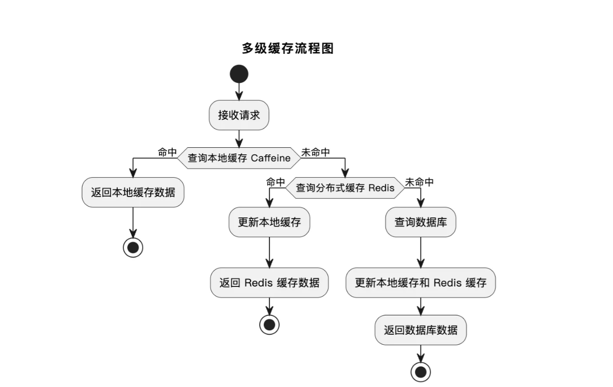
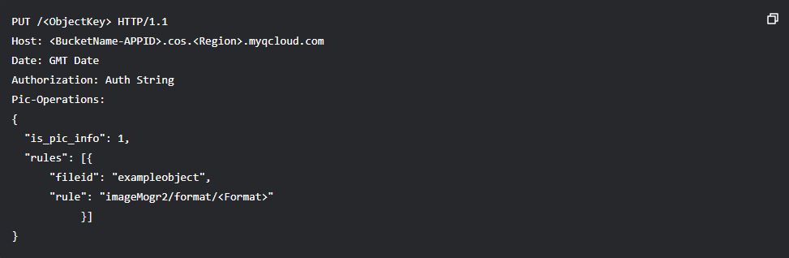

# 图片优化

在进行下一阶段之前，我们需要对图片的一些功能进行优化，优化的目标主要是：**查询更块，存储更少**。主要分为一下四个部分，近十余中优化策略

* 图片查询优化-分布式缓存、本地缓存、多级缓存
* 图片上传优化-压缩、秒传、分片上传、断点续传
* 图片加载优化-懒加载、缩略图、CDN加速、浏览器缓存
* 图片存储优化-降频存储（冷热数据分离）、清理策略

---

# 图片查询优化

## 缓存

对于经常访问的数据，每次都从数据库（硬盘）中获取是比较慢，可以利用性能更高的存储来提高系统响应速度，俗称**缓存** 。合理使用缓存可以显著降低数据库的压力、提高系统性能。

那么，什么样的数据适合缓存呢？一般情况下就4个字“**读多写少** ”，要频繁查询的、不怎么修改的。

具体来说：

1. 高频访问的数据：如系统首页、热门推荐内容等。
2. 计算成本较高的数据：如复杂查询结果、大量数据的统计结果。
3. 允许短时间延迟的数据：如不需要实时更新的排行榜、图片列表等。

在我们的项目中，主页是用户高频访问的内容，调用的获取图片列表的接口也是高频访问的。而且即使数据更新存在一定延迟，也不会对用户体验造成明显影响，因此非常适合缓存。

### Redis分布式缓存

分布式缓存是指将缓存数据分布存储在多台服务器上，以便在高并发场景下提供更高的吞吐量和更好的容错性。

Redis是实现分布式缓存的主流方案，也是后端开发必学的技能。主要是由于它具有下面几个优势：

* 高性能:基于内存操作，访问速度极快。单节点 Redis的读写**QPS可达10w次每秒！**
* 丰富的数据结构：支持字符串、列表、集合、哈希、位图等，适用于各种数据结构存储。
* 分布式支持：可以通过RedisCluster构建高可用、高性能的分布式缓存，还提供哨兵集群机制提升可用性、提供分片集群机制提高可扩展性。

#### 缓存设计

需要缓存首页的图片列表数据，也就是对 listPictureVOByPage接口进行缓存。首先按照缓存3要素"key、value、过期时间”进行设计。

1. 缓存 key 设计

由于接口支持传入不同的查询条件，对应的数据不同，因此需要将查询条件作为缓存key的一部分。

可以将查询条件对象转换为JSON字符串，但这个JSON会比较长，可以利用哈希算法（md5)来压缩key。

此外，由于使用分布式缓存，可能由多个项目和业务共享，因此需要在key的开头拼接前缀进行隔离。设计出的key如下：


```Java
yunpicture:listPictureVOByPage:${查询条件key}
```

1. 缓存 value 设计

缓存从数据库中查到的Page分页对象，存储为什么格式呢？这里有2种选择：

* 为了可读性，可以转换为JSON结构的字符串
* 为了压缩空间，可以存为二进制等其他结构

但是对应的 Redis 数据结构都是 string。

1. 缓存过期时间设置

**必须设置缓存过期时间！** 根据实际业务场景和缓存空间的大小、数据的一致性的要求设置，合适即可，此处由于查询条件较多、而且考虑到图片会持续更新，设置为5~60分钟即可。

#### 如何操作Redis？

Java中有非常多的 Redis 操作库，比如 Jedis、Lettuce 等。为了便于和 Spring 项目集成，Spring 还提供了 Spring Data Redis作为操作Redis的更高层抽象（默认使用Lettuce作为底层客户端)。由于我们的项目使用Spring Boot，也推荐使用[Spring Data Redis](https://spring.io/projects/spring-data-redis/)，开发成本更低。

它的使用也非常简单，我们直接上手项目实战。

1. 引入redis的maven依赖


```XML
<!-- Redis -->
<dependency>
    <groupId>org.springframework.boot</groupId>
    <artifactId>spring-boot-starter-data-redis</artifactId>
</dependency>
```

1. 在配置文件中引入redis：


```YAML
spring:
  # Redis 配置
  redis:
    database: 0
    host: 127.0.0.1
    port: 6379
    timeout: 5000
```

1. 编写操作Redis的代码：


```TypeScript
@PostMapping("/list/page/vo/cache")
public BaseResponse<Page<PictureVO>> listPictureVOByPageWithCache(@RequestBody PictureQueryRequest pictureQueryRequest,
                                                         HttpServletRequest request) {
    long current = pictureQueryRequest.getCurrent();
    long size = pictureQueryRequest.getPageSize();
    // 限制爬虫
    ThrowUtils.throwIf(size > 20, ErrorCode.PARAMS_ERROR);
    // 普通用户默认只能查看已过审的数据
    pictureQueryRequest.setReviewStatus(PictureReviewStatusEnum.PASS.getValue());

    // 构建缓存 key
    String queryCondition = JSONUtil.toJsonStr(pictureQueryRequest);
    String hashKey = DigestUtils.md5DigestAsHex(queryCondition.getBytes());
    String redisKey = "yupicture:listPictureVOByPage:" + hashKey;
    // 从 Redis 缓存中查询
    ValueOperations<String, String> valueOps = stringRedisTemplate.opsForValue();
    String cachedValue = valueOps.get(redisKey);
    if (cachedValue != null) {
        // 如果缓存命中，返回结果
        Page<PictureVO> cachedPage = JSONUtil.toBean(cachedValue, Page.class);
        return ResultUtils.success(cachedPage);
    }

    // 查询数据库
    Page<Picture> picturePage = pictureService.page(new Page<>(current, size),
            pictureService.getQueryWrapper(pictureQueryRequest));
    // 获取封装类
    Page<PictureVO> pictureVOPage = pictureService.getPictureVOPage(picturePage, request);

    // 存入 Redis 缓存
    String cacheValue = JSONUtil.toJsonStr(pictureVOPage);
    // 5 - 10 分钟随机过期，防止雪崩
    int cacheExpireTime = 300 +  RandomUtil.randomInt(0, 300);
    valueOps.set(redisKey, cacheValue, cacheExpireTime, TimeUnit.SECONDS);

    // 返回结果
    return ResultUtils.success(pictureVOPage);
}
```

### Caffeine 本地缓存

当应用需要频繁访问某些数据时，可以将这些数据缓存到应用的内存中（比如JVM中）；下次访问时，直接从内存读取，而不需要经过网络或其他存储系统。

相比于分布式缓存，本地缓存的速度更快，但是无法在多个服务器间共享数据、而且不方便扩容。

所以本地缓存的应用场景一般是：

* 数据访问量有限的小型数据集
* 不需要服务器间共享数据的单机应用
* 高频、低延迟的访问场景（如用户临时会话信息、短期热点数据）。

对于Java项目，Caffeine是主流的本地缓存技术，拥有极高的性能和丰富的功能。比如可以精确控制缓存数量和大小、支持缓存过期、支持多种缓存淘汰策略、支持异步操作、线程安全等。

由于本地缓存不需要引入额外的中间件，成本更低。因此如果只是要提升数据访问性能，优先考虑本地缓存而不是分布式缓存。

#### 缓存设计

本地缓存的设计和分布式缓存基本一致，不再赞述。但有2个区别：

1. 本地缓存需要自己创建初始化缓存结构（可以简单理解为要自己new一个HashMap)。
2. 由于本地缓存本身就是服务器隔离的，而且占用服务器的内存，key可以更精简一些，不用再添加项目前缀。

#### 后端开发

1. 参考[官方文档](https://github.com/ben-manes/caffeine)引入Caffeine 的Maven依赖，注意如果要引入3.x版本的Caffeine，Java版本必须>= 11！如果不想升级JDK，也可以改为引入2x版本


```XML
<!-- 本地缓存 Caffeine -->
<dependency>
  <groupId>com.github.ben-manes.caffeine</groupId>
  <artifactId>caffeine</artifactId>
  <version>3.1.8</version>
</dependency>
```

1. 构造本地缓存，设置缓存容量和过期时间


```Java
private final Cache<String, String> LOCAL_CACHE =
        Caffeine.newBuilder().initialCapacity(1024)
                .maximumSize(10000L)
                // 缓存 5 分钟移除
                .expireAfterWrite(5L, TimeUnit.MINUTES)
                .build();
```

1. 参考之前使用分布式缓存的代码，修改为使用本地缓存。在查询数据库前先查询本地缓存，如果已有数据则直接返回缓存：


```JavaScript
// 构建缓存 key
String queryCondition = JSONUtil.toJsonStr(pictureQueryRequest);
String hashKey = DigestUtils.md5DigestAsHex(queryCondition.getBytes());
String cacheKey = "listPictureVOByPage:" + hashKey;
// 从本地缓存中查询
String cachedValue = LOCAL_CACHE.getIfPresent(cacheKey);
if (cachedValue != null) {
    // 如果缓存命中，返回结果
    Page<PictureVO> cachedPage = JSONUtil.toBean(cachedValue, Page.class);
    return ResultUtils.success(cachedPage);
}
```

如果每有数据则查询数据库，将结果放到本地缓存中


```Java
// 查询数据库
Page<Picture> picturePage = pictureService.page(new Page<>(current, size),
        pictureService.getQueryWrapper(pictureQueryRequest));
// 获取封装类
Page<PictureVO> pictureVOPage = pictureService.getPictureVOPage(picturePage, request);

// 存入本地缓存
String cacheValue = JSONUtil.toJsonStr(pictureVOPage);
LOCAL_CACHE.put(cacheKey, cacheValue);
```

### 多级缓存

多级缓存是指结合本地缓存和分布式缓存的优点，在同一业务场景下构建两级缓存系统，这样可以兼顾本地缓存的高性能、以及分布式缓存的数据一致性和可靠性。

多级缓存的工作流程：

1. 第一级（Caffeine本地缓存)：优先从本地缓存中读取数据。如果命中，则直接返回。
2. 第二级(Redis分布式缓存)：如果本地缓存未命中，则查询Redis分布式缓存。如果Redis命中，则返回数据并更新本地缓存。
3. 数据库查询：如果Redis也未命中，则查询数据库，并将结果写入Redis和本地缓存。



#### 后端开发

1. 优先从本地缓存中读取数据


```JavaScript
// 构建缓存 key
String queryCondition = JSONUtil.toJsonStr(pictureQueryRequest);
String hashKey = DigestUtils.md5DigestAsHex(queryCondition.getBytes());
String cacheKey = "yupicture:listPictureVOByPage:" + hashKey;

// 1. 查询本地缓存（Caffeine）
String cachedValue = LOCAL_CACHE.getIfPresent(cacheKey);
if (cachedValue != null) {
    Page<PictureVO> cachedPage = JSONUtil.toBean(cachedValue, Page.class);
    return ResultUtils.success(cachedPage);
}
```

1. 本地缓存没有，从redis中获取数据，如果redis有本地缓存没有，将数据存入本地缓存返回


```JavaScript
// 2. 查询分布式缓存（Redis）
ValueOperations<String, String> valueOps = stringRedisTemplate.opsForValue();
cachedValue = valueOps.get(cacheKey);
if (cachedValue != null) {
    // 如果命中 Redis，存入本地缓存并返回
    LOCAL_CACHE.put(cacheKey, cachedValue);
    Page<PictureVO> cachedPage = JSONUtil.toBean(cachedValue, Page.class);
    return ResultUtils.success(cachedPage);
}
```

1. redis没有，从数据库中获取数据，如果数据库有redis没有，将数据存入redis返回


```JavaScript
// 3. 查询数据库
Page<Picture> picturePage = pictureService.page(new Page<>(current, size),
        pictureService.getQueryWrapper(pictureQueryRequest));
Page<PictureVO> pictureVOPage = pictureService.getPictureVOPage(picturePage, request);

// 4. 更新缓存
String cacheValue = JSONUtil.toJsonStr(pictureVOPage);
// 更新本地缓存
LOCAL_CACHE.put(cacheKey, cacheValue);
// 更新 Redis 缓存，设置过期时间为 5 分钟
valueOps.set(cacheKey, cacheValue, 5, TimeUnit.MINUTES);
```

### 扩展

#### 手动刷新缓存

在某些情况下，数据更新较为频繁，但自动刷新缓存机制可能存在延迟，可以通过手动刷新来解决。

比如:

* 提供一个刷新缓存的接口，仅管理员可调用。
* 提供管理后台，支持管理员手动刷新指定缓存。

#### 解决缓存常见问题

使用缓存时，一般要注意下面几个问题：

1. 缓存击穿：某些热点数据在缓存过期后，大量请求直接打到数据库。

> 解决方案：设置热点数据的超长过期时间，或使用互斥锁（如Redisson）控制缓存刷新。


1. 缓存穿透：用户频繁请求不存在的数据，导致大量的请求直接触发数据库查询。

解决方案：对无效查询结果也进行缓存（如设置空值缓存），或者使用布隆过滤器。

1. 缓存雪崩：大量缓存同时过期，导致请求打到数据库，系统崩溃。

> 解决方案：设置不同缓存的过期时间，避免同时过期；或者使用多级缓存，减少对数据库的依赖。


#### 自动识别热点图片缓存

可以采用热key探测技术，实时对图片的访问量进行统计，并自动将热点图片添加到内存缓存，以应对大量高频的访问。

#### 查询优化

可以参考数据库优化技巧，比如获取图片列表时只查询（select）必要的字段，返回给前端时也只返回必要的字段等。

#### 代码优化

如果操作缓存的逻辑更复杂，可以单独抽象CacheManager统一管理缓存相关操作。

## 图片上传优化

### 图片压缩

对于图库网站来؜说，图片压缩是图片优化中最基本且最重要的操作，能够显著减少图片文件的大小，从而降低带宽使用和流量消耗，大幅降低成本的同时，提高图片加载速度。

有哪些压缩图片的方法呢？

1. 将图片格式转换为体积更小的格式，比如 WebP 或其他现代格式
2. 对图片质量进行压缩
3. 缩小图片尺寸

当然对于图؜片网站来说，我们希望尽可能不要影响图片的质量，因此更推荐第 1 种方法

那么将图片压缩成什么格式？如何对图片进行压缩呢？

#### 图片压缩格式

格式上，有 2 种选择：PVHq6NW9Nt5fXkQO/a1pmCEpMMQkmAtku92aHSjiX4c=

1. Web؜P：由 Google 开发的现代图片格式，支持有损和无损压缩。相比传统格式：
    * 比 PNG 文件小约 26%。
    * 比 JPEG 文件小约 25%-34%。
    * 支持透明背景（Alpha 通道）。
    * 兼容性：大部分主流浏览器（如 Chrome、Edge、Firefox 等）均已支持 WebP。
2. AVI؜F：基于 AV1 视频编码技术的图片格式，压缩率更高。
    * 比 WebP 的文件大小更小，画质更优。
    * 支持透明背景和高动态范围（HDR）。

虽然 AVIF 看起来更牛，但目前其兼容性没有 WebP 要好，为了保证图片在不同浏览器都能正常加载，建议选择 WebP 格式。

#### 图片压缩方案

跟解析图片؜的操作一样，可以使用本地的图像处理类库自行操作，也可以利用第三方云服务完成。

因为我们图片已؜经上传到了腾讯云 COS 对象存储服务，可以直接利用数据万象服务。通过配置图片处理规则，在图片上传的同时自动进行压缩处理，减少开发成本。

如何利用数据万象对图片进行压缩呢？官方提供了 [最佳实践文档](https://cloud.tencent.com/document/product/460/72229) ，主要有 2 种压缩方式：

1. 访问图片时实时压缩
2. 上传图片时实时压缩，[参考文档](https://cloud.tencent.com/document/product/436/54050#.E4.B8.8A.E4.BC.A0.E6.97.B6.E5.A4.84.E7.90.86)

其实还有第三种方式，也可以对已上传的图片进行压缩处理，[参考文档](https://cloud.tencent.com/document/product/436/54050#.E4.BA.91.E4.B8.8A.E6.95.B0.E6.8D.AE.E5.A4.84.E7.90.86)。

对于我们的需求，要将图片格式转化为 WebP，可以 [参考官方文档](https://cloud.tencent.com/document/product/436/44883)，在上传文件时，传入 Rules 规则。使用 HTTP API 调用时，传入处理规则参数：



如果使用 SDK，就需要构造图片处理规则对象，[参考文档](https://cloud.tencent.com/document/product/436/55377#.E4.B8.8A.E4.BC.A0.E6.97.B6.E5.9B.BE.E7.89.87.E6.8C.81.E4.B9.85.E5.8C.96.E5.A4.84.E7.90.86)：

#### 后端开发

为了实现方؜便，我们此处仅对文件格式进行转化，不进行质量变换之类的其他处理。

1. 修改 ؜CosManager 上传图片的方法，将图片后缀转为 webp，并且使用数据万象将图片格式转为 webp


```Java
public PutObjectResult putPictureObject(String key, File file) {
    PutObjectRequest putObjectRequest = new PutObjectRequest(cosClientConfig.getBucket(), key,
            file);
    // 对图片进行处理（获取基本信息也被视作为一种处理）PicOperations picOperations = new PicOperations();
    // 1 表示返回原图信息
    picOperations.setIsPicInfo(1);
    List<PicOperations.Rule> rules = new ArrayList<>();
    // 图片压缩（转成 webp 格式）String webpKey = FileUtil.mainName(key) + ".webp";
    PicOperations.Rule compressRule = new PicOperations.Rule();
    compressRule.setRule("imageMogr2/format/webp");
    compressRule.setBucket(cosClientConfig.getBucket());
    compressRule.setFileId(webpKey);
    rules.add(compressRule);
    // 构造处理参数
    picOperations.setRules(rules);
    putObjectRequest.setPicOperations(picOperations);
    return cosClient.putObject(putObjectRequest);
}
```

1. 修改 P؜ictureUploadTemplate 上传图片的方法，从图片处理结果中获取到缩略图，并设置到返回结果中：


```Java

try {
    // 创建临时文件
    file = File.createTempFile(uploadPath, null);
    // 处理文件来源（本地或 URL）
    processFile(inputSource, file);
    // 上传图片到对象存储PutObjectResult putObjectResult = cosManager.putPictureObject(uploadPath, file);
    ImageInfo imageInfo = putObjectResult.getCiUploadResult().getOriginalInfo().getImageInfo();
    ProcessResults processResults = putObjectResult.getCiUploadResult().getProcessResults();
    List<CIObject> objectList = processResults.getObjectList();
    if (CollUtil.isNotEmpty(objectList)) {
        CIObject compressedCiObject = objectList.get(0);
        // 封装压缩图返回结果return buildResult(originFilename, compressedCiObject);
    }
    // 封装原图返回结果return buildResult(originFilename, file, uploadPath, imageInfo);
} catch (Exception e) {
    log.error("图片上传到对象存储失败", e);
    throw new BusinessException(ErrorCode.SYSTEM_ERROR, "上传失败");
}
```

1. 编写新的封装返回结果方法，从压缩图中获取图片信息：


```Java
▼
private UploadPictureResult buildResult(String originFilename, CIObject compressedCiObject) {
    UploadPictureResult uploadPictureResult = new UploadPictureResult();
    int picWidth = compressedCiObject.getWidth();
    int picHeight = compressedCiObject.getHeight();
    double picScale = NumberUtil.round(picWidth * 1.0 / picHeight, 2).doubleValue();
    uploadPictureResult.setPicName(FileUtil.mainName(originFilename));
    uploadPictureResult.setPicWidth(picWidth);
    uploadPictureResult.setPicHeight(picHeight);
    uploadPictureResult.setPicScale(picScale);
    uploadPictureResult.setPicFormat(compressedCiObject.getFormat());
    uploadPictureResult.setPicSize(compressedCiObject.getSize().longValue());
    // 设置图片为压缩后的地址
    uploadPictureResult.setUrl(cosClientConfig.getHost() + "/" + compressedCiObject.getKey());
    return uploadPictureResult;
}
```

#### 扩展

1. 增加对原图的处理

目前每次上传图片؜实际上会保存原图和压缩图 2 个图片，原图占用的空间还是比较大的。如果想进一步优化，可以删除原图，只保留缩略图；或者在数据库中保存原图的地址，用作备份。

1. 尝试更大比例的压缩，比如使用 [质量变换](https://cloud.tencent.com/document/product/436/44884) 来处理图片。

### 扩展知识 - 文件秒传

由于文件秒؜传对于图片上传场景的作用有限，仅作为扩展知识学习即可，不必在本项目中实现。

文件秒传是一种基؜于文件的唯一标识（如 MD5、SHA-256）对文件内容进行快速校验，避免重复上传的方法，在大型文件传输场景下非常重要。可以提高性能、节约带宽和存储资源。

大家可能用؜过 XX 网盘软件，如果重复上传相同的文件 2 次，你会发现第二次的上传速度贼快.

#### 文件秒传的实现方案

文件秒传的实现并不复杂，流程如下：

1. 客户端؜生成文件唯一标识：上传前，通过客户端计算文件的哈希值（如 MD5、SHA-256），生成文件的唯一指纹
2. 服务端؜校验文件指纹：后端接收到文件指纹后，在存储中查询是否已存在相同文件。
    * 若存在相同文件，则直接返回文件的存储路径。
    * 若不存在相同文件，则接收并存储新文件，同时记录其指纹信息。

注意，客户端؜和服务端是相对的概念。因为现在我们要把文件上传到对象存储服务器，我们的后端此时就是“客户端”，对象存储服务器才是 “服务端”。

对于我们的؜项目，给图片表增加 md5 字段用于存储文件指纹，上传图片前增加类似的逻辑判断即可：


```Java
▼
// 计算文件指纹String md5 = SecureUtil.md5(file);
// 从数据库中查询已有的文件
List<Picture> pictureList = pictureService.lambdaQuery()
        .eq(Picture::getMd5, md5)
        .list();
// 文件已存在，秒传if (CollUtil.isNotEmpty(pictureList)) {
    // 直接复用已有文件的信息，不必重复上传文件Picture existPicture = pictureList.get(0);
} else {
    // 文件不存在，实际上传逻辑
}
```

#### 实际使用中的限制

我们目前的项目其实不适合使用文件秒传؜。一方面是对于图片场景，文件比较小、重复文件也相对较少，秒传的优化效果有限；另外一方面是本项目使用腾讯云 COS 的对象存储，只能通过唯一地址去取文件，无法完全自定义文件的存储结构、也不支持文件快捷方式的概念，因此秒传的文件地址必须使用和原文件相同的对象路径，可能导致其他的问题（比如用户 A 上传的图片地址等同于用户 B 上传的地址）。

### 扩展知识 - 分片上传和断点续传

对于大文件，还可以开启分片上传和断点续传，不需要自己开发，直接使用 [对象存储的 SDK](https://cloud.tencent.com/document/product/436/65935) 就能完成。

---


## 图片加载优化

图片加载优؜化的目的是提升页面加载速度、减少带宽消耗，并改善用户体验。

将؜从缩略图、懒加载、CDN 加速、浏览器缓存这 4 个方面进行全面优化。

### 缩略图

系统目前的؜问题：首页直接加载原图，原图文件通常比缩略图大数倍甚至数十倍，不仅导致加载时间长，还会造成大量流量浪费。OTsSx2bzs2C13D2pB4s4on5rzOarAwg0YtGpfccE/pk=

解决方案：؜上传图片时，同时生成一份较小尺寸的缩略图。用户浏览图片列表时加载缩略图，只有在进入详情页或下载时才加载原图。

#### 1、实现方案

生成缩略图؜的方法和前面讲的 “图片压缩” 一致，可以使用本地图像处理类库，也可以利用第三方云服务完成。

此处我们依然选择数据万象服务，[参考 Java SDK 文档](https://cloud.tencent.com/document/product/436/55377#.E4.B8.8A.E4.BC.A0.E6.97.B6.E5.9B.BE.E7.89.87.E6.8C.81.E4.B9.85.E5.8C.96.E5.A4.84.E7.90.86) 使用 SDK 来构造图片处理规则对象，具体的图片缩放参数可 [参考文档](https://cloud.tencent.com/document/product/436/44880)

#### 2、后端开发

1）数据表 picture 新增缩略图字段：


```SQL
ALTER TABLE picture
    -- 添加新列ADD COLUMN thumbnailUrl varchar(512) NULL COMMENT '缩略图 url';
```

2）PictureMapper.xml 新增缩略图字段：


```XML
<result property="thumbnailUrl" column="thumbnailUrl" jdbcType="VARCHAR"/><!-- ... --><sql id="Base_Column_List">
    id,url,thumbnailUrl,name,
    introduction,category,tags,
    picSize,picWidth,picHeight,
    picScale,picFormat,userId,
    createTime,editTime,updateTime,
    isDelete
</sql>
```

3）数据模型؜新增缩略图字段，包括 Picture 类、PictureVO 类、UploadPictureResult 类：


```Java
/**
 * 缩略图 url
 */private String thumbnailUrl;
```

4）缩略图处理

首先明确我؜们使用的缩放规则，设置最大宽高后，对图片进行等比缩小。且如果缩略图的宽高大于原图，则不会处理。

修改 Co؜sManager 的上传图片方法，补充对缩略图的处理：


```Java
public PutObjectResult putPictureObject(String key, File file) {
    PutObjectRequest putObjectRequest = new PutObjectRequest(cosClientConfig.getBucket(), key,
            file);
    // 对图片进行处理（获取基本信息也被视作为一种处理）PicOperations picOperations = new PicOperations();
    // 1 表示返回原图信息
    picOperations.setIsPicInfo(1);
    List<PicOperations.Rule> rules = new ArrayList<>();
    // 图片压缩（转成 webp 格式）String webpKey = FileUtil.mainName(key) + ".webp";
    PicOperations.Rule compressRule = new PicOperations.Rule();
    compressRule.setRule("imageMogr2/format/webp");
    compressRule.setBucket(cosClientConfig.getBucket());
    compressRule.setFileId(webpKey);
    rules.add(compressRule);
    // 缩略图处理
    PicOperations.Rule thumbnailRule = new PicOperations.Rule();
    thumbnailRule.setBucket(cosClientConfig.getBucket());
    String thumbnailKey = FileUtil.mainName(key) + "_thumbnail." + FileUtil.getSuffix(key);
    thumbnailRule.setFileId(thumbnailKey);
    // 缩放规则 /thumbnail/<Width>x<Height>>（如果大于原图宽高，则不处理）
    thumbnailRule.setRule(String.format("imageMogr2/thumbnail/%sx%s>", 128, 128));
    rules.add(thumbnailRule);
    // 构造处理参数
    picOperations.setRules(rules);
    putObjectRequest.setPicOperations(picOperations);
    return cosClient.putObject(putObjectRequest);
}
```

修改 Pi؜ctureUploadTemplate 的上传图片方法，获取到缩略图：


```Java
ProcessResults processResults = putObjectResult.getCiUploadResult().getProcessResults();
List<CIObject> objectList = processResults.getObjectList();
if (CollUtil.isNotEmpty(objectList)) {
    CIObject compressedCiObject = objectList.get(0);
    CIObject thumbnailCiObject = objectList.get(1);
    // 封装压缩图返回结果return buildResult(originFilename, compressedCiObject, thumbnailCiObject);
}
```

修改 Pi؜ctureUploadTemplate 封装返回结果的方法，将缩略图路径也设置到返回结果中：


```Java
private UploadPictureResult buildResult(String originFilename, CIObject compressedCiObject, CIObject thumbnailCiObject) {
    UploadPictureResult uploadPictureResult = new UploadPictureResult();
    // ...// 设置缩略图
    uploadPictureResult.setThumbnailUrl(cosClientConfig.getHost() + "/" + thumbnailCiObject.getKey());
    return uploadPictureResult;
}
```

需要同步修؜改 PictureService 的上传图片方法，补充设置缩略图字段：


```Java
// 构造要入库的图片信息Picture picture = new Picture();
picture.setUrl(uploadPictureResult.getUrl());
picture.setThumbnailUrl(uploadPictureResult.getThumbnailUrl());
String picName = uploadPictureResult.getPicName();
```

5）测试效果

上传大图片时，缩略图的效果显著，体积直接减小百倍！

但有个比较؜坑的情况，如果上传的图片本身就比较小，缩略图反而比压缩图更大，还不如不缩略！

我们可以优؜化 CosManager 图片上传的逻辑，仅对 > 20 KB 的图片生成缩略图：


```Java
// 缩略图处理，仅对 > 20 KB 的图片生成缩略图if (file.length() > 2 * 1024) {
    PicOperations.Rule thumbnailRule = new PicOperations.Rule();
    thumbnailRule.setBucket(cosClientConfig.getBucket());
    String thumbnailKey = FileUtil.mainName(key) + "_thumbnail." + FileUtil.getSuffix(key);
    thumbnailRule.setFileId(thumbnailKey);
    // 缩放规则 /thumbnail/<Width>x<Height>>（如果大于原图宽高，则不处理）
    thumbnailRule.setRule(String.format("imageMogr2/thumbnail/%sx%s>", 128, 128));
    rules.add(thumbnailRule);
}
```

修改 Pi؜ctureUploadTemplate 的逻辑，如果没有生成缩略图，则缩略图等于压缩图：


```Java
if (CollUtil.isNotEmpty(objectList)) {
    CIObject compressedCiObject = objectList.get(0);
    // 缩略图默认等于压缩图CIObject thumbnailCiObject = compressedCiObject;
    // 有生成缩略图，才得到缩略图if (objectList.size() > 1) {
        thumbnailCiObject = objectList.get(1);
    }
    // 封装压缩图返回结果return buildResult(originFilename, compressedCiObject, thumbnailCiObject);
}
```

#### 3、前端开发

只需要将首页展示的图片改为优先读取缩略图即可：


```PlainText

```

如果觉得太؜模糊了，还可以增大缩略图的宽高、调高需要生成缩略图的文件大小阈值，这是一个成本和用户体验上的权衡

#### 扩展

1）除了缩略图之外，还可以提供相对更清晰的 预览图，用于在图片详情页展示，仅在下载时才使用无损原图。

2）可以对؜文件名称进行更完整地校验处理，防止因为图片本身名称不规范导致的后缀丢失。

### 懒加载

懒加载（Lazy Loading）可以避免一次性加载所有图片，只有当资源需要显示时才进行加载。比如对于图片列表来说，仅在用户滚动到图片所在区域时才加载该图片资源。

#### 实现方案

虽然懒加载؜的实现更多的是依赖前端，但后端也有一定的优化策略，比如对图片列表进行分页，每页不需要展示过多的内容。ea/ltUip9c7M0FiZpvhBOidq1hgdtVTeHcw0XSJsUYE=

前端如何实现懒加载呢？

1）使用 HTML5 原生的 `loading="lazy"` 属性。示例代码如下：


```Java

```

这种方法最؜简单，但是对旧版浏览器（如 IE）不兼容，而且不支持更复杂的懒加载需求（如动画或特殊事件触发）。

2）使用 ؜JS 的 Intersection Observer，这个 API 能够检测元素是否进入视口，参考实现如下：

1. 将图片的真实 src 替换为一个占位属性（如 data-src）。
2. 使用 Intersection Observer 监听图片是否进入视口。
3. 当图片进入视口时，将 data-src 的值赋给 src，触发加载。


```HTML
<script>// 获取所有需要懒加载的图片const lazyImages = document.querySelectorAll('img.lazy');

  // 创建 Intersection Observerconst observer = new IntersectionObserver((entries, observer) => {
    entries.forEach(entry => {
      if (entry.isIntersecting) {
        const img = entry.target;
        // 将 data-src 的值赋给 src 属性
        img.src = img.dataset.src;
        img.classList.remove('lazy');
        observer.unobserve(img); // 停止观察已加载的图片
      }
    });
  });

  // 观察每个图片
  lazyImages.forEach(image => observer.observe(image));
</script>
```

3）使用 J؜S 监听页面滚动事件实现。每次页面滚动时，判断图片是否进入可视区域；如果是，则给图片增加 src 属性，触发图片加载。

4）使用现成的组件库或类库实现，比如 [lazysizes 库](https://github.com/aFarkas/lazysizes)。Dlfw8NwnEDAWu8E/AQcY7dm3A98behgssP1uNM9pOf8=

由于我们的؜项目已经使用了缩略图，加载的资源本来也不多，所以暂时没必要使用懒加载了。

#### 扩展知识 - 渐进式加载

渐进式加载和懒加؜载技术类似，先加载低分辨率或低质量的占位资源（如模糊的图片缩略图），在用户访问或等待期间逐步加载高分辨率的完整资源，加载完成后再替换掉占位资源。

适用于超清؜图片加载、用户体验要求较高的页面，在网络环境较差时，效果会更明显。

Ant Design Vue 的 [Image 图片组件](https://antdv.com/components/image-cn) 支持渐进加载功能

### CDN 加速

#### 1、什么是 CDN？

CDN（内容分发网络؜）是通过将图片文件分发到全球各地的节点，用户访问时从离自己最近的节点获取资源的技术，常用于文件资源或后端动态请求的网络加速，也能大幅分摊源站的压力、支持更多请求同时访问，是性能提升的利器。

💡 如果؜你想了解一些云服务的介绍、架构和最佳实践，多去看大公司云服务的产品文档，就能学到很多知识。

CDN 请求的核心过程如下：

1. 图片文件由 源站（如 COS 对象存储、或者服务器）上传至 CDN 服务进行缓存。
2. 当用户请求图片时，CDN 会根据用户的地理位置，返回离用户 最近的 CDN 节点缓存的图片资源。
3. 未命中缓存的图片将从源站获取，并缓存在 CDN 节点，供后续用户访问，俗称 回源。

💡 回源的具体解释：在؜内容分发网络中，回源是指用户通过浏览器发送请求时，响应该请求的是源站点的服务器，而不是各节点上的缓存服务器。一般情况下，当 CDN 节点上的缓存服务器没有缓存响应的内容，或者响应的内容在源站点服务器上被修改，就会回源站去获取。

#### 2、CDN 的优势

有同学会问؜了：COS 对象存储不也是存储图片的服务么？CDN 内容分发网络有啥独特的优势啊？

从这两个服؜务的名称中，我们就能明显感受到区别了，COS 更倾向于 “存储”，CDN 更倾向于 “网络请求”。

所以如果文件存储容量较大؜、但是访问频率较低，用对象存储性价比更高；但如果资源访问频率高、流量消耗大，还需要对访问进行加速、减少源站压力，就要使用 CDN 了。CDN 的流量和请求单价通常低于对象存储，而且更加安全，可以保护源站地址不被泄露。

#### 3、如何使用 CDN？

一般情况下，如果你؜要对外提供文件（图片）访问 / 下载服务，建议结合 COS 和 CDN。比如对于本项目，COS 作为源站，负责存储图片文件；CDN 负责提供文件访问服务，以及缓存、安全性的设置。

也就是说，؜使用 CDN 之后，我们数据库中存储的图片地址就不再是 COS 的地址，而是 CDN 的 URL。

如何开通和使用 CDN 服务？建议阅读 [官方的产品文档](https://cloud.tencent.com/document/product/228/3149)、还有 [CDN 结合 COS 的文档](https://cloud.tencent.com/document/product/228/38088)，写得很贴心。

💡 CDN 还提供自动图片优化功能，感兴趣的同学可以 [看文档](https://cloud.tencent.com/document/product/228/43121) 了解下。

大家一定要认真看：

1）缓存策؜略：为静态资源（如图片、CSS、JS）设置长期缓存时间，可以减少回源的次数和消耗。

2）防盗链؜：配置 Referer 防盗链保护资源，比如仅允许自己的域名可以加载图片

3）IP ؜限制：根据需要配置 IP 黑白名单，限制不必要的访问。

4）HTT؜PS 配置：配置有效的 SSL 证书，启用 HTTPS 传输，提高请求的安全性。

5）**监控告警：这点尤为重要！** 一定要给 CDN 配置监控告警，比如设置一段时间内最多消耗的流量，超出时会自动发短信告警，避免费用超额；或者限制单个 IP 的请求频率，防止突发流量影响服务。

6）CDN ؜节点选择：国内业务选择覆盖中国大陆的节点就足够了，非必要的话，不要开通全球 CDN 节点，容易遭受海外攻击。

7）访问日؜志：开启访问日志，分析用户行为和流量来源，这个能力更适合业务访问量较大的场景。

### 浏览器缓存

通过设置 HTT؜P 头信息（如 Cache-Control），可以让用户的浏览器将资源缓存在本地。在用户再次访问同样的资源时，直接从本地缓存加载资源，而无需再次请求服务器。1jGyT1jdedQgDNFYA8T3BC8Rpod+tQXglYFmkZuCZXA=

所有缓存在使用时的注意事项基本都是类似的：

1）设置合理的缓存时间。常用的几种设置参数是：

* 静态资源使用长期缓存，比如：`Cache-Control: public, max-age=31536000` 表示缓存一年，适合存储图片等静态资源。
* 动态内容使用验证缓存，比如：`Cache-Control: private, no-cache` 表示缓存可被客户端存储，但每次使用前需要与服务器验证有效性。适合会动态变化内容的页面，比如用户个人中心。
* 敏感内容禁用缓存，比如：`Cache-Control: no-store` 表示不允许任何形式的缓存，适合安全性较高的场景，比如登录页面、支付页面。

2）要能够及时更؜新缓存。可以给图片的名称添加 “版本号”（如文件名中包含 hash 值），这样哪怕上传相同的图片，由于版本号不同，得到的图片地址也不同，下次访问时就会重新加载。

对于我们的项目，图片资源是非常适合长期缓存在浏览器本地的，也已经通过给文件名添加日期和随机数防止了重复。由于图片是从对象存储云服务加载的，如果需要使用缓存，可以接入 CDN 服务，直接在云服务的控制台配置缓存，[参考文档](https://cloud.tencent.com/document/product/228/50114)

如果触发了؜浏览器本地缓存，在 F12 控制台中能够看到图片瞬间加载成功：

## 图片存储优化

### 数据沉降

大部分数据的؜访问热度会随着存储时间延长逐渐降低，为了严格控制存储成本，需要定期分析业务数据的访问情况，并动态调整存储类型。

这就涉及到 数据沉降 技术，将长时间未访问的数据自动迁移到低频访问存储，从而降低存储成本。就跟我们平时使用电脑一样，SSD 硬盘很贵，我们一般优先将常用软件放在 SSD 目录中，至于一些以前写过的资料什么的，可以放在机械硬盘或外接硬盘中。

一般情况下，数据沉降分为 2 个阶段：先分析再沉降。

1）先分析؜：通过对象存储提供的清单 / 访问日志分析，或者业务代码中自行统计分析。

2）再沉降：可以直接通过对象存储提供的 生命周期 功能自动沉降数据，只需编写沉降规则即可。如下图，将 30 天未修改的文件沉降至低频存储

低频存储的价格比标准存储低了一些，还可以将 几乎不需要修改和访问 的文件（比如日志文件）移动到归档存储中，存储价格更低，可节约几倍的成本！

不过要注意，虽؜然低频存储的存储费用更低，但是当你要访问低频存储的资源时，会产生数据取回费用，所以一般只对几乎不访问的资源进行沉降，尽量减少取回费用。

数据沉降和 冷热数据分离 的概念是比较接近的，冷热数据分离是根据数据的访问热度，将访问频繁的数据（热数据）和访问较少的数据（冷数据）存储在不同的存储层中。

对于我们的项目，很久无؜人问津的历史图片就可以称为 “冷数据”，可以利用 COS 的生命周期功能在 30 天后自动沉降为低频存储。当然也可以通过数据库记录图片的访问和下载时间，自行调用 API 批量沉降数据或者转储到其他存储服务。OTsSx2bzs2C13D2pB4s4on5rzOarAwg0YtGpfccE/pk=

💡 数据沉降和冷热数据分离的概؜念又有一些细微的差别，个人的理解是数据沉降更倾向于关注一个对象的生命周期（一个资源从热到冷），目标更多的是降低存储成本，配置沉降规则后也一般不会调整。冷热数据分离更关注整个系统的资源分布（比如热门图片放到性能更高的硬盘中，冷门图片进行归档存储），目标是同时优化性能和节约成本，数据的热度可以实时调整。

### 清理策略

对于 “重؜存储” 的系统，数据清理是必要的！通过设置合理的清理策略，可以避免冗余数据占用存储空间，降低成本。

分享 4 种典型的清理策略：

1）立即清؜理：在删除图片记录时，立即关联删除对象存储中已上传的图片文件，确保数据库记录与存储文件保持一致。

这里还有个؜小技巧，可以使用异步清理降低对删除操作性能的影响，并且记录一些日志，避免删除失败的情况。

2）手动清؜理：由管理员手动触发清理任务，可以筛选要清理的数据，按需选择需要清理的文件范围。

3）定期清؜理：通过定时任务自动触发清理操作。系统预先设置规则（如文件未访问时间超过一定期限）自动清理不需要的数据。

4）惰性清理：؜清理任务不会主动执行，而是等到资源需求增加（存储空间不足）或触发特定操作时才清理，适合存储空间紧张但清理任务优先级较低的场景。

实际开发中，以上几种清理策略可以结合使用。比如 Redis 的内存管理机制结合了定期清理和惰性清理策略。 定期清理通过后台定期扫描一部分键，随机检查并删除已过期的键，从而主动释放内存，减少过期键的堆积。惰性清理则是在访问某个键时，检查其是否已过期，如果已过期则立即删除。这两种策略互为补充：定期清理降低了过期键的占用积累，而惰性清理确保了访问时键的准确性和及时清理，从而在性能和内存使用之间取得平衡。

#### 实现方案

对于我们的项目，؜由于不像 Redis 一样对空间的限制那么严格，更多的是为了节约成本，所以不需要惰性清理策略，按需运用 “立即清理 + 手动清理 + 定期清理” 即可。OTsSx2bzs2C13D2pB4s4on5rzOarAwg0YtGpfccE/pk=

#### 后端开发

1）CosManager 补充删除对象的方法：


```Java
/**
 * 删除对象
 *
 * @param key 文件 key
 */public void deleteObject(String key) throws CosClientException {
    cosClient.deleteObject(cosClientConfig.getBucket(), key);
}
```

2）在 PictureService 中开发图片清理方法。

注意，删除图؜片时，需要先判断该图片地址是否还存在于其他记录里，确认没有才能删除。比如秒传的场景，就有可能多个图片地址指向同一个文件。

此外，还要注意删除对؜象存储中的文件时传入的是 key（不包含域名的相对路径），而数据库中取到的图片地址是包含域名的，所以删除前要移除域名，从而得到 key。


```Java
@Async
@Override
public void clearPictureFile(Picture oldPicture) {
    // 判断该图片是否被多条记录使用String pictureUrl = oldPicture.getUrl();
    long count = this.lambdaQuery()
            .eq(Picture::getUrl, pictureUrl)
            .count();
    // 有不止一条记录用到了该图片，不清理if (count > 1) {
        return;
    }
    // FIXME 注意，这里的 url 包含了域名，实际上只要传 key 值（存储路径）就够了
    cosManager.deleteObject(oldPicture.getUrl());
    // 清理缩略图String thumbnailUrl = oldPicture.getThumbnailUrl();
    if (StrUtil.isNotBlank(thumbnailUrl)) {
        cosManager.deleteObject(thumbnailUrl);
    }
}
```

上述代码中，使用了 Spring 的 `@Async` 注解，可以使得方法被异步调用，记得要在启动类上添加 `@EnableAsync` 注解才会生效。


```Java
@SpringBootApplication@EnableAsync@MapperScan("com.yupi.yupicturebackend.mapper")@EnableAspectJAutoProxy(exposeProxy = true)public class YuPictureBackendApplication {
    public static void main(String[] args) {
        SpringApplication.run(YuPictureBackendApplication.class, args);
    }
}
```

然后你可以将 cl؜earPictureFile 方法运用到图片删除接口等场景        

#### 扩展

1）补充更؜多清理时机：在重新上传图片时，虽然那条图片记录不会删除，但其实之前的图片文件已经作废了，也可以触发清理逻辑。

2）实现更多؜清理策略：比如用 Spring Scheduler 定时任务实现定时清理、编写一个接口供管理员手动清理，作为一种兜底策略。

3）优化清理文件的代码，比如要删除多个文件时，使用 [对象存储的批量删除接口](https://cloud.tencent.com/document/product/436/65939#841fe310-bdf8-4789-9bc0-26ea844e316d) 代替 for 循环调用。

4）为了清理原图，可以在数据库中保存原图的地址。

---

至此项目第一阶段完成

