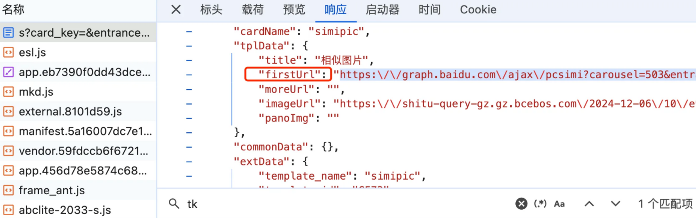
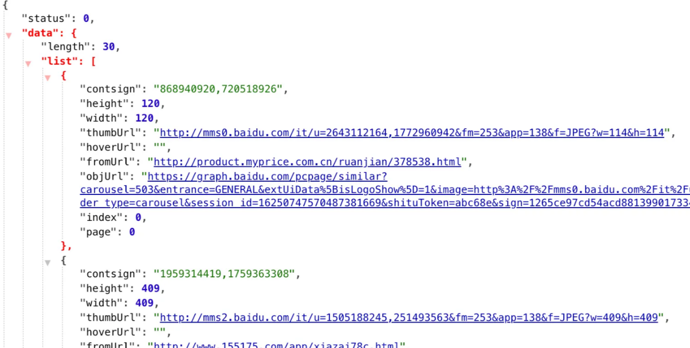
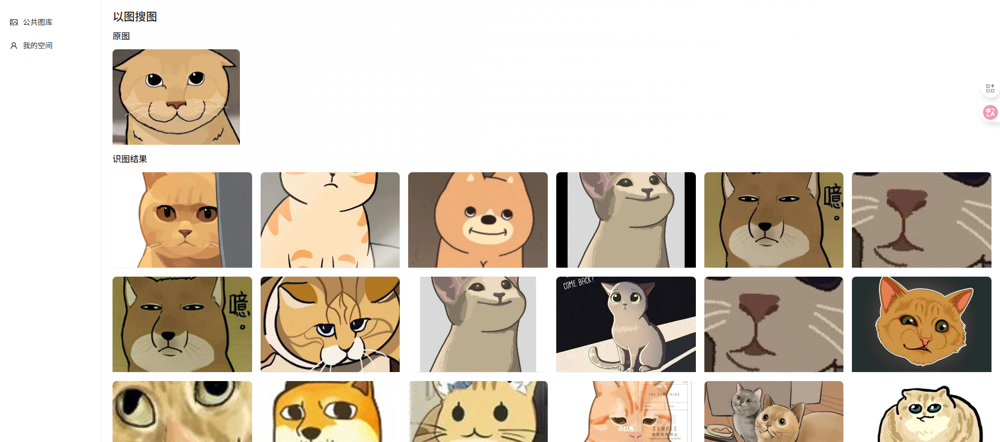
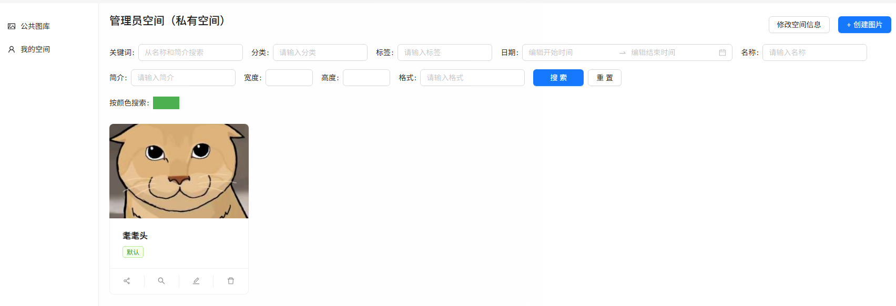
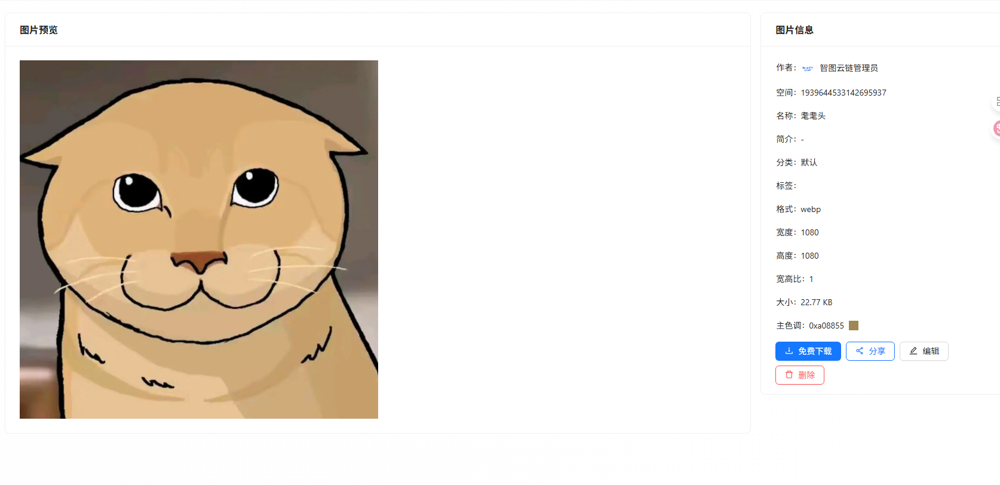
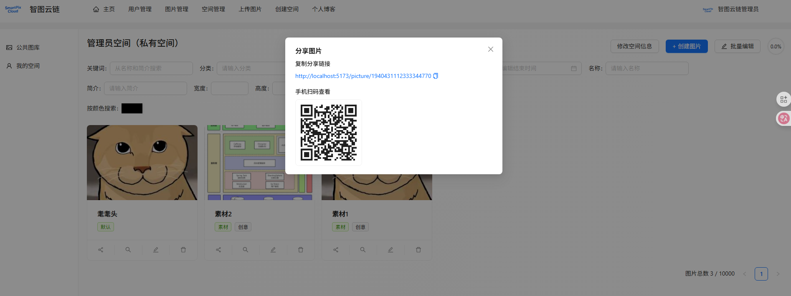
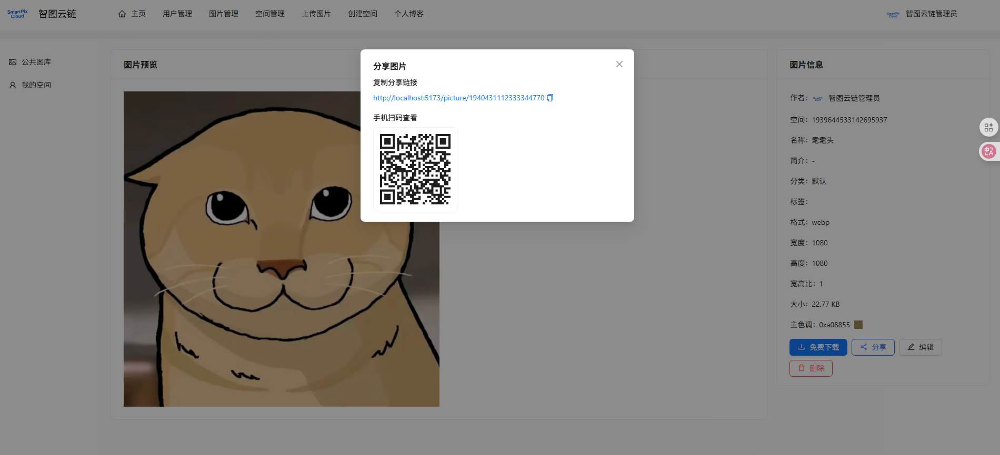
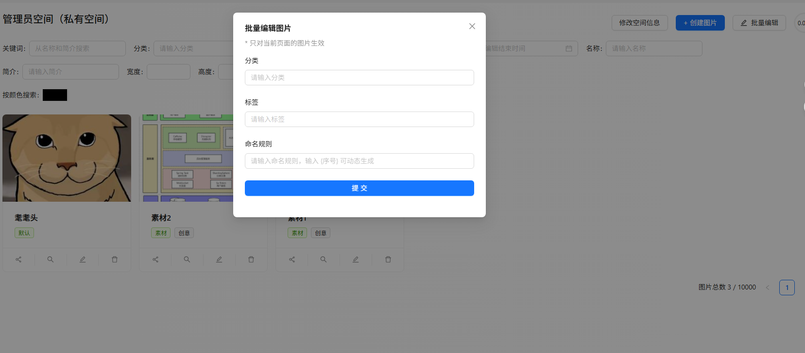

# 图片功能扩展

为了吸引用؜户使用我们平台的私有空间作为个人相册，需要提供更多功能。

本节我们重点对图片功能进行扩展，包括：

* 图片搜索
* 基础属性搜索
* 以图搜图
* 颜色搜索
* 图片分享
* 链接分享
* 扫码分享
* 图片批量管理
* 批量修改信息
* 批量重命名

有了这些功؜能，用户能够更高效地管理和分享平台上的图片资源，进一步提升使用体验。

# 图片搜索——基础属性搜索

## 需求分析

我们可以提供多种搜索维度，帮用户更快地找到自己空间的图片。

将搜索维度按优先级进行排序，优先级高的会展示在靠前的位置：

* 关键词：同时搜索名称和简介
* 标签
* 分类
* 编辑时间（开始时间与结束时间）
* 图片名称
* 图片简介
* 图片宽度
* 图片高度
* 图片格式

## 方案设计

后端可以直؜接复用原有的分页获取图片列表接口，并在此基础上增加相应的搜索条件，以支持更灵活的筛选。

前端可以针؜对不同类型的搜索维度选用特定的表单项组件，来提高搜索的体验。

* 关键词：文本输入框
* 标签：下拉选择框
* 分类：下拉选择框
* 编辑时间：日期选择器
* 图片名称：文本输入框
* 图片简介：文本输入框
* 图片宽度：数字输入框
* 图片高度：数字输入框
* 图片格式：文本输入框 / 下拉选择框

## 后端开发

其他的搜索条件基本都已经有了，还需要支持按照编辑时间搜索。

1）为了支؜持按编辑时间进行搜索，需要在请求类 PictureQueryRequest 中添加开始和结束编辑时间字段：


```Java
/**
 * 开始编辑时间
 */private Date startEditTime;

/**
 * 结束编辑时间
 */private Date endEditTime;
```

2）更新图片服务的 getQueryWrapper 方法

在处理查询时，补充按编辑时间筛选的逻辑：


```Java
Date startEditTime = pictureQueryRequest.getStartEditTime();
Date endEditTime = pictureQueryRequest.getEndEditTime();
queryWrapper.ge(ObjUtil.isNotEmpty(startEditTime), "editTime", startEditTime);
queryWrapper.lt(ObjUtil.isNotEmpty(endEditTime), "editTime", endEditTime);
```

## 前端开发

### 1、图片搜索表单组件

由于空间详情页的代码量较大，我们可以将所有图片搜索逻辑单独封装为图片搜索表单组件 `PictureSearchForm.vue`。为提高效率，该组件可以从图片管理页面的搜索表单复制而来。

注意，该组件仅负责修改搜索条件，不负责数据获取与存储。

1）定义组件属性：


```TypeScript
interface Props {
  onSearch?: (searchParams: PictureQueryRequest) => void
}

const props = defineProps<Props>()
```

2）编写搜索条件和搜索函数：使用 `reactive` 变量存储搜索条件，并触发父组件的 `onSearch` 方法。


```TypeScript
// 搜索条件const searchParams = reactive<API.PictureQueryRequest>({})

// 获取数据const doSearch = () => {
  props.onSearch?.(searchParams)
}
```

3）开发页面结构

其中：

* 日期表单项使用 Ant Design 的 [日期选择器组件](https://antdv.com/components/date-picker-cn#components-date-picker-demo-presetted-ranges)，支持预设的日期范围选项（比如过去一周）
* 宽度 / 高度表单项使用 [数字输入框组件](https://antdv.com/components/input-number-cn)

代码如下：


```PlainText
<div class="picture-search-form">
  <!-- 搜索表单 -->
  <a-form layout="inline" :model="searchParams" @finish="doSearch">
    <a-form-item label="关键词" name="searchText">
      <a-input
        v-model:value="searchParams.searchText"
        placeholder="从名称和简介搜索"
        allow-clear
      />
    </a-form-item>
    <a-form-item label="分类" name="category">
      <a-auto-complete
        v-model:value="searchParams.category"
        style="min-width: 180px"
        :options="categoryOptions"
        placeholder="请输入分类"
        allowClear
      />
    </a-form-item>
    <a-form-item label="标签" name="tags">
      <a-select
        v-model:value="searchParams.tags"
        style="min-width: 180px"
        :options="tagOptions"
        mode="tags"
        placeholder="请输入标签"
        allowClear
      />
    </a-form-item>
    <a-form-item label="日期" name="">
      <a-range-picker
        style="width: 400px"
        show-time
        v-model:value="dateRange"
        :placeholder="['编辑开始日期', '编辑结束时间']"
        format="YYYY/MM/DD HH:mm:ss"
        :presets="rangePresets"
        @change="onRangeChange"
      />
    </a-form-item>
    <a-form-item label="名称" name="name">
      <a-input v-model:value="searchParams.name" placeholder="请输入名称" allow-clear />
    </a-form-item>
    <a-form-item label="简介" name="introduction">
      <a-input v-model:value="searchParams.introduction" placeholder="请输入简介" allow-clear />
    </a-form-item>
    <a-form-item label="宽度" name="picWidth">
      <a-input-number v-model:value="searchParams.picWidth" />
    </a-form-item>
    <a-form-item label="高度" name="picHeight">
      <a-input-number v-model:value="searchParams.picHeight" />
    </a-form-item>
    <a-form-item label="格式" name="picFormat">
      <a-input v-model:value="searchParams.picFormat" placeholder="请输入格式" allow-clear />
    </a-form-item>
    <a-form-item>
      <a-button type="primary" html-type="submit" style="width: 96px">搜索</a-button>
    </a-form-item>
  </a-form>
</div>
```

日期表单项所需的变量：


```TypeScript
const dateRange = ref<[]>([])

/**
 * 日期范围更改时触发
 * @param dates
 * @param dateStrings
 */const onRangeChange = (dates: any[], dateStrings: string[]) => {
  if (dates.length < 2) {
    searchParams.startEditTime = undefined
    searchParams.endEditTime = undefined
  } else {
    searchParams.startEditTime = dates[0].toDate()
    searchParams.endEditTime = dates[1].toDate()
  }
}

const rangePresets = ref([
  { label: '过去 7 天', value: [dayjs().add(-7, 'd'), dayjs()] },
  { label: '过去 14 天', value: [dayjs().add(-14, 'd'), dayjs()] },
  { label: '过去 30 天', value: [dayjs().add(-30, 'd'), dayjs()] },
  { label: '过去 90 天', value: [dayjs().add(-90, 'd'), dayjs()] },
])
```

4）获取分؜类和标签表单项的默认选项列表，这段代码可以直接复用创建图片页面的：


```TypeScript
const categoryOptions = ref<string[]>([])
const tagOptions = ref<string[]>([])

// 获取标签和分类选项const getTagCategoryOptions = async () => {
  const res = await listPictureTagCategoryUsingGet()
  if (res.data.code === 0 && res.data.data) {
    // 转换成下拉选项组件接受的格式
    tagOptions.value = (res.data.data.tagList ?? []).map((data: string) => {
      return {
        value: data,
        label: data,
      }
    })
    categoryOptions.value = (res.data.data.categoryList ?? []).map((data: string) => {
      return {
        value: data,
        label: data,
      }
    })
  } else {
    message.error('加载选项失败，' + res.data.message)
  }
}

onMounted(() => {
  getTagCategoryOptions()
})
```

5）空间详情页使用组件：


```PlainText
<!-- 搜索表单 -->
<PictureSearchForm />
```

浏览效果，目前表单项都挤在一起，不太好看

可以添加 CSS 样式，增加上边距：


```CSS
.picture-search-form .ant-form-item {
  margin-top: 16px;
}
```

6）由于数؜字输入框的值无法直接通过 allow-clear 清理，所以给表单增加一个重置按钮。

页面代码：


```PlainText
<a-form-item>
  <a-space>
    <a-button type="primary" html-type="submit" style="width: 96px">搜索</a-button>
    <a-button html-type="reset" @click="doClear">重置</a-button>
  </a-space>
</a-form-item>
```

需要编写一个重置函数，将所有搜索条件的值清空。由于我们使用了 `reactive` 响应式变量，无法直接整体赋值为一个空对象，而是需要将其中的字段全部设置为空。此外，不要忘了日期组件的值也需要重置为空数组。


```TypeScript
// 清理const doClear = () => {
  // 取消所有对象的值Object.keys(searchParams).forEach((key) => {
    searchParams[key] = undefined
  })
  dateRange.value = []
  props.onSearch?.(searchParams)
}
```

效果如图：


### 2、执行搜索

1）给组件传递 onSearch 搜索函数：


```PlainText
<!-- 搜索表单 -->
<PictureSearchForm :onSearch="onSearch" />
```

2）编写搜索函数

由于搜索参数可能؜被重置，为了方便，将 searchParams 从 reactive 变量改为 ref 变量，这样可以整体给 searchParams 赋值为空的对象。

要修改的代码如下：


```TypeScript
// 搜索条件const searchParams = ref<API.PictureQueryRequest>({
  current: 1,
  pageSize: 12,
  sortField: 'createTime',
  sortOrder: 'descend',
})

// 分页参数const onPageChange = (page, pageSize) => {
  searchParams.value.current = page
  searchParams.value.pageSize = pageSize
  fetchData()
}

// 搜索const onSearch = (newSearchParams: API.PictureQueryRequest) => {
  searchParams.value = {
    ...searchParams.value,
    ...newSearchParams,
    current: 1,
  }
  fetchData()
}

// 获取数据const fetchData = async () => {
  loading.value = true// 转换搜索参数const params = {
    spaceId: props.id,
    ...searchParams.value,
  }
  const res = await listPictureVoByPageUsingPost(params)
  if (res.data.data) {
    dataList.value = res.data.data.records ?? []
    total.value = res.data.data.total ?? 0
  } else {
    message.error('获取数据失败，' + res.data.message)
  }
  loading.value = false
}
```

---

# 图片搜索——以图搜图

## 需求分析

用户可以使؜用一张图片来搜索相似的图片，相比传统的关键词搜索，能够更精确地找到与上传图片内容相似的图片。

为了获得更多的搜索结果，我们的需求是从 全网搜索图片，而不是只在自己的图库中搜索。

注意，该功能不用局限于私有空间，公共图库也可以使用。

## 方案设计

主要有 2 种方案：第三方 API 以及数据抓取（爬虫）

### 1、第三方 API

如果想从自建的图库中搜索：可以使用百度 AI 提供的图片搜索 API，<span style="color: #C7D5F6">[参考官方文档](https://ai.baidu.com/tech/imagesearch/)</span>

Bing 以图搜图 API： 利用必应的图库，可以从全网进行搜索，而且可以免费使用，<span style="color: #C7D5F6">[参考官方文档](https://learn.microsoft.com/en-us/bing/search-apis/bing-image-search/quickstarts/rest/java)</span>

### 2、数据抓取

利用已有的؜以图搜图网站，通过数据抓取的方式实时查询搜图网站的返回结果。

为了让大家学习到更多知识，此处我们选择这种方案。

以百度搜图؜网站为例，我们可以先体验一遍流程，并且对接口进行分析：

1）进到百度图片搜索，通过 url 上传图片，发现接口：<span style="color: #C7D5F6">[https://graph.baidu.com/upload?uptime=](https://graph.baidu.com/upload?uptime=)</span> ，该接口的返回值为 “以图搜图的页面地址”

2）访问上一步得到的 <span style="color: #C7D5F6">[页面地址](https://graph.baidu.com/s?card_key=&entrance=GENERAL&extUiData%5BisLogoShow%5D=1&f=all&isLogoShow=1&session_id=16250747570487381669&sign=1265ce97cd54acd88139901733452612&tpl_from=pc)</span>，可以在返回值中找到 firstUrl：



3）访问 <span style="color: #C7D5F6">[firstUrl](https://graph.baidu.com/ajax/pcsimi?carousel=503&entrance=GENERAL&extUiData%5BisLogoShow%5D=1&inspire=general_pc&limit=30&next=2&render_type=card&session_id=16250747570487381669&sign=1265ce97cd54acd88139901733452612&tk=4caaa&tpl_from=pc)</span>，就能得到 JSON 格式的相似图片列表，里面包含了图片的缩略图和原图地址：



## 后端开发

新建 `api` 包，由于项目可能会用到多个 api，可以将每个 api 都放在 api 目录下的一个包中。比如图片搜索 api 的相关代码，全部放在 `api.imagesearch` 包下。

### 1、数据模型开发

在 `imagesearch.model` 包中，新建一个图片搜索结果类，用于接受 API 的返回值：


```Java
@Datapublic class ImageSearchResult {

    /**
     * 缩略图地址
     */private String thumbUrl;

    /**
     * 来源地址
     */private String fromUrl;
}
```

### 2、API 开发

根据方案，我们要调用多个 API，每个子 API 可以作为一个静态类来实现，统一放在 `imagesearch.sub` 包中，并且每个类都包含一个 `main` 方法，用于进行本地测试。

1）获取以图搜图的页面地址

通过向百度؜发送 POST 请求，获取给定图片 URL 的相似图片页面地址。


```Java
@Slf4jpublic class GetImagePageUrlApi {

    /**
     * 获取图片页面地址
     *
     * @param imageUrl
     * @return
     */public static String getImagePageUrl(String imageUrl) {
        // 1. 准备请求参数
        Map<String, Object> formData = new HashMap<>();
        formData.put("image", imageUrl);
        formData.put("tn", "pc");
        formData.put("from", "pc");
        formData.put("image_source", "PC_UPLOAD_URL");
        // 获取当前时间戳long uptime = System.currentTimeMillis();
        // 请求地址String url = "https://graph.baidu.com/upload?uptime=" + uptime;

        try {
            // 2. 发送 POST 请求到百度接口HttpResponse response = HttpRequest.post(url)
                    .form(formData)
                    .timeout(5000)
                    .execute();
            // 判断响应状态if (HttpStatus.HTTP_OK != response.getStatus()) {
                throw new BusinessException(ErrorCode.OPERATION_ERROR, "接口调用失败");
            }
            // 解析响应String responseBody = response.body();
            Map<String, Object> result = JSONUtil.toBean(responseBody, Map.class);

            // 3. 处理响应结果if (result == null || !Integer.valueOf(0).equals(result.get("status"))) {
                throw new BusinessException(ErrorCode.OPERATION_ERROR, "接口调用失败");
            }
            Map<String, Object> data = (Map<String, Object>) result.get("data");
            String rawUrl = (String) data.get("url");
            // 对 URL 进行解码String searchResultUrl = URLUtil.decode(rawUrl, StandardCharsets.UTF_8);
            // 如果 URL 为空if (searchResultUrl == null) {
                throw new BusinessException(ErrorCode.OPERATION_ERROR, "未返回有效结果");
            }
            return searchResultUrl;
        } catch (Exception e) {
            log.error("搜索失败", e);
            throw new BusinessException(ErrorCode.OPERATION_ERROR, "搜索失败");
        }
    }

    public static void main(String[] args) {
        // 测试以图搜图功能String imageUrl = "https://www.codefather.cn/logo.png";
        String result = getImagePageUrl(imageUrl);
        System.out.println("搜索成功，结果 URL：" + result);
    }
}
```

2）获取图片列表页面地址

通过 jsoup 爬取 HTML 页面，提取其中包含 `firstUrl` 的 JavaScript 脚本，并返回图片列表的页面地址。


```Java
@Slf4jpublic class GetImageFirstUrlApi {

    /**
     * 获取图片列表页面地址
     *
     * @param url
     * @return
     */public static String getImageFirstUrl(String url) {
        try {
            // 使用 Jsoup 获取 HTML 内容Document document = Jsoup.connect(url)
                    .timeout(5000)
                    .get();

            // 获取所有 <script> 标签Elements scriptElements = document.getElementsByTag("script");

            // 遍历找到包含 `firstUrl` 的脚本内容for (Element script : scriptElements) {
                String scriptContent = script.html();
                if (scriptContent.contains("\"firstUrl\"")) {
                    // 正则表达式提取 firstUrl 的值Pattern pattern = Pattern.compile("\"firstUrl\"\\s*:\\s*\"(.*?)\"");
                    Matcher matcher = pattern.matcher(scriptContent);
                    if (matcher.find()) {
                        String firstUrl = matcher.group(1);
                        // 处理转义字符
                        firstUrl = firstUrl.replace("\\/", "/");
                        return firstUrl;
                    }
                }
            }

            throw new BusinessException(ErrorCode.OPERATION_ERROR, "未找到 url");
        } catch (Exception e) {
            log.error("搜索失败", e);
            throw new BusinessException(ErrorCode.OPERATION_ERROR, "搜索失败");
        }
    }

    public static void main(String[] args) {
        // 请求目标 URLString url = "https://graph.baidu.com/s?card_key=&entrance=GENERAL&extUiData[isLogoShow]=1&f=all&isLogoShow=1&session_id=16250747570487381669&sign=1265ce97cd54acd88139901733452612&tpl_from=pc";
        String imageFirstUrl = getImageFirstUrl(url);
        System.out.println("搜索成功，结果 URL：" + imageFirstUrl);
    }
}
```

3）获取图片列表

通过调用百؜度接口返回的 JSON 数据，提取出其中的图片列表并返回。


```Java
@Slf4jpublic class GetImageListApi {

    /**
     * 获取图片列表
     *
     * @param url
     * @return
     */public static List<ImageSearchResult> getImageList(String url) {
        try {
            // 发起GET请求HttpResponse response = HttpUtil.createGet(url).execute();

            // 获取响应内容int statusCode = response.getStatus();
            String body = response.body();

            // 处理响应if (statusCode == 200) {
                // 解析 JSON 数据并处理return processResponse(body);
            } else {
                throw new BusinessException(ErrorCode.OPERATION_ERROR, "接口调用失败");
            }
        } catch (Exception e) {
            log.error("获取图片列表失败", e);
            throw new BusinessException(ErrorCode.OPERATION_ERROR, "获取图片列表失败");
        }
    }

    /**
     * 处理接口响应内容
     *
     * @param responseBody 接口返回的JSON字符串
     */private static List<ImageSearchResult> processResponse(String responseBody) {
        // 解析响应对象JSONObject jsonObject = new JSONObject(responseBody);
        if (!jsonObject.containsKey("data")) {
            throw new BusinessException(ErrorCode.OPERATION_ERROR, "未获取到图片列表");
        }
        JSONObject data = jsonObject.getJSONObject("data");
        if (!data.containsKey("list")) {
            throw new BusinessException(ErrorCode.OPERATION_ERROR, "未获取到图片列表");
        }
        JSONArray list = data.getJSONArray("list");
        return JSONUtil.toList(list, ImageSearchResult.class);
    }

    public static void main(String[] args) {
        String url = "https://graph.baidu.com/ajax/pcsimi?carousel=503&entrance=GENERAL&extUiData%5BisLogoShow%5D=1&inspire=general_pc&limit=30&next=2&render_type=card&session_id=16250747570487381669&sign=1265ce97cd54acd88139901733452612&tk=4caaa&tpl_from=pc";
        List<ImageSearchResult> imageList = getImageList(url);
        System.out.println("搜索成功" + imageList);
    }
}
```

### 3、图片搜索服务（门面模式）

这里我们运用؜一种设计模式来提供图片搜索服务。门面模式通过提供一个统一的接口来简化多个接口的调用，使得客户端不需要关注内部的具体实现。

我们可以将多个 API 整合到一个门面类中，简化调用过程。在 `imagesearch` 包下新建门面类，整合几个接口的调用：


```Java
@Slf4jpublic class ImageSearchApiFacade {

    /**
     * 搜索图片
     *
     * @param imageUrl
     * @return
     */public static List<ImageSearchResult> searchImage(String imageUrl) {
        String imagePageUrl = GetImagePageUrlApi.getImagePageUrl(imageUrl);
        String imageFirstUrl = GetImageFirstUrlApi.getImageFirstUrl(imagePageUrl);
        List<ImageSearchResult> imageList = GetImageListApi.getImageList(imageFirstUrl);
        return imageList;
    }

    public static void main(String[] args) {
        // 测试以图搜图功能String imageUrl = "https://www.codefather.cn/logo.png";
        List<ImageSearchResult> resultList = searchImage(imageUrl);
        System.out.println("结果列表" + resultList);
    }
}
```

### 4、接口开发

开发请求类：


```Java
@Datapublic class SearchPictureByPictureRequest implements Serializable {

    /**
     * 图片 id
     */private Long pictureId;

    private static final long serialVersionUID = 1L;
}
```

开发接口：


```Java
/**
 * 以图搜图
 */@PostMapping("/search/picture")public BaseResponse<List<ImageSearchResult>> searchPictureByPicture(@RequestBody SearchPictureByPictureRequest searchPictureByPictureRequest) {
    ThrowUtils.throwIf(searchPictureByPictureRequest == null, ErrorCode.PARAMS_ERROR);
    Long pictureId = searchPictureByPictureRequest.getPictureId();
    ThrowUtils.throwIf(pictureId == null || pictureId <= 0, ErrorCode.PARAMS_ERROR);
    Picture oldPicture = pictureService.getById(pictureId);
    ThrowUtils.throwIf(oldPicture == null, ErrorCode.NOT_FOUND_ERROR);
    List<ImageSearchResult> resultList = ImageSearchApiFacade.searchImage(oldPicture.getUrl());
    return ResultUtils.success(resultList);
}
```

## 前端开发

### 1、搜索入口

1）修改图片列表页面的代码，给图片操作栏增加一个搜索按钮：


```PlainText
<template v-if="showOp" #actions>
  <a-space @click="(e) => doSearch(picture, e)">
    <search-outlined />
    搜索
  </a-space>
  <a-space @click="(e) => doEdit(picture, e)">
    <edit-outlined />
    编辑
  </a-space>
  <a-space @click="(e) => doDelete(picture, e)">
    <delete-outlined />
    删除
  </a-space>
</template>
```

2）点击搜索后打开新页面，进入到以图搜图结果页：


```TypeScript
// 搜索const doSearch = (picture, e) => {
  e.stopPropagation()
  window.open(`/search_picture?pictureId=${picture.id}`)
}
```

### 2、以图搜图结果页面

1）新建图片搜索页面文件 `SearchPicturePage.vue`。可以复制创建图片页面，这样可以复用获取 url 查询参数并查询老数据的逻辑。

添加路由：


```TypeScript
{
  path: '/search_picture',
  name: '图片搜索',
  component: SearchPicturePage,
}
```

2）开发页؜面，上方展示页面标题和原始图片，下方展示搜索结果图片列表。可以参考图片列表组件来展示图片列表：


```PlainText
<template>
  <div id="searchPicturePage">
    <h2 style="margin-bottom: 16px">以图搜图</h2>
    <h3 style="margin: 16px 0">原图</h3>
    <a-card style="width: 240px">
      <template #cover>
        
      </template>
    </a-card>
    <h3 style="margin: 16px 0">识图结果</h3>
    <!-- 图片列表 -->
    <a-list
      :grid="{ gutter: 16, xs: 1, sm: 2, md: 3, lg: 4, xl: 5, xxl: 6 }"
      :data-source="dataList"
    >
      <template #renderItem="{ item }">
        <a-list-item style="padding: 0">
          <a :href="item.fromUrl" target="_blank">
            <a-card>
              <template #cover>
                
              </template>
            </a-card>
          </a>
        </a-list-item>
      </template>
    </a-list>
  </div>
</template>

<script setup lang="ts">
import { computed, onMounted, ref } from 'vue'
import { useRoute } from 'vue-router'
import { getPictureVoByIdUsingGet, searchPictureByPictureUsingPost } from '@/api/pictureController'
import { message } from 'ant-design-vue'

const route = useRoute()

// 图片 id
const pictureId = computed(() => {
  return route.query?.pictureId
})

const picture = ref<API.PictureVO>({})

// 获取老数据
const getOldPicture = async () => {
  // 获取数据
  const id = route.query?.pictureId
  if (id) {
    const res = await getPictureVoByIdUsingGet({
      id: id,
    })
    if (res.data.code === 0 && res.data.data) {
      const data = res.data.data
      picture.value = data
    }
  }
}

onMounted(() => {
  getOldPicture()
})
</script>
```

3）获取图片搜索结果：


```TypeScript
const dataList = ref<API.ImageSearchResult[]>([])
// 获取搜图结果const fetchData = async () => {
  const res = await searchPictureByPictureUsingPost({
    pictureId: pictureId.value,
  })
  if (res.data.code === 0 && res.data.data) {
    dataList.value = res.data.data ?? []
  } else {
    message.error('获取数据失败，' + res.data.message)
  }
}

// 页面加载时请求一次onMounted(() => {
  fetchData()
})
```

## 测试

经过测试发؜现，百度搜索对于 webp 格式图片的支持度并不好（改文件的后缀也没有用），估计是平台不支持该格式的算法。

但是使用 png 图片去测试，就能正常看到结果了：



---

# 图片搜索——颜色搜索

## 需求分析

能够按照颜色搜索空间内 主色调 最相似的图片，在设计、创意和电商领域有广泛应用。

## 方案设计

需要思考几个问题：

1. 整体业务流程
2. 怎么获取图片主色调？
3. 怎么设计搜索算法？

### 1、整体流程

为了提升性؜能，避免每次搜索都实时计算图片主色调，建议在图片上传成功后立即提取主色调并存储到数据库的独立字段中。

完整流程如下：

1. 提取图片颜色：通过图像处理技术（云服务 API 或者 OpenCV 图像处理库）提取图片的颜色特征，可以采用主色调、颜色直方图等方法表示图片的颜色特征。此处我们采用主色调，便于理解。
2. 存储颜色特征：将提取的颜色数据存储到数据库中，以便后续快速检索。
3. 用户查询输入：用户通过颜色选择器、RGB 值输入、或预定义颜色名称指定颜色查询条件。
4. 计算相似度：根据用户指定的颜色，与数据库中的颜色特征进行相似度计算（如欧氏距离、余弦相似度等方法）。
5. 返回结果：由于空间内的图片数量相对较少，可以按照图片与目标颜色的相似度进行排序，优先返回最符合用户要求的图片，而不是仅返回完全符合指定色调的图片。

### 2、怎么获取图片主色调？

我们存储图片使用的 COS 对象存储服务已经帮我们整合了数据万象，自带获取图片主色调的功能，[参考文档](https://cloud.tencent.com/document/product/460/6928)。

💡 在使用云服务功能前，我们可以详细了解下服务的相关限制，比如 [数据万象的限制](https://cloud.tencent.com/document/product/460/36620)，一般情况下达不到限制。

除了方便之؜外，这个功能属于基础图片处理，官方提供的免费额度较高，适合学习测试：

💡 一般我们做项目时，؜尽可能减少新依赖或服务的引入，会让成本更可控。比如看到腾讯云 COS 有现成的支持和免费额度，就已经是我们的首选解决方案，无需考虑第三方 API，可能会带来的额外限制和兼容性问题（比如我们的图片开启防盗链，可能就解析不到）。

### 3、如何计算颜色相似度？

数据库不支؜持直接按照颜色检索，用 like 检索又不符合颜色的特性。所以可以使用一些算法来解决。

此处使用 欧几里得距离 算法：颜色可以用 RGB 值表示，可以通过计算两种颜色 RGB 值之间的欧几里得距离来判断它们的相似度。

距离越小，表示颜色越相似；距离越大，表示颜色越不同。

## 后端开发

### 1、补充颜色字段

1）图片表新增字段，执行 SQL：


```SQL
ALTER TABLE picture
    ADD COLUMN picColor varchar(16) null comment '图片主色调';
```

2）每次新增字段时，都要修改 PictureMapper.xml 以支持新字段的查询。

Pictur؜e 实体类、PictureVO 包装类、UploadPictureResult 上传图片结果类也需要补充新字段：


```Java
/**
 * 图片主色调
 */private String picColor;
```

### 2、存储颜色

1）修改 P؜ictureUploadTemplate 的 buildResult 方法，直接从 ImageInfo 对象中就能获得主色调：


```Java
uploadPictureResult.setPicColor(imageInfo.getAve());
```

注意两个 b؜uildResult 方法都要修改，其中一个 buildResult 方法要补充 imageInfo 参数，修改的代码如下：


```Java
private UploadPictureResult buildResult(String originFilename, CIObject compressedCiObject, CIObject thumbnailCiObject, ImageInfo imageInfo) {
    UploadPictureResult uploadPictureResult = new UploadPictureResult();
    int picWidth = compressedCiObject.getWidth();
    int picHeight = compressedCiObject.getHeight();
    double picScale = NumberUtil.round(picWidth * 1.0 / picHeight, 2).doubleValue();
    uploadPictureResult.setPicName(FileUtil.mainName(originFilename));
    uploadPictureResult.setPicWidth(picWidth);
    uploadPictureResult.setPicHeight(picHeight);
    uploadPictureResult.setPicScale(picScale);
    uploadPictureResult.setPicFormat(compressedCiObject.getFormat());
    uploadPictureResult.setPicColor(imageInfo.getAve());
    uploadPictureResult.setPicSize(compressedCiObject.getSize().longValue());
    // 设置图片为压缩后的地址
    uploadPictureResult.setUrl(cosClientConfig.getHost() + "/" + compressedCiObject.getKey());
    // 设置缩略图
    uploadPictureResult.setThumbnailUrl(cosClientConfig.getHost() + "/" + thumbnailCiObject.getKey());
    return uploadPictureResult;
}
```

2）图片服؜务的 uploadPicture 中补充设置 picColor，从而将该字段保存到数据库中：


```Java
picture.setPicColor(uploadPictureResult.getPicColor());
```

### 3、颜色相似度计算

新建 `utils` 包，直接利用 AI 来编写工具类：


```Java
/**
 * 工具类：计算颜色相似度
 */public class ColorSimilarUtils {

    private ColorSimilarUtils() {
        // 工具类不需要实例化
    }

    /**
     * 计算两个颜色的相似度
     *
     * @param color1 第一个颜色
     * @param color2 第二个颜色
     * @return 相似度（0到1之间，1为完全相同）
     */public static double calculateSimilarity(Color color1, Color color2) {
        int r1 = color1.getRed();
        int g1 = color1.getGreen();
        int b1 = color1.getBlue();

        int r2 = color2.getRed();
        int g2 = color2.getGreen();
        int b2 = color2.getBlue();

        // 计算欧氏距离double distance = Math.sqrt(Math.pow(r1 - r2, 2) + Math.pow(g1 - g2, 2) + Math.pow(b1 - b2, 2));

        // 计算相似度return 1 - distance / Math.sqrt(3 * Math.pow(255, 2));
    }

    /**
     * 根据十六进制颜色代码计算相似度
     *
     * @param hexColor1 第一个颜色的十六进制代码（如 0xFF0000）
     * @param hexColor2 第二个颜色的十六进制代码（如 0xFE0101）
     * @return 相似度（0到1之间，1为完全相同）
     */public static double calculateSimilarity(String hexColor1, String hexColor2) {
        Color color1 = Color.decode(hexColor1);
        Color color2 = Color.decode(hexColor2);
        return calculateSimilarity(color1, color2);
    }

    // 示例代码public static void main(String[] args) {
        // 测试颜色Color color1 = Color.decode("0xFF0000");
        Color color2 = Color.decode("0xFE0101");
        double similarity = calculateSimilarity(color1, color2);

        System.out.println("颜色相似度为：" + similarity);

        // 测试十六进制方法double hexSimilarity = calculateSimilarity("0xFF0000", "0xFE0101");
        System.out.println("十六进制颜色相似度为：" + hexSimilarity);
    }
}
```

### 4、颜色查询服务

为了让大家学؜习更清晰，在图片服务中新编写按颜色查询图片的方法 searchPictureByColor，不和其他的搜索条件放在一起。

按照方案设计中的流程开发，代码如下：


```Java
@Overridepublic List<PictureVO> searchPictureByColor(Long spaceId, String picColor, User loginUser) {
    // 1. 校验参数
    ThrowUtils.throwIf(spaceId == null || StrUtil.isBlank(picColor), ErrorCode.PARAMS_ERROR);
    ThrowUtils.throwIf(loginUser == null, ErrorCode.NO_AUTH_ERROR);
    // 2. 校验空间权限Space space = spaceService.getById(spaceId);
    ThrowUtils.throwIf(space == null, ErrorCode.NOT_FOUND_ERROR, "空间不存在");
    if (!loginUser.getId().equals(space.getUserId())) {
        throw new BusinessException(ErrorCode.NO_AUTH_ERROR, "没有空间访问权限");
    }
    // 3. 查询该空间下所有图片（必须有主色调）
    List<Picture> pictureList = this.lambdaQuery()
            .eq(Picture::getSpaceId, spaceId)
            .isNotNull(Picture::getPicColor)
            .list();
    // 如果没有图片，直接返回空列表if (CollUtil.isEmpty(pictureList)) {
        return Collections.emptyList();
    }
    // 将目标颜色转为 Color 对象Color targetColor = Color.decode(picColor);
    // 4. 计算相似度并排序
    List<Picture> sortedPictures = pictureList.stream()
            .sorted(Comparator.comparingDouble(picture -> {
                // 提取图片主色调String hexColor = picture.getPicColor();
                // 没有主色调的图片放到最后if (StrUtil.isBlank(hexColor)) {
                    return Double.MAX_VALUE;
                }
                Color pictureColor = Color.decode(hexColor);
                // 越大越相似return -ColorSimilarUtils.calculateSimilarity(targetColor, pictureColor);
            }))
            // 取前 12 个
            .limit(12)
            .collect(Collectors.toList());

    // 转换为 PictureVOreturn sortedPictures.stream()
            .map(PictureVO::objToVo)
            .collect(Collectors.toList());
}
```

上述代码有 2 个小细节：

1. 我们提前把目标颜色从字符串转为 color 对象，而不是每计算一张图都重新转换一次对象。
2. 最后将 Picture 转为 PictureVO 时，不要调用 service 中的转换方法，会额外查询用户信息，这是没必要的。

### 5、接口开发

1）请求封装类 ؜SearchPictureByColorRequest，需要传入空间 id 和主色调：                 ‍               


```Java
@Datapublic class SearchPictureByColorRequest implements Serializable {

    /**
     * 图片主色调
     */private String picColor;

    /**
     * 空间 id
     */private Long spaceId;

    private static final long serialVersionUID = 1L;
}
```

2）开发接口：


```Java
@PostMapping("/search/color")public BaseResponse<List<PictureVO>> searchPictureByColor(@RequestBody SearchPictureByColorRequest searchPictureByColorRequest, HttpServletRequest request) {
    ThrowUtils.throwIf(searchPictureByColorRequest == null, ErrorCode.PARAMS_ERROR);
    String picColor = searchPictureByColorRequest.getPicColor();
    Long spaceId = searchPictureByColorRequest.getSpaceId();
    User loginUser = userService.getLoginUser(request);
    List<PictureVO> result = pictureService.searchPictureByColor(spaceId, picColor, loginUser);
    return ResultUtils.success(result);
}
```

## 前端开发

### 1、颜色搜索

1）选择颜色选择器组件 [vue3-colorpicker](https://github.com/aesoper101/vue3-colorpicker?tab=readme-ov-file)，[参考文档](https://aesoper101.github.io/vue3-colorpicker/?path=/docs/example-colorpicker--docs) 来了解使用方法和参数。

安装组件：


```Shell
npm install vue3-colorpicker
```

2）在空间؜详情页新增颜色搜索。因为跟其他搜索不是联动的，所以独立出来，放到搜索框下面。


```PlainText
<!-- 按颜色搜索 -->
<a-form-item label="按颜色搜索" style="margin-top: 16px">
  <color-picker format="hex" @pureColorChange="onColorChange" />
</a-form-item>
```

注意，fo؜rmat 要设置为 hex，得到十六进制的颜色值。

3）编写切换颜色事件函数，切换颜色时会触发搜索：


```TypeScript
const onColorChange = async (color: string) => {
  const res = await searchPictureByColorUsingPost({
    picColor: color,
    spaceId: props.id,
  })
  if (res.data.code === 0 && res.data.data) {
    const data = res.data.data ?? [];
    dataList.value = data;
    total.value = data.length;
  } else {
    message.error('获取数据失败，' + res.data.message)
  }
}
```

效果如图：



### 2、展示图片主色调

图片详情页؜补充颜色主色调的展示，可以使用一个小色块让颜色展示效果更明显：


```PlainText
<a-descriptions-item label="主色调">
  <a-space>
    {{ picture.picColor ?? '-' }}
    <div
      v-if="picture.picColor"
      :style="{
        backgroundColor: toHexColor(picture.picColor),
        width: '16px',
        height: '16px',
      }"
    />
  </a-space>
</a-descriptions-item>
```

由于后端数据万象计算出的色值格式不是标准的，存在类似 `0x080e0` 的色值，需要转换为标准 16 进制色值：


```TypeScript
export function toHexColor(input) {
  // 去掉 0x 前缀const colorValue = input.startsWith('0x') ? input.slice(2) : input

  // 将剩余部分解析为十六进制数，再转成 6 位十六进制字符串const hexColor = parseInt(colorValue, 16).toString(16).padStart(6, '0')

  // 返回标准 #RRGGBB 格式return `#${hexColor}`
}
```

效果如图：



---

# 图片分享

## 需求分析

为了提升网站؜的用户数量，我们需要添加多个引导用户分享网站的按钮，并且确保个人用户能够更方便地通过手机访问和分享网站内容。

支持两种分؜享形式：移动端扫码分享和复制链接分享，同时兼容移动端和 PC 端。

## 方案设计

该功能的实现以前端为主，不涉及后端开发。

### 1、通用分享组件

由于网站多؜个位置都可以触发分享。可以开发一个通用的弹窗分享组件，并在网站的各个页面（或组件）中引入。

用户点击分؜享按钮时，分享弹窗会弹出，并展示多种不同的分享方式，引导用户顺利完成分享。

### 2、分享入口

可以在图片؜详情页、个人空间的图片卡片操作栏中增加分享入口。当然也可以在主页等其他合适的位置分享~

### 3、复制链接分享

我们可以直接使用 Ant Design 的 [可复制文本组件](https://antdv.com/components/typography-cn#components-typography-demo-interactive)，也可以采用第三方库如 [copy-text-to-clipboard](https://www.npmjs.com/package/copy-text-to-clipboard) 来实现复制链接功能。

### 4、移动端扫码分享

移动端扫码分享可以使用 [组件库的 qrcode 组件](https://antdv.com/components/qrcode-cn)，也可以使用第三方的 [qrcode 组件](https://www.npmjs.com/package/qrcode)。其原理是将分享链接转化为二维码图片，用户扫描二维码后即可访问链接。

## 前端开发

### 1、通用弹窗分享组件

1）新增 ShareModal 组件，使用 [Modal 弹窗组件](https://antdv.com/components/modal-cn)，支持传入 title 标题和 link 分享链接属性，可以由父组件决定要分享的信息。


```PlainText
<template>
  <a-modal v-model:visible="visible" title="分享图片" :footer="false" @cancel="closeModal">
    <h4>复制分享链接</h4>
    <a-typography-link copyable>
      {{ link }}
    </a-typography-link>
    <div style="margin-bottom: 16px" />
    <h4>手机扫码查看</h4>
    <a-qrcode :value="link" />
  </a-modal>
</template>

<script setup lang="ts">
import { defineProps, ref, withDefaults, defineExpose } from 'vue'

/**
 * 定义组件属性类型
 */
interface Props {
  title: string
  link: string
}

/**
 * 给组件指定初始值
 */
const props = withDefaults(defineProps<Props>(), {
  title: () => '分享',
  link: () => 'https://laoyujianli.com/share/yupi',
})
</script>
```

2）定义 ؜visible 变量和弹窗打开关闭的函数，用于控制弹窗是否可见：


```TypeScript
// 是否可见const visible = ref(false)

// 打开弹窗const openModal = () => {
  visible.value = true
}

// 关闭弹窗const closeModal = () => {
  visible.value = false
}
```

3）为了方؜便其他页面使用组件，需要暴露出 openModal 函数：


```JavaScript
import { defineExpose } from "vue";

// 暴露函数给父组件defineExpose({
  openModal,
});
```

### 2、图片列表使用组件

1）图片列؜表组件中引入弹窗分享组件，注意要在 for 循环外引入：


```PlainText
<ShareModal ref="shareModalRef" :link="shareLink" />
```

2）编写触؜发分享的入口，点击分享图标后打开弹窗。可以移除操作栏的文字，让图片卡片看起来更精简：


```PlainText
<template v-if="showOp" #actions>
  <search-outlined @click="(e) => doSearch(picture, e)" />
  <share-alt-outlined @click="(e) => doShare(picture, e)" />
  <edit-outlined @click="(e) => doEdit(picture, e)" />
  <delete-outlined @click="(e) => doDelete(picture, e)" />
</template>
```

3）编写分؜享函数，打开分享弹窗。注意不要硬编码分享链接的路径，而是可以获取当前的网址，代码如下：


```JavaScript
// 分享弹窗引用const shareModalRef = ref()
// 分享链接const shareLink = ref<string>()

// 分享const doShare = (picture: API.PictureVO, e: Event) => {
  e.stopPropagation()
  shareLink.value = `${window.location.protocol}//${window.location.host}/picture/${picture.id}`if (shareModalRef.value) {
    shareModalRef.value.openModal()
  }
}
```

效果如图：



#### 3、图片详情页使用组件

1）在免费下载按钮的右边增加分享按钮：


```PlainText
<a-button type="primary" ghost @click="doShare">
  分享
  <template #icon>
    <share-alt-outlined />
  </template>
</a-button>
```

2）分享函؜数就很简单了，复制图片列表组件的分享函数代码后，略作修改即可。

效果如图：



---

# 图片批量管理

## 需求分析

用户可以对私有空间内的图片进行批量修改，包括：

* 批量修改信息：修改图片的标签和分类
* 批量重命名：批量修改图片名称

## 方案设计

### 1、批处理操作优化

批量操作的؜实现并不难，首先查询出空间内所有的图片，然后最简单的方式就是 for 循环遍历一下嘛！

但如果想让批量操作更快、更稳定地完成，我们需要注意几点：

1. 数据校验：校验参数的合法性，并且校验用户是否具有空间的访问权限，确保操作安全。
2. 查询优化：查询图片时，仅选择所需的字段（如 id 和 spaceId），减少数据库开销。
3. 事务：确保批量操作具有原子性，如果有一条更新失败，那么需要对这一批操作进行回滚，避免数据不一致
4. 批量更新：利用 MyBatis-Plus 提供的 `updateBatchById` 方法进行批量更新，而不是 for 循环多次操作数据库，从而提高性能并降低操作时间。

此外，如果要处理的؜数据量非常大（上千条），为了进一步优化性能，还可以结合使用线程池、分批处理和并发编程，提升大规模操作的效率。还可以通过添加日志来记录批处理操作的执行情况，提高可观测性。

### 2、批量重命名

最简单的实现是将所有图片都修改为同一个名称，但这样不够有区分度。所以我们可以定义一个动态生成规则，允许用户在重命名时填写动态变量（占位符）。比如用户输入`图片_{序号}`，其中`{序号}`就是动态变量，每个图片的序号都不同，会从 1 开始持续递增。

后端可以使用字符串替换方法来处理 `{序号}` 占位符，适用于比较简单的场景，如果动态生成规则很复杂，可以使用模板引擎技术。

### 扩展知识 - Spring 表达式

提到动态替؜换内容，这里顺便分享一下 Spring 表达式技术。

Spring 表达式语言（Sp؜ring Expression Language，简称 SpEL）用于在 Spring 配置文件或 Java 代码中动态地查询和操作对象。SpEL 可以在运行时解析表达式，并执行对 Java 对象的访问、操作和计算，支持丰富的功能，如条件判断、方法调用、属性访问、集合处理、正则表达式等。

举一些语法示例：


```Java
#{user.name}   // 访问 user 对象的 name 属性
#{person.address.city}  // 访问嵌套对象地址中的 city 属性
#{user.getFullName()}   // 调用 user 对象的 getFullName() 方法
#{user.age > 18 ? 'Adult' : 'Child'}  // 根据 age 判断是否为成年人
```

举例一个应؜用场景，比如缓存注解中，使用表达式根据方法参数动态生成缓存的 key：


```Java
/**
 * 根据用户 ID 获取用户信息，并将结果缓存。
 * 使用 SpEL 动态生成缓存的 key，加入用户 ID 和请求的语言（locale）。
 *
 * @param userId 用户 ID
 * @param locale 当前语言环境（如 en, zh）
 * @return 用户信息
 */@Cacheable(value = "users", key = "#userId + ':' + #locale")public String getUserInfo(Long userId, String locale) {
    // 模拟数据库查询
    System.out.println("Fetching user info from DB...");
    return "User " + userId + " info in " + locale + " language";
}
```

它的实现方؜式可就不是字符串替换这么简单了，而是用到了 AST 抽象语法树来对字符串进行解析，大家要对这种思路有个印象。

## 后端开发

### 1、批量修改信息

1）开发请求类，接受图片 id 列表等字段：


```Java
@Datapublic class PictureEditByBatchRequest implements Serializable {

    /**
     * 图片 id 列表
     */private List<Long> pictureIdList;

    /**
     * 空间 id
     */private Long spaceId;

    /**
     * 分类
     */private String category;

    /**
     * 标签
     */private List<String> tags;

    private static final long serialVersionUID = 1L;
}
```

2）开发批؜量修改图片服务，依次完成参数校验、空间权限校验、图片查询、批量更新操作：


```Java
@Override@Transactional(rollbackFor = Exception.class)public void editPictureByBatch(PictureEditByBatchRequest pictureEditByBatchRequest, User loginUser) {
    List<Long> pictureIdList = pictureEditByBatchRequest.getPictureIdList();
    Long spaceId = pictureEditByBatchRequest.getSpaceId();
    String category = pictureEditByBatchRequest.getCategory();
    List<String> tags = pictureEditByBatchRequest.getTags();

    // 1. 校验参数
    ThrowUtils.throwIf(spaceId == null || CollUtil.isEmpty(pictureIdList), ErrorCode.PARAMS_ERROR);
    ThrowUtils.throwIf(loginUser == null, ErrorCode.NO_AUTH_ERROR);
    // 2. 校验空间权限Space space = spaceService.getById(spaceId);
    ThrowUtils.throwIf(space == null, ErrorCode.NOT_FOUND_ERROR, "空间不存在");
    if (!loginUser.getId().equals(space.getUserId())) {
        throw new BusinessException(ErrorCode.NO_AUTH_ERROR, "没有空间访问权限");
    }

    // 3. 查询指定图片，仅选择需要的字段
    List<Picture> pictureList = this.lambdaQuery()
            .select(Picture::getId, Picture::getSpaceId)
            .eq(Picture::getSpaceId, spaceId)
            .in(Picture::getId, pictureIdList)
            .list();

    if (pictureList.isEmpty()) {
        return;
    }
    // 4. 更新分类和标签
    pictureList.forEach(picture -> {
        if (StrUtil.isNotBlank(category)) {
            picture.setCategory(category);
        }
        if (CollUtil.isNotEmpty(tags)) {
            picture.setTags(JSONUtil.toJsonStr(tags));
        }
    });

    // 5. 批量更新boolean result = this.updateBatchById(pictureList);
    ThrowUtils.throwIf(!result, ErrorCode.OPERATION_ERROR);
}
```

💡 对于我们的؜项目来说，由于用户要处理的数据量不大，上述代码已经能够满足需求。但如果要处理大量数据，可以使用线程池 + 分批 + 并发进行优化，参考代码如下：


```Java
@Resourceprivate ThreadPoolExecutor customExecutor;

/**
 * 批量编辑图片分类和标签
 */@Override@Transactional(rollbackFor = Exception.class)public void batchEditPictureMetadata(PictureBatchEditRequest request, Long spaceId, Long loginUserId) {
    // 参数校验
    validateBatchEditRequest(request, spaceId, loginUserId);

    // 查询空间下的图片
    List<Picture> pictureList = this.lambdaQuery()
            .eq(Picture::getSpaceId, spaceId)
            .in(Picture::getId, request.getPictureIds())
            .list();

    if (pictureList.isEmpty()) {
        throw new BusinessException(ErrorCode.NOT_FOUND_ERROR, "指定的图片不存在或不属于该空间");
    }

    // 分批处理避免长事务int batchSize = 100;
    List<CompletableFuture<Void>> futures = new ArrayList<>();
    for (int i = 0; i < pictureList.size(); i += batchSize) {
        List<Picture> batch = pictureList.subList(i, Math.min(i + batchSize, pictureList.size()));

        // 异步处理每批数据
        CompletableFuture<Void> future = CompletableFuture.runAsync(() -> {
            batch.forEach(picture -> {
                // 编辑分类和标签if (request.getCategory() != null) {
                    picture.setCategory(request.getCategory());
                }
                if (request.getTags() != null) {
                    picture.setTags(String.join(",", request.getTags()));
                }
            });
            boolean result = this.updateBatchById(batch);
            if (!result) {
                throw new BusinessException(ErrorCode.OPERATION_ERROR, "批量更新图片失败");
            }
        }, customExecutor);

        futures.add(future);
    }

    // 等待所有任务完成
    CompletableFuture.allOf(futures.toArray(new CompletableFuture[0])).join();
}
```

此外，还可؜以多记录日志，或者让返回结果更加详细，比如更新成功了多少条数据之类的。

3）开发接口


```Java
@PostMapping("/edit/batch")public BaseResponse<Boolean> editPictureByBatch(@RequestBody PictureEditByBatchRequest pictureEditByBatchRequest, HttpServletRequest request) {
    ThrowUtils.throwIf(pictureEditByBatchRequest == null, ErrorCode.PARAMS_ERROR);
    User loginUser = userService.getLoginUser(request);
    pictureService.editPictureByBatch(pictureEditByBatchRequest, loginUser);
    return ResultUtils.success(true);
}
```

### 2、批量重命名

直接复用批؜量修改信息的方法，在这基础上做增强，补充对图片名称的修改。

1）批量编؜辑请求类 PictureEditByBatchRequest 补充字段：


```Java
/**
 * 命名规则
 */private String nameRule;
```

2）批量修改方法补充图片名称：


```Java
// 批量重命名String nameRule = pictureEditByBatchRequest.getNameRule();
fillPictureWithNameRule(pictureList, nameRule);
```

编写填充图片名称的方法，使用字符串的 `replaceAll` 方法替换动态变量：


```Java
/**
 * nameRule 格式：图片{序号}
 *
 * @param pictureList
 * @param nameRule
 */private void fillPictureWithNameRule(List<Picture> pictureList, String nameRule) {
    if (CollUtil.isEmpty(pictureList) || StrUtil.isBlank(nameRule)) {
        return;
    }
    long count = 1;
    try {
        for (Picture picture : pictureList) {
            String pictureName = nameRule.replaceAll("\\{序号}", String.valueOf(count++));
            picture.setName(pictureName);
        }
    } catch (Exception e) {
        log.error("名称解析错误", e);
        throw new BusinessException(ErrorCode.OPERATION_ERROR, "名称解析错误");
    }
}
```

## 前端开发

为了实现方؜便，仅对空间详情页当前页号查询出的图片进行批量管理。

### 1、批量编辑弹窗表单

1）直接复؜用之前的弹窗分享组件 + 搜索图片表单组件，就能快速完成开发。

* 表单项包括分类、标签、命名规则，还可以加一行提示语 “只对当前页面的图片生效”。
* 组件属性包括 spaceId 和 pictureList，由空间详情页传入。

代码如下：


```PlainText
<template>
  <a-modal v-model:visible="visible" title="批量编辑图片" :footer="false" @cancel="closeModal">
    <a-typography-paragraph type="secondary">* 只对当前页面的图片生效</a-typography-paragraph>
    <!-- 表单项 -->
    <a-form layout="vertical" :model="formData" @finish="handleSubmit">
      <a-form-item label="分类" name="category">
        <a-auto-complete
          v-model:value="formData.category"
          :options="categoryOptions"
          placeholder="请输入分类"
          allowClear
        />
      </a-form-item>
      <a-form-item label="标签" name="tags">
        <a-select
          v-model:value="formData.tags"
          :options="tagOptions"
          mode="tags"
          placeholder="请输入标签"
          allowClear
        />
      </a-form-item>
      <a-form-item label="命名规则" name="nameRule">
        <a-input v-model:value="formData.nameRule" placeholder="请输入命名规则，输入 {序号} 可动态生成" />
      </a-form-item>
      <a-form-item>
        <a-button type="primary" html-type="submit">提交</a-button>
      </a-form-item>
    </a-form>
  </a-modal>
</template>

<script setup lang="ts">
import { defineProps, ref, withDefaults, defineExpose, reactive, onMounted } from 'vue'
import {
  editPictureByBatchUsingPost,
  listPictureTagCategoryUsingGet,
} from '@/api/pictureController'
import { message } from 'ant-design-vue'

// 定义组件属性类型
interface Props {
  pictureList: API.PictureVO[]
  spaceId: number
  onSuccess: () => void
}

// 给组件指定初始值
const props = withDefaults(defineProps<Props>(), {})

// 控制弹窗可见性
const visible = ref(false)

// 打开弹窗
const openModal = () => {
  visible.value = true
}

// 关闭弹窗
const closeModal = () => {
  visible.value = false
}

// 暴露函数给父组件
defineExpose({
  openModal,
})

// 初始化表单数据
const formData = reactive({
  category: '', // 分类
  tags: [], // 标签
  nameRule: '', // 命名规则
})

const categoryOptions = ref<string[]>([])
const tagOptions = ref<string[]>([])

// 获取标签和分类选项
const getTagCategoryOptions = async () => {
  const res = await listPictureTagCategoryUsingGet()
  if (res.data.code === 0 && res.data.data) {
    // 转换成下拉选项组件接受的格式
    tagOptions.value = (res.data.data.tagList ?? []).map((data: string) => {
      return {
        value: data,
        label: data,
      }
    })
    categoryOptions.value = (res.data.data.categoryList ?? []).map((data: string) => {
      return {
        value: data,
        label: data,
      }
    })
  } else {
    message.error('加载选项失败，' + res.data.message)
  }
}

onMounted(() => {
  getTagCategoryOptions()
})
</script>
```

2）编写提交表单的函数，调用后端批量编辑接口：


```TypeScript
// 提交表单时处理const handleSubmit = async (values: any) => {
  if (!props.pictureList) {
    return
  }
  const res = await editPictureByBatchUsingPost({
    pictureIdList: props.pictureList.map((picture) => picture.id),
    spaceId: props.spaceId,
    ...values,
  })
  if (res.data.code === 0 && res.data.data) {
    message.success('操作成功')
    closeModal()
    props.onSuccess?.()
  } else {
    message.error('操作失败，' + res.data.message)
  }
}
```

### 2、使用弹窗组件

1）空间详情页引入弹窗组件：


```PlainText
<BatchEditPictureModal
  ref="batchEditPictureModalRef"
  :spaceId="id"
  :pictureList="dataList"
  :onSuccess="onBatchEditPictureSuccess"
/>
```

2）通过 ؜ref 获取到弹窗的引用，在批量编辑成功后要刷新图片列表数据：


```TypeScript
// 分享弹窗引用const batchEditPictureModalRef = ref()

// 批量编辑成功后，刷新数据const onBatchEditPictureSuccess = () => {
  fetchData()
}
```

### 3、打开弹窗组件

在创建图片按؜钮的右侧补充 “批量编辑” 按钮，点击后打开弹窗表单：                     ‍          


```PlainText
<a-button :icon="h(EditOutlined)" @click="doBatchEdit"> 批量编辑</a-button>
```

按钮点击函数：


```TypeScript
// 打开批量编辑弹窗const doBatchEdit = () => {
  if (batchEditPictureModalRef.value) {
    batchEditPictureModalRef.value.openModal()
  }
}
```

效果如图：



---


