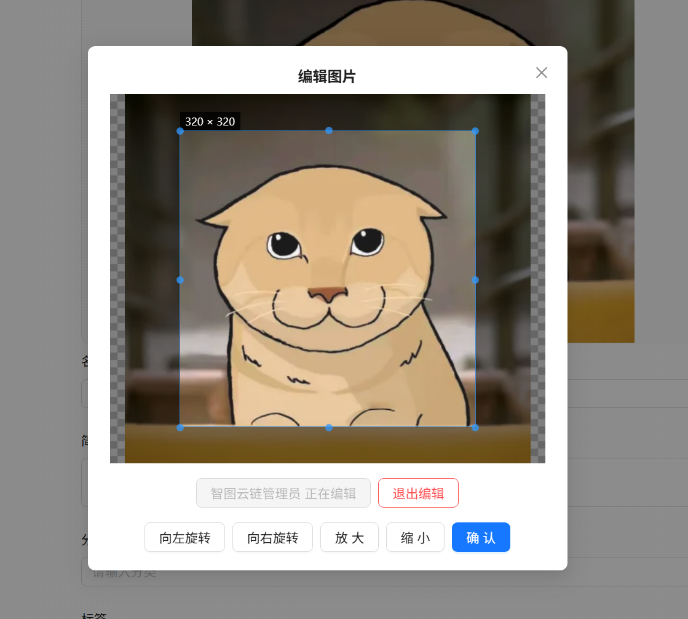
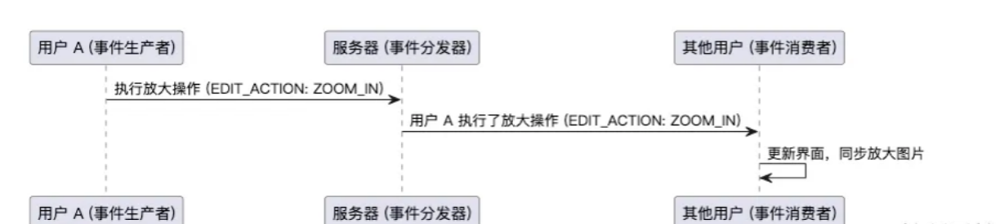

# 图片协同编辑

上一节我们已؜经完成了团队空间的创建、成员管理和权限控制等功能。为了提高项目的商业价值，本节来完成本项目的亮点功能 —— 图片协同编辑。

大纲：

* 图片协同编辑需求分析
* 图片协同编辑方案设计
* 图片协同编辑后端开发
* 图片协同编辑前端开发

通过本节，你将学؜习到多人实时协作功能的设计开发，涉及 WebSocket、事件驱动设计、Disruptor 无锁队列等技术知识。学会后再去开发聊天室之类的业务，都会轻松很多。

# 需求分析

现在很多产؜品都有多人协作功能，比如协同文档、协同素材设计、协同代码编辑器等等，可以提高协作的效率。

对于我们的项目，所谓的图片协同编辑功能，是在图片编辑的基础上增加了 “协同” 的概念。当用户编辑某张图片时，其他用户可以 实时 看到编辑效果和操作提示。如图：



注意，因为只有؜团队空间才会有多个用户编辑同一张图片，所以该功能只对团队空间开放，需要成员具有编辑权限。协同的图片编辑操作包括左旋、右旋、放大、缩小。

---

# 方案设计

虽然需求介؜绍很简单，但是涉及到多人协作的业务，有很多问题需要考虑，比如：

* 多个用户之间如何进行交互？
* 如何防止协作编辑时出现冲突？
* 如何提高协作的实时性？

## 协作交互流程

多人协作时؜，每个用户的动作都需要通知到其他用户，收到通知消息的用户需要进行相应的处理。

比如用户 A؜ 放大了图片，就需要给其他正在编辑的用户发送 “图片放大” 消息，其他用户收到这个消息后，需要同步放大自己界面上的图片。

这其实是一种 事件驱动 的架构设计思想，协作编辑中的每个用户动作本质上是一个 事件，执行动作时会产生事件并提交给服务器；服务器收到事件后，会转发给其他用户；其他用户收到事件后，就要作为事件的消费者来处理事件。流程如图：



相比于生产者直接调用消费者，事件驱动模型的主要优点在于 解耦 和 异步性。在事件驱动模型中，生产者和消费者不需要直接依赖于彼此的实现，生产者只需触发事件并将其发送到事件分发器，消费者则根据事件类型处理逻辑。这样多个消费者可以独立响应同一事件（比如一个用户旋转了图片，其他用户都能同步），系统更加灵活，可扩展性更强。此外，事件驱动还可以提升系统的 并发性PVHq6NW9Nt5fXkQO/a1pmCEpMMQkmAtku92aHSjiX4c= 和 实时性，可以理解为多引入了一个中介来帮忙，通过异步消息传递，减少了阻塞和等待，能够更高效地处理多个并发任务。

下面我们按照事件驱动的设计，来详细列举协作编辑的交互流程：

## 解决协作冲突

### 1、解决方案

假设这样一؜种场景：张三和李四同时快速点击了十次旋转，最终的结果会是怎样的呢？

如果所有事件都是按顺序处理的，那结果就很清晰了，但事实上，为了提高性能和响应速度，事件通常是 并发 的，而不是严格的顺序执行。这种并发操作会引发 协作冲突，导致其他用户看到的旋转效果是乱序的。

那么你会怎؜么解决协作冲突的问题呢？      ‌                  ‍        

我们可以通过业务设计来减少开发成本，比如约定 同一时刻只允许一位用户进入编辑图片的状态，此时其他用户只能实时浏览到修改效果，但不能参与编辑；进入编辑状态的用户可以退出编辑，其他用户才可以进入编辑状态。类似于给图片编辑这个动作加了一把锁，直接从源头上解决了编辑冲突的问题。

此时，协作؜编辑的交互流程又要增加 2 个动作 —— 进入编辑状态和退出编辑状态：

其实核心流程是前 5 行，但是考虑到前端传递了错误参数的情况，我们新增一种 `ERROR` 事件类型，可用于展示错误提示信息。

在本项目中؜，我们就采用这种方案，不仅实现简单、流程清晰，也尽最大可能减少了编辑冲突的风险。

但这种方案的缺点也؜很明显，减少了实时协作的便利性，对于协作设计、协作编码、协作文档的场景，同一时间只能有一个用户编辑，提高的效率有限。所以这里再分享另外一种实时协同算法作为扩展知识。

### 2、扩展知识 - OT 算法

实时协同 OT 算法（Operational Transformation）是一种支持分布式系统中多个用户实时协作编辑的核心算法，广泛应用于在线文档协作等场景。OT 算法的主要功能是解决并发编辑冲突，确保编辑结果在所有用户终端一致。

OT 算法其实很好理解，先看下 3 个核心概念：

* 操作 (Operation)：表示用户对协作内容的修改，比如插入字符、删除字符等。
* 转化 (Transformation)：当多个用户同时编辑内容时，OT 会根据操作的上下文将它们转化，使得这些操作可以按照不同的顺序应用而结果保持一致。
* 因果一致性：OT 算法确保操作按照用户看到的顺序被正确执行，即每个用户的操作基于最新的内容状态。

其中，最重要的就是 转化 步骤了，相当于有一个负责人统一收集大家的操作，然后按照设定的规则和信息进行排序与合并，最终给大家一个统一的结果。

举一个简单的例子，假设初始内容是 `"abc"`，用户 A 和 B 同时进行编辑：

* 用户 A 在位置 `1` 插入 `"x"`
* 用户 B 在位置 `2` 删除 `"b"`

如果不使用 OT 算法，结果是：

1. 用户 A 操作后，内容变为 `"axbc"`
2. 用户 B 操作后，内容变为 `"ac"`

如果直接应用 B 的操作到 A 的结果，得到的是 `"ac"`，对于 A 来说，相当于删除了 `"b"`，A 会感到一脸懵逼。1jGyT1jdedQgDNFYA8T3BC8Rpod+tQXglYFmkZuCZXA=

如果使用 OT 算法，结果是：

1. 用户 A 的操作，应用后内容为 `"axbc"`
2. 用户 B 的操作经过 OT 转化为删除 `"b"` 在 `"axbc"` 中的新位置

最终用户 A 和 B 的内容都一致为 `"axc"`，符合预期。OT 算法确保无论用户编辑的顺序如何，最终内容是一致的。

当然，具体؜的 OT 算法还是要根据需求来设计了，协作密度越高，算法设计难度越大。

此外，还有一种与 O؜T 类似的协同算法 CRDT（Conflict-free Replicated Data Type），其通过数学模型实现无需中心化转化的冲突解决，在离线协作场景中更具优势，感兴趣的同学可以自行了解。

## 提高协作实时性

在实时通讯的业务场؜景中，常用的技术方案包括长轮询、SSE 和 WebSocket。由于我们的业务需求需要实现频繁且高效的双向通信，因此我们选用 WebSocket 来实现即时通讯。

### 1、什么是 WebSocket？

WebSocket 是一种 全双工通信协议，让客户端（比如浏览器）和服务器之间能够保持实时、持续的连接。和传统的 HTTP 请求-响应模式不同，WebSocket 是一条**“常开的隧道”** ，连接的双方可以随时发送和接收数据，而不需要不断建立和关闭连接。

打个比方：

* HTTP 就像点外卖： 每次下单（请求）- 到货（响应）都是一次独立的操作，完成后连接关闭。
* WebSocket 像是打电话：你打通了电话（建立连接），可以随时聊天（双向通信），直到挂断（关闭连接）。

### 2、WebSocket 的应用场景

WebSocket 的主要作用是 实现实时数据传输，适用于需要频繁交互或者实时更新数据的场景。比如：

* 即时通讯（聊天软件、实时协作工具）
* 实时数据更新（股票行情、体育比赛比分）
* 在线游戏（多人实时互动）
* 物联网（设备状态实时传输）
* 协同编辑（像语雀这样的多人协作编辑）

通过 We؜bSocket，客户端与服务器之间能够显著减少消息传输的延迟，提高通信效率，同时降低数据传输的开销。

### 3、WebSocket 和 HTTP 的关系

WebSock؜et 和 HTTP 是两种不同的通信协议，但它们是紧密相关的，都是基于 TCP 协议、都可以在同样的端口上工作（比如 80 和 443）。

**首先要明确，WebSocket 是建立在 HTTP 基础之上的！** WebSocket 的连接需要通过 HTTP 协议发起一个握手（称为 HTTP Upgrade 请求），这个握手请求是 WebSocket 建立连接的前提，表明希望切换协议；服务器如果支持 WebSocket，会返回一个 HTTP 101 状态码，表示协议切换成功。

握手完成后؜，HTTP 协议的作用结束，通信会切换为 WebSocket 协议，双方可以开始全双工通信。

### 4、WebSocket 协作编辑的流程

通过 WebSo؜cket 实时通信的能力，可以将用户的编辑操作发给 WebSocket 服务器，再由服务器转发给其他连接服务器的用户前端，前端就可以根据操作处理图片。Dlfw8NwnEDAWu8E/AQcY7dm3A98behgssP1uNM9pOf8=

具体的业务流程：

1. 建立连接之前，先进行用户权限校验；校验通过后，将登录用户信息、要编辑的图片信息保存到要建立的 WebSocket 连接的会话属性中。
2. 建立连接成功后，将 WebSocket 会话保存到该图片对应的会话集合中，便于后续分发消息给其他会话。
3. 前端将消息发送到后端，后端根据消息类型分发到对应的处理器。
4. 处理器处理消息，将处理结果作为消息发送给需要的 WebSocket 客户端。
5. 当前端断开连接时，删除会话集合中的 WebSocket 会话，释放资源。

和 HTT؜P 请求一样，前端和 WebSocket 服务器之间传输信息时，也可以通过 JSON 格式对数据进行序列化。

### 5、WebSocket 的实现方式

对于 Java Spring 项目，主要有原生 WebSocket（基于`WebSocketHandler` 实现）、STOMP、WebFlux 这 3 种实现方式。

对于大多数简单实时推送，选用原生 WebSocket；对于复杂的聊天室和协同系统，选用 WebSocket + STOMP + SockJS；对于高并发、低延迟数据流推送，选用 WebFlux + Reactive WebSocket。

对于我们的؜项目，并发要求不高，选择 Spring 原生的 WebSocket 来降低开发成本。

明确方案后，我们进入后端开发。

---

# 后端开发

## 1、引入 WebSocket 依赖

引入依赖：


```XML
<!-- websocket --><dependency><groupId>org.springframework.boot</groupId><artifactId>spring-boot-starter-websocket</artifactId></dependency>
```

新建 `manager.websocket` 包，所有和 WebSocket 相关的代码都放到该包下。

## 2、定义数据模型

新建 `websocket.model` 包，存放数据模型，包括请求类、响应类、枚举类。

1）定义图片编辑请求消息，也就是前端要发送给后端的参数：


```Java
@Data@NoArgsConstructor@AllArgsConstructorpublic class PictureEditRequestMessage {

    /**
     * 消息类型，例如 "ENTER_EDIT", "EXIT_EDIT", "EDIT_ACTION"
     */private String type;

    /**
     * 执行的编辑动作
     */private String editAction;
}
```

2）定义图片编辑响应消息，也就是后端要发送给前端的信息：


```Java
@Data@NoArgsConstructor@AllArgsConstructorpublic class PictureEditResponseMessage {

    /**
     * 消息类型，例如 "INFO", "ERROR", "ENTER_EDIT", "EXIT_EDIT", "EDIT_ACTION"
     */private String type;

    /**
     * 信息
     */private String message;

    /**
     * 执行的编辑动作
     */private String editAction;

    /**
     * 用户信息
     */private UserVO user;
}
```

3）定义图؜片编辑消息类型枚举，便于后续根据消息类型进行相应的处理：


```Java
@Getterpublic enum PictureEditMessageTypeEnum {

    INFO("发送通知", "INFO"),
    ERROR("发送错误", "ERROR"),
    ENTER_EDIT("进入编辑状态", "ENTER_EDIT"),
    EXIT_EDIT("退出编辑状态", "EXIT_EDIT"),
    EDIT_ACTION("执行编辑操作", "EDIT_ACTION");

    private final String text;
    private final String value;

    PictureEditMessageTypeEnum(String text, String value) {
        this.text = text;
        this.value = value;
    }

    /**
     * 根据 value 获取枚举
     */public static PictureEditMessageTypeEnum getEnumByValue(String value) {
        if (value == null || value.isEmpty()) {
            return null;
        }
        for (PictureEditMessageTypeEnum typeEnum : PictureEditMessageTypeEnum.values()) {
            if (typeEnum.value.equals(value)) {
                return typeEnum;
            }
        }
        return null;
    }
}
```

4）定义图片编辑操作类型枚举：


```Java
@Getterpublic enum PictureEditActionEnum {

    ZOOM_IN("放大操作", "ZOOM_IN"),
    ZOOM_OUT("缩小操作", "ZOOM_OUT"),
    ROTATE_LEFT("左旋操作", "ROTATE_LEFT"),
    ROTATE_RIGHT("右旋操作", "ROTATE_RIGHT");

    private final String text;
    private final String value;

    PictureEditActionEnum(String text, String value) {
        this.text = text;
        this.value = value;
    }

    /**
     * 根据 value 获取枚举
     */public static PictureEditActionEnum getEnumByValue(String value) {
        if (value == null || value.isEmpty()) {
            return null;
        }
        for (PictureEditActionEnum actionEnum : PictureEditActionEnum.values()) {
            if (actionEnum.value.equals(value)) {
                return actionEnum;
            }
        }
        return null;
    }
}
```

## 3、WebSocket 拦截器 - 权限校验

在 WebSoc؜ket 连接前需要进行权限校验，如果发现用户没有团队空间内编辑图片的权限，则拒绝握手，可以通过定义一个 WebSocket 拦截器实现这个能力。

此外，由于 HTTP 和 ؜WebSocket 的区别，我们不能在后续收到前端消息时直接从 request 对象中获取到登录用户信息，因此也需要通过 WebSocket 拦截器，为即将建立连接的 WebSocket 会话指定一些属性，比如登录用户信息、编辑的图片 id 等。

编写拦截器的代码，需要实现 `HandshakeInterceptor` 接口：


```Java
@Component@Slf4jpublic class WsHandshakeInterceptor implements HandshakeInterceptor {

    @Resourceprivate UserService userService;

    @Resourceprivate PictureService pictureService;

    @Resourceprivate SpaceService spaceService;

    @Resourceprivate SpaceUserAuthManager spaceUserAuthManager;

    @Overridepublic boolean beforeHandshake(@NotNull ServerHttpRequest request, @NotNull ServerHttpResponse response, @NotNull WebSocketHandler wsHandler, @NotNull Map<String, Object> attributes) {
        if (request instanceof ServletServerHttpRequest) {
            HttpServletRequest servletRequest = ((ServletServerHttpRequest) request).getServletRequest();
            // 获取请求参数String pictureId = servletRequest.getParameter("pictureId");
            if (StrUtil.isBlank(pictureId)) {
                log.error("缺少图片参数，拒绝握手");
                return false;
            }
            User loginUser = userService.getLoginUser(servletRequest);
            if (ObjUtil.isEmpty(loginUser)) {
                log.error("用户未登录，拒绝握手");
                return false;
            }
            // 校验用户是否有该图片的权限Picture picture = pictureService.getById(pictureId);
            if (picture == null) {
                log.error("图片不存在，拒绝握手");
                return false;
            }
            Long spaceId = picture.getSpaceId();
            Space space = null;
            if (spaceId != null) {
                space = spaceService.getById(spaceId);
                if (space == null) {
                    log.error("空间不存在，拒绝握手");
                    return false;
                }
                if (space.getSpaceType() != SpaceTypeEnum.TEAM.getValue()) {
log.info("不是团队空间，拒绝握手");
                    return false;
                }
            }
            List<String> permissionList = spaceUserAuthManager.getPermissionList(space, loginUser);
            if (!permissionList.contains(SpaceUserPermissionConstant.PICTURE_EDIT)) {
                log.error("没有图片编辑权限，拒绝握手");
                return false;
            }
            // 设置 attributes
            attributes.put("user", loginUser);
            attributes.put("userId", loginUser.getId());
            attributes.put("pictureId", Long.valueOf(pictureId)); // 记得转换为 Long 类型
        }
        return true;
    }

    @Overridepublic void afterHandshake(@NotNull ServerHttpRequest request, @NotNull ServerHttpResponse response, @NotNull WebSocketHandler wsHandler, Exception exception) {
    }
}
```

## 4、WebSocket 处理器

我们需要定؜义 WebSocket 处理器类，在连接成功、连接关闭、接收到客户端消息时进行相应的处理。

可以实现 ؜TextWebSocketHandler 接口，这样就能以字符串的方式发送和接受消息了：


```Java
@Componentpublic class PictureEditHandler extends TextWebSocketHandler {
}
```

1）首先在处理器类中定义 2 个常量，分别为：

* 保存当前正在编辑的用户 id，执行编辑操作、进入或退出编辑时都会校验。
* 保存参与编辑图片的用户 WebSocket 会话的集合。

由于每个图؜片的协作编辑都是相互独立的，所以需要用 Map 来区分每个图片 id 对应的数据。代码如下：


```Java
// 每张图片的编辑状态，key: pictureId, value: 当前正在编辑的用户 IDprivate final Map<Long, Long> pictureEditingUsers = new ConcurrentHashMap<>();

// 保存所有连接的会话，key: pictureId, value: 用户会话集合private final Map<Long, Set<WebSocketSession>> pictureSessions = new ConcurrentHashMap<>();
```

注意，由于可能同时有多个 WebSocket 客户端建立连接和发送消息，集合要使用并发包（JUC）中的 `ConcurrentHashMap`，来保证线程安全。

2）由于接下来很多消息都需要传递给所有协作者，所以先编写一个 广播消息 的方法。该方法会根据 pictureId，将响应消息发送给编辑该图片的所有会话。考虑到可能会有消息不需要发送给编辑者本人的情况，该方法还可以接受 excludeSession 参数，支持排除掉向某个会话发送消息。

代码如下：؜         ‌         ‌              


```Java
private void broadcastToPicture(Long pictureId, PictureEditResponseMessage pictureEditResponseMessage, WebSocketSession excludeSession) throws Exception {
    Set<WebSocketSession> sessionSet = pictureSessions.get(pictureId);
    if (CollUtil.isNotEmpty(sessionSet)) {
        // 创建 ObjectMapperObjectMapper objectMapper = new ObjectMapper();
        // 配置序列化：将 Long 类型转为 String，解决丢失精度问题SimpleModule module = new SimpleModule();
        module.addSerializer(Long.class, ToStringSerializer.instance);
        module.addSerializer(Long.TYPE, ToStringSerializer.instance); // 支持 long 基本类型
        objectMapper.registerModule(module);
        // 序列化为 JSON 字符串String message = objectMapper.writeValueAsString(pictureEditResponseMessage);
        TextMessage textMessage = new TextMessage(message);
        for (WebSocketSession session : sessionSet) {
            // 排除掉的 session 不发送if (excludeSession != null && excludeSession.equals(session)) {
                continue;
            }
            if (session.isOpen()) {
                session.sendMessage(textMessage);
            }
        }
    }
}
```

上述代码中有个小细؜节，由于前端 JS 的长整数可能会丢失精度，所以使用 Jackson 自定义序列化器，在将对象转换为 JSON 字符串时，将 Long 类型转换为 String 类型。

再编写一个不排除 Session，给所有会话广播的方法：


```Java
// 全部广播private void broadcastToPicture(Long pictureId, PictureEditResponseMessage pictureEditResponseMessage) throws Exception {
    broadcastToPicture(pictureId, pictureEditResponseMessage, null);
}
```

3）实现连؜接建立成功后执行的方法，保存会话到集合中，并且给其他会话发送消息：


```Java
@Overridepublic void afterConnectionEstablished(WebSocketSession session) throws Exception {
    // 保存会话到集合中User user = (User) session.getAttributes().get("user");
    Long pictureId = (Long) session.getAttributes().get("pictureId");
    pictureSessions.putIfAbsent(pictureId, ConcurrentHashMap.newKeySet());
    pictureSessions.get(pictureId).add(session);

    // 构造响应PictureEditResponseMessage pictureEditResponseMessage = new PictureEditResponseMessage();
    pictureEditResponseMessage.setType(PictureEditMessageTypeEnum.INFO.getValue());
    String message = String.format("%s加入编辑", user.getUserName());
    pictureEditResponseMessage.setMessage(message);
    pictureEditResponseMessage.setUser(userService.getUserVO(user));
    // 广播给同一张图片的用户
    broadcastToPicture(pictureId, pictureEditResponseMessage);
}
```

4）编写接收客户端消息的方法，根据消息类别执行不同的处理：


```Java
@Overrideprotected void handleTextMessage(WebSocketSession session, TextMessage message) throws Exception {
    // 将消息解析为 PictureEditMessagePictureEditRequestMessage pictureEditRequestMessage = JSONUtil.toBean(message.getPayload(), PictureEditRequestMessage.class);
    String type = pictureEditRequestMessage.getType();
    PictureEditMessageTypeEnum pictureEditMessageTypeEnum = PictureEditMessageTypeEnum.valueOf(type);

    // 从 Session 属性中获取公共参数
    Map<String, Object> attributes = session.getAttributes();
    User user = (User) attributes.get("user");
    Long pictureId = (Long) attributes.get("pictureId");

    // 调用对应的消息处理方法switch (pictureEditMessageTypeEnum) {
        case ENTER_EDIT:
            handleEnterEditMessage(pictureEditRequestMessage, session, user, pictureId);
            break;
        case EDIT_ACTION:
            handleEditActionMessage(pictureEditRequestMessage, session, user, pictureId);
            break;
        case EXIT_EDIT:
            handleExitEditMessage(pictureEditRequestMessage, session, user, pictureId);
            break;
        default:
            PictureEditResponseMessage pictureEditResponseMessage = new PictureEditResponseMessage();
            pictureEditResponseMessage.setType(PictureEditMessageTypeEnum.ERROR.getValue());
            pictureEditResponseMessage.setMessage("消息类型错误");
            pictureEditResponseMessage.setUser(userService.getUserVO(user));
            session.sendMessage(new TextMessage(JSONUtil.toJsonStr(pictureEditResponseMessage)));
    }
}
```

接下来依次؜编写每个处理消息的方法。首先是用户进入编辑状态，要设置当前用户为编辑用户，并且向其他客户端发送消息：


```Java
public void handleEnterEditMessage(PictureEditRequestMessage pictureEditRequestMessage, WebSocketSession session, User user, Long pictureId) throws Exception {
    // 没有用户正在编辑该图片，才能进入编辑if (!pictureEditingUsers.containsKey(pictureId)) {
        // 设置当前用户为编辑用户
        pictureEditingUsers.put(pictureId, user.getId());
        PictureEditResponseMessage pictureEditResponseMessage = new PictureEditResponseMessage();
        pictureEditResponseMessage.setType(PictureEditMessageTypeEnum.ENTER_EDIT.getValue());
        String message = String.format("%s开始编辑图片", user.getUserName());
        pictureEditResponseMessage.setMessage(message);
        pictureEditResponseMessage.setUser(userService.getUserVO(user));
        broadcastToPicture(pictureId, pictureEditResponseMessage);
    }
}
```

用户执行编辑操作时，将该操作同步给 除了当前用户之外 的其他客户端，也就是说编辑操作不用再同步给自己：


```Java
public void handleEditActionMessage(PictureEditRequestMessage pictureEditRequestMessage, WebSocketSession session, User user, Long pictureId) throws Exception {
    Long editingUserId = pictureEditingUsers.get(pictureId);
    String editAction = pictureEditRequestMessage.getEditAction();
    PictureEditActionEnum actionEnum = PictureEditActionEnum.getEnumByValue(editAction);
    if (actionEnum == null) {
        return;
    }
    // 确认是当前编辑者if (editingUserId != null && editingUserId.equals(user.getId())) {
        PictureEditResponseMessage pictureEditResponseMessage = new PictureEditResponseMessage();
        pictureEditResponseMessage.setType(PictureEditMessageTypeEnum.EDIT_ACTION.getValue());
        String message = String.format("%s执行%s", user.getUserName(), actionEnum.getText());
        pictureEditResponseMessage.setMessage(message);
        pictureEditResponseMessage.setEditAction(editAction);
        pictureEditResponseMessage.setUser(userService.getUserVO(user));
        // 广播给除了当前客户端之外的其他用户，否则会造成重复编辑
        broadcastToPicture(pictureId, pictureEditResponseMessage, session);
    }
}
```

用户退出编؜辑操作时，移除当前用户的编辑状态，并且向其他客户端发送消息：


```Java
public void handleExitEditMessage(PictureEditRequestMessage pictureEditRequestMessage, WebSocketSession session, User user, Long pictureId) throws Exception {
    Long editingUserId = pictureEditingUsers.get(pictureId);
    if (editingUserId != null && editingUserId.equals(user.getId())) {
        // 移除当前用户的编辑状态
        pictureEditingUsers.remove(pictureId);
        // 构造响应，发送退出编辑的消息通知PictureEditResponseMessage pictureEditResponseMessage = new PictureEditResponseMessage();
        pictureEditResponseMessage.setType(PictureEditMessageTypeEnum.EXIT_EDIT.getValue());
        String message = String.format("%s退出编辑图片", user.getUserName());
        pictureEditResponseMessage.setMessage(message);
        pictureEditResponseMessage.setUser(userService.getUserVO(user));
        broadcastToPicture(pictureId, pictureEditResponseMessage);
    }
}
```

5）WebS؜ocket 连接关闭时，需要移除当前用户的编辑状态、并且从集合中删除当前会话，还可以给其他客户端发送消息通知：


```Java
@Overridepublic void afterConnectionClosed(WebSocketSession session, @NotNull CloseStatus status) throws Exception {
    Map<String, Object> attributes = session.getAttributes();
    Long pictureId = (Long) attributes.get("pictureId");
    User user = (User) attributes.get("user");
    // 移除当前用户的编辑状态
    handleExitEditMessage(null, session, user, pictureId);

    // 删除会话
    Set<WebSocketSession> sessionSet = pictureSessions.get(pictureId);
    if (sessionSet != null) {
        sessionSet.remove(session);
        if (sessionSet.isEmpty()) {
            pictureSessions.remove(pictureId);
        }
    }

    // 响应PictureEditResponseMessage pictureEditResponseMessage = new PictureEditResponseMessage();
    pictureEditResponseMessage.setType(PictureEditMessageTypeEnum.INFO.getValue());
    String message = String.format("%s离开编辑", user.getUserName());
    pictureEditResponseMessage.setMessage(message);
    pictureEditResponseMessage.setUser(userService.getUserVO(user));
    broadcastToPicture(pictureId, pictureEditResponseMessage);
}
```

💡 由于处理器的代码؜并不复杂，而且处理逻辑中使用到了当前类的全局变量，所以没有选择将每个处理器封装为单独的类。大家也可以将每个处理器封装为单独的类（相当于设计模式中的策略模式），并且根据消息类别调

## 5、WebSocket 配置

类似于编写؜ Spring MVC 的 Controller 接口，可以为指定的路径配置处理器和拦截器：


```Java
@Configuration@EnableWebSocketpublic class WebSocketConfig implements WebSocketConfigurer {

    @Resourceprivate PictureEditHandler pictureEditHandler;

    @Resourceprivate WsHandshakeInterceptor wsHandshakeInterceptor;

    @Overridepublic void registerWebSocketHandlers(WebSocketHandlerRegistry registry) {
        // websocket
        registry.addHandler(pictureEditHandler, "/ws/picture/edit")
                .addInterceptors(wsHandshakeInterceptor)
                .setAllowedOrigins("*");
    }
}
```

之后，前端就可以通过 WebSocket 连接项目启动端口的 `/ws/picture/edit` 路径了。

---

# 前端开发

前端开发主要集中在基础图片编辑组件 `ImageCropper.vue` 中。

## 1、基础代码

首先根据后端的枚举类和常量，在 `picture.ts` 中定义图片编辑消息类型、图片编辑动作：


```TypeScript
export const PICTURE_EDIT_MESSAGE_TYPE_ENUM = {
  INFO: 'INFO',
  ERROR: 'ERROR',
  ENTER_EDIT: 'ENTER_EDIT',
  EXIT_EDIT: 'EXIT_EDIT',
  EDIT_ACTION: 'EDIT_ACTION',
};

export const PICTURE_EDIT_MESSAGE_TYPE_MAP = {
  INFO: '发送通知',
  ERROR: '发送错误',
  ENTER_EDIT: '进入编辑状态',
  EXIT_EDIT: '退出编辑状态',
  EDIT_ACTION: '执行编辑操作',
};

export const PICTURE_EDIT_ACTION_ENUM = {
  ZOOM_IN: 'ZOOM_IN',
  ZOOM_OUT: 'ZOOM_OUT',
  ROTATE_LEFT: 'ROTATE_LEFT',
  ROTATE_RIGHT: 'ROTATE_RIGHT',
};

export const PICTURE_EDIT_ACTION_MAP = {
  ZOOM_IN: '放大操作',
  ZOOM_OUT: '缩小操作',
  ROTATE_LEFT: '左旋操作',
  ROTATE_RIGHT: '右旋操作',
};
```

## 2、WebSocket 前端基础代码

为了让页面或组件的代码中能够更方便地使用 WebSocket 连接，我们可以先在 `utils` 目录下编写适用于图片编辑 WebSocket 连接的工具类。定义了：

* 连接 WebSocket 的地址
* WebSocket 各个事件的处理函数，比如连接成功和连接关闭事件，跟后端对应
* 向 WebSocket 服务端发送消息的函数等

代码如下，这段属于样板代码，大家了解一下即可，不必自己敲：


```TypeScript
export default class PictureEditWebSocket {
  private pictureId: numberprivate socket: WebSocket | nullprivate eventHandlers: anyconstructor(pictureId: number) {
    this.pictureId = pictureId // 当前编辑的图片 IDthis.socket = null // WebSocket 实例this.eventHandlers = {} // 自定义事件处理器
  }

  /**
   * 初始化 WebSocket 连接
   */connect() {
    const url = `ws://localhost:8123/api/ws/picture/edit?pictureId=${this.pictureId}`this.socket = new WebSocket(url)

    // 设置携带 cookiethis.socket.binaryType = 'blob'// 监听连接成功事件this.socket.onopen = () => {
      console.log('WebSocket 连接已建立')
      this.triggerEvent('open')
    }

    // 监听消息事件this.socket.onmessage = (event) => {
      const message = JSON.parse(event.data)
      console.log('收到消息:', message)

      // 根据消息类型触发对应事件const type = message.typethis.triggerEvent(type, message)
    }

    // 监听连接关闭事件this.socket.onclose = (event) => {
      console.log('WebSocket 连接已关闭:', event)
      this.triggerEvent('close', event)
    }

    // 监听错误事件this.socket.onerror = (error) => {
      console.error('WebSocket 发生错误:', error)
      this.triggerEvent('error', error)
    }
  }

  /**
   * 关闭 WebSocket 连接
   */disconnect() {
    if (this.socket) {
      this.socket.close()
      console.log('WebSocket 连接已手动关闭')
    }
  }

  /**
   * 发送消息到后端
   * @param {Object} message 消息对象
   */sendMessage(message: object) {
    if (this.socket && this.socket.readyState === WebSocket.OPEN) {
      this.socket.send(JSON.stringify(message))
      console.log('消息已发送:', message)
    } else {
      console.error('WebSocket 未连接，无法发送消息:', message)
    }
  }

  /**
   * 添加自定义事件监听
   * @param {string} type 消息类型
   * @param {Function} handler 消息处理函数
   */on(type: string, handler: (data?: any) => void) {
    if (!this.eventHandlers[type]) {
      this.eventHandlers[type] = []
    }
    this.eventHandlers[type].push(handler)
  }

  /**
   * 触发事件
   * @param {string} type 消息类型
   * @param {Object} data 消息数据
   */triggerEvent(type: string, data?: any) {
    const handlers = this.eventHandlers[type]
    if (handlers) {
      handlers.forEach((handler: any) => handler(data))
    }
  }
}
```

上述代码中比较巧妙的是，我们自定义了一套事件监听机制，使用工具类的组件可以通过 `on` 方法注册事件处理函数，然后通过 `triggerEvent` 函数触发事件处理函数。

## 3、图片编辑组件开发

1）定义响应؜式变量，包括正在编辑的用户、用户是否可以进入编辑、用户是否可以退出编辑，这些变量会用于控制页面的展示和编辑按钮是否可点击：


```TypeScript
// --------- 实时编辑 ---------const loginUserStore = useLoginUserStore()
let loginUser = loginUserStore.loginUser// 正在编辑的用户const editingUser = ref<API.UserVO>()
// 没有用户正在编辑中，可进入编辑const canEnterEdit = computed(() => {
  return !editingUser.value
})
// 正在编辑的用户是本人，可退出编辑const canExitEdit = computed(() => {
  return editingUser.value?.id === loginUser.id
})
// 可以编辑const canEdit = computed(() => {
  return editingUser.value?.id === loginUser.id
})
```

2）开发协同编辑操作相关的按钮元素：


```PlainText
<!-- 协同编辑操作 -->
<div class="image-edit-actions">
  <a-space>
    <a-button v-if="editingUser" disabled> {{ editingUser.userName }}正在编辑</a-button>
    <a-button v-if="canEnterEdit" type="primary" ghost @click="enterEdit">进入编辑</a-button>
    <a-button v-if="canExitEdit" danger ghost @click="exitEdit">退出编辑</a-button>
  </a-space>
</div>
```

给所有的图؜片编辑操作按钮补充禁用状态，如果有其他人在编辑，则禁用按钮：


```PlainText
<a-space>
  <a-button @click="rotateLeft" :disabled="!canEdit">向左旋转</a-button>
  <a-button @click="rotateRight" :disabled="!canEdit">向右旋转</a-button>
  <a-button @click="changeScale(1)" :disabled="!canEdit">放大</a-button>
  <a-button @click="changeScale(-1)" :disabled="!canEdit">缩小</a-button>
  <a-button type="primary" :loading="loading" :disabled="!canEdit" @click="handleConfirm">
    确认
  </a-button>
</a-space>
```

效果如图：

3）初始化 WebSocket 连接，绑定事件：


```TypeScript
let websocket: PictureEditWebSocket | null// 初始化 WebSocket 连接，绑定事件const initWebsocket = () => {
  const pictureId = props.picture?.idif (!pictureId || !visible.value) {
    return
  }
  // 防止之前的连接未释放if (websocket) {
    websocket.disconnect()
  }
  // 创建 WebSocket 实例
  websocket = new PictureEditWebSocket(pictureId)
  // 建立 WebSocket 连接
  websocket.connect()

  // 监听通知消息
  websocket.on(PICTURE_EDIT_MESSAGE_TYPE_ENUM.INFO, (msg) => {
    console.log('收到通知消息：', msg)
message.info(msg.message)
  })

  // 监听错误消息
  websocket.on(PICTURE_EDIT_MESSAGE_TYPE_ENUM.ERROR, (msg) => {
    console.log('收到错误消息：', msg)
    message.error(msg.message)
  })

  // 监听进入编辑状态消息
  websocket.on(PICTURE_EDIT_MESSAGE_TYPE_ENUM.ENTER_EDIT, (msg) => {
    console.log('收到进入编辑状态消息：', msg)
message.info(msg.message)
    editingUser.value = msg.user
  })

  // 监听编辑操作消息
  websocket.on(PICTURE_EDIT_MESSAGE_TYPE_ENUM.EDIT_ACTION, (msg) => {
    console.log('收到编辑操作消息：', msg)
message.info(msg.message)
    switch (msg.editAction) {
      case PICTURE_EDIT_ACTION_ENUM.ROTATE_LEFT:
        cropperRef.value.rotateLeft()
        breakcase PICTURE_EDIT_ACTION_ENUM.ROTATE_RIGHT:
        cropperRef.value.rotateRight()
        breakcase PICTURE_EDIT_ACTION_ENUM.ZOOM_IN:
        cropperRef.value.changeScale(1)
        breakcase PICTURE_EDIT_ACTION_ENUM.ZOOM_OUT:
        cropperRef.value.changeScale(-1)
        break
    }
  })

  // 监听退出编辑状态消息
  websocket.on(PICTURE_EDIT_MESSAGE_TYPE_ENUM.EXIT_EDIT, (msg) => {
    console.log('收到退出编辑状态消息：', msg)
message.info(msg.message)
    editingUser.value = undefined
  })
}

watchEffect(() => {
  initWebsocket()
})

onUnmounted(() => {
  // 断开连接if (websocket) {
    websocket.disconnect()
  }
  editingUser.value = undefined
})

// 关闭弹窗const closeModal = () => {
  visible.value = false// 断开连接if (websocket) {
    websocket.disconnect()
  }
  editingUser.value = undefined
}
```

上述代码中的几个注意事项：

1. 定义了收到消息后的事件处理函数，比如收到编辑操作消息时，调用图片编辑器组件的对应操作方法，来同步编辑结果。收到有用户进入编辑状态的消息时，设置 editingUser 的值；收到有用户退出编辑状态的消息时，清空 editingUser 的值。
2. 及时释放 WebSocket 连接和资源：在组件销毁时（onUnmounted 函数）、弹窗关闭时（closeModal 函数）、重新连接时（initWebsocket 函数开头）都要释放连接并重置正在编辑的用户。

4）编辑发送 W؜ebSocket 消息的函数，包括进入编辑状态、退出编辑状态、执行编辑图片操作：                    ‍            


```TypeScript
// 进入编辑状态const enterEdit = () => {
  if (websocket) {
    // 发送进入编辑状态的消息
    websocket.sendMessage({
      type: PICTURE_EDIT_MESSAGE_TYPE_ENUM.ENTER_EDIT,
    })
  }
}

// 退出编辑状态const exitEdit = () => {
  if (websocket) {
    // 发送退出编辑状态的消息
    websocket.sendMessage({
      type: PICTURE_EDIT_MESSAGE_TYPE_ENUM.EXIT_EDIT,
    })
  }
}

// 编辑图片操作const editAction = (action: string) => {
  if (websocket) {
    // 发送编辑操作的请求
    websocket.sendMessage({
      type: PICTURE_EDIT_MESSAGE_TYPE_ENUM.EDIT_ACTION,
      editAction: action,
    })
  }
}
```

所有编辑图؜片的操作都要补充上发送 WebSocket 消息：


```TypeScript
// 向左旋转const rotateLeft = () => {
  cropperRef.value.rotateLeft()
  editAction(PICTURE_EDIT_ACTION_ENUM.ROTATE_LEFT)
}

// 向右旋转const rotateRight = () => {
  cropperRef.value.rotateRight()
  editAction(PICTURE_EDIT_ACTION_ENUM.ROTATE_RIGHT)
}

// 缩放const changeScale = (num: number) => {
  cropperRef.value.changeScale(num)
  if (num > 0) {
    editAction(PICTURE_EDIT_ACTION_ENUM.ZOOM_IN)
  } else {
    editAction(PICTURE_EDIT_ACTION_ENUM.ZOOM_OUT)
  }
}
```

## 4、协同编辑范围控制

只有团队空؜间才支持协作编辑，否则还是跟之前一样，默认就进入可编辑状态。

为此，我们需要在 `ImageCropper` 组件中获取到空间信息，并判断是否为团队空间。

1）可以由引入该组件的父页面 `AddPicturePage` 获取空间信息：


```TypeScript
const space = ref<API.SpaceVO>()

// 获取空间信息const fetchSpace = async () => {
  // 获取数据if (spaceId.value) {
    const res = await getSpaceVoByIdUsingGet({
      id: spaceId.value,
    })
    if (res.data.code === 0 && res.data.data) {
      space.value = res.data.data
    }
  }
}

watchEffect(() => {
  fetchSpace()
})
```

然后传入给组件：


```TypeScript
<ImageCropper
  ref="imageCropperRef"
  :imageUrl="picture?.url"
  :picture="picture"
  :spaceId="spaceId"
  :space="space"
  :onSuccess="onSuccess"
/>
```

2）在图片编辑组件中新增 space 属性：


```TypeScript
interface Props {
  imageUrl?: string
  picture?: API.PictureVO
  spaceId?: number
  space?: API.SpaceVO
  onSuccess?: (newPicture: API.PictureVO) => void
}
```

然后就可以؜根据 space 判断是否为团队空间了，定义一个变量便于复用：R7zfQ2yjmCwaGmgYTa9cW+7DK0YPbs0kpW2reaJf93o=


```TypeScript
// 是否为团队空间const isTeamSpace = computed(() => {
  return props.space?.spaceType === SPACE_TYPE_ENUM.TEAM;
})
```

3）使用该؜变量来控制协同编辑的范围，包括是否可编辑、是否初始化 WebSocket 连接：


```TypeScript
// 可以编辑const canEdit = computed(() => {
  // 不是团队空间，则默认可编辑if (!isTeamSpace.value) {
    return true
  }
  return editingUser.value?.id === loginUser.id
})

watchEffect(() => {
  // 团队空间才初始化if (isTeamSpace.value) {
    initWebsocket()
  }
})
```

以及是否展示协同编辑操作的按钮：


```PlainText
<!-- 协同编辑操作 -->
<div class="image-edit-actions" v-if="isTeamSpace">
</div>
```


