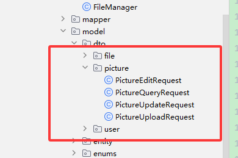
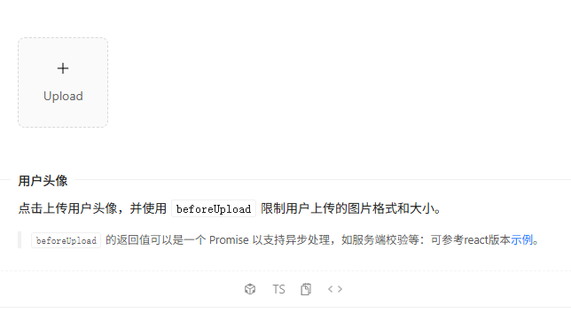
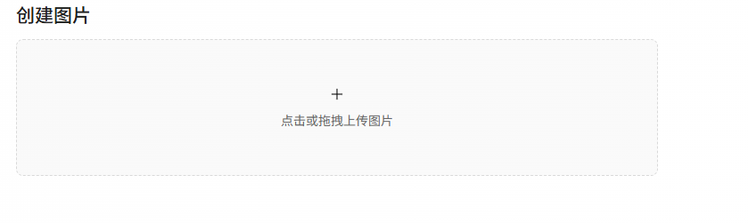
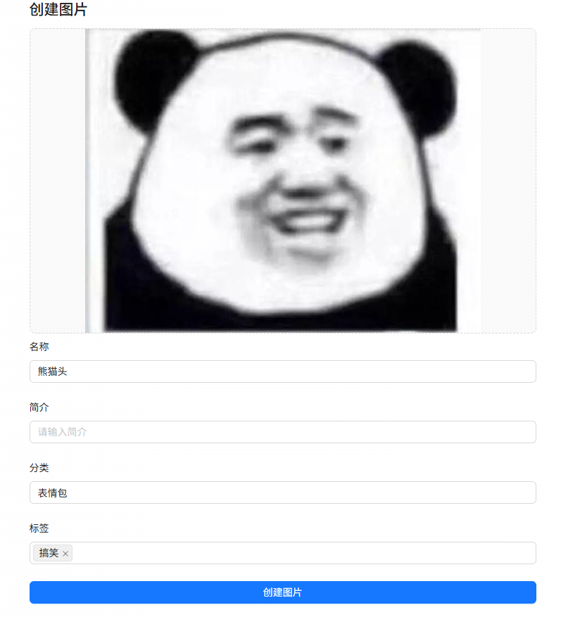
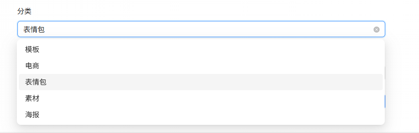
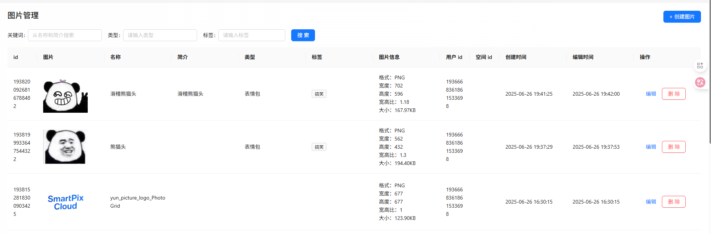
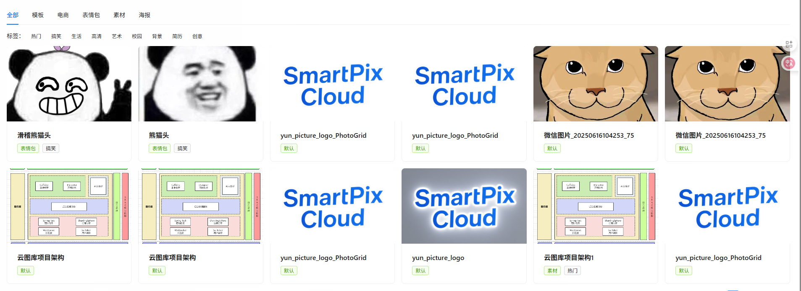
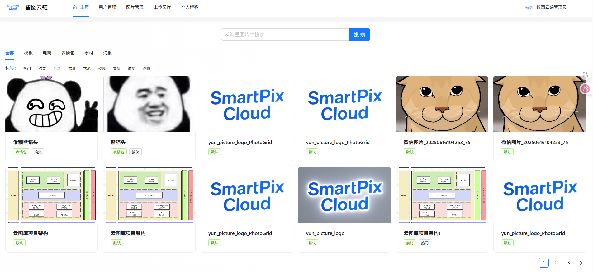
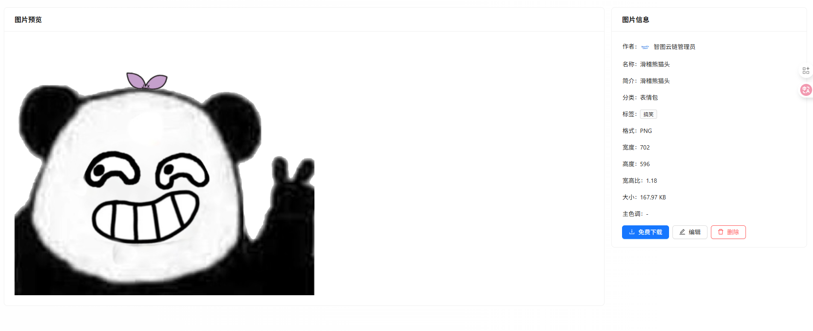

# 图片模块

# 需求分析

在设计图库系统时，要优先确保用户能够查看图片功能的实现，而上传功能暂时仅限管理员使用，以保证系统的安全性和稳定性。

基于这一原则，我们将优先实现以下功能，并按优先级排列如下：

1. 管理员功能

* 图片上传与创建
* 图片管理
* 图片修改（编辑信息）

1. 用户功能

* 查看与搜索图片列表（主页）
* 查看图片详情（详情页）
* 图片下载

具体分析每个需求：

1. 图片上传与创建：仅管理员可用，支持选择本地图片上传，并填写相关信息，如名称、简介、标签、分类等。系统会自动解析图片的基础信息（如宽高和格式等），便于检索。
2. 图片管理：管理员可以对图库内的图片资源进行管理，包括查询和删除。
3. 图片修改：管理员可以对图片信息进行编辑，例如修改名称、简介、标签、分类等。
4. 查看与搜索图片列表：用户在主页上可按关键词搜索图片，并支持按分类、标签等筛选条件分页查看图片列表。
5. 查看图片详情：用户点击列表中的图片后，可进入详情页，查看图片的大图及相关信息，如名称、简介、分类、标签、其他图片信息（如宽高和格式等)。
6. 图片下载：用户在详情页可点击下载图片按钮，将图片保存至本地。

# 方案设计

方案设计阶段我们需要确认：

* 库表设计
* 如何实现图片上传和下载？
* 创建图片的业务流程
* 如何解析图片的信息？

## 库表设计

表名：picture(图片表)，根据需求可以做出如下SQL设计：


```SQL
-- 图片表  
create table if not exists picture  
(  
    id           bigint auto_increment comment 'id' primary key,  
    url          varchar(512)                       not null comment '图片 url',  
    name         varchar(128)                       not null comment '图片名称',  
    introduction varchar(512)                       null comment '简介',  
    category     varchar(64)                        null comment '分类',  
    tags         varchar(512)                      null comment '标签（JSON 数组）',  
    picSize      bigint                             null comment '图片体积',  
    picWidth     int                                null comment '图片宽度',  
    picHeight    int                                null comment '图片高度',  
    picScale     double                             null comment '图片宽高比例',  
    picFormat    varchar(32)                        null comment '图片格式',  
    userId       bigint                             not null comment '创建用户 id',  
    createTime   datetime default CURRENT_TIMESTAMP not null comment '创建时间',  
    editTime     datetime default CURRENT_TIMESTAMP not null comment '编辑时间',  
    updateTime   datetime default CURRENT_TIMESTAMP not null on update CURRENT_TIMESTAMP comment '更新时间',  
    isDelete     tinyint  default 0                 not null comment '是否删除',  
    INDEX idx_name (name),                 -- 提升基于图片名称的查询性能  
    INDEX idx_introduction (introduction), -- 用于模糊搜索图片简介  
    INDEX idx_category (category),         -- 提升基于分类的查询性能  
    INDEX idx_tags (tags),                 -- 提升基于标签的查询性能  
    INDEX idx_userId (userId)              -- 提升基于用户 ID 的查询性能  
) comment '图片' collate = utf8mb4_unicode_ci;
```

几个注意事项：

1. 字段设计：

* 基础信息：包括图片的URL、名称、简介、分类、标签等，满足图片管理和分类筛选的基本需求。
* 图片属性：记录图片大小、分辨率（宽度、高度)、宽高比和格式，方便后续按照多种维度筛选图片。
* 用户关联：通过userId字段关联用户表，表示由哪个用户创建了该图片。
* 多个标签：由于标签支持多个值，使用JSON数组字符串来维护，而不是单独新建一个表，可以提高开发效率。

1. 时间字段区分：

* updateTime：任何字段的修改都会触发数据库自动更新，便于记录最新变动。该字段可以不让用户看到
* editTime：专用于记录图片信息被编辑的时间，需要通过业务逻辑主动更新。该字段可以对用户公开

1. 索引设计：为高频查询的字段（如图片名称、简介、分类、标签、用户id）添加索引，提高查询效率。
2. 逻辑删除：也就是“软删除”，使用isDelete字段标记是否删除，避免直接删除数据导致数据不可恢复问题

索引是数据库优化的核心手段，对于有大量查询需求的字段，不要吝啬索引的添加。

## 如何实现图片上传和下载？

图片本质上是一种”小型”文件，那么我们要思考：将文件上传到哪里？从哪里下载？

最简单的方式就是上传到后端项目所在的服务器，直接使用Java自带的文件读写API就能实现。但是，这种方式存在不少缺点，比如：

1. 不利于扩展：单个服务器的存储是有限的，如果存满了，只能再新增存储空间或者清理文件。
2. 不利于迁移：如果后端项目要更换服务器部署，之前所有的文件都要迁移到新服务器，非常麻烦。
3. 不够安全：如果忘记控制权限，用户很有可能通过恶意代码访问服务器上的文件，而且想控制权限也比较麻烦，需要自己实现。
4. 不利于管理：只能通过一些文件管理器进行简单的管理操作，但是缺乏数据处理、流量控制等多种高级能力。

因此，除了存储一些需要清理的临时文件之外，我们通常不会将用户上传并保存的文件（比如用户头像和图片）直接上传到服务器，而是更推荐大家使用专业的第三方存储服务，专业的工具做专业的事。其中，最常用的便是对象存储。

### 什么是对象存储？

对象存储是一种存储海量文件的分布式存储服务，具有高扩展性、低成本、可靠安全等优点。

比如开源的对象存储服务MinlO，还有商业版的云服务，像亚马逊S3（AmazonS3)、阿里云对象存储（OSS)、腾讯云对象存储(COS)等等。

我个人更推荐学习者和小型团队使用第三方云服务，不要自己再去搭建MinlO之类的，主打一个快速！

使用腾讯云COS带实现文件的上传和下载。

## 创建图片的业务流程

创建图片其实包括了2个过程：上传图片文件+补充图片信息并保存到数据库中

有2种常见的处理方式：

1. 先上传再提交数据：用户直接上传图片，系统生成图片的存储URL；然后在用户填写其他相关信息并提交后，才保存图片记录到数据库中。
2. 上传图片时直接保存记录：在用户上传图片后，系统立即生成图片的完整数据记录（包括图片URL和其他元信息），无需等待用户点击提交，图片信息就立刻存入了数据库中。之后用户再填写其他图片信息，相当于编辑了已有图片记录的信息。

方案1的优点是流程简单，但缺点是如果用户不提交，图片会残留在存储中，导致空间浪费；方案2则可以理解为保存了”图片草稿”，即使用户不填写任何额外信息，也能找到之前的创建记录。

在我们的系统中，由于图片是核心资源，所以此处选择方案2。便于对图片进行溯源，还可以对图片上传做一些限制——比如发现用户上传资源过多，就禁止上传。

## 如何解析图片的信息？

根据需求，我们要获取的图片信息包括：宽度、高度、宽高比、大小、格式、名称。

主流的获取图片信息的方法主要有2种：

1. 在后端服务器直接处理图片，比如Java库ImagelO、Python库Pillow，还有更成熟的专业图像处理库OpenCV等。
2. 通过第三方云存储服务（如腾讯云COS、AWSS3）或图像处理API（如ImageMagick、ExifTool)直接提取图片的元数据。

由于本教程中使用腾讯云COS对象存储来实现文件的上传和下载，腾讯云COS对象存储支持在图片上传时通过**数据万象** 服务直接获取到图片

# 后端开发

## 创建并使用对象存储

首先进入对象存储的控制台，创建存储桶。

可以把存储桶理解为一个存储空间，和文件系统类似，都是根据路径找到文件或目录（比如/test/aaa-jpg）。可以多个项目共用一个存储桶，也可以每个项目一个。

点击创建存储桶，注意地域选择国内（离用户较近的位置）。此处访问权限先选择”公有读私有写”，因为我们的存储桶要存储允许用户公开访问图片。而如果整个存储桶要存储的文件都不允许用户访问，建议选择私有读写，更安全。

默认告警一定要勾选！因为对象存储服务的存储和访问流量都是计费的，超限后我们要第一时间得到通知并进行相应的处理。

## 后端操作存储桶

如何在Java程序中使用对象存储呢?

其实非常简单，一般情况下，第三方服务都会提供比较贴心的文档教程，比如这里我们参考[官方的快速入门或JavaSDK文档](https://cloud.tencent.com/document/product/436/10199)，就能快速入门基本操作（增删改查都有）。

还有更高级的学习操作方法，如果你是腾讯云熟练用户，可以直接使用[APIExplorer](https://console.cloud.tencent.com/api/explorer?Product=cos&Version=2018-11-26&Action=PutBucket)，在线寻找操作和示例代码。

### 初始化客户端

参考官方文档，我们要先初始化一个COS客户端对象，和对象存储服务进行交互。

对于我们的项目，只需要复用一个COS客户端对象即可，所以我们可以通过编写配置类初始化客户端对象。

1. 引入 COS 依赖:


```XML
<!-- 腾讯云 cos 服务 -->  
<dependency>  
    <groupId>com.qcloud</groupId>  
    <artifactId>cos_api</artifactId>  
    <version>5.6.227</version>  
</dependency>
```

1. 在项目的config包下新建CosClientConfig类。负责读取配置文件，并创建一个COS客户端的 Bean。代码如下：


```TypeScript
@Configuration  
@ConfigurationProperties(prefix = "cos.client")  
@Data  
public class CosClientConfig {  
  
    /**  
     * 域名  
     */  
    private String host;  
  
    /**  
     * secretId  
     */  
    private String secretId;  
  
    /**  
     * 密钥（注意不要泄露）  
     */  
    private String secretKey;  
  
    /**  
     * 区域  
     */  
    private String region;  
  
    /**  
     * 桶名  
     */  
    private String bucket;  
  
    @Bean  
    public COSClient cosClient() {  
        // 初始化用户身份信息(secretId, secretKey)  
        COSCredentials cred = new BasicCOSCredentials(secretId, secretKey);  
        // 设置bucket的区域, COS地域的简称请参照 https://www.qcloud.com/document/product/436/6224  
        ClientConfig clientConfig = new ClientConfig(new Region(region));  
        // 生成cos客户端  
        return new COSClient(cred, clientConfig);  
    }  
}
```

1. 填写配置文件。

**一定要注意防止密码泄露！** 所以我们新建application-local.yml文件，并且在·gitignore中忽略该文件的提交，这样就不会将代码等敏感配置提交到代码仓库了。


```YAML
# 对象存储配置（需要从腾讯云获取）  
cos:  
  client:  
    host: xxx  
    secretId: xxx  
    secretKey: xxx  
    region: xxx  
    bucket: xxx
```

### 通用能力类

在manager包下新建CosManager类，提供通用的对象存储操作，比如文件上传、文件下载等。

Manager也是人为约定的一种写法，表示通用的、可复用的能力，可供其他代码（比如Service)调用。

该类需要引入对象存储配置和COS客户端，用于和COS进行交互。代码如下：


```Java
@Component  
public class CosManager {  
  
    @Resource  
    private CosClientConfig cosClientConfig;  
  
    @Resource  
    private COSClient cosClient;  
  
    // ... 一些操作 COS 的方法  
}
```

### 文件上传

参考官方文档的”上传对象”部分，可以编写出文件上传的代码。

1. CosManager新增上传对象的方法，代码如下：


```TypeScript
/**  
 * 上传对象  
 *  
 * @param key  唯一键  
 * @param file 文件  
 */  
public PutObjectResult putObject(String key, File file) {  
    PutObjectRequest putObjectRequest = new PutObjectRequest(cosClientConfig.getBucket(), key,  
            file);  
    return cosClient.putObject(putObjectRequest);  
}
```

1. 为了方便测试，在FileController中编写测试文件上传接口。

核心流程是先接受用户上传的文件，指定上传的路径，然后调用cosManager.putobject方法上传文件到COS对象存储;

上传成功后，会返回一个文件的key（其实就是文件路径），便于我们访问和下载文件。

需要注意，**测试接口一定要加上管理员权限！** 防止任何用户随意上传文件。

测试文件上传接口代码如下：


```TypeScript
/**  
 * 测试文件上传  
 *  
 * @param multipartFile  
 * @return  
 */  
@AuthCheck(mustRole = UserConstant.ADMIN_ROLE)  
@PostMapping("/test/upload")  
public BaseResponse<String> testUploadFile(@RequestPart("file") MultipartFile multipartFile) {  
    // 文件目录  
    String filename = multipartFile.getOriginalFilename();  
    String filepath = String.format("/test/%s", filename);  
    File file = null;  
    try {  
        // 上传文件  
        file = File.createTempFile(filepath, null);  
        multipartFile.transferTo(file);  
        cosManager.putObject(filepath, file);  
        // 返回可访问地址  
        return ResultUtils.success(filepath);  
    } catch (Exception e) {  
        log.error("file upload error, filepath = " + filepath, e);  
        throw new BusinessException(ErrorCode.SYSTEM_ERROR, "上传失败");  
    } finally {  
        if (file != null) {  
            // 删除临时文件  
            boolean delete = file.delete();  
            if (!delete) {  
                log.error("file delete error, filepath = {}", filepath);  
            }  
        }  
    }  
}
```

### 文件下载

官方文档介绍了2种文件下载方式。一种是直接下载COS的文件到后端服务器（适合服务器端处理文件），另一种是获取

到文件下载输入流（适合返回给前端用户)。

参考官方文档：

* https://cloud.tencent.com/document/product/436/65937
* https://cloud.tencent.com/document/product/436/10199#.E4.B8.8B.E8.BD.BD.E5.AF.B9.E8.B1.A1

其实还有第三种”下载方式”，直接通过URL路径链接访问，适用于单一的、可以被用户公开访问的资源，比如用户头像、本项目中的公开图片。

对于安全性要求较高的场景，建议先通过后端服务器进行权限校验，然后从COS下载文件到服务器，再返回给前端，这样可以在后端限制只有登录用户才能下载。

不过还有更巧妙的方式，先通过后端服务器进行权限校验，然后返回给前端一个临时秘钥，之后前端可以凭借该秘钥直接从对象存储下载，不用经过服务端中转，性能更高。

**对于我们目前的项目，图片本身就是公开的，直接使用第三种方式，凭借URL连接访问即可。**

但是作为一个小知识，还是给大家演示如何将对象存储的文件下载到服务器中。

1. 首先在CosManager中新增对象下载方法，根据对象的 key获取存储信息：


```TypeScript
/**  
 * 下载对象  
 *  
 * @param key 唯一键  
 */  
public COSObject getObject(String key) {  
    GetObjectRequest getObjectRequest = new GetObjectRequest(cosClientConfig.getBucket(), key);  
    return cosClient.getObject(getObjectRequest);  
}
```

1. 为了方便测试，在FileController中编写测试文件下载接口。

核心流程是根据路径获取到COS文件对象，然后将文件对象转换为文件流，并写入到Servlet的Response对象中。注意要设置文件下载专属的响应头。

同上，测试接口一定要加上管理员权限！防止任何用户随意上传文件。

测试文件下载接口代码如下：


```Java
/**  
 * 测试文件下载  
 *  
 * @param filepath 文件路径  
 * @param response 响应对象  
 */  
@AuthCheck(mustRole = UserConstant.ADMIN_ROLE)  
@GetMapping("/test/download/")  
public void testDownloadFile(String filepath, HttpServletResponse response) throws IOException {  
    COSObjectInputStream cosObjectInput = null;  
    try {  
        COSObject cosObject = cosManager.getObject(filepath);  
        cosObjectInput = cosObject.getObjectContent();  
        // 处理下载到的流  
        byte[] bytes = IOUtils.toByteArray(cosObjectInput);  
        // 设置响应头  
        response.setContentType("application/octet-stream;charset=UTF-8");  
        response.setHeader("Content-Disposition", "attachment; filename=" + filepath);  
        // 写入响应  
        response.getOutputStream().write(bytes);  
        response.getOutputStream().flush();  
    } catch (Exception e) {  
        log.error("file download error, filepath = " + filepath, e);  
        throw new BusinessException(ErrorCode.SYSTEM_ERROR, "下载失败");  
    } finally {  
        if (cosObjectInput != null) {  
            cosObjectInput.close();  
        }  
    }  
}
```

## 图片基础代码

首先利用MyBatisX插件生成图片表相关的基础代码，包括实体类、Mapper、Service

> 用户模块中有讲解详细流程，此处不再赘述。


然后根据需求优化Picture实体类：


```SQL
@TableName(value ="picture")  
@Data  
public class Picture implements Serializable {  
    /**  
     * id  
     */  
    @TableId(type = IdType.ASSIGN_ID)  
    private Long id;  
  
    /**  
     * 图片 url  
     */  
    private String url;  
  
    /**  
     * 图片名称  
     */  
    private String name;  
  
    /**  
     * 简介  
     */  
    private String introduction;  
  
    /**  
     * 分类  
     */  
    private String category;  
  
    /**  
     * 标签（JSON 数组）  
     */  
    private String tags;  
  
    /**  
     * 图片体积  
     */  
    private Long picSize;  
  
    /**  
     * 图片宽度  
     */  
    private Integer picWidth;  
  
    /**  
     * 图片高度  
     */  
    private Integer picHeight;  
  
    /**  
     * 图片宽高比例  
     */  
    private Double picScale;  
  
    /**  
     * 图片格式  
     */  
    private String picFormat;  
  
    /**  
     * 创建用户 id  
     */  
    private Long userId;  
  
    /**  
     * 创建时间  
     */  
    private Date createTime;  
  
    /**  
     * 编辑时间  
     */  
    private Date editTime;  
  
    /**  
     * 更新时间  
     */  
    private Date updateTime;  
  
    /**  
     * 是否删除  
     */  
    @TableLogic  
    private Integer isDelete;  
  
    @TableField(exist = false)  
    private static final long serialVersionUID = 1L;  
}
```

## 图片上传

### 数据模型

在model.dto.picture下新建用于接受请求参数的类。由于图片需要支持重复上传（基础信息不变，只改变图片文件)，所以要添加图片 id参数:


```Java
@Data  
public class PictureUploadRequest implements Serializable {  
  
    /**  
     * 图片 id（用于修改）  
     */  
    private Long id;  
  
    private static final long serialVersionUID = 1L;  
}
```

在model.vo下新建上传成功后返回给前端的响应类，这是一个视图包装类，可以额外关联上传图片的用户信息。还可以编写Picture实体类和该VO类的转换方法，便于后续快速传值。


```C++
@Data  
public class PictureVO implements Serializable {  
  
    /**  
     * id  
     */  
    private Long id;  
  
    /**  
     * 图片 url  
     */  
    private String url;  
  
    /**  
     * 图片名称  
     */  
    private String name;  
  
    /**  
     * 简介  
     */  
    private String introduction;  
  
    /**  
     * 标签  
     */  
    private List<String> tags;  
  
    /**  
     * 分类  
     */  
    private String category;  
  
    /**  
     * 文件体积  
     */  
    private Long picSize;  
  
    /**  
     * 图片宽度  
     */  
    private Integer picWidth;  
  
    /**  
     * 图片高度  
     */  
    private Integer picHeight;  
  
    /**  
     * 图片比例  
     */  
    private Double picScale;  
  
    /**  
     * 图片格式  
     */  
    private String picFormat;  
  
    /**  
     * 用户 id  
     */  
    private Long userId;  
  
    /**  
     * 创建时间  
     */  
    private Date createTime;  
  
    /**  
     * 编辑时间  
     */  
    private Date editTime;  
  
    /**  
     * 更新时间  
     */  
    private Date updateTime;  
  
    /**  
     * 创建用户信息  
     */  
    private UserVO user;  
  
    private static final long serialVersionUID = 1L;  
  
    /**  
     * 封装类转对象  
     */  
    public static Picture voToObj(PictureVO pictureVO) {  
        if (pictureVO == null) {  
            return null;  
        }  
        Picture picture = new Picture();  
        BeanUtils.copyProperties(pictureVO, picture);  
        // 类型不同，需要转换  
        picture.setTags(JSONUtil.toJsonStr(pictureVO.getTags()));  
        return picture;  
    }  
  
    /**  
     * 对象转封装类  
     */  
    public static PictureVO objToVo(Picture picture) {  
        if (picture == null) {  
            return null;  
        }  
        PictureVO pictureVO = new PictureVO();  
        BeanUtils.copyProperties(picture, pictureVO);  
        // 类型不同，需要转换  
        pictureVO.setTags(JSONUtil.toList(picture.getTags(), String.class));  
        return pictureVO;  
    }  
}
```

### 通用文件上传服务

之前虽然我们已经编写了通用的对象存储操作类CosManager，但这个类并不能直接满足我们的图片上传需求。

比如:

* 图片是否符合要求？需要校验
* 将图片上传到哪里？需要指定路径
* 如何解析图片？需要使用数据万象服务

所以，可以针对我们的项目，编写一个更贴合业务的文件上传服务FileManager（这里用Service也可以)，该服务提供一个上传图片并返回图片解析信息的方法。

1. 在model.dto.file中新增用于接受图片解析信息的包装类:


```C++
@Data  
public class UploadPictureResult {  
  
    /**  
     * 图片地址  
     */  
    private String url;  
  
    /**  
     * 图片名称  
     */  
    private String picName;  
  
    /**  
     * 文件体积  
     */  
    private Long picSize;  
  
    /**  
     * 图片宽度  
     */  
    private int picWidth;  
  
    /**  
     * 图片高度  
     */  
    private int picHeight;  
  
    /**  
     * 图片宽高比  
     */  
    private Double picScale;  
  
    /**  
     * 图片格式  
     */  
    private String picFormat;  
  
}
```

1. 参考[数据万象](https://cloud.tencent.com/document/product/436/55377)的文档，在CosManager中添加上传图片并解析图片的方法：


```Java
/**  
 * 上传对象（附带图片信息）  
 *  
 * @param key  唯一键  
 * @param file 文件  
 */  
public PutObjectResult putPictureObject(String key, File file) {  
    PutObjectRequest putObjectRequest = new PutObjectRequest(cosClientConfig.getBucket(), key,  
            file);  
    // 对图片进行处理（获取基本信息也被视作为一种处理）  
    PicOperations picOperations = new PicOperations();  
    // 1 表示返回原图信息  
    picOperations.setIsPicInfo(1);  
    // 构造处理参数  
    putObjectRequest.setPicOperations(picOperations);  
    return cosClient.putObject(putObjectRequest);  
}
```

1. 在 FileManager 中编写上传图片的方法:


```Java
/**  
 * 上传图片  
 *  
 * @param multipartFile    文件  
 * @param uploadPathPrefix 上传路径前缀  
 * @return  
 */  
public UploadPictureResult uploadPicture(MultipartFile multipartFile, String uploadPathPrefix) {  
    // 校验图片  
    validPicture(multipartFile);  
    // 图片上传地址  
    String uuid = RandomUtil.randomString(16);  
    String originFilename = multipartFile.getOriginalFilename();  
    String uploadFilename = String.format("%s_%s.%s", DateUtil.formatDate(new Date()), uuid,  
            FileUtil.getSuffix(originFilename));  
    String uploadPath = String.format("/%s/%s", uploadPathPrefix, uploadFilename);  
    File file = null;  
    try {  
        // 创建临时文件  
        file = File.createTempFile(uploadPath, null);  
        multipartFile.transferTo(file);  
        // 上传图片  
        PutObjectResult putObjectResult = cosManager.putPictureObject(uploadPath, file);  
        ImageInfo imageInfo = putObjectResult.getCiUploadResult().getOriginalInfo().getImageInfo();  
        // 封装返回结果  
        UploadPictureResult uploadPictureResult = new UploadPictureResult();  
        int picWidth = imageInfo.getWidth();  
        int picHeight = imageInfo.getHeight();  
        double picScale = NumberUtil.round(picWidth * 1.0 / picHeight, 2).doubleValue();  
        uploadPictureResult.setPicName(FileUtil.mainName(originFilename));  
        uploadPictureResult.setPicWidth(picWidth);  
        uploadPictureResult.setPicHeight(picHeight);  
        uploadPictureResult.setPicScale(picScale);  
        uploadPictureResult.setPicFormat(imageInfo.getFormat());  
        uploadPictureResult.setPicSize(FileUtil.size(file));  
        uploadPictureResult.setUrl(cosClientConfig.getHost() + "/" + uploadPath);  
        return uploadPictureResult;  
    } catch (Exception e) {  
        log.error("图片上传到对象存储失败", e);  
        throw new BusinessException(ErrorCode.SYSTEM_ERROR, "上传失败");  
    } finally {  
        this.deleteTempFile(file);  
    }  
}  
  
/**  
 * 校验文件  
 *  
 * @param multipartFile multipart 文件  
 */  
public void validPicture(MultipartFile multipartFile) {  
    ThrowUtils.throwIf(multipartFile == null, ErrorCode.PARAMS_ERROR, "文件不能为空");  
    // 1. 校验文件大小  
    long fileSize = multipartFile.getSize();  
    final long ONE_M = 1024 * 1024L;  
    ThrowUtils.throwIf(fileSize > 2 * ONE_M, ErrorCode.PARAMS_ERROR, "文件大小不能超过 2M");  
    // 2. 校验文件后缀  
    String fileSuffix = FileUtil.getSuffix(multipartFile.getOriginalFilename());  
    // 允许上传的文件后缀  
    final List<String> ALLOW_FORMAT_LIST = Arrays.asList("jpeg", "jpg", "png", "webp");  
    ThrowUtils.throwIf(!ALLOW_FORMAT_LIST.contains(fileSuffix), ErrorCode.PARAMS_ERROR, "文件类型错误");  
}  
  
/**  
 * 删除临时文件  
 */  
public void deleteTempFile(File file) {  
    if (file == null) {  
        return;  
    }  
    // 删除临时文件  
    boolean deleteResult = file.delete();  
    if (!deleteResult) {  
        log.error("file delete error, filepath = {}", file.getAbsolutePath());  
    }  
}
```

上述代码中有几个实现关键：

1. 由于文件校验规则较复杂，单独抽象为validPicture方法，对文件大小、类型进行校验。
2. 文件上传时，会先在本地创建临时文件，无论上传是否成功，都要记得删除临时文件，否则会导致资源泄露。
3. 可以根据自己的需求定义文件上传地址，比如此处给文件名前增加了上传日期和16位uuid随机数，便于了解文件上传时间并防止文件重复。还预留了一个uploadPathPrefix参数，由调用方指定上传文件到哪个目录。

如果多个项目共享存储桶，可以给上传文件路径再加一个ProjectName前缀。不过建议还是每个项目独立分配资源。

### 服务开发

在 PictureService 中编写上传图片的方法：

接口：


```Java
/**  
 * 上传图片  
 *  
 * @param multipartFile  
 * @param pictureUploadRequest  
 * @param loginUser  
 * @return  
 */  
PictureVO uploadPicture(MultipartFile multipartFile,  
                        PictureUploadRequest pictureUploadRequest,  
                        User loginUser);
```

实现类


```Java
@Override  
public PictureVO uploadPicture(MultipartFile multipartFile, PictureUploadRequest pictureUploadRequest, User loginUser) {  
    ThrowUtils.throwIf(loginUser == null, ErrorCode.NO_AUTH_ERROR);  
    // 用于判断是新增还是更新图片  
    Long pictureId = null;  
    if (pictureUploadRequest != null) {  
        pictureId = pictureUploadRequest.getId();  
    }  
    // 如果是更新图片，需要校验图片是否存在  
    if (pictureId != null) {  
        boolean exists = this.lambdaQuery()  
                .eq(Picture::getId, pictureId)  
                .exists();  
        ThrowUtils.throwIf(!exists, ErrorCode.NOT_FOUND_ERROR, "图片不存在");  
    }  
    // 上传图片，得到信息  
    // 按照用户 id 划分目录  
    String uploadPathPrefix = String.format("public/%s", loginUser.getId());  
    UploadPictureResult uploadPictureResult = fileManager.uploadPicture(multipartFile, uploadPathPrefix);  
    // 构造要入库的图片信息  
    Picture picture = new Picture();  
    picture.setUrl(uploadPictureResult.getUrl());  
    picture.setName(uploadPictureResult.getPicName());  
    picture.setPicSize(uploadPictureResult.getPicSize());  
    picture.setPicWidth(uploadPictureResult.getPicWidth());  
    picture.setPicHeight(uploadPictureResult.getPicHeight());  
    picture.setPicScale(uploadPictureResult.getPicScale());  
    picture.setPicFormat(uploadPictureResult.getPicFormat());  
    picture.setUserId(loginUser.getId());  
    // 如果 pictureId 不为空，表示更新，否则是新增  
    if (pictureId != null) {  
        // 如果是更新，需要补充 id 和编辑时间  
        picture.setId(pictureId);  
        picture.setEditTime(new Date());  
    }  
    boolean result = this.saveOrUpdate(picture);  
    ThrowUtils.throwIf(!result, ErrorCode.OPERATION_ERROR, "图片上传失败");  
    return PictureVO.objToVo(picture);  
}
```

上述代码中，注意：

1. 我们将所有图片都放到了public目录下，并且每个用户的图片存储到对应用户id的目录下，便于管理。
2. 如果pictureld不为空，表示更新已有图片的信息，需要判断对应id的图片是否存在，并且更新时要指定editTime编辑时间。可以调用MyBatis Plus提供的saveOrUpdate 方法兼容创建和更新操作。


### 接口开发


```Java
/**  
 * 上传图片（可重新上传）  
 */  
@PostMapping("/upload")  
@AuthCheck(mustRole = UserConstant.ADMIN_ROLE)  
public BaseResponse<PictureVO> uploadPicture(  
        @RequestPart("file") MultipartFile multipartFile,  
        PictureUploadRequest pictureUploadRequest,  
        HttpServletRequest request) {  
    User loginUser = userService.getLoginUser(request);  
    PictureVO pictureVO = pictureService.uploadPicture(multipartFile, pictureUploadRequest, loginUser);  
    return ResultUtils.success(pictureVO);  
}
```

### 扩展思路

目前在文件上传时，会先在本地创建临时文件。如果你不需要对文件进行额外的处理、想进一步提高性能，可以直

接用流的方式将请求中的文件上传到COS。以下代码仅供参考：


```Java
// 上传文件  
public static String uploadToCOS(MultipartFile multipartFile, String bucketName, String key) throws Exception {  
    // 创建 COS 客户端  
    COSClient cosClient = createCOSClient();  
  
    try (InputStream inputStream = multipartFile.getInputStream()) {  
        // 元信息配置  
        ObjectMetadata metadata = new ObjectMetadata();  
        metadata.setContentLength(multipartFile.getSize());  
        metadata.setContentType(multipartFile.getContentType());  
  
        // 创建上传请求  
        PutObjectRequest putObjectRequest = new PutObjectRequest(bucketName, key, inputStream, metadata);  
  
        // 上传文件  
        cosClient.putObject(putObjectRequest);  
  
        // 生成访问链接  
        return "https://" + bucketName + ".cos." + cosClient.getClientConfig().getRegion().getRegionName()  
               + ".myqcloud.com/" + key;  
    } finally {  
        cosClient.shutdown();  
    }  
}

```

## 图片管理

图片管理功能具体可以拆分为：

* 【管理员】根据id 删除图片
* 【管理员】更新图片
* 【管理员】分页获取图片列表（不需要脱敏和限制条数）
* 【管理员】根据id获取图片（不需要脱敏）
* 分页获取图片列表（需要脱敏和限制条数）
* 根据id获取图片（需要脱敏）
* 修改图片


### 数据模型

每个操作都需要提供一个请求类，都放在model.dto.picture包下。



1. 图片更新请求，给管理员使用。注意要将tags的类型改为List<String>，便于前端上传：


```C++
@Data  
public class PictureUpdateRequest implements Serializable {  
  
    /**  
     * id  
     */  
    private Long id;  
  
    /**  
     * 图片名称  
     */  
    private String name;  
  
    /**  
     * 简介  
     */  
    private String introduction;  
  
    /**  
     * 分类  
     */  
    private String category;  
  
    /**  
     * 标签  
     */  
    private List<String> tags;  
  
    private static final long serialVersionUID = 1L;  
}
```

1. 图片修改请求，一般情况下给普通用户使用，可修改的字段范围小于更新请求：


```C++
@Data  
public class PictureEditRequest implements Serializable {  
  
    /**  
     * id  
     */  
    private Long id;  
  
    /**  
     * 图片名称  
     */  
    private String name;  
  
    /**  
     * 简介  
     */  
    private String introduction;  
  
    /**  
     * 分类  
     */  
    private String category;  
  
    /**  
     * 标签  
     */  
    private List<String> tags;  
  
    private static final long serialVersionUID = 1L;  
}
```

1. 图片查询请求，需要继承公共包中的PageRequest来支持分页查询:


```C++
@EqualsAndHashCode(callSuper = true)  
@Data  
public class PictureQueryRequest extends PageRequest implements Serializable {  
  
    /**  
     * id  
     */  
    private Long id;  
  
    /**  
     * 图片名称  
     */  
    private String name;  
  
    /**  
     * 简介  
     */  
    private String introduction;  
  
    /**  
     * 分类  
     */  
    private String category;  
  
    /**  
     * 标签  
     */  
    private List<String> tags;  
  
    /**  
     * 文件体积  
     */  
    private Long picSize;  
  
    /**  
     * 图片宽度  
     */  
    private Integer picWidth;  
  
    /**  
     * 图片高度  
     */  
    private Integer picHeight;  
  
    /**  
     * 图片比例  
     */  
    private Double picScale;  
  
    /**  
     * 图片格式  
     */  
    private String picFormat;  
  
    /**  
     * 搜索词（同时搜名称、简介等）  
     */  
    private String searchText;  
  
    /**  
     * 用户 id  
     */  
    private Long userId;  
  
    private static final long serialVersionUID = 1L;  
}
```

### 服务开发

1. 在UserService中编写判断用户是否为管理员的方法，后续开发中会用到。

接口代码：


```Java
/**  
 * 是否为管理员  
 *  
 * @param user  
 * @return  
 */  
boolean isAdmin(User user);
```

实现类


```SQL
@Override  
public boolean isAdmin(User user) {  
    return user != null && UserRoleEnum.ADMIN.getValue().equals(user.getUserRole());  
}
```

1. 对于分页查询接口，需要根据用户传入的参数来构造SQL查询。由于使用MyBatisPlus框架，不用自己拼接SQL

了，而是通过构造QueryWrapper 对象来生成 SQL查询。

可以在 PictureService 中编写一个方法，专门用于将查询请求转为QueryWrapper 对象：


```Java
@Override  
public QueryWrapper<Picture> getQueryWrapper(PictureQueryRequest pictureQueryRequest) {  
    QueryWrapper<Picture> queryWrapper = new QueryWrapper<>();  
    if (pictureQueryRequest == null) {  
        return queryWrapper;  
    }  
    // 从对象中取值  
    Long id = pictureQueryRequest.getId();  
    String name = pictureQueryRequest.getName();  
    String introduction = pictureQueryRequest.getIntroduction();  
    String category = pictureQueryRequest.getCategory();  
    List<String> tags = pictureQueryRequest.getTags();  
    Long picSize = pictureQueryRequest.getPicSize();  
    Integer picWidth = pictureQueryRequest.getPicWidth();  
    Integer picHeight = pictureQueryRequest.getPicHeight();  
    Double picScale = pictureQueryRequest.getPicScale();  
    String picFormat = pictureQueryRequest.getPicFormat();  
    String searchText = pictureQueryRequest.getSearchText();  
    Long userId = pictureQueryRequest.getUserId();  
    String sortField = pictureQueryRequest.getSortField();  
    String sortOrder = pictureQueryRequest.getSortOrder();  
    // 从多字段中搜索  
    if (StrUtil.isNotBlank(searchText)) {  
        // 需要拼接查询条件  
        queryWrapper.and(qw -> qw.like("name", searchText)  
                .or()  
                .like("introduction", searchText)  
        );  
    }  
    queryWrapper.eq(ObjUtil.isNotEmpty(id), "id", id);  
    queryWrapper.eq(ObjUtil.isNotEmpty(userId), "userId", userId);  
    queryWrapper.like(StrUtil.isNotBlank(name), "name", name);  
    queryWrapper.like(StrUtil.isNotBlank(introduction), "introduction", introduction);  
    queryWrapper.like(StrUtil.isNotBlank(picFormat), "picFormat", picFormat);  
    queryWrapper.eq(StrUtil.isNotBlank(category), "category", category);  
    queryWrapper.eq(ObjUtil.isNotEmpty(picWidth), "picWidth", picWidth);  
    queryWrapper.eq(ObjUtil.isNotEmpty(picHeight), "picHeight", picHeight);  
    queryWrapper.eq(ObjUtil.isNotEmpty(picSize), "picSize", picSize);  
    queryWrapper.eq(ObjUtil.isNotEmpty(picScale), "picScale", picScale);  
    // JSON 数组查询  
    if (CollUtil.isNotEmpty(tags)) {  
        for (String tag : tags) {  
            queryWrapper.like("tags", "\"" + tag + "\"");  
        }  
    }  
    // 排序  
    queryWrapper.orderBy(StrUtil.isNotEmpty(sortField), sortOrder.equals("ascend"), sortField);  
    return queryWrapper;  
}
```

上面的代码中，注意两点：

1. searchText 支持同时从 name 和 introduction中检索，可以用 queryWrapper 的 or 语法构造查询条件。
2. 由于tags在数据库中存储的是JSON格式的字符串，如果前端要传多个tag（必须同时存在才查出)，需要遍历ta

数组，每个标签都使用like模糊查询，将这些条件组合在一起。

1. 编写获取图片封装的方法，可以为原有的图片关联创建用户的信息。

获取单个图片封装：


```SQL
/**  
 * 分页获取图片封装  
 */  
@Override  
public Page<PictureVO> getPictureVOPage(Page<Picture> picturePage, HttpServletRequest request) {  
    List<Picture> pictureList = picturePage.getRecords();  
    Page<PictureVO> pictureVOPage = new Page<>(picturePage.getCurrent(), picturePage.getSize(), picturePage.getTotal());  
    if (CollUtil.isEmpty(pictureList)) {  
        return pictureVOPage;  
    }  
    // 对象列表 => 封装对象列表  
    List<PictureVO> pictureVOList = pictureList.stream().map(PictureVO::objToVo).collect(Collectors.toList());  
    // 1. 关联查询用户信息  
    Set<Long> userIdSet = pictureList.stream().map(Picture::getUserId).collect(Collectors.toSet());  
    Map<Long, List<User>> userIdUserListMap = userService.listByIds(userIdSet).stream()  
            .collect(Collectors.groupingBy(User::getId));  
    // 2. 填充信息  
    pictureVOList.forEach(pictureVO -> {  
        Long userId = pictureVO.getUserId();  
        User user = null;  
        if (userIdUserListMap.containsKey(userId)) {  
            user = userIdUserListMap.get(userId).get(0);  
        }  
        pictureVO.setUser(userService.getUserVO(user));  
    });  
    pictureVOPage.setRecords(pictureVOList);  
    return pictureVOPage;  
}
```

注意，这里我们做了个小优化，不是针对每条数据都查询一次用户，而是先获取到要查询的用户id列表，只发送一次查询用户表的请求，再将查到的值设置到图片对象中。

1. 编写图片数据校验方法，用于更新和修改图片时进行判断：


```Java
@Override  
public void validPicture(Picture picture) {  
    ThrowUtils.throwIf(picture == null, ErrorCode.PARAMS_ERROR);  
    // 从对象中取值  
    Long id = picture.getId();  
    String url = picture.getUrl();  
    String introduction = picture.getIntroduction();  
    // 修改数据时，id 不能为空，有参数则校验  
    ThrowUtils.throwIf(ObjUtil.isNull(id), ErrorCode.PARAMS_ERROR, "id 不能为空");  
    if (StrUtil.isNotBlank(url)) {  
        ThrowUtils.throwIf(url.length() > 1024, ErrorCode.PARAMS_ERROR, "url 过长");  
    }  
    if (StrUtil.isNotBlank(introduction)) {  
        ThrowUtils.throwIf(introduction.length() > 800, ErrorCode.PARAMS_ERROR, "简介过长");  
    }  
}
```

### 接口开发

上述功能其实都是样板代码，俗称“增删改查”。

代码实现比较简单，注意添加对应的权限注解、做好参数校验即可：


```Java
/**  
 * 删除图片  
 */  
@PostMapping("/delete")  
public BaseResponse<Boolean> deletePicture(@RequestBody DeleteRequest deleteRequest, HttpServletRequest request) {  
    if (deleteRequest == null || deleteRequest.getId() <= 0) {  
        throw new BusinessException(ErrorCode.PARAMS_ERROR);  
    }  
    User loginUser = userService.getLoginUser(request);  
    long id = deleteRequest.getId();  
    // 判断是否存在  
    Picture oldPicture = pictureService.getById(id);  
    ThrowUtils.throwIf(oldPicture == null, ErrorCode.NOT_FOUND_ERROR);  
    // 仅本人或管理员可删除  
    if (!oldPicture.getUserId().equals(loginUser.getId()) && !userService.isAdmin(loginUser)) {  
        throw new BusinessException(ErrorCode.NO_AUTH_ERROR);  
    }  
    // 操作数据库  
    boolean result = pictureService.removeById(id);  
    ThrowUtils.throwIf(!result, ErrorCode.OPERATION_ERROR);  
    return ResultUtils.success(true);  
}  
  
/**  
 * 更新图片（仅管理员可用）  
 */  
@PostMapping("/update")  
@AuthCheck(mustRole = UserConstant.ADMIN_ROLE)  
public BaseResponse<Boolean> updatePicture(@RequestBody PictureUpdateRequest pictureUpdateRequest) {  
    if (pictureUpdateRequest == null || pictureUpdateRequest.getId() <= 0) {  
        throw new BusinessException(ErrorCode.PARAMS_ERROR);  
    }  
    // 将实体类和 DTO 进行转换  
    Picture picture = new Picture();  
    BeanUtils.copyProperties(pictureUpdateRequest, picture);  
    // 注意将 list 转为 string  
    picture.setTags(JSONUtil.toJsonStr(pictureUpdateRequest.getTags()));  
    // 数据校验  
    pictureService.validPicture(picture);  
    // 判断是否存在  
    long id = pictureUpdateRequest.getId();  
    Picture oldPicture = pictureService.getById(id);  
    ThrowUtils.throwIf(oldPicture == null, ErrorCode.NOT_FOUND_ERROR);  
    // 操作数据库  
    boolean result = pictureService.updateById(picture);  
    ThrowUtils.throwIf(!result, ErrorCode.OPERATION_ERROR);  
    return ResultUtils.success(true);  
}  
  
/**  
 * 根据 id 获取图片（仅管理员可用）  
 */  
@GetMapping("/get")  
@AuthCheck(mustRole = UserConstant.ADMIN_ROLE)  
public BaseResponse<Picture> getPictureById(long id, HttpServletRequest request) {  
    ThrowUtils.throwIf(id <= 0, ErrorCode.PARAMS_ERROR);  
    // 查询数据库  
    Picture picture = pictureService.getById(id);  
    ThrowUtils.throwIf(picture == null, ErrorCode.NOT_FOUND_ERROR);  
    // 获取封装类  
    return ResultUtils.success(picture);  
}  
  
/**  
 * 根据 id 获取图片（封装类）  
 */  
@GetMapping("/get/vo")  
public BaseResponse<PictureVO> getPictureVOById(long id, HttpServletRequest request) {  
    ThrowUtils.throwIf(id <= 0, ErrorCode.PARAMS_ERROR);  
    // 查询数据库  
    Picture picture = pictureService.getById(id);  
    ThrowUtils.throwIf(picture == null, ErrorCode.NOT_FOUND_ERROR);  
    // 获取封装类  
    return ResultUtils.success(pictureService.getPictureVO(picture, request));  
}  
  
/**  
 * 分页获取图片列表（仅管理员可用）  
 */  
@PostMapping("/list/page")  
@AuthCheck(mustRole = UserConstant.ADMIN_ROLE)  
public BaseResponse<Page<Picture>> listPictureByPage(@RequestBody PictureQueryRequest pictureQueryRequest) {  
    long current = pictureQueryRequest.getCurrent();  
    long size = pictureQueryRequest.getPageSize();  
    // 查询数据库  
    Page<Picture> picturePage = pictureService.page(new Page<>(current, size),  
            pictureService.getQueryWrapper(pictureQueryRequest));  
    return ResultUtils.success(picturePage);  
}  
  
/**  
 * 分页获取图片列表（封装类）  
 */  
@PostMapping("/list/page/vo")  
public BaseResponse<Page<PictureVO>> listPictureVOByPage(@RequestBody PictureQueryRequest pictureQueryRequest,  
                                                         HttpServletRequest request) {  
    long current = pictureQueryRequest.getCurrent();  
    long size = pictureQueryRequest.getPageSize();  
    // 限制爬虫  
    ThrowUtils.throwIf(size > 20, ErrorCode.PARAMS_ERROR);  
    // 查询数据库  
    Page<Picture> picturePage = pictureService.page(new Page<>(current, size),  
            pictureService.getQueryWrapper(pictureQueryRequest));  
    // 获取封装类  
    return ResultUtils.success(pictureService.getPictureVOPage(picturePage, request));  
}  
  
/**  
 * 编辑图片（给用户使用）  
 */  
@PostMapping("/edit")  
public BaseResponse<Boolean> editPicture(@RequestBody PictureEditRequest pictureEditRequest, HttpServletRequest request) {  
    if (pictureEditRequest == null || pictureEditRequest.getId() <= 0) {  
        throw new BusinessException(ErrorCode.PARAMS_ERROR);  
    }  
    // 在此处将实体类和 DTO 进行转换  
    Picture picture = new Picture();  
    BeanUtils.copyProperties(pictureEditRequest, picture);  
    // 注意将 list 转为 string  
    picture.setTags(JSONUtil.toJsonStr(pictureEditRequest.getTags()));  
    // 设置编辑时间  
    picture.setEditTime(new Date());  
    // 数据校验  
    pictureService.validPicture(picture);  
    User loginUser = userService.getLoginUser(request);  
    // 判断是否存在  
    long id = pictureEditRequest.getId();  
    Picture oldPicture = pictureService.getById(id);  
    ThrowUtils.throwIf(oldPicture == null, ErrorCode.NOT_FOUND_ERROR);  
    // 仅本人或管理员可编辑  
    if (!oldPicture.getUserId().equals(loginUser.getId()) && !userService.isAdmin(loginUser)) {  
        throw new BusinessException(ErrorCode.NO_AUTH_ERROR);  
    }  
    // 操作数据库  
    boolean result = pictureService.updateById(picture);  
    ThrowUtils.throwIf(!result, ErrorCode.OPERATION_ERROR);  
    return ResultUtils.success(true);  
}

```

## 获取预置标签和分类

根据需求，要支持用户根据标签和分类搜索图片，我们可以给用户列举一些常用的标签和分类，便于筛选。

在项目前期规模不大的时候，我们没必要将标签和分类单独用数据表来维护了，直接在PictureController中写一个接口，返回预设的固定数据即可：


```TypeScript
@GetMapping("/tag_category")  
public BaseResponse<PictureTagCategory> listPictureTagCategory() {  
    PictureTagCategory pictureTagCategory = new PictureTagCategory();  
    List<String> tagList = Arrays.asList("热门", "搞笑", "生活", "高清", "艺术", "校园", "背景", "简历", "创意");  
    List<String> categoryList = Arrays.asList("模板", "电商", "表情包", "素材", "海报");  
    pictureTagCategory.setTagList(tagList);  
    pictureTagCategory.setCategoryList(categoryList);  
    return ResultUtils.success(pictureTagCategory);  
}
```

数据模型


```Java
@Data
public class PictureTagCategory implements Serializable {
    private List<String> tagList;
    private List<String> categoryList;
    private static final long *serialVersionUID*= 1L;
}
```

# 前端开发

## 图片上传和创建页面

### 新建路由和菜单

首先新建AddPicturePage.vue页面文件，在router/index.ts中定义路由:


```Java
{  
  path: '/add_picture',  
  name: '创建图片',  
  component: AddPicturePage,  
},
```

在GlobalHeader中补充菜单


```Java
{  
  key: '/add_picture',  
  label: '创建图片',  
  title: '创建图片',  
}
```

### 图片上传组件

在开发页面前，先开发通用图片上传组件PictureUpload（放到components目录下)，支持上传图片并返回图片信息。

1. 使用Ant DesignVue提供的upload组件快速开发，引入示例代码后就能立刻测试效果了：



1. 该组件为受控组件，由父组件（图片创建页面）来管理，需要定义属性：


```Java
interface Props {  
  picture?: API.PictureVO  
  onSuccess?: (newPicture: API.PictureVO) => void  
}  
  
const props = defineProps<Props>()
```

其中，picture就是已上传的图片信息，会展示出来;onSuccess是上传成功后，需要将得到的新图片信息返回给父组件，来更新 picture 的值

父组件可以这样使用组件：


```Java
<PictureUpload :picture="picture" :onSuccess="onSuccess" />
```


```Java
const picture = ref<API.PictureVO>()  
const onSuccess = (newPicture: API.PictureVO) => {  
  picture.value = newPicture  
}
```

1. 修改页面结构代码，更改展示的图片地址、文案等：


```XML
<div class="picture-upload">  
  <a-upload  
    list-type="picture-card"  
    :show-upload-list="false"  
    :custom-request="handleUpload"  
    :before-upload="beforeUpload"  
  >  
      
    <div v-else>  
      <loading-outlined v-if="loading"></loading-outlined>  
      <plus-outlined v-else></plus-outlined>  
      <div class="ant-upload-text">点击或拖拽上传图片</div>  
    </div>  
  </a-upload>  
</div>
```

1. Upload组件支持上传前校验和自定义请求处理逻辑，我们可以编写对应的函数并传递给组件。

上传前校验函数：


```Go
const beforeUpload = (file: UploadProps['fileList'][number]) => {  
  const isJpgOrPng = file.type === 'image/jpeg' || file.type === 'image/png'  
  if (!isJpgOrPng) {  
    message.error('不支持上传该格式的图片，推荐 jpg 或 png')  
  }  
  const isLt2M = file.size / 1024 / 1024 < 2  
  if (!isLt2M) {  
    message.error('不能上传超过 2M 的图片')  
  }  
  return isJpgOrPng && isLt2M  
}
```

上传到后端函数


```TypeScript
const loading = ref<boolean>(false)  
  
/**  
 * 上传  
 * @param file  
 */  
const handleUpload = async ({ file }: any) => {  
  loading.value = true  
  try {  
    const params = props.picture ? { id: props.picture.id } : {};  
    const res = await uploadPictureUsingPost(params, {}, file)  
    if (res.data.code === 0 && res.data.data) {  
      message.success('图片上传成功')  
      // 将上传成功的图片信息传递给父组件  
      props.onSuccess?.(res.data.data)  
    } else {  
      message.error('图片上传失败，' + res.data.message)  
    }  
  } catch (error) {  
    message.error('图片上传失败')  
  } finally {  
    loading.value = false  
  }  
}
```

1. 最后优化css界面


```YAML
.picture-upload :deep(.ant-upload) {  
  width: 100% !important;  
  height: 100% !important;  
  min-height: 152px;  
  min-width: 152px;  
}  
  
.picture-upload img {  
  max-width: 100%;  
  max-height: 480px;  
}  
  
.ant-upload-select-picture-card i {  
  font-size: 32px;  
  color: #999;  
}  
  
.ant-upload-select-picture-card .ant-upload-text {  
  margin-top: 8px;  
  color: #666;  
}
```

最终组件效果如图：



### 开发创建页面

1. 先开发页面结构，从上到下分别是页面标题、图片上传组件和表单。表单支持填写名称、简介、分类和标签：


```XML
<div id="addPicturePage">  
  <h2 style="margin-bottom: 16px">创建图片</h2>  
  <PictureUpload :picture="picture" :onSuccess="onSuccess" />  
  <a-form layout="vertical" :model="pictureForm" @finish="handleSubmit">  
    <a-form-item label="名称" name="name">  
      <a-input v-model:value="pictureForm.name" placeholder="请输入名称" />  
    </a-form-item>  
    <a-form-item label="简介" name="introduction">  
      <a-textarea  
        v-model:value="pictureForm.introduction"  
        placeholder="请输入简介"  
        :rows="2"  
        autoSize  
        allowClear  
      />  
    </a-form-item>  
    <a-form-item label="分类" name="category">  
      <a-auto-complete  
        v-model:value="pictureForm.category"  
        placeholder="请输入分类"  
        allowClear  
      />  
    </a-form-item>  
    <a-form-item label="标签" name="tags">  
      <a-select  
        v-model:value="pictureForm.tags"  
        mode="tags"  
        placeholder="请输入标签"  
        allowClear  
      />  
    </a-form-item>  
    <a-form-item>  
      <a-button type="primary" html-type="submit" style="width: 100%">创建</a-button>  
    </a-form-item>  
  </a-form>  
</div>
```

注意，我们针对不同的数据使用了不同的输入组件：

* 名称：普通输入框
* 简介：TextArea多行输入框
* 分类：AutoComplete输入框，可以自由输入，同时会给出搜索提示
* 标签：Select 选择框，使用mode="tags"支持自由输入和多选

定义变量，接受上传的图片和填写的表单信息：


```Java
const picture = ref<API.PictureVO>()  
const pictureForm = reactive<API.PictureEditRequest>({})
```

可以限制最大宽度让用户视角更加集中


```Java
#addPicturePage {  
  max-width: 720px;  
  margin: 0 auto;  
}
```



1. 上传图片后，可以将得到的图片信息（比如名称）填充到表单，直接赋值即可：


```Java
const onSuccess = (newPicture: API.PictureVO) => {  
  picture.value = newPicture  
  pictureForm.name = newPicture.name  
}
```

1. 编写提交表单的函数，需要带着上传图片得到的pictureld来调用后端**修改图片接口** （而不是上传接口)：


```TypeScript
const router = useRouter()  
  
/**  
 * 提交表单  
 * @param values  
 */  
const handleSubmit = async (values: any) => {  
  const pictureId = picture.value.id  
  if (!pictureId) {  
    return  
  }  
  const res = await editPictureUsingPost({  
    id: pictureId,  
    ...values,  
  })  
  if (res.data.code === 0 && res.data.data) {  
    message.success('创建成功')  
    // 跳转到图片详情页  
    router.push({  
      path: `/picture/${pictureId}`,  
    })  
  } else {  
    message.error('创建失败，' + res.data.message)  
  }  
}
```

创建成功后，需要跳转到图片详情页面

1. 给分类和标签补充数据，注意格式转换


```TypeScript
const categoryOptions = ref<string[]>([])  
const tagOptions = ref<string[]>([])  
  
// 获取标签和分类选项  
const getTagCategoryOptions = async () => {  
  const res = await listPictureTagCategoryUsingGet()  
  if (res.data.code === 0 && res.data.data) {  
    // 转换成下拉选项组件接受的格式  
    tagOptions.value = (res.data.data.tagList ?? []).map((data: string) => {  
      return {  
        value: data,  
        label: data,  
      }  
    })  
    categoryOptions.value = (res.data.data.categoryList ?? []).map((data: string) => {  
      return {  
        value: data,  
        label: data,  
      }  
    })  
  } else {  
    message.error('加载选项失败，' + res.data.message)  
  }  
}  
  
onMounted(() => {  
  getTagCategoryOptions()  
})
```

给组件补充options选项


```XML
<a-form-item label="分类" name="category">  
  <a-auto-complete  
    v-model:value="pictureForm.category"  
    :options="categoryOptions"  
    placeholder="请输入分类"  
    allowClear  
  />  
</a-form-item>  
<a-form-item label="标签" name="tags">  
  <a-select  
    v-model:value="pictureForm.tags"  
    :options="tagOptions"  
    mode="tags"  
    placeholder="请输入标签"  
    allowClear  
  />  
</a-form-item>
```

效果如图：




1. 最后，可以再做一些优化，比如像某视频网站投稿一样，上传图片后才展示更多表单项。

直接用v-if判断即可，picture为空则表示图片未上传：


```Java
<a-form v-if="picture" layout="vertical" :model="pictureForm"@finish="handleSubmit">  
</a-form>
```

## 图片信息修改

可以直接复用创建页面，在页面后增加URL查询参数?id=xx表示要修改对应id的图片。

没传这个参数则表示创建新图片，有id的话就直接根据id查询到picture数据，并且将值填充到表单项中，其他的逻辑和创建图片是兼容的。

1. 根据id查询要修改的图片数据，并设置到picture变量中：


```JavaScript
const route = useRoute()  
  
// 获取老数据  
const getOldPicture = async () => {  
  // 获取数据  
  const id = route.query?.id  
  if (id) {  
    const res = await getPictureVoByIdUsingGet({  
      id: id,  
    })  
    if (res.data.code === 0 && res.data.data) {  
      const data = res.data.data  
      picture.value = data  
      pictureForm.name = data.name  
      pictureForm.introduction = data.introduction  
      pictureForm.category = data.category  
      pictureForm.tags = data.tags  
    }  
  }  
}  
  
onMounted(() => {  
  getOldPicture()  
})
```

1. 优化界面细节


```Java
<h2 style="margin-bottom: 16px">  
  {{ route.query?.id ? '修改图片' : '创建图片' }}  
</h2>
```

效果如图：


## 图片管理

### 新建路由和菜单

首先新建admin/PictureManagePage.vue页面文件，在router/index.ts中定义路由:


```Java
{  
  path: '/admin/pictureManage',  
  name: '图片管理',  
  component: PictureManagePage,  
}
```

在GlobalHeader中补充菜单


```Java
{  
  key: '/admin/pictureManage',  
  label: '图片管理',  
  title: '图片管理',  
}
```

### 开发管理页面

跟用户管理页面类似，页面的上方是搜索栏，下方是表格，表格需要支持分页。

大多数的内容可以直接复用用户管理页面的代码，可以先复制过来，再进行修改。

1.  给表格定义展示的列：


```YAML
const columns = [  
  {  
    title: 'id',  
    dataIndex: 'id',  
    width: 80,  
  },  
  {  
    title: '图片',  
    dataIndex: 'url',  
  },  
  {  
    title: '名称',  
    dataIndex: 'name',  
  },  
  {  
    title: '简介',  
    dataIndex: 'introduction',  
    ellipsis: true,  
  },  
  {  
    title: '类型',  
    dataIndex: 'category',  
  },  
  {  
    title: '标签',  
    dataIndex: 'tags',  
  },  
  {  
    title: '图片信息',  
    dataIndex: 'picInfo',  
  },  
  {  
    title: '用户 id',  
    dataIndex: 'userId',  
    width: 80,  
  },  
  {  
    title: '创建时间',  
    dataIndex: 'createTime',  
  },  
  {  
    title: '编辑时间',  
    dataIndex: 'editTime',  
  },  
  {  
    title: '操作',  
    key: 'action',  
  },  
]
```

1. 从后端获取数据，支持搜索和分页


```TypeScript
// 数据  
const dataList = ref([])  
const total = ref(0)  
  
// 搜索条件  
const searchParams = reactive<API.PictureQueryRequest>({  
  current: 1,  
  pageSize: 10,  
  sortField: 'createTime',  
  sortOrder: 'descend',  
})  
  
// 分页参数  
const pagination = computed(() => {  
  return {  
    current: searchParams.current ?? 1,  
    pageSize: searchParams.pageSize ?? 10,  
    total: total.value,  
    showSizeChanger: true,  
    showTotal: (total) => `共 ${total} 条`,  
  }  
})  
  
// 获取数据  
const fetchData = async () => {  
  const res = await listPictureByPageUsingPost({  
    ...searchParams,  
  })  
  if (res.data.data) {  
    dataList.value = res.data.data.records ?? []  
    total.value = res.data.data.total ?? 0  
  } else {  
    message.error('获取数据失败，' + res.data.message)  
  }  
}  
  
// 页面加载时请求一次  
onMounted(() => {  
  fetchData()  
})  
  
// 获取数据  
const doSearch = () => {  
  // 重置搜索条件  
  searchParams.current = 1  
  fetchData()  
}  
  
// 表格变化处理  
const doTableChange = (page: any) => {  
  searchParams.current = page.current  
  searchParams.pageSize = page.pageSize  
  fetchData()  
}
```

注意:

1. 跟用户管理页面不同的是，默认按照创建时间降序展示图片，最新的图片会被优先看到。
1. 获取数据时，调用的是仅管理员可用的查询接口listPictureByPageUsingPost（不是给用户使用的查询包装类接口)
1. 自定义列的展示

比如图片、标签、图片解析信息、创建时间、编辑时间等：


```XML
<template #bodyCell="{ column, record }">  
  <template v-if="column.dataIndex === 'url'">  
    <a-image :src="record.url" :width="120" />  
  </template>  
  <!-- 标签 -->  
  <template v-if="column.dataIndex === 'tags'">  
    <a-space wrap>  
      <a-tag v-for="tag in JSON.parse(record.tags || '[]')" :key="tag">{{ tag }}</a-tag>  
    </a-space>  
  </template>  
  <!-- 图片信息 -->  
  <template v-if="column.dataIndex === 'picInfo'">  
    <div>格式：{{ record.picFormat }}</div>  
    <div>宽度：{{ record.picWidth }}</div>  
    <div>高度：{{ record.picHeight }}</div>  
    <div>宽高比：{{ record.picScale }}</div>  
    <div>大小：{{ (record.picSize / 1024).toFixed(2) }}KB</div>  
  </template>  
  <template v-else-if="column.dataIndex === 'createTime'">  
    {{ dayjs(record.createTime).format('YYYY-MM-DD HH:mm:ss') }}  
  </template>  
  <template v-else-if="column.dataIndex === 'editTime'">  
    {{ dayjs(record.editTime).format('YYYY-MM-DD HH:mm:ss') }}  
  </template>  
  <template v-else-if="column.key === 'action'">  
    <a-button type="link" danger @click="doDelete(record.id)">删除</a-button>  
  </template>  
</template>
```

注意，由于后端返回的tags类型是字符串，需要用JsoN.parse转为JS数组

1. 开发搜索表单，支持按照关键词、类型和标签搜索：


```XML
<a-form layout="inline" :model="searchParams" @finish="doSearch">  
  <a-form-item label="关键词" name="searchText">  
    <a-input  
      v-model:value="searchParams.searchText"  
      placeholder="从名称和简介搜索"  
      allow-clear  
    />  
  </a-form-item>  
  <a-form-item label="类型" name="category">  
    <a-input v-model:value="searchParams.category" placeholder="请输入类型" allow-clear />  
  </a-form-item>  
  <a-form-item label="标签" name="tags">  
    <a-select  
      v-model:value="searchParams.tags"  
      mode="tags"  
      placeholder="请输入标签"  
      style="min-width: 180px"  
      allow-clear  
    />  
  </a-form-item>  
  <a-form-item>  
    <a-button type="primary" html-type="submit">搜索</a-button>  
  </a-form-item>  
</a-form>
```

1. 补充操作按钮


```XML
<a-flex justify="space-between">  
  <h2>图片管理</h2>  
  <a-button type="primary" href="/add_picture" target="_blank">+ 创建图片</a-button>  
</a-flex>
```

在操作列中，可以补充编辑按钮


```Bash
<a-space>  
  <a-button type="link" :href="`/add_picture?id=${record.id}`" target="_blank">编辑</a-button>  
  <a-button type="link" danger @click="doDelete(record.id)">删除</a-button>  
</a-space>
```



## 图片列表页（主页）

整个页面布局从上到下依次为：搜索框、分类选项、标签选项、图片列表、分页操作栏。

### 分页列表开发

1. 使用响应式的List组件，会根据屏幕大小调整每行展示的图片数：


```XML
<!-- 图片列表 -->  
<a-list  
  :grid="{ gutter: 16, xs: 1, sm: 2, md: 3, lg: 4, xl: 5, xxl: 6 }"  
  :data-source="dataList"  
  :pagination="pagination"  
  :loading="loading"  
>  
  <template #renderItem="{ item: picture }">  
    <a-list-item>  
      <!-- 单张图片 -->  
    </a-list-item>  
  </template>  
</a-list>
```

1. 定义数据、搜索条件、分页参数，以及获取数据的函数：


```JavaScript
// 数据  
const dataList = ref([])  
const total = ref(0)  
const loading = ref(true)  
  
// 搜索条件  
const searchParams = reactive<API.PictureQueryRequest>({  
  current: 1,  
  pageSize: 12,  
  sortField: 'createTime',  
  sortOrder: 'descend',  
})  
  
// 分页参数  
const pagination = computed(() => {  
  return {  
    current: searchParams.current ?? 1,  
    pageSize: searchParams.pageSize ?? 10,  
    total: total.value,  
    // 切换页号时，会修改搜索参数并获取数据  
    onChange: (page, pageSize) => {  
      searchParams.current = page  
      searchParams.pageSize = pageSize  
      fetchData()  
    },  
  }  
})  
  
// 获取数据  
const fetchData = async () => {  
  loading.value = true  
  const res = await listPictureVoByPageUsingPost(searchParams)  
  if (res.data.data) {  
    dataList.value = res.data.data.records ?? []  
    total.value = res.data.data.total ?? 0  
  } else {  
    message.error('获取数据失败，' + res.data.message)  
  }  
  loading.value = false  
}  
  
// 页面加载时请求一次  
onMounted(() => {  
  fetchData()  
})
```

注意，上述代码中，故意移除了数据的总数和切换每页数量的选择器，这些信息没必要对用户展示，可以让页面更精简。

1. 展示图片，可以使用Card 组件:


```XML
<a-list-item style="padding: 0">  
  <!-- 单张图片 -->  
  <a-card hoverable>  
    <template #cover>  
        
    </template>  
    <a-card-meta :title="picture.name">  
      <template #description>  
        <a-flex>  
          <a-tag color="green">  
            {{ picture.category ?? '默认' }}  
          </a-tag>  
          <a-tag v-for="tag in picture.tags" :key="tag">  
            {{ tag }}  
          </a-tag>  
        </a-flex>  
      </template>  
    </a-card-meta>  
  </a-card>  
</a-list-item>
```

注意，由于图片的宽高都是不同的，为了防止页面“参差不齐”，给所有图片统一设置相同的高度、并使用object-fit：cover优化图片的展示效果，不会受到挤压。

效果如图：



### 搜索能力的开发

1. 引入搜索框，使用[input-search组件](https://antdv.com/components/input-cn#components-input-demo-search-input)，先定义页面结构


```XML
<!-- 搜索框 -->  
<div class="search-bar">  
  <a-input-search  
    placeholder="从海量图片中搜索"  
    v-model:value="searchParams.searchText"  
    enter-button="搜索"  
    size="large"  
    @search="doSearch"  
  />  
</div>
```

1. 点击搜索框时触发搜索事件


```Java
const doSearch = () => {  
  // 重置搜索条件  
  searchParams.current = 1  
  fetchData()  
}
```

1. 优化CSS样式


```Java
#homePage .search-bar {  
  max-width: 480px;  
  margin: 0 auto 16px;  
}
```

### 分类和标签筛选模块

1. 先开发页面结构。分类仅支持单选，可以使用[Tabs组件](https://antdv.com/components/tabs-cn#components-tabs-demo-slide)；标签支持多选，可以使用[标签选择器组件](https://antdv.com/components/tag-cn#components-tag-demo-checkable)。

为了支持取消选中的分类，可以新增一个“全部”分类，页面代码如下：


```XML
<!-- 分类 + 标签 -->  
<a-tabs v-model:activeKey="selectedCategory" @change="doSearch">  
  <a-tab-pane key="all" tab="全部" />  
  <a-tab-pane v-for="category in categoryList" :key="category" :tab="category" />  
</a-tabs>  
<div class="tag-bar">  
  <span style="margin-right: 8px">标签：</span>  
  <a-space :size="[0, 8]" wrap>  
    <a-checkable-tag  
      v-for="(tag, index) in tagList"  
      :key="tag"  
      v-model:checked="selectedTagList[index]"  
      @change="doSearch"  
    >  
      {{ tag }}  
    </a-checkable-tag>  
  </a-space>  
</div>
```

1. 定义可选分类/标签列表、选中的分类/标签，并获取分类和标签选项：


```TypeScript
const categoryList = ref<string[]>([])  
const selectedCategory = ref<string>('all')  
const tagList = ref<string[]>([])  
const selectedTagList = ref<string[]>([])  
  
// 获取标签和分类选项  
const getTagCategoryOptions = async () => {  
  const res = await listPictureTagCategoryUsingGet()  
  if (res.data.code === 0 && res.data.data) {  
    // 转换成下拉选项组件接受的格式  
    categoryList.value = res.data.data.categoryList ?? []  
    tagList.value = res.data.data.tagList ?? []  
  } else {  
    message.error('加载分类标签失败，' + res.data.message)  
  }  
}  
  
onMounted(() => {  
  getTagCategoryOptions()  
})
```

1. 在搜索时，需要将选中的分类和标签转换为对应的请求参数：


```JavaScript
const fetchData = async () => {  
  loading.value = true  
  // 转换搜索参数  
  const params = {  
    ...searchParams,  
    tags: [],  
  }  
  if (selectedCategory.value !== 'all') {  
    params.category = selectedCategory.value  
  }  
  selectedTagList.value.forEach((useTag, index) => {  
    if (useTag) {  
      params.tags.push(tagList.value[index])  
    }  
  })  
  const res = await listPictureVoByPageUsingPost(params)  
  if (res.data.data) {  
    dataList.value = res.data.data.records ?? []  
    total.value = res.data.data.total ?? 0  
  } else {  
    message.error('获取数据失败，' + res.data.message)  
  }  
  loading.value = false  
}
```

1. 给图片卡片绑定事件，支持点击跳转详情页

单张卡片


```XML
<!-- 单张图片 -->  
<a-card hoverable @click="doClickPicture(picture)">
```

点击跳转事件


```Java
const router = useRouter()  
// 跳转至图片详情  
const doClickPicture = (picture) => {  
  router.push({  
    path: `/picture/${picture.id}`,  
  })  
}
```

这就是最终的页面效果



## 图片详情页

### 新建路由

首先新建PictureDetailPage.vue页面文件，在router/index.ts中定义路由:


```Java
{  
  path: '/picture/:id',  
  name: '图片详情',  
  component: PictureDetailPage,  
  props: true,  
}
```

由于图片详情页要展示的图片是根据id而变化的，所以此处使用动态路由，在页面中用 props获取到动态的参数：


```Java
const props = defineProps<{  
  id: string | number  
}>()
```

然后就可以在加载页面是通过调用页面接口来跳转图片详情页


```TypeScript
const picture = ref<API.PictureVO>({})  
  
// 获取图片详情  
const fetchPictureDetail = async () => {  
  try {  
    const res = await getPictureVoByIdUsingGet({  
      id: props.id,  
    })  
    if (res.data.code === 0 && res.data.data) {  
      picture.value = res.data.data  
    } else {  
      message.error('获取图片详情失败，' + res.data.message)  
    }  
  } catch (e: any) {  
    message.error('获取图片详情失败：' + e.message)  
  }  
}  
  
onMounted(() => {  
  fetchPictureDetail()  
})
```

### 页面开发

1. 采用一行两列的响应式布局结构，左边使用[图片浏览组件](https://antdv.com/components/image-cn)展示图片，右边使用[描述列表组件](https://antdv.com/components/descriptions-cn#components-descriptions-demo-vertical)展示图片信息。


```XML
<a-row :gutter="[16, 16]">  
  <!-- 图片展示区 -->  
  <a-col :sm="24" :md="16" :xl="18">  
    <a-card title="图片预览">  
      <a-image  
        style="max-height: 600px; object-fit: contain"  
        :src="picture.url"  
      />  
    </a-card>  
  </a-col>  
  <!-- 图片信息区 -->  
  <a-col :sm="24" :md="8" :xl="6">  
    <a-card title="图片信息">  
      <a-descriptions :column="1">  
        <a-descriptions-item label="作者">  
          <a-space>  
            <a-avatar :size="24" :src="picture.user?.userAvatar" />  
            <div>{{ picture.user?.userName }}</div>  
          </a-space>  
        </a-descriptions-item>  
        <a-descriptions-item label="名称">  
          {{ picture.name ?? '未命名' }}  
        </a-descriptions-item>  
        <a-descriptions-item label="简介">  
          {{ picture.introduction ?? '-' }}  
        </a-descriptions-item>  
        <a-descriptions-item label="分类">  
          {{ picture.category ?? '默认' }}  
        </a-descriptions-item>  
        <a-descriptions-item label="标签">  
          <a-tag v-for="tag in picture.tags" :key="tag">  
            {{ tag }}  
          </a-tag>  
        </a-descriptions-item>  
        <a-descriptions-item label="格式">  
          {{ picture.picFormat ?? '-' }}  
        </a-descriptions-item>  
        <a-descriptions-item label="宽度">  
          {{ picture.picWidth ?? '-' }}  
        </a-descriptions-item>  
        <a-descriptions-item label="高度">  
          {{ picture.picHeight ?? '-' }}  
        </a-descriptions-item>  
        <a-descriptions-item label="宽高比">  
          {{ picture.picScale ?? '-' }}  
        </a-descriptions-item>  
        <a-descriptions-item label="大小">  
          {{ formatSize(picture.picSize) }}  
        </a-descriptions-item>  
      </a-descriptions>  
    </a-card>  
  </a-col>  
</a-row>
```

注意，为了防止图片过高，给图片设置最大高度；并且设置object-fit：contain让图片能够完整展示。

可以将计算图片尺寸的代码移动到utils/index.ts中，作为工具类，可在其他位置复用：


```TypeScript
/**  
 * 格式化文件大小  
 * @param size  
 */  
export const formatSize = (size?: number) => {  
  if (!size) return '未知'  
  if (size < 1024) return size + ' B'  
  if (size < 1024 * 1024) return (size / 1024).toFixed(2) + ' KB'  
  return (size / (1024 * 1024)).toFixed(2) + ' MB'  
}
```

1. 在描述列表下补充操作按钮，对于图片上传者或管理员，可以编辑和删除图片：


```XML
<a-space wrap>  
  <a-button v-if="canEdit" type="default" @click="doEdit">  
    编辑  
    <template #icon>  
      <EditOutlined />  
    </template>  
  </a-button>  
  <a-button v-if="canEdit" danger @click="doDelete">  
    删除  
    <template #icon>  
      <DeleteOutlined />  
    </template>  
  </a-button>  
</a-space>
```

编写权限判断逻辑，canEdit的值为true表示有编辑和删除权限：


```JavaScript
const loginUserStore = useLoginUserStore()  
// 是否具有编辑权限  
const canEdit = computed(() => {  
  const loginUser = loginUserStore.loginUser;  
  // 未登录不可编辑  
  if (!loginUser.id) {  
    return false  
  }  
  // 仅本人或管理员可编辑  
  const user = picture.value.user || {}  
  return loginUser.id === user.id || loginUser.userRole === 'admin'  
})
```

编写对应事件


```JavaScript
// 编辑  
const doEdit = () => {  
  router.push('/add_picture?id=' + picture.value.id)  
}  
// 删除  
const doDelete = async () => {  
  const id = picture.value.id  
  if (!id) {  
    return  
  }  
  const res = await deletePictureUsingPost({ id })  
  if (res.data.code === 0) {  
    message.success('删除成功')  
  } else {  
    message.error('删除失败')  
  }  
}
```

## 图片下载

最后，我们来开发图片下载功能。之前方案设计中提到，为了实现方便，我们可以直接从对象存储的URL下载图片，无需经过后端。

前端可以使用file-saver库，下载指定URL或者后端返回的blob内容为文件。

1. 先安装file-saver库：


```Java
npm install file-saver  
npm i --save-dev @types/file-saver
```

1. 在图片详情页的操作区域补充下载按钮：


```XML
<a-button type="primary" @click="doDownload">  
  免费下载  
  <template #icon>  
    <DownloadOutlined />  
  </template>  
</a-button>
```

1. 定义下载事件


```Java
// 处理下载  
const doDownload = () => {  
  downloadImage(picture.value.url)  
}
```

1. 在utils/ideax.ts中补充下载图片的工具函数


```TypeScript
/**  
 * 下载图片  
 * @param url 图片下载地址  
 * @param fileName 要保存为的文件名  
 */  
export function downloadImage(url?: string, fileName?: string) {  
  if (!url) {  
    return  
  }  
  saveAs(url, fileName)  
}
```

最终页面效果如图：



