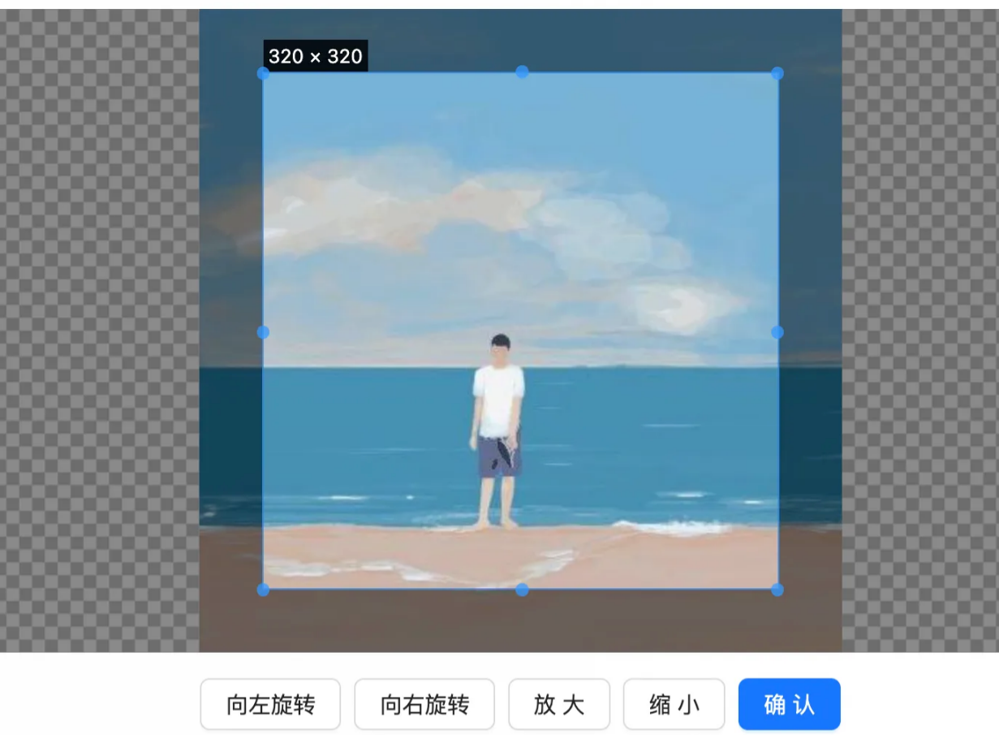
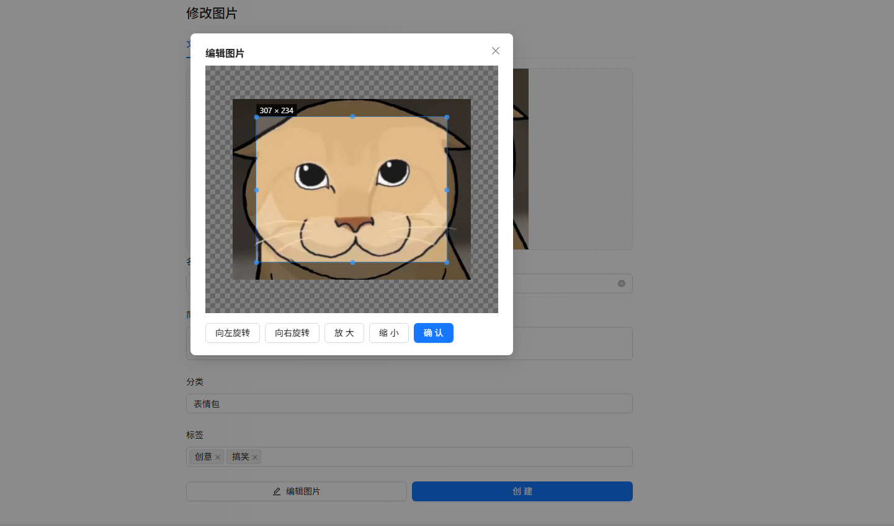

# 图片编辑

# 基础编辑

## 需求分析

在日常的图؜片管理中，用户经常需要对图片进行简单处理，比如裁剪多余部分、旋转图片、放大缩小尺寸等。

因此，我们؜首先要引入基础图片编辑功能，帮助用户快速完成以下操作：

* 裁剪：支持按固定比例或自由裁剪
* 旋转：提供顺时针、逆时针旋转功能

这个功能非常适合上传证件照之类的场景。

注意，该功؜能不需要限制仅在空间内才能使用，公共图库也可以支持。

## 方案设计

图片编辑功؜能的实现以前端为主，编辑完成后通过调用现有的图片上传接口，将编辑后的图片保存至平台。

具体业务流程：

1. 在图片上传页面，如果用户已上传图片，页面会展示“编辑图片”按钮。
2. 用户点击“编辑图片”后，将打开图片编辑的弹窗组件，支持裁剪、旋转等操作。
3. 用户确认编辑后，会调用图片上传接口，将编辑后的新图片保存至平台，同时更新图片信息。

其实还有另一种设计，在؜用户每次选择本地或 URL 图片时，先不调用后端的图片上传接口，而是自动弹出图片编辑弹窗组件，编辑完后再保存。但这样做就不是 “扩展功能” 而是 “修改已有功能”，涉及到的代码改动会更多，感兴趣的同学可以尝试实现。

💡 这个؜地方也能体现出方案设计的重要性，可以通过合适地改变业务流程，降低开发成本，并让项目更利于维护扩展。

## 前端开发

### 1、图片编辑组件

图片编辑是个比较常见的功能，一般会有现成的库可以直接用。经过调研，选用开源的 [vue-cropper 组件](https://github.com/xyxiao001/vue-cropper?tab=readme-ov-file#2-%E5%BC%95%E5%85%A5-vue-cropper)。

1）引入组件

参考官方文档引入，注意要引入 Vue3 版本的：


```JavaScript
npm install vue-cropper@next
```

在`main.ts`中引入组件


```JavaScript
import VueCropper from 'vue-cropper';
import 'vue-cropper/dist/index.css'

app.use(VueCropper)

```

2）新建图片编辑组件ImageCropper.vue，我们要开发的组件结构包括两部分：上方为图片预览区，下方为操作栏。

在哪里使用图片编辑组件呢？

根据我们的方案؜设计，图片编辑不应该和任何一种上传图片的方式（本地图片 / URL 上传）进行绑定，是在上传完成后才能编辑，所以应该在图片上传页面引入。

先硬编码要编辑的图片 url：


```JavaScript
<ImageCropper imageUrl="https://avatars2.githubusercontent.com/u/15681693?s=460&v=4" />
```

可以参考 [官方 Demo](https://codepen.io/xyxiao001/pen/yLooYKg) 实现组件，依次完成放大、缩小、左旋、右旋操作：


```XML
<template>
  <div class="image-cropper">
    <vue-cropper
      ref="cropperRef"
      :img="imageUrl"
      :autoCrop="true"
      :fixedBox="false"
      :centerBox="true"
      :canMoveBox="true"
      :info="true"
      outputType="png"
    />
    <div style="margin-bottom: 16px" />
    <!-- 图片操作 -->
    <div class="image-cropper-actions">
      <a-space>
        <a-button @click="rotateLeft">向左旋转</a-button>
        <a-button @click="rotateRight">向右旋转</a-button>
        <a-button @click="changeScale(1)">放大</a-button>
        <a-button @click="changeScale(-1)">缩小</a-button>
      </a-space>
    </div>
  </div>
</template>

<script setup lang="ts">
import { ref } from 'vue'

interface Props {
  imageUrl?: string
}

const props = defineProps<Props>()

// 编辑器组件的引用
const cropperRef = ref()

// 向左旋转
const rotateLeft = () => {
  cropperRef.value.rotateLeft()
}

// 向右旋转
const rotateRight = () => {
  cropperRef.value.rotateRight()
}

// 缩放
const changeScale = (num: number) => {
  cropperRef.value.changeScale(num)
}
</script>

<style scoped>
.image-cropper {
  text-align: center;
}
  
.image-cropper .vue-cropper {
  height: 400px;
}
</style>
```

3）编写确认按钮


```XML
<a-space>
  <a-button @click="rotateLeft">向左旋转</a-button>
  <a-button @click="rotateRight">向右旋转</a-button>
  <a-button @click="changeScale(1)">放大</a-button>
  <a-button @click="changeScale(-1)">缩小</a-button>
  <a-button type="primary" :loading="loading" @click="handleConfirm">确认</a-button>
</a-space>
```

点击后，调؜用 cropper 的 getCropBlob 函数，可以获得裁切后的文件：


```JavaScript
// 确认裁剪
const handleConfirm = () => {
  cropperRef.value.getCropBlob((blob: Blob) => {
    // blob 为已裁切的文件
  })
}
```



### 2、图片编辑弹框

1）把最外层从 `div` 改为 `a-modal`，注意一定要将 class 类名加在 modal 上，否则样式无法正确添加：


```PlainText
<a-modal class="image-cropper" v-model:visible="visible" title="编辑图片" :footer="false" @cancel="closeModal">
  ... 原有代码
</a-modal>
```

2）参考图؜片分享弹窗组件，补充控制弹窗显示隐藏的相关代码，并对外暴露打开弹窗的 openModal 函数：


```TypeScript
// 是否可见const visible = ref(false)

// 打开弹窗const openModal = () => {
  visible.value = true
}

// 关闭弹窗const closeModal = () => {
  visible.value = false
}

// 暴露函数给父组件defineExpose({
  openModal,
})
```

### 3、上传编辑后的图片

点击确认后，需؜要上传编辑后的图片。我们可以把图片编辑组件当做是图片上传组件的一种，而不和任何一种上传图片的方式（本地图片 / URL 上传）进行绑定。

1）参考图片上传؜组件的属性，给组件补充 picture 和 spaceId、onSuccess 属性：                 ‍               


```TypeScript
interface Props {
  imageUrl?: string
  picture?: API.PictureVO
  spaceId?: number
  onSuccess?: (newPicture: API.PictureVO) => void
}
```

2）编写上传函数؜。点击确认后将 blob 数据转换为 file 对象，然后就可以复用图片上传组件的提交函数了，上传成功后会传递新图片信息给父组件、并关闭弹窗。代码如下：


```TypeScript
const loading = ref<boolean>(false)

// 确认裁剪const handleConfirm = () => {
  cropperRef.value.getCropBlob((blob: Blob) => {
    const fileName = (props.picture?.name || 'image') + '.png'const file = new File([blob], fileName, { type: blob.type })
    // 上传图片handleUpload({ file })
  })
}

/**
 * 上传
 * @param file
 */const handleUpload = async ({ file }: any) => {
  loading.value = truetry {
    const params: API.PictureUploadRequest = props.picture ? { id: props.picture.id } : {}
    params.spaceId = props.spaceIdconst res = await uploadPictureUsingPost(params, {}, file)
    if (res.data.code === 0 && res.data.data) {
      message.success('图片上传成功')
      // 将上传成功的图片信息传递给父组件
      props.onSuccess?.(res.data.data)
      closeModal();
    } else {
      message.error('图片上传失败，' + res.data.message)
    }
  } catch (error) {
    message.error('图片上传失败')
  } finally {
    loading.value = false
  }
}
```

### 4、使用图片编辑弹窗组件

在创建图片؜页面使用组件，可以在图片下方补充一个编辑按钮，点击编辑按钮后打开弹窗：


```PlainText
<div v-if="picture" class="edit-bar">
  <a-button :icon="h(EditOutlined)" @click="doEditPicture">编辑图片</a-button>
  <ImageCropper
    ref="imageCropperRef"
    imageUrl="https://avatars2.githubusercontent.com/u/15681693?s=460&v=4"
    :picture="picture"
    :spaceId="spaceId"
    :onSuccess="onCropSuccess"
  />
</div>
```

编辑图片事件函数：


```TypeScript
// 图片编辑弹窗引用const imageCropperRef = ref()

// 编辑图片const doEditPicture = () => {
  if (imageCropperRef.value) {
    imageCropperRef.value.openModal()
  }
}

// 编辑成功事件const onCropSuccess = (newPicture: API.PictureVO) => {
  picture.value = newPicture
}
```

适当优化一下 CSS 样式，增加上下边距和居中：


```CSS
#addPicturePage .edit-bar {
  text-align: center;
  margin: 16px 0;
}
```

开发完成后؜，把 imageUrl 的值改为要编辑的图片地址：


```PlainText
<ImageCropper
  ref="imageCropperRef"
  :imageUrl="picture?.url"
  :picture="picture"
  :spaceId="spaceId"
  :onSuccess="onSuccess"
/>
```

效果如图：




