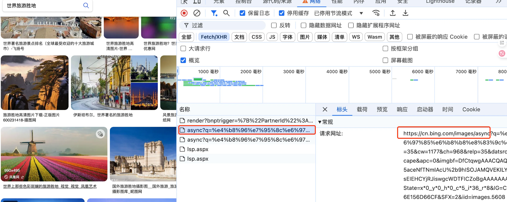
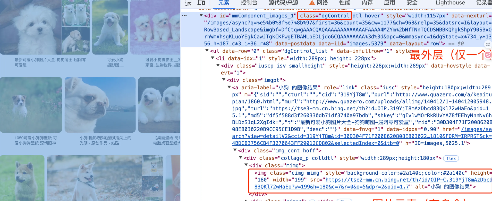
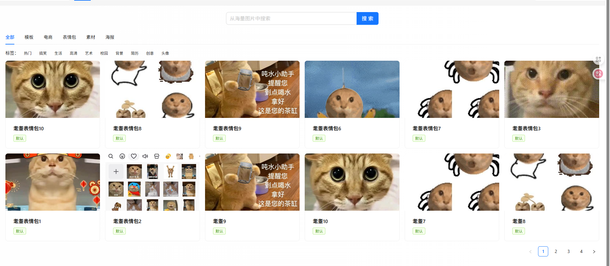

# 用户传图

# 用户上传图片及审核

## 需求分析

之前我们已经开发了管理员上传图片功能，想实现用户上传图片就比较简单了，但是我们要考虑到一点“用户上传的内容可能是不安全的”。

一般只要涉及到"用户上传内容”（俗称UGC）的场景，就要增加审核功能。

具体分析每个需求：

1. 用户上传创建图片：需要开放权限，允许用户上传图片，功能和流程跟之前管理员上传图片一致，也要增加文件校验。
2. 管理员审核图片：管理员可以查看和筛选所有待审核的图片，并标记为通过或拒绝，可填写通过或拒绝的具体原因。

此外，需要记录审核人和审核时间作为日志，如果发现误审的情况也可以追责。

## 方案设计

方案设计阶段我们需要确认：

* 审核的具体逻辑
* 库表设计

### 审核逻辑

1. 管理员可以操作审核的状态流转：
    * 默认为“待审核”，可以设置为“审核通过”或“审核拒绝”
    * 已拒绝的图片可以重新审核为通过
    * 已通过的图片可以撤销为拒绝状态
2. 管理员自动审核：管理员上传/更新图片时，图片自动审核通过，并且自动填充审核参数一—设置审核人为创建人、审核时间为当前时间、审核原因为“管理员自动过审”。
3. 用户操作需要审核：用户上传或编辑图片时，图片的状态会被重置为“待审核”。

重复审核时，既可以选择重置所有审核参数，也可以仅重置审核状态。其余参数在前端不展示，但是在后端保留，以便管理员参考历史审核信息。

1. 控制内容可见性；对于用户来说，应该只能看见“审核通过”状态的数据；管理员可以在图片管理页面看到所有数据，并且根据审核状态筛选图片。

> Q：是否要考虑并发问题呢？
> A：由于审核操作为管理员手动执行，不涉及复杂的奖励机制或并发高频请求，误审核或重复审核对系统影响不大，因此无需过度考虑并发问题。


### 库表设计

为了支持审核功能，我们在picture图片表中新增审核相关字段，同时优化索引设计以提升查询性能。

修改表的 SQL 如下：


```SQL
ALTER TABLE picture  
    -- 添加新列  
    ADD COLUMN reviewStatus INT DEFAULT 0 NOT NULL COMMENT '审核状态：0-待审核; 1-通过; 2-拒绝',  
    ADD COLUMN reviewMessage VARCHAR(512) NULL COMMENT '审核信息',  
    ADD COLUMN reviewerId BIGINT NULL COMMENT '审核人 ID',  
    ADD COLUMN reviewTime DATETIME NULL COMMENT '审核时间';  
  
-- 创建基于 reviewStatus 列的索引  
CREATE INDEX idx_reviewStatus ON picture (reviewStatus);
```

注意事项:

1. 审核状态：reviewStatus使用整数(0、1、2)表示不同的审核状态，而不是用字符串，可以节约表的空间、提升查找效率。
2. 索引设计：由于要根据审核状态筛选图片，所以给该字段添加索引，提升查询性能。

下面我们进行开发，先后端再前端。

## 后端开发

### 数据模型开发

由于新增一些审核相关的字段，要对原有的数据模型进行修改

1. 实体类Picture新增


```C++
/**  
 * 状态：0-待审核; 1-通过; 2-拒绝  
 */  
private Integer reviewStatus;  
  
/**  
 * 审核信息  
 */  
private String reviewMessage;  
  
/**  
 * 审核人 id  
 */  
private Long reviewerId;  
  
/**  
 * 审核时间  
 */  
private Date reviewTime;
```

1. 图片查询请求类PictureQueryRequest，新增


```Java
/**  
 * 状态：0-待审核; 1-通过; 2-拒绝  
 */  
private Integer reviewStatus;  
  
/**  
 * 审核信息  
 */  
private String reviewMessage;  
  
/**  
 * 审核人 id  
 */  
private Long reviewerId;
```

1. 新建审核状态枚举类


```Java
@Getter  
public enum PictureReviewStatusEnum {  
    REVIEWING("待审核", 0),  
    PASS("通过", 1),  
    REJECT("拒绝", 2);  
  
    private final String text;  
    private final int value;  
  
    PictureReviewStatusEnum(String text, int value) {  
        this.text = text;  
        this.value = value;  
    }  
  
    /**  
     * 根据 value 获取枚举  
     */  
    public static PictureReviewStatusEnum getEnumByValue(Integer value) {  
        if (ObjUtil.isEmpty(value)) {  
            return null;  
        }  
        for (PictureReviewStatusEnum pictureReviewStatusEnum : PictureReviewStatusEnum.values()) {  
            if (pictureReviewStatusEnum.value == value) {  
                return pictureReviewStatusEnum;  
            }  
        }  
        return null;  
    }  
}
```

### 管理员审核功能

1. 开发请求包装类，注意不需要增加reviewId和reviewTime这两个是由系统自动填充的，而不是由前端传递。


```C++
@Data  
public class PictureReviewRequest implements Serializable {  
  
    /**  
     * id  
     */  
    private Long id;  
  
    /**  
     * 状态：0-待审核, 1-通过, 2-拒绝  
     */  
    private Integer reviewStatus;  
  
    /**  
     * 审核信息  
     */  
    private String reviewMessage;  
  
  
    private static final long serialVersionUID = 1L;  
}
```

1. 开发审核服务

接口：


```Java
/**  
 * 图片审核  
 *  
 * @param pictureReviewRequest  
 * @param loginUser  
 */  
void doPictureReview(PictureReviewRequest pictureReviewRequest, User loginUser);
```

实现类：


```Java
@Override  
public void doPictureReview(PictureReviewRequest pictureReviewRequest, User loginUser) {  
    Long id = pictureReviewRequest.getId();  
    Integer reviewStatus = pictureReviewRequest.getReviewStatus();  
    PictureReviewStatusEnum reviewStatusEnum = PictureReviewStatusEnum.getEnumByValue(reviewStatus);  
    if (id == null || reviewStatusEnum == null || PictureReviewStatusEnum.REVIEWING.equals(reviewStatusEnum)) {  
        throw new BusinessException(ErrorCode.PARAMS_ERROR);  
    }  
    // 判断是否存在  
    Picture oldPicture = this.getById(id);  
    ThrowUtils.throwIf(oldPicture == null, ErrorCode.NOT_FOUND_ERROR);  
    // 已是该状态  
    if (oldPicture.getReviewStatus().equals(reviewStatus)) {  
        throw new BusinessException(ErrorCode.PARAMS_ERROR, "请勿重复审核");  
    }  
    // 更新审核状态  
    Picture updatePicture = new Picture();  
    BeanUtils.copyProperties(pictureReviewRequest, updatePicture);  
    updatePicture.setReviewerId(loginUser.getId());  
    updatePicture.setReviewTime(new Date());  
    boolean result = this.updateById(updatePicture);  
    ThrowUtils.throwIf(!result, ErrorCode.OPERATION_ERROR);  
}
```

1. 开发审核接口，加上管理员权限


```Java
@PostMapping("/review")  
@AuthCheck(mustRole = UserConstant.ADMIN_ROLE)  
public BaseResponse<Boolean> doPictureReview(@RequestBody PictureReviewRequest pictureReviewRequest,  
                                             HttpServletRequest request) {  
    ThrowUtils.throwIf(pictureReviewRequest == null, ErrorCode.PARAMS_ERROR);  
    User loginUser = userService.getLoginUser(request);  
    pictureService.doPictureReview(pictureReviewRequest, loginUser);  
    return ResultUtils.success(true);  
}
```

### 审核状态控制

1. 权限控制

首先取消上传图片接口（uploadPicture）的权限校验注解，但是注意，由于图片上传功能是支持图片编辑的，所以需要做好编辑权限控制———仅本人或管理员可编辑。

修改 PictureService的uploadPicture 方法，补充权限校验逻辑：


```Java
// 如果是更新图片，需要校验图片是否存在  
if (pictureId != null) {  
    Picture oldPicture = this.getById(pictureId);  
    ThrowUtils.throwIf(oldPicture == null, ErrorCode.NOT_FOUND_ERROR, "图片不存在");  
    // 仅本人或管理员可编辑  
    if (!oldPicture.getUserId().equals(loginUser.getId()) && !userService.isAdmin(loginUser)) {  
        throw new BusinessException(ErrorCode.NO_AUTH_ERROR);  
    }  
}
```

1. 设置审核状态：管理员自动过审并且填充审核参数；用户上传或编辑图片时，图片的状态会被重置为“待审核”。

由于图片上传、用户编辑、管理员更新这3个操作都需要设置审核状态，所以我们可以先编写一个通用的“补充审核参数”的方法，根据用户的角色给图片对象填充审核字段的值。


```TypeScript
@Override  
public void fillReviewParams(Picture picture, User loginUser) {  
    if (userService.isAdmin(loginUser)) {  
        // 管理员自动过审  
        picture.setReviewStatus(PictureReviewStatusEnum.PASS.getValue());  
        picture.setReviewerId(loginUser.getId());  
        picture.setReviewMessage("管理员自动过审");  
        picture.setReviewTime(new Date());  
    } else {  
        // 非管理员，创建或编辑都要改为待审核  
        picture.setReviewStatus(PictureReviewStatusEnum.REVIEWING.getValue());  
    }  
}
```

分别给三个操作增加审核参数。

图片更新接口


```Java
public BaseResponse<Boolean> updatePicture(@RequestBody PictureUpdateRequest pictureUpdateRequest  
        , HttpServletRequest request) {  
    // ...  
    Picture oldPicture = pictureService.getById(id);  
    ThrowUtils.throwIf(oldPicture == null, ErrorCode.NOT_FOUND_ERROR);  
    // 补充审核参数  
    User loginUser = userService.getLoginUser(request);  
    pictureService.fillReviewParams(picture, loginUser);  
    // 操作数据库  
    boolean result = pictureService.updateById(picture);  
    ThrowUtils.throwIf(!result, ErrorCode.OPERATION_ERROR);  
    return ResultUtils.success(true);  
}
```

图片修改接口


```TypeScript
public BaseResponse<Boolean> editPicture(@RequestBody PictureEditRequest pictureEditRequest, HttpServletRequest request) {  
    // ...  
    if (!oldPicture.getUserId().equals(loginUser.getId()) && !userService.isAdmin(loginUser)) {  
        throw new BusinessException(ErrorCode.NO_AUTH_ERROR);  
    }  
    // 补充审核参数  
    pictureService.fillReviewParams(picture, loginUser);  
    // 操作数据库  
    boolean result = pictureService.updateById(picture);  
    ThrowUtils.throwIf(!result, ErrorCode.OPERATION_ERROR);  
    return ResultUtils.success(true);  
}
```

上传图片服务


```TypeScript
@Override  
public PictureVO uploadPicture(Object inputSource, PictureUploadRequest pictureUploadRequest, User loginUser) {  
    // ...  
    picture.setPicFormat(uploadPictureResult.getPicFormat());  
    picture.setUserId(loginUser.getId());  
    // 补充审核参数  
    fillReviewParams(picture, loginUser);  
    // 如果 pictureId 不为空，表示更新，否则是新增  
    if (pictureId != null) {  
        // 如果是更新，需要补充 id 和编辑时间  
        picture.setId(pictureId);  
        picture.setEditTime(new Date());  
    }  
    // ...  
}
```

### 控制内容可见性

目前我们只有主页给用户查看图片列表，所以需要修改主页调用的listPictureVOByPage接口，补充查询条件即可，默认只能查看已过审的数据：


```Java
// 普通用户默认只能查看已过审的数据  
pictureQueryRequest.setReviewStatus(PictureReviewStatusEnum.PASS.getValue());  
// 查询数据库  
Page<Picture> picturePage = pictureService.page(new Page<>(current, size),  
        pictureService.getQueryWrapper(pictureQueryRequest));
```

需要同步更改PictureService的getQueryWrapper方法，支持根据审核字段进行查询:


```Java
Integer reviewStatus = pictureQueryRequest.getReviewStatus();  
String reviewMessage = pictureQueryRequest.getReviewMessage();  
Long reviewerId = pictureQueryRequest.getReviewerId();  
queryWrapper.eq(ObjUtil.isNotEmpty(reviewStatus), "reviewStatus", reviewStatus);  
queryWrapper.like(StrUtil.isNotBlank(reviewMessage), "reviewMessage", reviewMessage);  
queryWrapper.eq(ObjUtil.isNotEmpty(reviewerId), "reviewerId", reviewerId);
```

这样一来，后端就同时支持了“管理员筛选审核状态”的功能。

至此，用户上传图片及审核的后端就开发完成了。

> Q：根据id查询图片的接口需要做同样的限制么？
> A：对目前咱们的系统来说，用户正常情况下不会得到未过审图片的id，影响面较小，可以暂时不做。


## 前端开发

控制首页未过审的图片不可见已经通过后端接口实现，我们只需开发管理员审核和按审核状态筛选图片功能即可。

### 定义审核常量

和后端一样，前端也有很多地方要用到审核状态信息，可以定义为一个常量。

在constants目录下新建picture.ts常量文件，定义枚举信息、对应的中文映射、以及后续筛选审核状态时要用到的选项数组：


```JavaScript
export const PIC_REVIEW_STATUS_ENUM = {  
  REVIEWING: 0,  
  PASS: 1,  
  REJECT: 2,  
}  
  
export const PIC_REVIEW_STATUS_MAP = {  
  0: '待审核',  
  1: '通过',  
  2: '拒绝',  
}  
  
export const PIC_REVIEW_STATUS_OPTIONS = Object.keys(PIC_REVIEW_STATUS_MAP).map((key) => {  
  return {  
    label: PIC_REVIEW_STATUS_MAP[key],  
    value: key,  
  }  
})
```

### 管理员审核功能

1. 表格列新增审核信息


```Java
const columns = [  
  // ...  
  {  
    title: '审核信息',  
    dataIndex: 'reviewMessage',  
  },  
  // ...  
]
```

1. 自定义审核列需要展示的内容


```XML
<!-- 审核信息 -->  
<template v-if="column.dataIndex === 'reviewMessage'">  
  <div>审核状态：{{ PIC_REVIEW_STATUS_MAP[record.reviewStatus] }}</div>  
  <div>审核信息：{{ record.reviewMessage }}</div>  
  <div>审核人：{{ record.reviewerId }}</div>  
</template>
```

1. 新增审核通过和拒绝的按钮


```XML
<template v-else-if="column.key === 'action'">  
  <a-space wrap>  
    <a-button  
      v-if="record.reviewStatus !== PIC_REVIEW_STATUS_ENUM.PASS"  
      type="link"  
      @click="handleReview(record, PIC_REVIEW_STATUS_ENUM.PASS)"  
    >  
      通过  
    </a-button>  
    <a-button  
      v-if="record.reviewStatus !== PIC_REVIEW_STATUS_ENUM.REJECT"  
      type="link"  
      danger  
      @click="handleReview(record, PIC_REVIEW_STATUS_ENUM.REJECT)"  
    >  
      拒绝  
    </a-button>  
    <a-button type="link" :href="`/add_picture?id=${record.id}`" target="_blank"  
      >编辑  
    </a-button>  
    <a-button type="link" danger @click="doDelete(record.id)">删除</a-button>  
  </a-space>  
</template>
```

1. 编写审核函数，调用后端完成操作


```TypeScript
const handleReview = async (record: API.Picture, reviewStatus: number) => {  
  const reviewMessage = reviewStatus === PIC_REVIEW_STATUS_ENUM.PASS ? '管理员操作通过' : '管理员操作拒绝'  
  const res = await doPictureReviewUsingPost({  
    id: record.id,  
    reviewStatus,  
    reviewMessage,  
  })  
  if (res.data.code === 0) {  
    message.success('审核操作成功')  
    // 重新获取列表  
    fetchData()  
  } else {  
    message.error('审核操作失败，' + res.data.message)  
  }  
}
```

### 按审核状态筛选

只需要在原来的搜索表单中补充一个表单项即可，使用下拉框组件，传入定义好的审核状态常量作为选项：


```XML
<a-form-item label="审核状态" name="reviewStatus">  
  <a-select  
    v-model:value="searchParams.reviewStatus"  
    :options="PIC_REVIEW_STATUS_OPTIONS"  
    placeholder="请输入审核状态"  
    style="min-width: 180px"  
    allow-clear  
  />  
</a-form-item>
```

---

# 通过URL导入图片

## 需求分析

为了提高上传图片的效率，除了支持上传本地文件外，还可以支持输入一个远程URL，直接将网上已有的图片导入到我们的系统中。

## 方案设计

实现原理很简单，但是有一些细节需要注意：

1. 下载图片：后端服务器从指定的远程URL下载图片到本地临时存储。对于Java项目，可以直接使用Hutool的HttpUtil.downloadFile方法一行代码完成。
2. 校验图片：跟验证本地文件一样，需要校验图片的格式、大小等。

> Q:传统的校验思路是先把文件下载到本地，再对本地文件进行校验，有没有更节省资源的方法呢？
> A:**其实可以先对URL本身进行校验。** 首先是校验URL字符串本身的合法性，比如要是一个合理的URL地址。此外，可以先使用HEAD请求来获取URL对应文件的元信息（如文件大小、格式等)。HEAD请求仅返回HTTP响应头信息，而不会下载文件的内容，大大降低了网络流量的消耗。


注意此处不能使用GET请求，它会获取完整文件。

1. 上传图片：将校验通过的图片上传到对象存储服务，生成存储URL。

> 之后的流程就都可以复用从本地上传图片的流程了。


## 后端开发

### 服务开发

先编写通过URL上传文件的方法，为了便于开发，直接在FileManager类中编写，绝大多数代码跟之前的uploadPicture方法一致，只需要改动以下4处位置：

1. 方法接受的参数：之前是MultipartFile文件类型，现在是String字符串类型
1. 校验图片：之前是校验文件，现在是校验URL
1. 获取文件名称：之前是根据文件获取，现在是根据URL获取
1. 保存临时文件：之前是将MultipartFile写入到临时文件，现在是从URL下载文件
代码如下：


```TypeScript
public UploadPictureResult uploadPictureByUrl(String fileUrl, String uploadPathPrefix) {  
    // 校验图片  
    // validPicture(multipartFile);  
    validPicture(fileUrl);  
    // 图片上传地址  
    String uuid = RandomUtil.randomString(16);  
    // String originFilename = multipartFile.getOriginalFilename();  
    String originFilename = FileUtil.mainName(fileUrl);  
    String uploadFilename = String.format("%s_%s.%s", DateUtil.formatDate(new Date()), uuid,  
            FileUtil.getSuffix(originFilename));  
    String uploadPath = String.format("/%s/%s", uploadPathPrefix, uploadFilename);  
    File file = null;  
    try {  
        // 创建临时文件  
        file = File.createTempFile(uploadPath, null);  
        // multipartFile.transferTo(file);  
        HttpUtil.downloadFile(fileUrl, file);  
        // 上传图片  
        // ... 其余代码保持不变  
    } catch (Exception e) {  
        log.error("图片上传到对象存储失败", e);  
        throw new BusinessException(ErrorCode.SYSTEM_ERROR, "上传失败");  
    } finally {  
        this.deleteTempFile(file);  
    }  
}
```

### 校验URL图片

编写校验URL图片的方法，分别校验URL格式、协议、文件是否存在、文件格式、文件大小。


```Java
private void validPicture(String fileUrl) {  
    ThrowUtils.throwIf(StrUtil.isBlank(fileUrl), ErrorCode.PARAMS_ERROR, "文件地址不能为空");  
  
    try {  
        // 1. 验证 URL 格式  
        new URL(fileUrl); // 验证是否是合法的 URL  
    } catch (MalformedURLException e) {  
        throw new BusinessException(ErrorCode.PARAMS_ERROR, "文件地址格式不正确");  
    }  
  
    // 2. 校验 URL 协议  
    ThrowUtils.throwIf(!(fileUrl.startsWith("http://") || fileUrl.startsWith("https://")),  
            ErrorCode.PARAMS_ERROR, "仅支持 HTTP 或 HTTPS 协议的文件地址");  
  
    // 3. 发送 HEAD 请求以验证文件是否存在  
    HttpResponse response = null;  
    try {  
        response = HttpUtil.createRequest(Method.HEAD, fileUrl).execute();  
        // 未正常返回，无需执行其他判断  
        if (response.getStatus() != HttpStatus.HTTP_OK) {  
            return;  
        }  
        // 4. 校验文件类型  
        String contentType = response.header("Content-Type");  
        if (StrUtil.isNotBlank(contentType)) {  
            // 允许的图片类型  
            final List<String> ALLOW_CONTENT_TYPES = Arrays.asList("image/jpeg", "image/jpg", "image/png", "image/webp");  
            ThrowUtils.throwIf(!ALLOW_CONTENT_TYPES.contains(contentType.toLowerCase()),  
                    ErrorCode.PARAMS_ERROR, "文件类型错误");  
        }  
        // 5. 校验文件大小  
        String contentLengthStr = response.header("Content-Length");  
        if (StrUtil.isNotBlank(contentLengthStr)) {  
            try {  
                long contentLength = Long.parseLong(contentLengthStr);  
                final long TWO_MB = 2 * 1024 * 1024L; // 限制文件大小为 2MB  
                ThrowUtils.throwIf(contentLength > TWO_MB, ErrorCode.PARAMS_ERROR, "文件大小不能超过 2M");  
            } catch (NumberFormatException e) {  
                throw new BusinessException(ErrorCode.PARAMS_ERROR, "文件大小格式错误");  
            }  
        }  
    } finally {  
        if (response != null) {  
            response.close();  
        }  
    }  
}
```

上述代码中，注意2点：

1. 注意发送HTTP请求后，需要即时释放资源
2. 有些URL地址可能不支持通过HEAD请求访问，为了提高导入成功率，即使HEAD请求访问失败，也不会报错，并且不用执行后续的校验。**仅对能获取到的信息进行校验。**


### 优化代码

目前我们的FileManager文件内写了两种不同的上传文件的方法，但是我们会发现，这两种方法的流程完全一致、而且大多数代码都是相同的。

这种情况下，我们就要想要运用设计模式——**模板方法模式** 对代码进行优化。

模板方法模式是行为型设计模式，适用于具有通用处理流程、但处理细节不同的情况。通过定义一个抽象模板类，提供通用的业务流程处理逻辑，并将不同的部分定义为抽象方法，由子类具体实现。

在我们的场景中，两种文件上传方法的流程都是：

1. 校验文件
1. 获取上传地址
1. 获取本地临时文件
1. 上传到对象存储
1. 封装解析得到的图片信息
1. 清理临时文件
可以将这些流程抽象为一套模板（抽象类)，将每个实现不一样的步骤都定义为一个抽象方法，比如：

1. 校验图片
1. 获取文件名称
1. 保存临时文件
下面开始开发，先在manager包下创建upload包，将模板方法有关的代码全部放在该包下统一管理。

1. 新建图片上传抽象类PictureUploadTemplate


```Java
@Slf4j  
public abstract class PictureUploadTemplate {  
  
    @Resource  
    protected CosManager cosManager;  
  
    @Resource  
    protected CosClientConfig cosClientConfig;  
  
    /**  
     * 模板方法，定义上传流程  
     */  
    public final UploadPictureResult uploadPicture(Object inputSource, String uploadPathPrefix) {  
        // 1. 校验图片  
        validPicture(inputSource);  
  
        // 2. 图片上传地址  
        String uuid = RandomUtil.randomString(16);  
        String originFilename = getOriginFilename(inputSource);  
        String uploadFilename = String.format("%s_%s.%s", DateUtil.formatDate(new Date()), uuid,  
                FileUtil.getSuffix(originFilename));  
        String uploadPath = String.format("/%s/%s", uploadPathPrefix, uploadFilename);  
  
        File file = null;  
        try {  
            // 3. 创建临时文件  
            file = File.createTempFile(uploadPath, null);  
            // 处理文件来源（本地或 URL）  
            processFile(inputSource, file);  
  
            // 4. 上传图片到对象存储  
            PutObjectResult putObjectResult = cosManager.putPictureObject(uploadPath, file);  
            ImageInfo imageInfo = putObjectResult.getCiUploadResult().getOriginalInfo().getImageInfo();  
  
            // 5. 封装返回结果  
            return buildResult(originFilename, file, uploadPath, imageInfo);  
        } catch (Exception e) {  
            log.error("图片上传到对象存储失败", e);  
            throw new BusinessException(ErrorCode.SYSTEM_ERROR, "上传失败");  
        } finally {  
            // 6. 清理临时文件  
            deleteTempFile(file);  
        }  
    }  
  
    /**  
     * 校验输入源（本地文件或 URL）  
     */  
    protected abstract void validPicture(Object inputSource);  
  
    /**  
     * 获取输入源的原始文件名  
     */  
    protected abstract String getOriginFilename(Object inputSource);  
  
    /**  
     * 处理输入源并生成本地临时文件  
     */  
    protected abstract void processFile(Object inputSource, File file) throws Exception;  
  
    /**  
     * 封装返回结果  
     */  
    private UploadPictureResult buildResult(String originFilename, File file, String uploadPath, ImageInfo imageInfo) {  
        UploadPictureResult uploadPictureResult = new UploadPictureResult();  
        int picWidth = imageInfo.getWidth();  
        int picHeight = imageInfo.getHeight();  
        double picScale = NumberUtil.round(picWidth * 1.0 / picHeight, 2).doubleValue();  
        uploadPictureResult.setPicName(FileUtil.mainName(originFilename));  
        uploadPictureResult.setPicWidth(picWidth);  
        uploadPictureResult.setPicHeight(picHeight);  
        uploadPictureResult.setPicScale(picScale);  
        uploadPictureResult.setPicFormat(imageInfo.getFormat());  
        uploadPictureResult.setPicSize(FileUtil.size(file));  
        uploadPictureResult.setUrl(cosClientConfig.getHost() + "/" + uploadPath);  
        return uploadPictureResult;  
    }  
  
    /**  
     * 删除临时文件  
     */  
    public void deleteTempFile(File file) {  
        if (file == null) {  
            return;  
        }  
        boolean deleteResult = file.delete();  
        if (!deleteResult) {  
            log.error("file delete error, filepath = {}", file.getAbsolutePath());  
        }  
    }  
}
```

上述代码中，我们把每个步骤都封装为了一个单独的方法，公共的实现（比如deleteTempFile）可以直接放到模板中，而不用放到具体的实现类中。

**注意，为了让模板同时兼容MultiPartFile和String类型的文件参数，直接将这两种情况统一为Object类型的inputSource 输入源。**

1. 新建本地图片上传子类FilePictureUpload，继承模板，并且打上@Service注解生成 Bean实例:


```Java
@Service  
public class FilePictureUpload extends PictureUploadTemplate {  
  
    @Override  
    protected void validPicture(Object inputSource) {  
        MultipartFile multipartFile = (MultipartFile) inputSource;  
        ThrowUtils.throwIf(multipartFile == null, ErrorCode.PARAMS_ERROR, "文件不能为空");  
        // 1. 校验文件大小  
        long fileSize = multipartFile.getSize();  
        final long ONE_M = 1024 * 1024L;  
        ThrowUtils.throwIf(fileSize > 2 * ONE_M, ErrorCode.PARAMS_ERROR, "文件大小不能超过 2M");  
        // 2. 校验文件后缀  
        String fileSuffix = FileUtil.getSuffix(multipartFile.getOriginalFilename());  
        // 允许上传的文件后缀  
        final List<String> ALLOW_FORMAT_LIST = Arrays.asList("jpeg", "jpg", "png", "webp");  
        ThrowUtils.throwIf(!ALLOW_FORMAT_LIST.contains(fileSuffix), ErrorCode.PARAMS_ERROR, "文件类型错误");  
    }  
  
    @Override  
    protected String getOriginFilename(Object inputSource) {  
        MultipartFile multipartFile = (MultipartFile) inputSource;  
        return multipartFile.getOriginalFilename();  
    }  
  
    @Override  
    protected void processFile(Object inputSource, File file) throws Exception {  
        MultipartFile multipartFile = (MultipartFile) inputSource;  
        multipartFile.transferTo(file);  
    }  
}
```

1. 新建URL图片上传子类UrIPictureUpload，继承模板，并且打上@Service注解生成Bean实例:


```TypeScript
@Service  
public class UrlPictureUpload extends PictureUploadTemplate {  
    @Override  
    protected void validPicture(Object inputSource) {  
        String fileUrl = (String) inputSource;  
        ThrowUtils.throwIf(StrUtil.isBlank(fileUrl), ErrorCode.PARAMS_ERROR, "文件地址不能为空");  
        // ... 跟之前的校验逻辑保持一致  
    }  
  
    @Override  
    protected String getOriginFilename(Object inputSource) {  
        String fileUrl = (String) inputSource;  
        // 从 URL 中提取文件名  
        return FileUtil.mainName(fileUrl);  
    }  
  
    @Override  
    protected void processFile(Object inputSource, File file) throws Exception {  
        String fileUrl = (String) inputSource;  
        // 下载文件到临时目录  
        HttpUtil.downloadFile(fileUrl, file);  
    }  
}
```

优化完后，可以还原FileManager文件，并添加@Deprecated注解表示已废弃，后续将直接使用文件上传模板类PictureUploadTemplate。

### 图片上传服务支持URL上传

由于图片上传的逻辑还是比较复杂的，尽量让URL上传复用之前的代码。

但是之前图片上传服务的uploadPicture方法接受的是文件类型的参数，现在要支持URL上传，怎么办呢？

可以将输入参数跟上述模板一样，改为Object类型的inputSource，然后在代码中可以根据inputSource的实际类型，来选择对应的图片上传子类。代码如下：


```TypeScript
@Resource  
private FilePictureUpload filePictureUpload;  
  
@Resource  
private UrlPictureUpload urlPictureUpload;  
  
// 上传图片  
public PictureVO uploadPicture(Object inputSource, PictureUploadRequest pictureUploadRequest, User loginUser) {  
    if (inputSource == null) {  
        throw new BusinessException(ErrorCode.PARAMS_ERROR, "图片为空");  
    }  
    // ...  
    // 按照用户 id 划分目录  
    String uploadPathPrefix = String.format("public/%s", loginUser.getId());  
    // 根据 inputSource 类型区分上传方式  
    PictureUploadTemplate pictureUploadTemplate = filePictureUpload;  
    if (inputSource instanceof String) {  
        pictureUploadTemplate = urlPictureUpload;  
    }  
    UploadPictureResult uploadPictureResult = pictureUploadTemplate.uploadPicture(inputSource, uploadPathPrefix);  
    // 构造要入库的图片信息  
    // ...  
}
```

### 接口开发

1. 在请求封装类 PictureUploadRequest 中新增 fileUrl 文件地址：


```Java
@Data  
public class PictureUploadRequest implements Serializable {  
  
    /**  
     * 图片 id（用于修改）  
     */  
    private Long id;  
  
    /**  
     * 文件地址  
     */  
    private String fileUrl;  
  
    private static final long serialVersionUID = 1L;  
}
```

1. 在PictureController中新增接口通过Url上传图片


```Java
/**  
 * 通过 URL 上传图片（可重新上传）  
 */  
@PostMapping("/upload/url")  
public BaseResponse<PictureVO> uploadPictureByUrl(  
        @RequestBody PictureUploadRequest pictureUploadRequest,  
        HttpServletRequest request) {  
    User loginUser = userService.getLoginUser(request);  
    String fileUrl = pictureUploadRequest.getFileUrl();  
    PictureVO pictureVO = pictureService.uploadPicture(fileUrl, pictureUploadRequest, loginUser);  
    return ResultUtils.success(pictureVO);  
}
```

## 前端开发

和本地上传图片的开发流程一样，我们先来开发一个URL上传图片的组件，绝大多数代码都可以复用本地上传图片组件。

### URL上传组件

> URL上传组件＝文本输入框+提交按钮


可以使用组件库的[复合输入框](https://antdv.com/components/input-cn#components-input-demo-group)组件：


```XML
<div class="url-picture-upload">  
  <a-input-group compact style="margin-bottom: 16px">  
    <a-input v-model:value="fileUrl" style="width: calc(100% - 120px)" placeholder="请输入图片 URL" />  
    <a-button type="primary" :loading="loading" @click="handleUpload" style="width: 120px">提交</a-button>  
  </a-input-group>  
    
</div>
```

开发上传操作函数


```TypeScript
const loading = ref<boolean>(false)  
const fileUrl = ref<string>()  
  
/**  
 * 上传  
 */  
const handleUpload = async () => {  
  loading.value = true  
  try {  
    const params: API.PictureUploadRequest = { fileUrl: fileUrl.value }  
    if (props.picture) {  
      params.id = props.picture.id  
    }  
    const res = await uploadPictureByUrlUsingPost(params)  
    if (res.data.code === 0 && res.data.data) {  
      message.success('图片上传成功')  
      // 将上传成功的图片信息传递给父组件  
      props.onSuccess?.(res.data.data)  
    } else {  
      message.error('图片上传失败，' + res.data.message)  
    }  
  } catch (error) {  
    message.error('图片上传失败')  
  } finally {  
    loading.value = false  
  }  
}
```

### 开发创建页面

之前已经开发了创建图片页面，可以在上传图片时增加一个Tabs选项组件，让用户自己选择上传方式。


```XML
<!-- 选择上传方式 -->  
<a-tabs v-model:activeKey="uploadType"  
  >>  
  <a-tab-pane key="file" tab="文件上传">  
    <PictureUpload :picture="picture" :onSuccess="onSuccess" />  
  </a-tab-pane>  
  <a-tab-pane key="url" tab="URL 上传" force-render>  
    <UrlPictureUpload :picture="picture" :onSuccess="onSuccess" />  
  </a-tab-pane>  
</a-tabs>
```

定义上传类型变量


```Java
const uploadType = ref<'file' | 'url'>('file')
```

---

# 批量抓取和创建图片

## 需求分析

为了帮助管理员快速丰富图片库，冷启动项目，需要提供批量从网络抓取并创建图片的功能。

**但是要注意，不建议将该功能开放给普通用户！** 主要是为了防止滥用导致的版权问题、低质量内容的上传、服务器资源消耗和安全问题。因为我们要从网络批量抓取图片（爬虫），如果功能开放给用户，相当于所有用户都在使用我们的服务器作为爬虫源头，容易导致我们的服务器IP被封禁。

### 方案设计

方案设计的重点包括：

* 如何抓取图片
* 抓取和导入规则

### 如何抓取图片？

思考2个问题：从哪里抓取图片？怎么抓取图片呢？

绝大多数的图片素材网站，都是有版权保护的，不建议大家操作，容易被封禁IP和账号。比较安全的方法是从搜索引擎中抓取图片，仅学习使用、不商用的话基本不会有什么风险。

这里我们选择从bing搜索获取图片，首先进入[bing图片](https://cn.bing.com/images/search?q=%e4%b8%96%e7%95%8c%e6%97%85%e6%b8%b8%e8%83%9c%e5%9c%b0&form=HDRSC2&first=1)网站，可以看到很多图片，但是如何获取这些图片呢？


有2种常见的做法

1. 请求到完整的页面内容后，对页面的HTML结构进行解析，提取到图片的地址，再通过URL下载；
2. 直接调用后端获取图片地址的接口拿到图片数据。

要使用哪种方式，还是要具体情况具体分析，比如在调研过程中，我们会发现直接从bing图片的首页抓取数据，可能会出现获取不到图片的情况。所以我们换一种策略，尝试去找图片接口。

按F12打开网络请求控制台，向下滚动图片时会触发新一波图片的加载，就能看到获取图片数据的接口了：

https://cn.bing.com/images/async?q=%25s&mmasync=1



但是该接口返回的还是HTML文档结构，所以我们需要使用一个HTML文档解析库来提取图片地址，Java中比较推荐jsoup，非常地轻量。

jsoup支持使用跟前端一致的选择器语法来定位HTML的元素，比如类选择器、CSS选择器。我们可以先通过类选择器找到最外层的元素dgControl，再通过CSS选择器img.mimg找到所有的图片元素：



注意，图片的地址后面有很多附加参数，比如?w=199&h=180，在导入图片时一定要移除！否则会影响图片的质量，还有可能导致上传到对象存储的文件包含被转义的特殊字符，引发无法访问等问题。

### 抓取和导入规则

可以在抓取时，让管理员填写以下参数：

* 搜索关键词：便于找到需要的数据
* 抓取数量：单次要抓取的条数，不建议超过30条（接口单次返回的图片有限）

## 后端开发

### 定义请求体


```Java
@Data  
public class PictureUploadByBatchRequest {  
  
    /**  
     * 搜索词  
     */  
    private String searchText;  
  
    /**  
     * 抓取数量  
     */  
    private Integer count = 10;  
}
```

### 开发服务

1. 引入Jsoup库


```XML
<!-- HTML 解析：https://jsoup.org/ -->  
<dependency>  
    <groupId>org.jsoup</groupId>  
    <artifactId>jsoup</artifactId>  
    <version>1.15.3</version>  
</dependency>=
```

1. 编写批量抓取和创建图片的方法

接口


```Java
/**  
 * 批量抓取和创建图片  
 *  
 * @param pictureUploadByBatchRequest  
 * @param loginUser  
 * @return 成功创建的图片数  
 */  
Integer uploadPictureByBatch(  
    PictureUploadByBatchRequest pictureUploadByBatchRequest,  
    User loginUser  
);
```

实现类


```Java
@Override  
public int uploadPictureByBatch(PictureUploadByBatchRequest pictureUploadByBatchRequest, User loginUser) {  
    String searchText = pictureUploadByBatchRequest.getSearchText();  
    // 格式化数量  
    Integer count = pictureUploadByBatchRequest.getCount();  
    ThrowUtils.throwIf(count > 30, ErrorCode.PARAMS_ERROR, "最多 30 条");  
    // 要抓取的地址  
    String fetchUrl = String.format("https://cn.bing.com/images/async?q=%s&mmasync=1", searchText);  
    Document document;  
    try {  
        document = Jsoup.connect(fetchUrl).get();  
    } catch (IOException e) {  
        log.error("获取页面失败", e);  
        throw new BusinessException(ErrorCode.OPERATION_ERROR, "获取页面失败");  
    }  
    Element div = document.getElementsByClass("dgControl").first();  
    if (ObjUtil.isNull(div)) {  
        throw new BusinessException(ErrorCode.OPERATION_ERROR, "获取元素失败");  
    }  
    Elements imgElementList = div.select("img.mimg");  
    int uploadCount = 0;  
    for (Element imgElement : imgElementList) {  
        String fileUrl = imgElement.attr("src");  
        if (StrUtil.isBlank(fileUrl)) {  
            log.info("当前链接为空，已跳过: {}", fileUrl);  
            continue;  
        }  
        // 处理图片上传地址，防止出现转义问题  
        int questionMarkIndex = fileUrl.indexOf("?");  
        if (questionMarkIndex > -1) {  
            fileUrl = fileUrl.substring(0, questionMarkIndex);  
        }  
        // 上传图片  
        PictureUploadRequest pictureUploadRequest = new PictureUploadRequest();  
        try {  
            PictureVO pictureVO = this.uploadPicture(fileUrl, pictureUploadRequest, loginUser);  
            log.info("图片上传成功, id = {}", pictureVO.getId());  
            uploadCount++;  
        } catch (Exception e) {  
            log.error("图片上传失败", e);  
            continue;  
        }  
        if (uploadCount >= count) {  
            break;  
        }  
    }  
    return uploadCount;  
}
```

上述代码中，我们添加了很多日志记录和异常处理逻辑，使得单张图片抓取或导入失败时任务还能够继续执行，最终返回创建成功的图片数。

### 开发接口

在PictureController中开发接口，注意管理员权限


```Java
@PostMapping("/upload/batch")  
@AuthCheck(mustRole = UserConstant.ADMIN_ROLE)  
public BaseResponse<Integer> uploadPictureByBatch(  
        @RequestBody PictureUploadByBatchRequest pictureUploadByBatchRequest,  
        HttpServletRequest request  
) {  
    ThrowUtils.throwIf(pictureUploadByBatchRequest == null, ErrorCode.PARAMS_ERROR);  
    User loginUser = userService.getLoginUser(request);  
    int uploadCount = pictureService.uploadPictureByBatch(pictureUploadByBatchRequest, loginUser);  
    return ResultUtils.success(uploadCount);  
}
```

### 批量设置属性

之前我们导入系统的图片名称都是由对方的URL决定的，名称可能乱七八糟，而且不利于我们得知数据是在那一批被导入的。

因此我们可以让管理员在执行任务前指定名称前缀，即导入到系统中的图片名称。比如前缀为“耄耋”，得到的图片名称就是“耄耋1”、“耄耋2”。。。相当于支持抓取和创建图片时批量对某批图片命名，名称前缀默认等于搜索关键词。

下面来开发实现：

1. 给 PictureUploadByBatchRequest 请求包装类补充 namePrefix 参数:


```Java
/**  
 * 名称前缀  
 */  
private String namePrefix;
```

1. 由于图片名称是在uploadPicture方法中传入并设置给Picture图片对象的，所以需要给该方法接受的参数PictureUploadRequest 类中补充 picName 参数:


```Java
/**  
 * 图片名称  
 */  
private String picName;
```

1. 修改uploadPicture服务方法，在构造入库图片信息时，可以通过pictureUploadRequest 对象获取到要手动设置的图片名称，而不是完全依赖于解析的结果：


```Java
// 构造要入库的图片信息  
Picture picture = new Picture();  
picture.setUrl(uploadPictureResult.getUrl());  
String picName = uploadPictureResult.getPicName();  
if (pictureUploadRequest != null && StrUtil.isNotBlank(pictureUploadRequest.getPicName())) {  
    picName = pictureUploadRequest.getPicName();  
}  
picture.setName(picName);
```

1. 修改批量抓取和导入图片的服务方法uploadPictureByBatch，补充图片名称生成逻辑：


```Java
String namePrefix = pictureUploadByBatchRequest.getNamePrefix();  
if (StrUtil.isBlank(namePrefix)) {  
    namePrefix = searchText;  
}  
// ...  
// 上传图片  
PictureUploadRequest pictureUploadRequest = new PictureUploadRequest();  
if (StrUtil.isNotBlank(namePrefix)) {  
    // 设置图片名称，序号连续递增  
    pictureUploadRequest.setPicName(namePrefix + (uploadCount + 1));  
}
```

### 接口测试

使用Swagger测试接口，效果如图：



## 前端开发

可以新建一个批量创建图片页面，并且在图片管理页面补充跳转到该页面的按钮。

### 图片管理页面补充按钮

管理页面补充“批量创建图片”按钮，代码如下：


```XML
<a-space>  
  <a-button type="primary" href="/add_picture" target="_blank">+ 创建图片</a-button>  
  <a-button type="primary" href="/add_picture/batch" target="_blank" ghost>+ 批量创建图片</a-button>  
</a-space>
```


### 批量创建图片页面

1. 新建页面文件AddPictureBatchPage.vue（复制创建图片页面），并添加路由：


```Java
{  
  path: '/add_picture/batch',  
  name: '批量创建图片',  
  component: AddPictureBatchPage,  
}
```

正常情况下，普通用户是看不见该页面的，即使看见了，也会因为后端的限制无法使用。

1. 该页面主体是一个表单，和创建图片页面极为相似，先修改表单项：


```XML
<div id="addPictureBatchPage">  
  <h2 style="margin-bottom: 16px">批量创建图片</h2>  
  <a-form layout="vertical" :model="formData" @finish="handleSubmit">  
    <a-form-item label="关键词" name="searchText">  
      <a-input v-model:value="formData.searchText" placeholder="请输入关键词" />  
    </a-form-item>  
    <a-form-item label="抓取数量" name="count">  
      <a-input-number  
        v-model:value="formData.count"  
        placeholder="请输入数量"  
        style="min-width: 180px"  
        :min="1"  
        :max="30"  
        allow-clear  
      />  
    </a-form-item>  
    <a-form-item label="名称前缀" name="namePrefix">  
      <a-input v-model:value="formData.namePrefix" placeholder="请输入名称前缀，会自动补充序号" />  
    </a-form-item>  
    <a-form-item>  
      <a-button type="primary" html-type="submit" style="width: 100%" :loading="loading">  
        执行任务  
      </a-button>  
    </a-form-item>  
  </a-form>  
</div>
```

注意，由于批量抓取任务是同步的，可能比较慢，所以需要添加loading效果，防止点击过快重复执行。

定义表单项结构和 loading变量：


```Java
const formData = reactive<API.PictureUploadByBatchRequest>({  
  count: 10,  
})  
const loading = ref(false)
```

1. 编写提交函数


```TypeScript
const handleSubmit = async (values: any) => {  
  loading.value = true;  
  const res = await uploadPictureByBatchUsingPost({  
    ...formData,  
  })  
  if (res.data.code === 0 && res.data.data) {  
    message.success(`创建成功，共 ${res.data.data} 条`)  
    router.push({  
      path: '/',  
    })  
  } else {  
    message.error('创建失败，' + res.data.message)  
  }  
  loading.value = false;  
}
```

---


