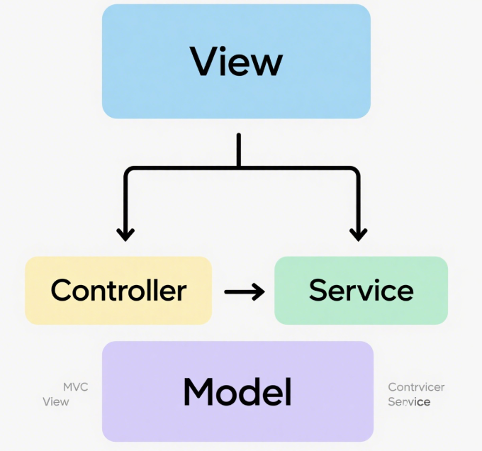

# 用户模块

# 需求分析

对于用户模块，通常要具有下列功能：

* 用户注册
* 用户登录
* 获取当前登录用户
* 用户注销
* 用户权限控制
* 【管理员】管理用户


具体分析每个需求：

1）用户注册：用户可以通过输入账号、密码、确认密码进行注册

2）用户登录：用户可以通过输入账号和密码登录

3）获取当前的登录用户：得到当前已经登录的用户信息（不用重复登录）

4）用户注销：用户可以退出登录

5）用户权限控制：用户又分为普通用户和管理员，管理员拥有整个系统的最高权限，比如可以管理其他用户

6）用户管理：仅管理员可用，可以对整个系统中的用户进行管理，比如搜索用户、删除用户


# 方案设计

实现用户模块的难度不大，方案设计阶段我们需要确认：

* 库表设计
* 用户登录流程
* 如何对用户权限进行控制？

## 库表设计

### 核心设计

库名：yu_picture

表名：user（用户表）


```SQL
-- 用户表
create table if not exists user
(
    id          bigint auto_increment comment 'id' primary key,
    userAccount varchar(256)         not null comment '账号',
    userPassword varchar(512)         not null comment '密码',
    userName    varchar(256)         null comment '用户昵称',
    userAvatar  varchar(1824)        null comment '用户头像',
    userProfile varchar(512)         null comment '用户简介',
    userRole    varchar(256) default 'user' not null comment '用户角色：user/admin',
    editTime    datetime             default CURRENT_TIMESTAMP not null comment '编辑时间',
    createTime  datetime             default CURRENT_TIMESTAMP not null comment '创建时间',
    updateTime  datetime             default CURRENT_TIMESTAMP not null on update CURRENT_TIMESTAMP comment '更新时间',
    isDelete    tinyint 0            default 0 not null comment '是否删除',
    UNIQUE KEY idx_userAccount (userAccount),
    INDEX idx_userName (userName)
) comment '用户表' collate = utf8mb4_unicode_ci;
```

几个注意事项：

1）editTime 和 updateTime 的区别：editTime 表示用户编辑个人信息的时间（需要业务代码来更新），而 updateTime 表示这条记录任何字段发生修改的时间（由数据库自动更新）。

2）给唯一值添加唯一键（唯一索引），比如账号 userAccount，利用数据库天然防重复，同时可以增加查询效率。

3）给经常用于查询的字段添加索引，比如用户昵称 userName，可以增加查询效率。

👇 建议养成好习惯，将库表设计 SQL 保存到项目的目录中，比如新建 sql/create_table.sql 文件，这样其他开发者就能更快地了解项目。


### 扩展设计

1）如果要实现会员功能，可以对表进行如下扩展：

1. 给 userRole 字段新增枚举值 vip，表示会员用户，可根据该值判断用户权限
2. 新增会员过期时间字段，可用于记录会员有效期
3. 新增会员兑换码字段，可用于记录会员的开通方式
4. 新增会员编号字段，可用于定位用户并提供额外服务，并增加会员归属感

对应的 SQL 如下：


```SQL
vipExpireTime datetime         null comment '会员过期时间',
vipCode       varchar(128)     null comment '会员兑换码',
vipNumber      bigint           null comment '会员编号'
```


2）如果要实现用户邀请功能，可以对表进行如下扩展：

1. 新增 shareCode 分享码字段，用于记录每个用户的唯一邀请标识，可拼接到邀请网址后面，比如 https://mianshiyuan/shareCode=xxx
2. 新增 inviteUser 字段，用于记录该用户被哪个用户邀请了，可通过这个字段查询某用户邀请的用户列表。

对应的 SQL 如下：


```SQL
shareCode     varchar(28) DEFAULT NULL COMMENT '分享码',
inviteUser     bigint          DEFAULT NULL COMMENT '邀请用户 id'
```


## 用户登录流程

1）建立初始会话：前端与服务器建立连接后，服务器会为该客户端创建一个初始的匿名 Session，并将其状态保存下来。这个 Session 的 ID 会作为唯一标识，返回给前端。

2）登录成功，更新会话信息：当用户在前端输入正确的账号密码并提交到后端验证成功后，后端会更新该用户的 Session，将用户的登录信息（如用户 ID、用户名等）保存到与该 Session 关联的存储中。同时，服务器会生成一个 Set-Cookie 的响应头，指示前端保存该用户的 Session ID。

3）前端保存 Cookie：前端接收到后端的响应后，浏览器会自动根据 Set-Cookie 指令，将 Session ID 存储到浏览器的 Cookie 中，与该域名绑定。

4）带 Cookie 的后续请求：当前端再次向相同域名的服务器发送请求时，浏览器会自动在请求头中附带之前保存的 Cookie，其中包含 Session ID。

5）后端验证会话：服务器接收到请求后，从请求头中提取 Session ID，找到对应的 Session 数据。

6）获取会话中存储的信息：后端通过该 Session 获取之前存储的用户信息（如登录名、权限等），从而识别用户身份并执行相应的业务逻辑。


## 如何对用户权限进行控制？

可以将接口分为 4 种权限：

1. 未登录也可以使用
2. 登录用户才能使用
3. 未登录也可以使用，但是登录用户能进行更多操作（比如登录后查看全文）
4. 仅管理员才能使用

传统的权限控制方法是，在每个接口内单独编写逻辑：先获取到当前登录用户信息，然后判断用户的权限是否符合要求。这种方法最灵活，但是会写很多重复的代码，而且其他开发者无法一眼得知接口所需要的权限。

权限校验其实是一个比较通用的业务需求，一般会通过 **Spring AOP 切面 + 自定义权限校验注解 **实现统一的接口拦截和权限校验；如果有特殊的权限校验逻辑，再单独在接口中编码。

👇 如果需要更复杂更灵活的权限控制，可以引入 Shiro / Spring Security / Sa-Token 等专门的权限管理框架

返回处理结果（如页面或数据）

---

# 后端开发

整个项目采用mvc模式，这里我在controller层和model层之间加一层service




## 数据模型开发

### 实体类

生成的代码也许不能完全满足我们的要求，比如数据库实体类，我们可以手动更改其字段配置，指定主键策略和逻辑删除。

1. id默认是连续生成的，容易被爬虫抓取，所以更换策略为ASSIGN_ID雪花算法生成。
2. 数据删除时默认为彻底删除记录，如果出现误删，将难以恢复，所以采用逻辑删除——通过修改isDelete字段为1表示已失效的数据。


```Java
@TableName(value ="user")
@Data
public class User implements Serializable {
    /**
     * id（要指定主键策略）
     */
    @TableId(type = IdType.ASSIGN_ID)
    private Long id;

    // ...
    
    /**
     * 是否删除（逻辑删除）
     */
    @TableLogic
    private Integer isDelete;
}
```

### 枚举类

对于用户角色这样值的数量有限的、可枚举的字段，最好定义一个枚举类，便于在项目中获取值、减少枚举值输入错误的

情况。在model.enums包下新建UserRoleEnum:


```TypeScript
@Getter
public enum UserRoleEnum {

    USER("用户", "user"),
    ADMIN("管理员", "admin");

    private final String text;

    private final String value;

    UserRoleEnum(String text, String value) {
        this.text = text;
        this.value = value;
    }

    /**
     * 根据 value 获取枚举
     *
     * @param value 枚举值的value
     * @return 枚举值
     */
    public static UserRoleEnum getEnumByValue(String value) {
        if (ObjUtil.isEmpty(value)) {
            return null;
        }
        for (UserRoleEnum anEnum : UserRoleEnum.values()) {
            if (anEnum.value.equals(value)) {
                return anEnum;
            }
        }
        return null;
    }
}
```

其中，getEnumByValue 是通过 value 找到具体的枚举对象。

如果枚举值特别多，可以Map缓存所有枚举值来加速查找，而不是遍历列表。

---

下面依次进行各功能接口的开发。


## 用户注册

### 数据模型


```C++
@Data
public class UserRegisterRequest implements Serializable {

    private static final long serialVersionUID = 3191241716373120793L;

    /**
     * 账号
     */
    private String userAccount;

    /**
     * 密码
     */
    private String userPassword;

    /**
     * 确认密码
     */
    private String checkPassword;
}
```

在Java接口开发中，为每个接口定义一个专门的类来接收请求参数，可以提高代码的可读性和维护性，便于对参进行统一验证和扩展，同时减少接口方法参数过多导致的复杂性，有助于在复杂场景下更清晰地管理和传递数据。

### 服务开发

在service包的 UserService 中增加方法声明：


```JavaScript
/**
 * 用户注册
 *
 * @param userAccount   用户账户
 * @param userPassword  用户密码
 * @param checkPassword 校验密码
 * @return 新用户 id
 */
long userRegister(String userAccount, String userPassword, String checkPassword);
```

在UserServicelmpl中增加实现代码，注意多补充一些校验条件：


```Java
@Override
public long userRegister(String userAccount, String userPassword, String checkPassword) {
    // 1. 校验
    if (StrUtil.hasBlank(userAccount, userPassword, checkPassword)) {
        throw new BusinessException(ErrorCode.PARAMS_ERROR, "参数为空");
    }
    if (userAccount.length() < 4) {
        throw new BusinessException(ErrorCode.PARAMS_ERROR, "用户账号过短");
    }
    if (userPassword.length() < 8 || checkPassword.length() < 8) {
        throw new BusinessException(ErrorCode.PARAMS_ERROR, "用户密码过短");
    }
    if (!userPassword.equals(checkPassword)) {
        throw new BusinessException(ErrorCode.PARAMS_ERROR, "两次输入的密码不一致");
    }
    // 2. 检查是否重复
    QueryWrapper<User> queryWrapper = new QueryWrapper<>();
    queryWrapper.eq("userAccount", userAccount);
    long count = this.baseMapper.selectCount(queryWrapper);
    if (count > 0) {
        throw new BusinessException(ErrorCode.PARAMS_ERROR, "账号重复");
    }
    // 3. 加密
    String encryptPassword = getEncryptPassword(userPassword);
    // 4. 插入数据
    User user = new User();
    user.setUserAccount(userAccount);
    user.setUserPassword(encryptPassword);
    user.setUserName("无名");
    user.setUserRole(UserRoleEnum.USER.getValue());
    boolean saveResult = this.save(user);
    if (!saveResult) {
        throw new BusinessException(ErrorCode.SYSTEM_ERROR, "注册失败，数据库错误");
    }
    return user.getId();
}
```

注意，上述代码中，我们需要将用户密码加密后进行存储。可以封装一个方法，便于后续复用：


```TypeScript
@Override
public String getEncryptPassword(String userPassword) {
    // 盐值，混淆密码
    final String SALT = "chengfu";
    return DigestUtils.md5DigestAsHex((SALT + userPassword).getBytes());
}
```

### 接口开发

在controller包中新建UserController，新增用户注册接口：


```Java
@RestController
@RequestMapping("/user")
public class UserController {

    @Resource
    private UserService userService;

    /**
     * 用户注册
     */
    @PostMapping("/register")
    public BaseResponse<Long> userRegister(@RequestBody UserRegisterRequest userRegisterRequest) {
        ThrowUtils.throwIf(userRegisterRequest == null, ErrorCode.PARAMS_ERROR);
        String userAccount = userRegisterRequest.getUserAccount();
        String userPassword = userRegisterRequest.getUserPassword();
        String checkPassword = userRegisterRequest.getCheckPassword();
        long result = userService.userRegister(userAccount, userPassword, checkPassword);
        return ResultUtils.success(result);
    }
}
```

## 用户登录

### 数据模型


```Java
@Data
public class UserLoginRequest implements Serializable {

    private static final long serialVersionUID = 3191241716373120793L;

    /**
     * 账号
     */
    private String userAccount;

    /**
     * 密码
     */
    private String userPassword;
}
```

### 服务开发


```Java
/**
 * 用户登录
 *
 * @param userAccount  用户账户
 * @param userPassword 用户密码
 * @param request
 * @return 脱敏后的用户信息
 */
LoginUserVO userLogin(String userAccount, String userPassword, HttpServletRequest request);
```

在UserServicelmpl中增加实现代码，注意多补充一些校验条件，在用户登录成功后，将用户信息存储在当前的Session中。代码如下：


```TypeScript
@Override
public LoginUserVO userLogin(String userAccount, String userPassword, HttpServletRequest request) {
    // 1. 校验
    if (StrUtil.hasBlank(userAccount, userPassword)) {
        throw new BusinessException(ErrorCode.PARAMS_ERROR, "参数为空");
    }
    if (userAccount.length() < 4) {
        throw new BusinessException(ErrorCode.PARAMS_ERROR, "账号错误");
    }
    if (userPassword.length() < 8) {
        throw new BusinessException(ErrorCode.PARAMS_ERROR, "密码错误");
    }
    // 2. 加密
    String encryptPassword = getEncryptPassword(userPassword);
    // 查询用户是否存在
    QueryWrapper<User> queryWrapper = new QueryWrapper<>();
    queryWrapper.eq("userAccount", userAccount);
    queryWrapper.eq("userPassword", encryptPassword);
    User user = this.baseMapper.selectOne(queryWrapper);
    // 用户不存在
    if (user == null) {
        log.info("user login failed, userAccount cannot match userPassword");
        throw new BusinessException(ErrorCode.PARAMS_ERROR, "用户不存在或密码错误");
    }
    // 3. 记录用户的登录态
    request.getSession().setAttribute(USER_LOGIN_STATE, user);
    return this.getLoginUserVO(user);
}
```

注意，由于注册用户时存入数据库的密码是加密后的，查询用户信息时，也要对用户输入的密码进行同样算法的加密，才能跟数据库的信息对应上。

可以把上述的 Session理解为一个Map，可以给 Map设置 key 和 value，每个不同的 SessionID 对应的 Session存储都是不同的，不用担心会污染。所以上述代码中，给Session设置了固定的key(USER_LOGIN_STATE)，可以将这个key值提取为常量，便于后续获取。

在constant包下新建UserConstant 类，统一声明用户相关的常量：


```Java
public interface UserConstant {

    /**
     * 用户登录态键
     */
    String USER_LOGIN_STATE = "user_login";

    //  region 权限

    /**
     * 默认角色
     */
    String DEFAULT_ROLE = "user";

    /**
     * 管理员角色
     */
    String ADMIN_ROLE = "admin";
    
    // endregion
}
```

### 接口开发


```Java
@PostMapping("/login")
public BaseResponse<LoginUserVO> userLogin(@RequestBody UserLoginRequest userLoginRequest, HttpServletRequest request) {
    ThrowUtils.throwIf(userLoginRequest == null, ErrorCode.PARAMS_ERROR);
    String userAccount = userLoginRequest.getUserAccount();
    String userPassword = userLoginRequest.getUserPassword();
    LoginUserVO loginUserVO = userService.userLogin(userAccount, userPassword, request);
    return ResultUtils.success(loginUserVO);
}
```

## 获取当前用户

可以从request请求对象对应的Session中直接获取到之前保存的登录用户信息，无需其他请求参数。

### 服务开发

在service包的 UserService 中增加方法声明：


```Java
/**
 * 获取当前登录用户
 *
 * @param request
 * @return
 */
User getLoginUser(HttpServletRequest request);
```

在UserServicelmpl中增加实现代码，此处为了保证获取到的数据始终是最新的，先从Session中获取登录用户的id，然后从数据库中查询最新的结果。代码如下：


```Java
@Override
public User getLoginUser(HttpServletRequest request) {
    // 先判断是否已登录
    Object userObj = request.getSession().getAttribute(USER_LOGIN_STATE);
    User currentUser = (User) userObj;
    if (currentUser == null || currentUser.getId() == null) {
        throw new BusinessException(ErrorCode.NOT_LOGIN_ERROR);
    }
    // 从数据库查询（追求性能的话可以注释，直接返回上述结果）
    long userId = currentUser.getId();
    currentUser = this.getById(userId);
    if (currentUser == null) {
        throw new BusinessException(ErrorCode.NOT_LOGIN_ERROR);
    }
    return currentUser;
}
```

### 接口开发


```Java
@GetMapping("/get/login")
public BaseResponse<LoginUserVO> getLoginUser(HttpServletRequest request) {
    User loginUser = userService.getLoginUser(request);
    return ResultUtils.success(userService.getLoginUserVO(loginUser));
}
```

注意，上述代码是直接将数据库查到的所有信息都返回给了前端（包括密码），可能存在信息泄露的安全风险。因此，我们还需要对返回结果进行脱敏处理。

### 数据脱敏

在model.vo包下新建LoginUserVo类，表示脱敏后的登录用户信息：


```C++
@Data
public class LoginUserVO implements Serializable {

    /**
     * 用户 id
     */
    private Long id;

    /**
     * 账号
     */
    private String userAccount;

    /**
     * 用户昵称
     */
    private String userName;

    /**
     * 用户头像
     */
    private String userAvatar;

    /**
     * 用户简介
     */
    private String userProfile;

    /**
     * 用户角色：user/admin
     */
    private String userRole;

    /**
     * 创建时间
     */
    private Date createTime;

    /**
     * 更新时间
     */
    private Date updateTime;

    private static final long serialVersionUID = 1L;
}
```

在UserService中新增获取脱敏后的已登录用户信息方法：


```Java
/**
 * 获取脱敏的已登录用户信息
 *
 * @return
 */
LoginUserVO getLoginUserVO(User user);
```

编写方法对应的实现类，其实就是将User类的属性复制到LoginUserVO中，不存在的字段就被过滤掉了：


```SQL
@Override
public LoginUserVO getLoginUserVO(User user) {
    if (user == null) {
        return null;
    }
    LoginUserVO loginUserVO = new LoginUserVO();
    BeanUtils.copyProperties(user, loginUserVO);
    return loginUserVO;
}
```

修改Controller 的 getLoginUser接口，改为返回脱敏后的用户信息：


```Java
@GetMapping("/get/login")
public BaseResponse<LoginUserVO> getLoginUser(HttpServletRequest request) {
    User user = userService.getLoginUser(request);
    return ResultUtils.success(userService.getLoginUserVO(user));
}
```

## 用户注销

可以从request请求对象对应的Session中直接获取到之前保存的登录用户信息，来完成注销，无需其他请求参数。

### 服务开发

在service包的 UserService 中增加方法声明:


```Java
/**
 * 用户注销
 *
 * @param request
 * @return
 */
boolean userLogout(HttpServletRequest request);
```

在UserServicelmpl中增加实现代码，从Session中移除掉当前用户的登录态即可：


```TypeScript
@Override
public boolean userLogout(HttpServletRequest request) {
    // 先判断是否已登录
    Object userObj = request.getSession().getAttribute(USER_LOGIN_STATE);
    if (userObj == null) {
        throw new BusinessException(ErrorCode.OPERATION_ERROR, "未登录");
    }
    // 移除登录态
    request.getSession().removeAttribute(USER_LOGIN_STATE);
    return true;
}
```

### 接口开发

在UserController中新增用户注销接口:


```TypeScript
@PostMapping("/logout")
public BaseResponse<Boolean> userLogout(HttpServletRequest request) {
    ThrowUtils.throwIf(request == null, ErrorCode.PARAMS_ERROR);
    boolean result = userService.userLogout(request);
    return ResultUtils.success(result);
}
```

## 用户权限控制

权限校验其实是一个比较通用的业务需求，一般会通过**SpringAOP切面+自定义权限校验注解** 实现统一的接口拦截和权限校验；如果有特殊的权限校验逻辑，再单独在接口中编码。

### 权限校验注解

首先编写权限校验注解，放到annotation包下:


```Java
@Target(ElementType.METHOD)
@Retention(RetentionPolicy.RUNTIME)
public @interface AuthCheck {

    /**
     * 必须有某个角色
     */
    String mustRole() default "";
}
```

### 权限校验切面

编写权限校验AOP，采用环绕通知，在**打上该注解的方法**执行前后进行一些额外的操作，比如校验权限。

代码如下，放到aop包下：


```Java
@Aspect
@Component
public class AuthInterceptor {

    @Resource
    private UserService userService;

    /**
     * 执行拦截
     *
     * @param joinPoint 切入点
     * @param authCheck 权限校验注解
     */
    @Around("@annotation(authCheck)")
    public Object doInterceptor(ProceedingJoinPoint joinPoint, AuthCheck authCheck) throws Throwable {
        String mustRole = authCheck.mustRole();
        RequestAttributes requestAttributes = RequestContextHolder.currentRequestAttributes();
        HttpServletRequest request = ((ServletRequestAttributes) requestAttributes).getRequest();
        // 当前登录用户
        User loginUser = userService.getLoginUser(request);
        UserRoleEnum mustRoleEnum = UserRoleEnum.getEnumByValue(mustRole);
        // 不需要权限，放行
        if (mustRoleEnum == null) {
            return joinPoint.proceed();
        }
        // 以下为：必须有该权限才通过
        // 获取当前用户具有的权限
        UserRoleEnum userRoleEnum = UserRoleEnum.getEnumByValue(loginUser.getUserRole());
        // 没有权限，拒绝
        if (userRoleEnum == null) {
            throw new BusinessException(ErrorCode.NO_AUTH_ERROR);
        }
        // 要求必须有管理员权限，但用户没有管理员权限，拒绝
        if (UserRoleEnum.ADMIN.equals(mustRoleEnum) && !UserRoleEnum.ADMIN.equals(userRoleEnum)) {
            throw new BusinessException(ErrorCode.NO_AUTH_ERROR);
        }
        // 通过权限校验，放行
        return joinPoint.proceed();
    }
}
```

### 使用注解

只要给方法添加了@AuthCheck注解，就必须要登录，否则会抛出异常。

可以设置mustRole为管理员，这样仅管理员才能使用该接口：


```Java
AuthCheck(mustRole = UserConstant.ADMIN_ROLE)
```

对于不需要登录就能使用的接口，不需要使用该注解。

## 用户管理

用户管理功能具体可以拆分为：

* 【管理员】创建用户
* 【管理员】根据id删除用户
* 【管理员】更新用户
* 【管理员】分页获取用户列表（需要脱敏）
* 【管理员】根据id获取用户（未脱敏）
* 根据 id获取用户(脱敏)

### 数据模型

1. 每个操作都需要提供一个请求类，都放在dto.user包下。

用户创建请求


```C++
@Data
public class UserAddRequest implements Serializable {

    /**
     * 用户昵称
     */
    private String userName;

    /**
     * 账号
     */
    private String userAccount;

    /**
     * 用户头像
     */
    private String userAvatar;

    /**
     * 用户简介
     */
    private String userProfile;

    /**
     * 用户角色: user, admin
     */
    private String userRole;

    private static final long serialVersionUID = 1L;
}
```

用户更新请求


```C++
@Data
public class UserUpdateRequest implements Serializable {

    /**
     * id
     */
    private Long id;

    /**
     * 用户昵称
     */
    private String userName;

    /**
     * 用户头像
     */
    private String userAvatar;

    /**
     * 简介
     */
    private String userProfile;

    /**
     * 用户角色：user/admin
     */
    private String userRole;

    private static final long serialVersionUID = 1L;
}
```

用户查询请求


```C++
@EqualsAndHashCode(callSuper = true)
@Data
public class UserQueryRequest extends PageRequest implements Serializable {

    /**
     * id
     */
    private Long id;

    /**
     * 用户昵称
     */
    private String userName;

    /**
     * 账号
     */
    private String userAccount;

    /**
     * 简介
     */
    private String userProfile;

    /**
     * 用户角色：user/admin/ban
     */
    private String userRole;

    private static final long serialVersionUID = 1L;
}
```

1. 由于要提供获取用户信息的接口，需要和获取当前登录用户接口一样对用户信息进行脱敏。

在model.vo包下新建UserVO，表示脱敏后的用户：


```C++
@Data
public class UserVO implements Serializable {

    /**
     * id
     */
    private Long id;
    
    /**
     * 账号
     */
    private String userAccount;

    /**
     * 用户昵称
     */
    private String userName;

    /**
     * 用户头像
     */
    private String userAvatar;

    /**
     * 用户简介
     */
    private String userProfile;

    /**
     * 用户角色：user/admin
     */
    private String userRole;

    /**
     * 创建时间
     */
    private Date createTime;

    private static final long serialVersionUID = 1L;
}
```

### 服务开发

1. 在UserService中编写获取脱敏后的单个用户信息、获取脱敏后的用户列表方法：


```SQL
@Override
public UserVO getUserVO(User user) {
    if (user == null) {
        return null;
    }
    UserVO userVO = new UserVO();
    BeanUtils.copyProperties(user, userVO);
    return userVO;
}

@Override
public List<UserVO> getUserVOList(List<User> userList) {
    if (CollUtil.isEmpty(userList)) {
        return new ArrayList<>();
    }
    return userList.stream().map(this::getUserVO).collect(Collectors.toList());
}
```

1. 除了上述方法外，对于分页查询接口，需要根据用户传入的参数来构造SQL查询。由于使用MyBatisPlus框架，不用自己拼接SQL了，而是通过构造QueryWrapper 对象来生成SQL查询。

可以在UserService中编写一个方法，专门用于将查询请求转为QueryWrapper 对象：


```Java
@Override
public QueryWrapper<User> getQueryWrapper(UserQueryRequest userQueryRequest) {
    if (userQueryRequest == null) {
        throw new BusinessException(ErrorCode.PARAMS_ERROR, "请求参数为空");
    }
    Long id = userQueryRequest.getId();
    String userAccount = userQueryRequest.getUserAccount();
    String userName = userQueryRequest.getUserName();
    String userProfile = userQueryRequest.getUserProfile();
    String userRole = userQueryRequest.getUserRole();
    String sortField = userQueryRequest.getSortField();
    String sortOrder = userQueryRequest.getSortOrder();
    QueryWrapper<User> queryWrapper = new QueryWrapper<>();
    queryWrapper.eq(ObjUtil.isNotNull(id), "id", id);
    queryWrapper.eq(StrUtil.isNotBlank(userRole), "userRole", userRole);
    queryWrapper.like(StrUtil.isNotBlank(userAccount), "userAccount", userAccount);
    queryWrapper.like(StrUtil.isNotBlank(userName), "userName", userName);
    queryWrapper.like(StrUtil.isNotBlank(userProfile), "userProfile", userProfile);
    queryWrapper.orderBy(StrUtil.isNotEmpty(sortField), sortOrder.equals("ascend"), sortField);
    return queryWrapper;
}
```

### 接口开发

上述功能其实都是样板代码，俗称“增删改查”。

代码实现比较简单，注意添加对应的权限注解、做好参数校验即可：


```Java
/**
 * 创建用户
 */
@PostMapping("/add")
@AuthCheck(mustRole = UserConstant.ADMIN_ROLE)
public BaseResponse<Long> addUser(@RequestBody UserAddRequest userAddRequest) {
    ThrowUtils.throwIf(userAddRequest == null, ErrorCode.PARAMS_ERROR);
    User user = new User();
    BeanUtils.copyProperties(userAddRequest, user);
    // 默认密码 12345678
    final String DEFAULT_PASSWORD = "12345678";
    String encryptPassword = userService.getEncryptPassword(DEFAULT_PASSWORD);
    user.setUserPassword(encryptPassword);
    boolean result = userService.save(user);
    ThrowUtils.throwIf(!result, ErrorCode.OPERATION_ERROR);
    return ResultUtils.success(user.getId());
}

/**
 * 根据 id 获取用户（仅管理员）
 */
@GetMapping("/get")
@AuthCheck(mustRole = UserConstant.ADMIN_ROLE)
public BaseResponse<User> getUserById(long id) {
    ThrowUtils.throwIf(id <= 0, ErrorCode.PARAMS_ERROR);
    User user = userService.getById(id);
    ThrowUtils.throwIf(user == null, ErrorCode.NOT_FOUND_ERROR);
    return ResultUtils.success(user);
}

/**
 * 根据 id 获取包装类
 */
@GetMapping("/get/vo")
public BaseResponse<UserVO> getUserVOById(long id) {
    BaseResponse<User> response = getUserById(id);
    User user = response.getData();
    return ResultUtils.success(userService.getUserVO(user));
}

/**
 * 删除用户
 */
@PostMapping("/delete")
@AuthCheck(mustRole = UserConstant.ADMIN_ROLE)
public BaseResponse<Boolean> deleteUser(@RequestBody DeleteRequest deleteRequest) {
    if (deleteRequest == null || deleteRequest.getId() <= 0) {
        throw new BusinessException(ErrorCode.PARAMS_ERROR);
    }
    boolean b = userService.removeById(deleteRequest.getId());
    return ResultUtils.success(b);
}

/**
 * 更新用户
 */
@PostMapping("/update")
@AuthCheck(mustRole = UserConstant.ADMIN_ROLE)
public BaseResponse<Boolean> updateUser(@RequestBody UserUpdateRequest userUpdateRequest) {
    if (userUpdateRequest == null || userUpdateRequest.getId() == null) {
        throw new BusinessException(ErrorCode.PARAMS_ERROR);
    }
    User user = new User();
    BeanUtils.copyProperties(userUpdateRequest, user);
    boolean result = userService.updateById(user);
    ThrowUtils.throwIf(!result, ErrorCode.OPERATION_ERROR);
    return ResultUtils.success(true);
}

/**
 * 分页获取用户封装列表（仅管理员）
 *
 * @param userQueryRequest 查询请求参数
 */
@PostMapping("/list/page/vo")
@AuthCheck(mustRole = UserConstant.ADMIN_ROLE)
public BaseResponse<Page<UserVO>> listUserVOByPage(@RequestBody UserQueryRequest userQueryRequest) {
    ThrowUtils.throwIf(userQueryRequest == null, ErrorCode.PARAMS_ERROR);
    long current = userQueryRequest.getCurrent();
    long pageSize = userQueryRequest.getPageSize();
    Page<User> userPage = userService.page(new Page<>(current, pageSize),
            userService.getQueryWrapper(userQueryRequest));
    Page<UserVO> userVOPage = new Page<>(current, pageSize, userPage.getTotal());
    List<UserVO> userVOList = userService.getUserVOList(userPage.getRecords());
    userVOPage.setRecords(userVOList);
    return ResultUtils.success(userVOPage);
}
```

### 分页功能修复

**必须要注意，本项目使用的v3.5.9版本引入分页插件的方式和之前不同！3.5.9版本后需要独立安装分页插件依赖！！！**

引入插件依赖


```XML
<!-- MyBatis Plus 分页插件 -->
<dependency>
    <groupId>com.baomidou</groupId>
    <artifactId>mybatis-plus-jsqlparser-4.9</artifactId>
</dependency>

```

光引入这一条，大概率是无法成功


```XML
<dependencyManagement>
    <dependencies>
        <dependency>
            <groupId>org.springframework.boot</groupId>
            <artifactId>spring-boot-dependencies</artifactId>
            <version>${spring-boot.version}</version>
            <type>pom</type>
            <scope>import</scope>
        </dependency>
        <dependency>
            <groupId>com.baomidou</groupId>
            <artifactId>mybatis-plus-bom</artifactId>
            <version>3.5.9</version>
            <type>pom</type>
            <scope>import</scope>
        </dependency>
    </dependencies>
</dependencyManagement>
```

依赖下载成功后，在config包下新建MyBatisPlus拦截器配置，添加分页插件：


```Java
@Configuration
@MapperScan("com.yupi.yupicturebackend.mapper")
public class MyBatisPlusConfig {

    /**
     * 拦截器配置
     *
     * @return {@link MybatisPlusInterceptor}
     */
    @Bean
    public MybatisPlusInterceptor mybatisPlusInterceptor() {
        MybatisPlusInterceptor interceptor = new MybatisPlusInterceptor();
        // 分页插件
        interceptor.addInnerInterceptor(new PaginationInnerInterceptor(DbType.MYSQL));
        return interceptor;
    }
}
```

### 数据精度修复

但是，在测试中，如果你打开F12控制台，利用预览来查看响应数据，就会发现另一个问题：id的最后两位好像都变成0了！

这是由于前端JS的精度范围有限，我们后端返回的id范围过大，导致前端精度丢失，会影响前端页面获取到的数据结果。

为了解决这个问题，可以在后端config包下新建一个全局JSON配置，将整个后端SpringMVC接口返回值的长整型数

字转换为字符串进行返回，从而集中解决问题。


```Java
/**
 * Spring MVC Json 配置
 */
@JsonComponent
public class JsonConfig {

    /**
     * 添加 Long 转 json 精度丢失的配置
     */
    @Bean
    public ObjectMapper jacksonObjectMapper(Jackson2ObjectMapperBuilder builder) {
        ObjectMapper objectMapper = builder.createXmlMapper(false).build();
        SimpleModule module = new SimpleModule();
        module.addSerializer(Long.class, ToStringSerializer.instance);
        module.addSerializer(Long.TYPE, ToStringSerializer.instance);
        objectMapper.registerModule(module);
        return objectMapper;
    }
}
```

# 前端开发

## 用户注册功能

### 页面代码


```HTML
<template>
  <div class="center">
    <h1>Sign in/ Sign up</h1>
    <div class="logon">
      <div :class="overlaylong">
        <div class="overlaylong-Signup" v-if="disfiex == 1">
          <h2 class="overlaylongH2">Registered Account</h2>
          <a-form
            style="max-width: 700px; margin: 0 auto"
            label-align="left"
            :label-col="{ span: 7 }"
            :wrapper-col="{ span: 20 }"
            :model="form2"
            @finish="handleRegister"
          >
            <a-form-item
              name="userAccount"
              label="账号"
              :rules="[
                { required: true, message: '请输入账号' },
                { min: 4, message: '账号不少于 4 位' },
                { max: 20, message: '账号不超过 20 位' },
              ]"
            >
              <a-input
                style="width: 200px"
                v-model:value="form2.userAccount"
                placeholder="请输入账号"
              />
            </a-form-item>
            <a-form-item
              name="userPassword"
              label="密码"
              :rules="[
                { required: true, message: '请输入密码' },
                { min: 8, message: '密码不少于 8 位' },
                { max: 20, message: '密码不超过 20 位' },
                {
                  pattern: passwordPattern,
                  message: '密码必须包含大小写字母、数字和特殊符号',
                },
              ]"
            >
              <a-input-password
                style="width: 200px"
                v-model:value="form2.userPassword"
                placeholder="请输入密码"
              />
            </a-form-item>
            <a-form-item
              name="checkPassword"
              label="确认密码"
              :rules="[
                { required: true, message: '请再次输入密码' },
                { min: 8, message: '密码不少于 8 位' },
                { max: 20, message: '密码不超过 20 位' },
                {
                  pattern: passwordPattern,
                  message: '密码必须包含大小写字母、数字和特殊符号',
                },
              ]"
            >
              <a-input-password
                style="width: 200px"
                v-model:value="form2.checkPassword"
                placeholder="请输入确认密码"
              />
            </a-form-item>
            <a-form-item :wrapper-col="{ offset: 4, span: 20 }">
              <a-button type="primary" html-type="submit" class="inupbutton">注册</a-button>
            </a-form-item>
          </a-form>
        </div>
      </div>
      <div :class="overlaytitle">
        <div class="overlaytitle-Signup" v-if="disfiex == 1">
          <h2 class="overlaytitleH2">Welcome Back!</h2>
          <p class="overlaytitleP">
            To keep connected with us please login with your personal info
          </p>
          <div class="buttongohs" @click="Signup">Sign in</div>
        </div>
      </div>
    </div>
  </div>
</template>
```

### JS代码


```JavaScript
import { reactive } from 'vue'
import { useLoginUserStore } from '@/stores/useLoginUserStore'
import { useRouter } from 'vue-router'
import { userRegisterUsingPost } from '@/api/userController'
import { message } from 'ant-design-vue'

// 密码强度验证规则：要求至少包含3种字符类型（大小写字母、数字、特殊符号）
const passwordPattern = /^((?=.*[a-z])(?=.*[A-Z])(?=.*\d)|(?=.*[a-z])(?=.*[A-Z])(?=.*[^A-Za-z0-9])|(?=.*[a-z])(?=.*\d)(?=.*[^A-Za-z0-9])|(?=.*[A-Z])(?=.*\d)(?=.*[^A-Za-z0-9])).*$/

// 注册表单数据模型
const form2 = reactive({
  userAccount: '',
  userPassword: '',
  checkPassword: '',
})

// 注册处理函数
const handleRegister = async () => {
  // 验证两次密码是否一致
  if (form2.checkPassword !== form2.userPassword) {
    message.error('二次输入的密码不一致')
    return
  }

  try {
    // 调用后端注册API
    const res = await userRegisterUsingPost(form2)
    if (res.data.code === 0 && res.data.data) {
      message.success('注册成功')
      // 注册成功后重置表单
      Object.assign(form2, {
        userAccount: '',
        userPassword: '',
        checkPassword: '',
      })
      // 切换到登录界面
      disfiex.value = 0
    } else {
      message.error('注册失败: ' + (res.data.description || '未知错误'))
    }
  } catch (error) {
    message.error('网络错误，请稍后重试')
    console.error('Registration error:', error)
  }
}

// 界面切换逻辑
const disfiex = ref(0)
const Signin = () => {
  // 切换到登录界面的动画效果
  overlaylong.value = 'overlaylongleft'
  overlaytitle.value = 'overlaytitleright'
  disfiex.value = 1
}

const Signup = () => {
  // 切换到注册界面的动画效果
  overlaylong.value = 'overlaylongright'
  overlaytitle.value = 'overlaytitleleft'
  disfiex.value = 0
}
```

### 技术详解

#### 核心功能点

* **表单验证机制**：实现账号长度校验（4-20位）和密码强度校验（8-20位，至少包含3种字符类型）。  
* **双密码一致性验证**：注册时要求两次输入密码一致，避免用户输入错误。  
* **后端API集成**：通过`userRegisterUsingPost`接口提交注册数据，并处理响应结果。  
* **界面交互切换**：注册成功后自动切换到登录界面，并重置表单数据。  

#### 技术要点

* **密码强度规则设计**：正则表达式`passwordPattern`要求密码至少包含以下组合中的一种：  
  * 小写字母+大写字母+数字  
  * 小写字母+大写字母+特殊符号  
  * 小写字母+数字+特殊符号  
  * 大写字母+数字+特殊符号  
* **响应式表单处理**：使用Ant Design Vue的`a-form`组件，通过`rules`属性定义实时验证规则，错误提示由组件自动生成。  
* **状态管理集成**：注册成功后未直接操作全局状态，而是通过路由和界面切换实现流程闭环，状态更新由`useLoginUserStore`统一管理。  
* **动画交互实现**：通过`overlaylong`和`overlaytitle`类名的动态切换，结合CSS的`transform`和`transition`属性实现界面滑动效果。  

## 用户登录功能

### 页面代码


```HTML
<template>
  <div class="center">
    <h1>Sign in/ Sign up</h1>
    <div class="logon">
      <div :class="overlaylong">
        <div class="overlaylong-Signin" v-if="disfiex == 0">
          <h2 class="overlaylongH2">Sign in</h2>
          <a-form
            style="max-width: 700px; margin: 0 auto"
            label-align="left"
            :label-col="{ span: 4 }"
            :wrapper-col="{ span: 20 }"
            :model="form1"
            @finish="handleLogin"
          >
            <a-form-item
              name="userAccount"
              label="账号"
              :rules="[
                { required: true, message: '请输入账号' },
                { min: 4, message: '账号不少于 4 位' },
                { max: 20, message: '账号不超过 20 位' },
              ]"
            >
              <a-input
                style="width: 250px"
                v-model:value="form1.userAccount"
                placeholder="请输入账号"
              />
            </a-form-item>
            <a-form-item
              name="userPassword"
              label="密码"
              :rules="[
                { required: true, message: '请输入密码' },
                { min: 8, message: '密码不少于 8 位' },
                { max: 20, message: '密码不超过 20 位' },
                {
                  pattern: passwordPattern,
                  message: '密码必须包含大小写字母、数字和特殊符号',
                },
              ]"
            >
              <a-input-password
                style="width: 250px"
                v-model:value="form1.userPassword"
                placeholder="请输入密码"
              />
              <h3 @click="message.info('请联系管理员')">Forgot your password?</h3>
            </a-form-item>
            <a-form-item :wrapper-col="{ offset: 4, span: 20 }">
              <a-button type="primary" html-type="submit" class="inupbutton">登录</a-button>
            </a-form-item>
          </a-form>
        </div>
      </div>
      <div :class="overlaytitle">
        <div class="overlaytitle-Signin" v-if="disfiex == 0">
          <h2 class="overlaytitleH2">Hello,Friend!</h2>
          <p class="overlaytitleP">Enter your personal details and start journey with us</p>
          <div class="buttongohs" @click="Signin">Sign up</div>
        </div>
      </div>
    </div>
  </div>
</template>
```

### JS代码


```JavaScript
import { reactive, ref } from 'vue'
import { useLoginUserStore } from '@/stores/useLoginUserStore'
import { useRouter } from 'vue-router'
import { userLoginUsingPost } from '@/api/userController'
import { message } from 'ant-design-vue'

const router = useRouter()
const loginUserStore = useLoginUserStore()
const passwordPattern = /^((?=.*[a-z])(?=.*[A-Z])(?=.*\d)|(?=.*[a-z])(?=.*[A-Z])(?=.*[^A-Za-z0-9])|(?=.*[a-z])(?=.*\d)(?=.*[^A-Za-z0-9])|(?=.*[A-Z])(?=.*\d)(?=.*[^A-Za-z0-9])).*$/

// 登录表单数据模型
const form1 = reactive({
  userAccount: '',
  userPassword: '',
})

// 登录处理函数
const handleLogin = async () => {
  try {
    // 调用后端登录API
    const res = await userLoginUsingPost(form1)
    if (res.data.code === 0 && res.data.data) {
      // 刷新登录用户状态
      await loginUserStore.fetchLoginUser()
      message.success('登录成功')
      // 跳转首页并替换历史记录
      router.push({
        path: '/',
        replace: true,
      })
    } else {
      message.error('登录失败: ' + (res.data.description || '未知错误'))
    }
  } catch (error) {
    message.error('网络错误，请稍后重试')
    console.error('Login error:', error)
  }
}

// 界面切换逻辑（同注册功能）
const disfiex = ref(0)
const overlaylong = ref('overlaylong')
const overlaytitle = ref('overlaytitle')

const Signin = () => {
  overlaylong.value = 'overlaylongleft'
  overlaytitle.value = 'overlaytitleright'
  disfiex.value = 1
}

const Signup = () => {
  overlaylong.value = 'overlaylongright'
  overlaytitle.value = 'overlaytitleleft'
  disfiex.value = 0
}
```

### 技术详解

#### 核心功能点

* **登录认证流程**：验证账号密码合法性，调用API完成登录，并跳转首页。  
* **状态管理集成**：通过`useLoginUserStore`获取登录用户信息，实现全局状态共享。  
* **路由导航控制**：使用`router.push`实现页面跳转，`replace: true`避免历史记录冗余。  
* **错误处理机制**：区分网络错误、认证失败等场景，提供明确的用户提示。  

#### 技术要点

* **API调用与状态同步**：  
  1. 登录成功后通过`loginUserStore.fetchLoginUser()`刷新用户状态，确保全局数据一致性。  
  1. 使用`async/await`处理异步请求，避免回调地狱，提升代码可读性。  
* **安全策略设计**：  
  * 密码输入使用`a-input-password`组件隐藏明文，防止窥屏泄露。  
  * 错误提示不暴露具体失败原因（如“账号不存在”或“密码错误”），避免安全漏洞。  
* **用户体验优化**：  
  * 登录成功后自动跳转首页，提升操作流畅性。  
  * 提供“忘记密码”交互入口（虽未实现完整逻辑，但预留交互点）。  
* **界面切换动画**：通过CSS变换实现左右分栏的滑动效果，`transition: transform 0.6s ease-in-out`保证动画平滑过渡。  

## 用户注销功能

### 页面代码


```HTML
<template>
  <div id="globalHeader">
   
      <a-col flex="200px">
                <a-avatar v-else style="background-color: #1890ff">
                  {{ loginUserStore.loginUser.userName?.charAt(0) || 'U' }}
                </a-avatar>
                {{ loginUserStore.loginUser.userName ?? '无名' }}
              </ASpace>
              <template #overlay>
                <a-menu>
                  <a-menu-item @click="doLogout">
                    <LogoutOutlined />
                    退出登录
                  </a-menu-item>
                </a-menu>
              </template>
            </a-dropdown>
          </div>
        </div>
  </div>
</template>
```

###  JS代码


```JavaScript
import { computed, ref } from 'vue'
import { useRouter } from 'vue-router'
import { message } from 'ant-design-vue'
import { useLoginUserStore } from '@/stores/useLoginUserStore'
import { userLogoutUsingPost } from '@/api/userController'

const loginUserStore = useLoginUserStore()
const router = useRouter()

// 用户注销核心函数
const doLogout = async () => {
  try {
    const res = await userLogoutUsingPost()
    if (res.data.code === 0) {
      // 清空登录状态
      loginUserStore.setLoginUser({ userName: '未登录' })
      message.success('退出登录成功')
      // 跳转登录页
      await router.push('/user/login')
    } else {
      message.error('退出登录失败：' + res.data.message)
    }
  } catch (error) {
    message.error('网络错误，请稍后重试')
    console.error('Logout error:', error)
  }
}
```

### 技术详解

#### 核心功能点

* **注销流程控制**：调用后端注销接口`userLogoutUsingPost`，清除客户端登录状态并跳转登录页。  
* **权限动态过滤**：根据用户角色（`userRole`）动态过滤菜单，非管理员隐藏`/admin`相关选项。  
* **状态同步机制**：通过`useLoginUserStore`全局状态管理，确保注销后所有页面登录状态一致更新。  

#### 技术要点

* **注销接口交互**：  
  * 采用POST请求方式调用`userLogoutUsingPost`，符合RESTful接口规范。  
  * 响应结果通过`res.data.code === 0`判断请求成功，避免强依赖HTTP状态码。  
* **状态管理设计**：  
  * `loginUserStore.setLoginUser`方法用于清空用户信息，触发全局状态更新。  
  * 使用`async/await`确保注销流程完成后再执行页面跳转，避免状态不一致。  
* **安全策略实现**：  
  * 注销后强制跳转登录页，防止用户通过浏览器历史记录访问受保护页面。  
  * 菜单过滤机制避免未授权用户看到管理功能入口，减少安全漏洞风险。  
* **用户体验优化**：  
  * 注销操作通过下拉菜单触发，符合常见Web应用交互习惯。  
  * 操作结果通过`message.success/error`提供明确反馈，提升操作感知度。  

## 用户个人简介

### 页面代码


```HTML
<template>
  <div class="userProfilePage">
    <a-card :bordered="false" class="profile-card">
      <div class="profile-header">
        <a-avatar :size="120" class="user-avatar">
          <template v-if="userData.userAvatar">
            <a-image :src="userData.userAvatar" :width="120" />
          </template>
          <template v-else>
            {{ userData.userName?.charAt(0) || 'U' }}
          </template>
        </a-avatar>
        <div class="profile-info">
          <h2>{{ userData.userName }}</h2>
          <p class="account-info">@{{ userData.userAccount }}</p>
          <a-tag :color="userData.userRole === 'admin' ? 'red' : 'blue'">
            {{ userData.userRole === 'admin' ? '管理员' : '普通用户' }}
          </a-tag>
        </div>
      </div>

      <a-divider />

      <div class="profile-details">
        <a-descriptions :column="1" bordered>
          <a-descriptions-item label="账号ID">{{ userData.id }}</a-descriptions-item>
          <a-descriptions-item label="个人简介">
            {{ userData.userProfile || '暂无简介' }}
          </a-descriptions-item>
          <a-descriptions-item label="创建时间">
            {{ formatDate(userData.createTime) }}
          </a-descriptions-item>
          <a-descriptions-item label="最后更新时间">
            {{ formatDate(userData.updateTime) }}
          </a-descriptions-item>
        </a-descriptions>
      </div>

      <div class="profile-actions">
        <a-button type="primary" @click="showEditModal">编辑资料</a-button>
        <a-button v-if="userData.userRole === 'admin'" style="margin-left: 10px" @click="goManage">
          管理后台
        </a-button>
      </div>
    </a-card>
    <a-modal
      v-model:visible="editModalVisible"
      title="编辑资料"
      ok-text="保存"
      cancel-text="取消"
      @ok="handleEdit"
      @cancel="handleCancel"
    >
      <a-form :model="updateUserForm" layout="vertical">
        <a-form-item label="用户名">
          <a-input v-model:value="updateUserForm.userName" placeholder="请输入用户名" />
        </a-form-item>
        <a-form-item label="头像URL">
          <a-input v-model:value="updateUserForm.userAvatar" placeholder="请输入头像URL" />
        </a-form-item>
        <a-form-item label="个人简介">
          <a-textarea
            v-model:value="updateUserForm.userProfile"
            placeholder="请输入个人简介"
            :auto-size="{ minRows: 3, maxRows: 5 }"
          />
        </a-form-item>
      </a-form>
    </a-modal>
  </div>
</template>
```

### JS代码


```JavaScript
import { ref, onMounted, reactive } from 'vue'
import { message } from 'ant-design-vue'
import { getLoginUserUsingGet } from '@/api/userController'
import router from '@/router'
import { updateUserSelfUsingPost } from '@/api/userController'

const editModalVisible = ref(false)
const userData = ref({
  id: '',
  userAccount: '',
  userName: '',
  userAvatar: null,
  userProfile: null,
  userRole: '',
  createTime: '',
  updateTime: '',
})

const updateUserForm = reactive({
  id: '',
  userName: '',
  userAvatar: '',
  userProfile: '',
})

// 日期格式化函数
const formatDate = (dateString: string) => {
  if (!dateString) return '未知时间'
  return new Date(dateString).toLocaleString()
}

// 获取用户资料
const fetchUserProfile = async () => {
  try {
    const res = await getLoginUserUsingGet()
    if (res.data.code === 0 && res.data.data) {
      userData.value = res.data.data
    } else {
      message.error('获取用户信息失败: ' + (res.data.message || '未知错误'))
    }
  } catch (error) {
    message.error('网络错误，请稍后重试')
    console.error('Fetch profile error:', error)
  }
}

// 显示编辑模态框
const showEditModal = () => {
  updateUserForm.id = userData.value.id
  updateUserForm.userName = userData.value.userName || ''
  updateUserForm.userAvatar = userData.value.userAvatar || ''
  updateUserForm.userProfile = userData.value.userProfile || ''
  editModalVisible.value = true
}

// 处理编辑提交
const handleEdit = async () => {
  try {
    const res = await updateUserSelfUsingPost(updateUserForm)
    if (res.data.code === 0) {
      message.success('资料更新成功')
      editModalVisible.value = false
      fetchUserProfile() // 刷新用户数据
    } else {
      message.error('更新失败: ' + (res.data.message || '未知错误'))
    }
  } catch (error) {
    message.error('网络错误，请稍后重试')
    console.error('Update profile error:', error)
  }
}

// 取消编辑
const handleCancel = () => {
  editModalVisible.value = false
}

// 跳转管理后台
const goManage = () => {
  router.push('/admin/user')
}

onMounted(() => {
  fetchUserProfile()
})
```

### 技术详解

#### 核心功能点

* **用户资料展示**：呈现用户基本信息（头像、用户名、账号ID等）和元数据（创建时间、更新时间）。  
* **资料编辑功能**：通过模态框实现用户名、头像URL、个人简介的修改与提交。  
* **权限差异化展示**：根据用户角色（`userRole`）显示“管理后台”入口，仅管理员可见。  

#### 技术要点

* **数据获取与渲染**：  
  * 使用`getLoginUserUsingGet`接口获取当前登录用户资料，页面挂载时自动调用`fetchUserProfile`。  
  * 通过响应式数据`userData`绑定页面元素，实现数据动态渲染。  
* **表单交互设计**：  
  * 编辑模态框使用Ant Design Vue的`a-form`组件，支持实时表单验证（虽未显式定义规则，但组件默认校验非空）。  
  * `updateUserForm`通过`reactive`定义响应式对象，与表单输入双向绑定，简化数据同步逻辑。  
* **状态更新机制**：  
  * 资料更新成功后调用`fetchUserProfile`重新获取数据，确保页面与后端数据一致。  
  * 使用`editModalVisible`控制模态框显示/隐藏，配合`@ok`和`@cancel`事件处理交互流程。  
* **响应式布局实现**：  
  * 通过CSS媒体查询`@media (max-width: 768px)`实现移动端适配，将头像与信息栏改为垂直排列。  
  * `a-descriptions`组件的`column="1"`属性在小屏幕下优化信息展示结构。  

## 用户增删改查

### 页面代码


```HTML
<template>
  <div id="userManagePage">
    <!-- 搜索表单 -->
    <a-form layout="inline" :model="searchParams" @finish="doSearch">
      <a-form-item label="账号">
        <a-input v-model:value="searchParams.userAccount" placeholder="输入账号" allow-clear />
      </a-form-item>
      <a-form-item label="用户名">
        <a-input v-model:value="searchParams.userName" placeholder="输入用户名" allow-clear />
      </a-form-item>
      <a-form-item label="用户角色">
        <a-select
          v-model:value="searchParams.userRole"
          placeholder="选择角色"
          style="width: 120px"
          allow-clear
        >
          <a-select-option value="admin">管理员</a-select-option>
          <a-select-option value="user">普通用户</a-select-option>
        </a-select>
      </a-form-item>
      <a-form-item>
        <a-button :icon="h(SearchOutlined)" type="primary" html-type="submit">搜索</a-button>
        <a-button style="margin-left: 8px" @click="resetSearch">重置</a-button>
        <a-button type="dashed" style="margin-left: 8px" @click="showAddModal">添加用户</a-button>
      </a-form-item>
    </a-form>
    
    <!-- 添加用户模态框 -->
    <a-modal
      v-model:visible="addModalVisible"
      title="添加新用户"
      :confirm-loading="addLoading"
      ok-text="确认"
      cancel-text="取消"
      @ok="handleAdd"
      @cancel="handleAddCancel"
    >
      <a-form :model="addUserForm" layout="vertical" ref="addFormRef">
        <a-form-item
          label="账号"
          name="userAccount"
          :rules="[{ required: true, message: '请输入账号' }]"
        >
          <a-input v-model:value="addUserForm.userAccount" placeholder="请输入账号" />
        </a-form-item>
        <a-form-item
          label="用户名"
          name="userName"
          :rules="[{ required: true, message: '请输入用户名' }]"
        >
          <a-input v-model:value="addUserForm.userName" placeholder="请输入用户名" />
        </a-form-item>
        <a-form-item label="头像URL" name="userAvatar">
          <a-input v-model:value="addUserForm.userAvatar" placeholder="请输入头像URL" />
        </a-form-item>
        <a-form-item label="个人简介" name="userProfile">
          <a-textarea
            v-model:value="addUserForm.userProfile"
            placeholder="请输入个人简介"
            :auto-size="{ minRows: 3, maxRows: 5 }"
          />
        </a-form-item>
        <a-form-item
          label="用户角色"
          name="userRole"
          :rules="[{ required: true, message: '请选择用户角色' }]"
        >
          <a-select v-model:value="addUserForm.userRole" placeholder="请选择角色">
            <a-select-option value="admin">管理员</a-select-option>
            <a-select-option value="user">普通用户</a-select-option>
          </a-select>
        </a-form-item>
      </a-form>
    </a-modal>

    <div style="margin-bottom: 16px" />
    
    <!-- 表格 -->
    <a-table
      :columns="columns"
      :data-source="dataList"
      :pagination="pagination"
      :loading="loading"
      @change="doTableChange"
    >
      <template #bodyCell="{ column, record }">
        <template v-if="column.dataIndex === 'userAvatar'">
          <a-image v-if="record.userAvatar" :src="record.userAvatar" :width="80" />
          <a-avatar v-else :size="80" style="background-color: #1890ff">
            {{ record.userName?.charAt(0) || 'U' }}
          </a-avatar>
        </template>
        <template v-else-if="column.dataIndex === 'userRole'">
          <a-tag :color="record.userRole === 'admin' ? 'green' : 'blue'">
            {{ record.userRole === 'admin' ? '管理员' : '普通用户' }}
          </a-tag>
        </template>
        <template v-else-if="column.dataIndex === 'createTime'">
          {{ dayjs(record.createTime).format('YYYY-MM-DD HH:mm:ss') }}
        </template>
        <template v-else-if="column.key === 'action'">
          <a-space>
            <a-button type="dashed" size="small" @click="showEditModal(record)">编辑</a-button>
            <a-button danger size="small" @click="showDeleteConfirm(record.id)">删除</a-button>
          </a-space>
        </template>
      </template>
    </a-table>

    <!-- 编辑用户模态框 -->
    <a-modal
      v-model:visible="editModalVisible"
      :title="editModalTitle"
      :confirm-loading="editLoading"
      ok-text="保存"
      cancel-text="取消"
      @ok="handleEdit"
      @cancel="handleCancel"
    >
      <a-form :model="updateUserForm" layout="vertical" ref="editFormRef">
        <a-form-item
          label="用户名"
          name="userName"
          :rules="[{ required: true, message: '请输入用户名' }]"
        >
          <a-input v-model:value="updateUserForm.userName" placeholder="请输入用户名" />
        </a-form-item>
        <a-form-item label="头像URL" name="userAvatar">
          <a-input v-model:value="updateUserForm.userAvatar" placeholder="请输入头像URL" />
        </a-form-item>
        <a-form-item label="个人简介" name="userProfile">
          <a-textarea
            v-model:value="updateUserForm.userProfile"
            placeholder="请输入个人简介"
            :auto-size="{ minRows: 3, maxRows: 5 }"
          />
        </a-form-item>
        <a-form-item
          label="用户角色"
          name="userRole"
          :rules="[{ required: true, message: '请选择用户角色' }]"
        >
          <a-select v-model:value="updateUserForm.userRole" placeholder="请选择角色">
            <a-select-option value="admin">管理员</a-select-option>
            <a-select-option value="user">普通用户</a-select-option>
          </a-select>
        </a-form-item>
      </a-form>
    </a-modal>
  </div>
</template>
```

### JS代码


```JavaScript
import { computed, onMounted, reactive, ref } from 'vue'
import {
  deleteUserUsingPost,
  getUserVoListPageUsingPost,
  updateUserUsingPost,
  addUserUsingPost,
} from '@/api/userController'
import { message, Modal } from 'ant-design-vue'
import dayjs from 'dayjs'
import type { FormInstance } from 'ant-design-vue'
import { h } from 'vue'
import { SearchOutlined } from '@ant-design/icons-vue'

// 模态框状态
const addModalVisible = ref(false)
const addLoading = ref(false)
const addFormRef = ref<FormInstance>()
const editModalVisible = ref(false)
const editModalTitle = ref('编辑用户')
const editLoading = ref(false)
const editFormRef = ref<FormInstance>()
const loading = ref(false)

// 表格列定义
const columns = [
  { title: 'ID', dataIndex: 'id', width: 200 },
  { title: '账号', dataIndex: 'userAccount', width: 200 },
  { title: '用户名', dataIndex: 'userName', width: 150 },
  { title: '头像', dataIndex: 'userAvatar', width: 120 },
  { title: '简介', dataIndex: 'userProfile', ellipsis: true },
  { title: '用户角色', dataIndex: 'userRole', width: 120 },
  { title: '创建时间', dataIndex: 'createTime', width: 180 },
  { title: '操作', key: 'action', width: 150 }
]

// 数据状态
const dataList = ref([])
const total = ref(0)
const searchParams = reactive({
  current: 1,
  pageSize: 10,
  sortField: 'createTime',
  sortOrder: 'descend',
  userAccount: '',
  userName: '',
  userRole: ''
})

// 表单数据模型
const updateUserForm = reactive({
  id: '',
  userName: '',
  userAvatar: '',
  userProfile: '',
  userRole: ''
})

const addUserForm = reactive({
  userName: '',
  userAccount: '',
  userAvatar: '',
  userProfile: '',
  userRole: ''
})

// 获取用户列表数据
const fetchData = async () => {
  try {
    loading.value = true
    const res = await getUserVoListPageUsingPost(searchParams)
    if (res.data.code === 0 && res.data.data) {
      dataList.value = res.data.data.records || []
      total.value = res.data.data.total || 0
    } else {
      message.error('获取数据失败: ' + (res.data.message || '未知错误'))
    }
  } catch (error) {
    message.error('网络错误，请稍后重试')
    console.error('Fetch data error:', error)
  } finally {
    loading.value = false
  }
}

// 显示添加用户模态框
const showAddModal = () => {
  addModalVisible.value = true
}

// 处理添加用户
const handleAdd = async () => {
  try {
    await addFormRef.value?.validate()
    addLoading.value = true
    const res = await addUserUsingPost(addUserForm)
    if (res.data.code === 0) {
      message.success('添加用户成功')
      addModalVisible.value = false
      addFormRef.value?.resetFields()
      fetchData()
    } else {
      message.error('添加失败: ' + (res.data.message || '未知错误'))
    }
  } catch (error) {
    console.error('Add user error:', error)
    if (error instanceof Error) {
      message.error('添加失败: ' + error.message)
    }
  } finally {
    addLoading.value = false
  }
}

// 取消添加
const handleAddCancel = () => {
  addModalVisible.value = false
  addFormRef.value?.resetFields()
}

// 显示编辑用户模态框
const showEditModal = (record) => {
  editModalTitle.value = `编辑用户 - ${record.userName}`
  Object.assign(updateUserForm, {
    id: record.id,
    userName: record.userName,
    userAvatar: record.userAvatar,
    userProfile: record.userProfile,
    userRole: record.userRole
  })
  editModalVisible.value = true
}

// 处理编辑用户
const handleEdit = async () => {
  try {
    await editFormRef.value?.validate()
    editLoading.value = true
    const res = await updateUserUsingPost(updateUserForm)
    if (res.data.code === 0) {
      message.success('更新成功')
      editModalVisible.value = false
      fetchData()
    } else {
      message.error('更新失败: ' + (res.data.message || '未知错误'))
    }
  } catch (error) {
    console.error('Update error:', error)
  } finally {
    editLoading.value = false
  }
}

// 取消编辑
const handleCancel = () => {
  editModalVisible.value = false
  editFormRef.value?.resetFields()
}

// 显示删除确认对话框
const showDeleteConfirm = (id) => {
  Modal.confirm({
    title: '确认删除',
    content: '确定要删除该用户吗？此操作不可撤销！',
    okText: '确认',
    okType: 'danger',
    cancelText: '取消',
    onOk: () => doDelete(id)
  })
}

// 处理删除用户
const doDelete = async (id) => {
  try {
    loading.value = true
    const res = await deleteUserUsingPost({ id })
    if (res.data.code === 0) {
      message.success('删除成功')
      fetchData()
    } else {
      message.error('删除失败: ' + (res.data.message || '未知错误'))
    }
  } catch (error) {
    message.error('网络错误，请稍后重试')
    console.error('Delete error:', error)
  } finally {
    loading.value = false
  }
}

// 搜索用户
const doSearch = () => {
  searchParams.current = 1
  fetchData()
}

// 重置搜索条件
const resetSearch = () => {
  Object.assign(searchParams, {
    userAccount: undefined,
    userName: undefined,
    userRole: undefined,
    current: 1
  })
  fetchData()
}

// 表格分页排序处理
const doTableChange = (page) => {
  searchParams.current = page.current
  searchParams.pageSize = page.pageSize
  fetchData()
}

// 计算分页配置
const pagination = computed(() => ({
  current: searchParams.current,
  pageSize: searchParams.pageSize,
  total: total.value,
  showSizeChanger: true,
  showQuickJumper: true,
  showTotal: (total) => `共 ${total} 条`
}))

// 页面挂载时获取数据
onMounted(() => {
  fetchData()
})
```

### 技术详解

#### 核心功能点

* **用户列表展示**：通过表格展示用户信息，支持分页、排序和条件搜索  
* **用户添加**：通过模态框表单添加新用户，包含必填字段验证  
* **用户编辑**：支持修改用户基本信息（用户名、头像、简介、角色）  
* **用户删除**：通过确认对话框删除用户，操作不可逆  
* **条件搜索**：支持按账号、用户名、用户角色筛选用户列表  


#### 技术要点

* **数据获取与分页**：  
  * 使用`getUserVoListPageUsingPost`接口获取用户列表，支持分页、排序和条件查询  
  * 通过`searchParams`响应式对象管理搜索条件和分页参数  
  * 使用`computed`计算属性动态生成表格分页配置  


* **表单验证与处理**：  
  * 添加和编辑表单使用Ant Design Vue的`a-form`组件，通过`rules`属性定义必填字段验证  
  * 表单提交前调用`validate()`方法进行字段校验，避免无效数据提交  
  * 提交成功后重置表单并刷新数据列表  


* **模态框交互**：  
  * 添加和编辑功能通过模态框实现，避免页面跳转影响用户体验  
  * 使用`v-model:visible`控制模态框显示/隐藏，通过`ref`引用操作表单实例  
  * 编辑模态框根据当前用户数据动态设置标题和表单初始值  


* **表格数据渲染**：  
  * 通过`columns`数组定义表格列，使用模板插槽自定义特殊列渲染  
  * 头像列根据是否存在头像URL显示图片或默认头像  
  * 角色列使用标签组件根据角色类型显示不同颜色  
  * 时间列使用dayjs库格式化时间戳为可读格式  


* **用户操作安全**：  
  * 删除操作通过确认对话框二次确认，防止误操作  
  * 所有API操作都包含错误处理，通过`message`组件反馈操作结果  
  * 加载状态控制（`loading`）防止重复提交和提升用户体验  


* **响应式设计**：  
  * 搜索表单使用`layout="inline"`在小屏幕下自动换行  
  * 表格列定义宽度和`ellipsis`属性优化不同屏幕下的显示效果  
  * 页面整体使用内边距和间距保证内容可读性  


