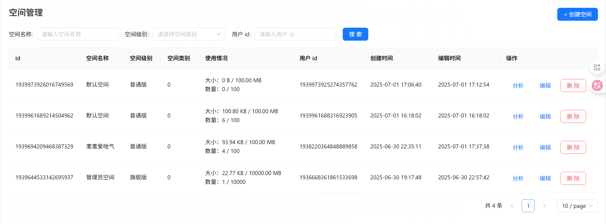
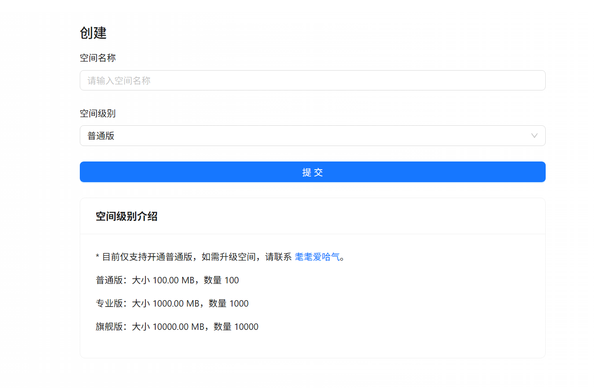

# 空间模块

之前我们已经؜完成了公共图库的开发，为了进一步增加系统的应用价值，可以让每个用户都能创建自己的私有空间，打造自己的图片云盘、个人相册。

# 需求分析

对于空间模块，通常要有这些功能：

* 【管理员】管理空间
* 用户创建私有空间
* 私有空间权限控制
* 空间级别和限额控制

看起来简单؜，但其实每个需求的细节都非常多，具体分析每个需求：

1. 管理空؜间：仅管理员可用，可以对整个系统中的空间进行管理，比如搜索空间、编辑空间、删除空间。
2. 用户创建私有空间：用户可以创建 最多一个 私有空间，并且在私有空间内自由上传和管理图片。
3. 私有空间؜权限控制：用户仅能访问和管理自己的私有空间和其中的图片，私有空间的图片不会展示在公共图库，也不需要管理员审核。
4. 空间级别؜和限额控制：每个空间有不同的级别（如普通版和专业版），对应了不同的容量和图片数量限制，如果超出限制则无法继续上传图片。

# 方案设计

从需求分析؜中，我们也能感受到，细节比较多，为了更好地把控这些细节，需要先对系统进行一个整体的方案设计。

思考下面的问题：

1. 为什么要有 “空间” 的概念？
2. 如何对空间进行库表设计？
3. 公共图库和空间的关系？

### 空间的必要性

如果没有 ؜“空间” 的概念，怎么实现让用户自由管理自己的私有图片呢？

Q：这不就؜相当于 “查看我的图片” 功能嘛，直接支持用户查询自己创建过的图片不就可以了？

A：如果这样做，会存在一个很大的问题：用户私有图片是 需要隐私 的，不需要被管理员审核，也不能被其他人公开查看。这和现在的公共图库平台的逻辑不一致。

想象一下，؜图片表中只有 userId 字段，无法区分图片到底是私有的还是公开的。

Q：那如果؜允许用户上传私有图片呢？比如设置图片可见范围为 “仅自己可见”？

A：这的确是可行的，对于内容占用存储空间不大的平台，很适合采用这种方案，像 [代码小抄](https://www.codecopy.cn/) 就支持上传仅自己可见的代码。但是，对于图库平台，图片占用的存储空间会直接产生存储费用，因此需要对用户上传的图片大小和数量进行限制。类似于给你分配了一个电脑硬盘，它就是你的，用满了就不能再传图了。所以使用 “空间” 的概念会更符合这种应用场景，可以针对空间进行限制和分析，也更便于管理。

此外，从项؜目可扩展性的角度来讲，抽象 “空间” 的概念还有 2 个优势：

1. 和之前的公共图库完全分开，尽量只额外增加空间相关的逻辑和代码，减少对代码的修改。
2. 以后我们要开发团队共享空间，需要对空间进行成员管理，也是需要 “空间” 概念的。所以目前设计的空间表，要能够兼容之后的共享空间，便于后续扩展。

### 空间库表设计

#### 空间表


```SQL
-- 空间表
create table if not exists space
(
    id         bigint auto_increment comment 'id' primary key,
    spaceName  varchar(128)                       null comment '空间名称',
    spaceLevel int      default 0                 null comment '空间级别：0-普通版 1-专业版 2-旗舰版',
    maxSize    bigint   default 0                 null comment '空间图片的最大总大小',
    maxCount   bigint   default 0                 null comment '空间图片的最大数量',
    totalSize  bigint   default 0                 null comment '当前空间下图片的总大小',
    totalCount bigint   default 0                 null comment '当前空间下的图片数量',
    userId     bigint                             not null comment '创建用户 id',
    createTime datetime default CURRENT_TIMESTAMP not null comment '创建时间',
    editTime   datetime default CURRENT_TIMESTAMP not null comment '编辑时间',
    updateTime datetime default CURRENT_TIMESTAMP not null on update CURRENT_TIMESTAMP comment '更新时间',
    isDelete   tinyint  default 0                 not null comment '是否删除',
    -- 索引设计
    index idx_userId (userId),        -- 提升基于用户的查询效率
    index idx_spaceName (spaceName),  -- 提升基于空间名称的查询效率
    index idx_spaceLevel (spaceLevel) -- 提升按空间级别查询的效率
) comment '空间' collate = utf8mb4_unicode_ci;
```

几个设计要点：

1. 空间级别字段：空间级别包括普通版、专业版和旗舰版，是可枚举的，因此使用整型来节约空间、提高查询效率。
2. 空间限额字段：除了级别字段外，增加 `maxSize` 和 `maxCount` 字段用于限制空间的图片总大小与数量，而不是在代码中根据级别读取限额。这样管理员可以单独设置限额，不用完全和级别绑定，利于扩展；而且查询限额时也更方便。
3. 索引设计：为高频查询的字段（如空间名称、空间级别、用户 id）添加索引，提高查询效率。

#### 图片表

由于一张图片؜只能属于一个空间，可以在图片表 picture 中新增字段 spaceId，实现图片与空间的关联，同时增加索引以提高查询性能。


```SQL
-- 添加新列
ALTER TABLE picture
    ADD COLUMN spaceId  bigint  null comment '空间 id（为空表示公共空间）';

-- 创建索引
CREATE INDEX idx_spaceId ON picture (spaceId);
```

### 公共图库和空间的关系

> Q：公共图库不就是系统管理员创建的一个空间么？既然有了空间表，要不要把公共图库也当做一个默认的空间来设计呢？或者在空间表创建一条公共图库的记录？

> 此处为了确保公共图库与私有空间的独立性，必须进行单独的设计，并避免将两者混合。原因如下：

> 1. 公共图库的访问权限与私有空间不同
    > * 公共图库中的图片无需登录就能查看，任何人都可以访问，不需要进行用户认证或成员管理。
    > * 私有空间则要求用户登录，且访问权限严格控制，通常只有空间管理员（或团队成员）才能查看或修改空间内容。
> 2. 公共图库؜没有额度限制：私有空间会有图片大小、数量等方面的限制，从而管理用户的存储资源和空间配额；而公共图库完全不受这些限制。


公共图库和私有空间在数据结构、؜图片存储、权限控制、额度管理等方面存在本质区别，如果混合设计，会增加系统的复杂度并影响维护与扩展性。举个例子：公共图库应该上传到对象存储的 public 目录，该目录里的文件可以公开访问；但私有图片应该上传到单独的 space 目录，该目录里的文件可以进一步设置访问权限。

# 后端开发

## 空间管理

先开发空间样板代码CRUD等等

### 数据模型

1. 使用MyBatis-Plus插件自动生成一个实体类，为了防爬虫，id随机；另外加上逻辑删除字段。


```SQL
@TableName(value ="space")
@Data
public class Space {
*/***** id***/*@TableId(type = IdType.*ASSIGN_ID*)
    private Long id;

*/***** 空间名称***/*private String spaceName;

*/***** 空间级别：0-普通版 1-专业版 2-旗舰版***/*private Integer spaceLevel;

*/***** 空间图片的最大总大小***/*private Long maxSize;

*/***** 空间图片的最大数量***/*private Long maxCount;

*/***** 当前空间下图片的总大小***/*private Long totalSize;

*/***** 当前空间下的图片数量***/*private Long totalCount;

*/***** 创建用户 id***/*private Long userId;

*/***** 创建时间***/*private Date createTime;

*/***** 编辑时间***/*private Date editTime;

*/***** 更新时间***/*private Date updateTime;

*/***** 是否删除***/*@TableLogic
    private Integer isDelete;

*/***** 空间类型：0-私有 1-团队***/*private Integer spaceType;
}
```

1. 每个操作需要一个请求类，分别是空间创建、更新、编辑、查询（由于每个用户都有一个自己的空间，这里就不需要有删除空间的逻辑——删除空间有点逆天）

空间创建


```Java
@Data
public class SpaceAddRequest implements Serializable {

*/***** 空间名称***/*private String spaceName;

*/***** 空间级别：0-普通版 1-专业版 2-旗舰版***/*private Integer spaceLevel;

    private static final long *serialVersionUID*= 1L;
}
```

空间编辑请求，给用户用，方便用户更改空间名称


```Java
@Data
public class SpaceEditRequest implements Serializable {

    /**
     * 空间 id
     */
    private Long id;

    /**
     * 空间名称
     */
    private String spaceName;

    private static final long serialVersionUID = 1L;
}
```

空间更新请求，给管理员用，可以更改空间级别和限额


```Java
@Data
public class SpaceUpdateRequest implements Serializable {

    /**
     * id
     */
    private Long id;

    /**
     * 空间名称
     */
    private String spaceName;

    /**
     * 空间级别：0-普通版 1-专业版 2-旗舰版
     */
    private Integer spaceLevel;

    /**
     * 空间图片的最大总大小
     */
    private Long maxSize;

    /**
     * 空间图片的最大数量
     */
    private Long maxCount;

    private static final long serialVersionUID = 1L;
}
```

空间查询请求，这里给管理员用，因为每个用户都有自己的空间


```Java
@EqualsAndHashCode(callSuper = true)
@Data
public class SpaceQueryRequest extends PageRequest implements Serializable {

    /**
     * id
     */
    private Long id;

    /**
     * 用户 id
     */
    private Long userId;

    /**
     * 空间名称
     */
    private String spaceName;

    /**
     * 空间级别：0-普通版 1-专业版 2-旗舰版
     */
    private Integer spaceLevel;

    private static final long serialVersionUID = 1L;
}
```

1. 在 `model.dto.vo` 下新建空间的视图包装类，可以额外关联创建空间的用户信息。还可以编写 Space 实体类和该 VO 类的转换方法，便于后续快速传值。


```C++
@Data
public class SpaceVO implements Serializable {
    /**
     * id
     */
    private Long id;

    /**
     * 空间名称
     */
    private String spaceName;

    /**
     * 空间级别：0-普通版 1-专业版 2-旗舰版
     */
    private Integer spaceLevel;

    /**
     * 空间图片的最大总大小
     */
    private Long maxSize;

    /**
     * 空间图片的最大数量
     */
    private Long maxCount;

    /**
     * 当前空间下图片的总大小
     */
    private Long totalSize;

    /**
     * 当前空间下的图片数量
     */
    private Long totalCount;

    /**
     * 创建用户 id
     */
    private Long userId;

    /**
     * 创建时间
     */
    private Date createTime;

    /**
     * 编辑时间
     */
    private Date editTime;

    /**
     * 更新时间
     */
    private Date updateTime;

    /**
     * 创建用户信息
     */
    private UserVO user;

    private static final long serialVersionUID = 1L;

    /**
     * 封装类转对象
     *
     * @param spaceVO
     * @return
     */
    public static Space voToObj(SpaceVO spaceVO) {
        if (spaceVO == null) {
            return null;
        }
        Space space = new Space();
        BeanUtils.copyProperties(spaceVO, space);
        return space;
    }

    /**
     * 对象转封装类
     *
     * @param space
     * @return
     */
    public static SpaceVO objToVo(Space space) {
        if (space == null) {
            return null;
        }
        SpaceVO spaceVO = new SpaceVO();
        BeanUtils.copyProperties(space, spaceVO);
        return spaceVO;
    }
}

```

1. 在 `model.enums` 包下新建空间级别枚举，定义每个级别的空间对应的限额：


```Java
@Getter
public enum SpaceLevelEnum {

    COMMON("普通版", 0, 100, 100L * 1024 * 1024),
    PROFESSIONAL("专业版", 1, 1000, 1000L * 1024 * 1024),
    FLAGSHIP("旗舰版", 2, 10000, 10000L * 1024 * 1024);

    private final String text;

    private final int value;

    private final long maxCount;

    private final long maxSize;


    /**
     * @param text 文本
     * @param value 值
     * @param maxSize 最大图片总大小
     * @param maxCount 最大图片总数量
     */
    SpaceLevelEnum(String text, int value, long maxCount, long maxSize) {
        this.text = text;
        this.value = value;
        this.maxCount = maxCount;
        this.maxSize = maxSize;
    }

    /**
     * 根据 value 获取枚举
     */
    public static SpaceLevelEnum getEnumByValue(Integer value) {
        if (ObjUtil.isEmpty(value)) {
            return null;
        }
        for (SpaceLevelEnum spaceLevelEnum : SpaceLevelEnum.values()) {
            if (spaceLevelEnum.value == value) {
                return spaceLevelEnum;
            }
        }
        return null;
    }
}
```

### 基础服务开发

可以参考图؜片服务的开发方法，完成 SpaceService 和实现类，大多数代码可以直接复用。

由于创建空؜间的逻辑比较复杂，可以先定义个接口占坑。我们主要开发下列方法

1. 需要开؜发校验空间数据的方法，增加 add 参数用来区分是创建数据时校验还是编辑时校验，判断条件是不一样的：

> 1. 校验参数
> 2. 如果是创建,那么名称和级别不能为空
> 3. 如果是编辑,则哦按段空间级别是否存在,再验证长度


```Java
@Override
public void validSpace(Space space, boolean add) {
    ThrowUtils.throwIf(space == null, ErrorCode.PARAMS_ERROR);
    // 从对象中取值
    String spaceName = space.getSpaceName();
    Integer spaceLevel = space.getSpaceLevel();
    SpaceLevelEnum spaceLevelEnum = SpaceLevelEnum.getEnumByValue(spaceLevel);
    // 要创建
    if (add) {
        if (StrUtil.isBlank(spaceName)) {
            throw new BusinessException(ErrorCode.PARAMS_ERROR, "空间名称不能为空");
        }
        if (spaceLevel == null) {
            throw new BusinessException(ErrorCode.PARAMS_ERROR, "空间级别不能为空");
        }
    }
    // 修改数据时，如果要改空间级别
    if (spaceLevel != null && spaceLevelEnum == null) {
        throw new BusinessException(ErrorCode.PARAMS_ERROR, "空间级别不存在");
    }
    if (StrUtil.isNotBlank(spaceName) && spaceName.length() > 30) {
        throw new BusinessException(ErrorCode.PARAMS_ERROR, "空间名称过长");
    }
}

```

1. 在创建؜或更新空间时，需要根据空间级别自动填充限额数据，可以在服务中编写方法便于复用：


```Java
@Override
public void fillSpaceBySpaceLevel(Space space) {
    // 根据空间级别，自动填充限额
    SpaceLevelEnum spaceLevelEnum = SpaceLevelEnum.getEnumByValue(space.getSpaceLevel());
    if (spaceLevelEnum != null) {
        long maxSize = spaceLevelEnum.getMaxSize();
        if (space.getMaxSize() == null) {
            space.setMaxSize(maxSize);
        }
        long maxCount = spaceLevelEnum.getMaxCount();
        if (space.getMaxCount() == null) {
            space.setMaxCount(maxCount);
        }
    }
}

```

### 接口开发

参考图片接؜口的开发方法，完成 SpaceController 类，大多数代码可以直接复用。

需要重点关注接口的权限：

* 创建空间：所有用户都可以使用
* 删除空间：仅允许空间创建人或管理员删除
* 更新空间：仅管理员可用，允许更新空间级别
* 编辑空间：允许空间创建人使用，但注意可编辑的字段（不能编辑空间级别）

开发更新接口时，需要调用填充空间限额数据的方法：


```Java
@PostMapping("/update")
@AuthCheck(mustRole = UserConstant.ADMIN_ROLE)
public BaseResponse<Boolean> updateSpace(@RequestBody SpaceUpdateRequest spaceUpdateRequest) {
    if (spaceUpdateRequest == null || spaceUpdateRequest.getId() <= 0) {
        throw new BusinessException(ErrorCode.PARAMS_ERROR);
    }
    // 将实体类和 DTO 进行转换
    Space space = new Space();
    BeanUtils.copyProperties(spaceUpdateRequest, space);
    // 自动填充数据
    spaceService.fillSpaceBySpaceLevel(space);
    // 数据校验
    spaceService.validSpace(space, false);
    // 判断是否存在
    long id = spaceUpdateRequest.getId();
    Space oldSpace = spaceService.getById(id);
    ThrowUtils.throwIf(oldSpace == null, ErrorCode.NOT_FOUND_ERROR);
    // 操作数据库
    boolean result = spaceService.updateById(space);
    ThrowUtils.throwIf(!result, ErrorCode.OPERATION_ERROR);
    return ResultUtils.success(true);
}
```

## 用户创建私有空间

用户可以自主创建私有空间，但是必须要加限制，最多只能创建一个。

需要开发创建空间服务，该服务较为复杂，我们要先整理下流程。

### 创建空间流程

流程如下：

1. 填充参数默认值
2. 校验参数
3. 校验权限，非管理员只能创建普通级别的空间
4. 控制同一用户只能创建一个私有空间

如何保证同一用户只能创建一个私有空间呢？

最粗暴的方式是给空间表的 userId 加上唯一索引，但由于后续用户还可以创建团队空间，这种方式不利于扩展。所以我们采用 **加锁 + 事务**  的方式实现。

### 创建空间服务

按照上述流程编写代码：


```Java
@Resourceprivate TransactionTemplate transactionTemplate;

@Overridepublic long addSpace(SpaceAddRequest spaceAddRequest, User loginUser) {
    // 在此处将实体类和 DTO 进行转换Space space = new Space();
    BeanUtils.copyProperties(spaceAddRequest, space);
    // 默认值if (StrUtil.isBlank(spaceAddRequest.getSpaceName())) {
        space.setSpaceName("默认空间");
    }
    if (spaceAddRequest.getSpaceLevel() == null) {
        space.setSpaceLevel(SpaceLevelEnum.COMMON.getValue());
    }
    // 填充数据this.fillSpaceBySpaceLevel(space);
    // 数据校验this.validSpace(space, true);
    Long userId = loginUser.getId();
    space.setUserId(userId);
    // 权限校验if (SpaceLevelEnum.COMMON.getValue() != spaceAddRequest.getSpaceLevel() && !userService.isAdmin(loginUser)) {
        throw new BusinessException(ErrorCode.NO_AUTH_ERROR, "无权限创建指定级别的空间");
    }
    // 针对用户进行加锁String lock = String.valueOf(userId).intern();
    synchronized (lock) {
        Long newSpaceId = transactionTemplate.execute(status -> {
            boolean exists = this.lambdaQuery().eq(Space::getUserId, userId).exists();
            ThrowUtils.throwIf(exists, ErrorCode.OPERATION_ERROR, "每个用户仅能有一个私有空间");
            // 写入数据库boolean result = this.save(space);
            ThrowUtils.throwIf(!result, ErrorCode.OPERATION_ERROR);
            // 返回新写入的数据 idreturn space.getId();
        });
        // 返回结果是包装类，可以做一些处理return Optional.ofNullable(newSpaceId).orElse(-1L);
    }
}
```

注意，上述代码中，我们使用本地 synchronized 锁对 userId 进行加锁，这样不同的用户可以拿到不同的锁，对性能的影响较低。在加锁的代码中，我们使用 Spring 的 编程式事务管理器 transactionTemplate 封装跟数据库有关的查询和插入操作，而不是使用 @Transactional 注解来控制事务，这样可以保证事务的提交在加锁的范围内。

💡 只要؜涉及到事务操作，建议大家测试时自己 new 个运行时异常来验证是否会回滚。

### 扩展知识 - 本地锁优化

上述代码中，我们是对字符串常量池（intern）进行加锁的，数据并不会及时释放。如果还要使用本地锁，可以按需选用另一种方式 —— 采用 `ConcurrentHashMap` 来存储锁对象。

示例代码如下：


```Java
Map<Long, Object> lockMap = new ConcurrentHashMap<>();

public long addSpace(SpaceAddRequest spaceAddRequest, User user) {
    Long userId = user.getId();
    Object lock = lockMap.computeIfAbsent(userId, key -> new Object());
    synchronized (lock) {
        try {
            // 数据库操作
        } finally {
            // 防止内存泄漏
            lockMap.remove(userId);
        }
    }
}
```

### 扩展

1）用户注؜册成功时，可以自动创建空间。即使创建失败了，也可以手动创建作为兜底。

2）管理员可以为某个用户创建空间（目前没啥必要）

3）本地锁改为分布式锁，可以基于 Redisson 实现。

## 私有空间权限控制

私有空间的权限和公共图库是不同的，我们需要对之前 所有的图片操作 都添加和空间有关的权限校验逻辑。

### 图片表新增字段

图片表增加؜ spaceId 字段，默认为 null 表示公共图库。

同步修改 PictureMapper.xml、Picture 实体类、PictureVO 响应视图，补充空间 id 字段：


```Java
/**
 * 空间 id
 */private Long spaceId;
```

下面我们依次给 “增删改查” 图片操作增加权限校验逻辑。

### 上传和更新图片

1）上传图؜片时支持指定空间 id，表示要将图片上传到哪个空间。

给 Pic؜tureUploadRequest 请求封装类补充 spaceId 字段。OTsSx2bzs2C13D2pB4s4on5rzOarAwg0YtGpfccE/pk=

2）修改上传؜图片方法 uploadPicture，校验空间是否存在；如果存在，还要校验是否有空间权限，仅空间的管理员才能上传。

现阶段空间的管理员就是空间的创建人


```Java
ThrowUtils.throwIf(loginUser == null, ErrorCode.NO_AUTH_ERROR);
// 校验空间是否存在Long spaceId = pictureUploadRequest.getSpaceId();
if (spaceId != null) {
    Space space = spaceService.getById(spaceId);
    ThrowUtils.throwIf(space == null, ErrorCode.NOT_FOUND_ERROR, "空间不存在");
    // 必须空间创建人（管理员）才能上传if (!loginUser.getId().equals(space.getUserId())) {
        throw new BusinessException(ErrorCode.NO_AUTH_ERROR, "没有空间权限");
    }
}
```

3）如果是更新图؜片，需要校验更新时传递的 spaceId 和已有图片的 spaceId 是否一致。如果更新时未传递 spaceId，则复用原有图片的 spaceId。代码如下：


```Java
// 如果是更新图片，需要校验图片是否存在if (pictureId != null) {
    Picture oldPicture = this.getById(pictureId);
    ThrowUtils.throwIf(oldPicture == null, ErrorCode.NOT_FOUND_ERROR, "图片不存在");
    // 仅本人或管理员可编辑if (!oldPicture.getUserId().equals(loginUser.getId()) && !userService.isAdmin(loginUser)) {
        throw new BusinessException(ErrorCode.NO_AUTH_ERROR);
    }
    // 校验空间是否一致// 没传 spaceId，则复用原有图片的 spaceIdif (spaceId == null) {
        if (oldPicture.getSpaceId() != null) {
            spaceId = oldPicture.getSpaceId();
        }
    } else {
        // 传了 spaceId，必须和原有图片一致if (ObjUtil.notEqual(spaceId, oldPicture.getSpaceId())) {
            throw new BusinessException(ErrorCode.PARAMS_ERROR, "空间 id 不一致");
        }
    }
}
```

4）之前是؜按用户划分图片上传目录的，现在如果有 spaceId，可以按照空间来划分图片上传目录。


```Java
// 按照用户 id 划分目录 => 按照空间划分目录
String uploadPathPrefix;
if (spaceId == null) {
    uploadPathPrefix = String.format("public/%s", loginUser.getId());
} else {
    uploadPathPrefix = String.format("space/%s", spaceId);
}
```

5）插入 ؜/ 更新数据时，将 spaceId 设置到 Picture 对象中：


```Java
// 构造要入库的图片信息Picture picture = new Picture();
// 补充设置 spaceId
picture.setSpaceId(spaceId);
```

### 删除图片

如果要删除的图؜片有空间 id，表示是用户上传到私有空间中的图片，那么登录用户必须是空间的管理员（也就是创建者），系统管理员也不能随意删除私有空间的图片。

1）因为删؜除图片和编辑图片的权限控制是一样的（有删除权限就有编辑权限），可以将这段权限校验逻辑封装为一个方法：OTsSx2bzs2C13D2pB4s4on5rzOarAwg0YtGpfccE/pk=


```Java
@Overridepublic void checkPictureAuth(User loginUser, Picture picture) {
    Long spaceId = picture.getSpaceId();
    if (spaceId == null) {
        // 公共图库，仅本人或管理员可操作if (!picture.getUserId().equals(loginUser.getId()) && !userService.isAdmin(loginUser)) {
            throw new BusinessException(ErrorCode.NO_AUTH_ERROR);
        }
    } else {
        // 私有空间，仅空间管理员可操作if (!picture.getUserId().equals(loginUser.getId())) {
            throw new BusinessException(ErrorCode.NO_AUTH_ERROR);
        }
    }
}
```

2）原本删除图片 d؜eletePicture 逻辑很简单，直接写到了 Controller 中，现在有了更多逻辑，建议封装为 service，并同步修改 Controller 来调用 Service。

删除图片方法代码如下：


```Java
@Overridepublic void deletePicture(long pictureId, User loginUser) {
    ThrowUtils.throwIf(pictureId <= 0, ErrorCode.PARAMS_ERROR);
    ThrowUtils.throwIf(loginUser == null, ErrorCode.NO_AUTH_ERROR);
    // 判断是否存在Picture oldPicture = this.getById(pictureId);
    ThrowUtils.throwIf(oldPicture == null, ErrorCode.NOT_FOUND_ERROR);
    // 校验权限
    checkPictureAuth(loginUser, oldPicture);
    // 操作数据库boolean result = this.removeById(pictureId);
    ThrowUtils.throwIf(!result, ErrorCode.OPERATION_ERROR);
    // 异步清理文件this.clearPictureFile(oldPicture);
}
```

### 编辑图片

跟删除图片的权限校؜验逻辑一样，如果要编辑的图片有空间 id，表示是用户上传到私有空间中的图片，那么登录用户必须是空间的管理员（也就是创建者），系统管理员也不能随意编辑私有空间的图片。

将 edit؜Picture 方法抽象到 Service 中，并同步修改 Controller 来调用 Service。代码如下：


```Java
@Overridepublic void editPicture(PictureEditRequest pictureEditRequest, User loginUser) {
    // 在此处将实体类和 DTO 进行转换Picture picture = new Picture();
    BeanUtils.copyProperties(pictureEditRequest, picture);
    // 注意将 list 转为 string
    picture.setTags(JSONUtil.toJsonStr(pictureEditRequest.getTags()));
    // 设置编辑时间
    picture.setEditTime(new Date());
    // 数据校验this.validPicture(picture);
    // 判断是否存在long id = pictureEditRequest.getId();
    Picture oldPicture = this.getById(id);
    ThrowUtils.throwIf(oldPicture == null, ErrorCode.NOT_FOUND_ERROR);
    // 校验权限
    checkPictureAuth(loginUser, oldPicture);
    // 补充审核参数this.fillReviewParams(picture, loginUser);
    // 操作数据库boolean result = this.updateById(picture);
    ThrowUtils.throwIf(!result, ErrorCode.OPERATION_ERROR);
}
```

由于更新图片是给管理员使用的接口，可以暂时不修改。

### 查询图片

用户无法查؜询到私有空间的图片，只能查询公共图库，单条查询和分页查询都要添加这个逻辑。

1）根据 id 查询接口 getPictureVOByIdea

如果查询出؜的图片有 spaceId，则运用跟删除图片一样的校验逻辑，仅空间管理员可以查看：


```Java
// 查询数据库Picture picture = pictureService.getById(id);
ThrowUtils.throwIf(picture == null, ErrorCode.NOT_FOUND_ERROR);
// 空间权限校验Long spaceId = picture.getSpaceId();
if (spaceId != null) {
    User loginUser = userService.getLoginUser(request);
    pictureService.checkPictureAuth(loginUser, picture);
}
```

2）分页查询؜接口 listPictureVOByPage                      ‍          

查询请求增加 spa؜ceId 参数，不传则表示查公共图库；传参则表示查询特定空间 id 下的图片，此时登录用户必须是空间的管理员（其他用户无法查看别人空间的图片），并且不需要指定审核条件（私有空间没有审核机制）。

先给请求封؜装类 PictureQueryRequest 和 QueryWrapper 补充空间 id 的查询条件。

PictureQueryRequest 新增代码：


```Java
/**
 * 空间 id
 */private Long spaceId;

/**
 * 是否只查询 spaceId 为 null 的数据
 */private boolean nullSpaceId;
```

QueryWrapper 新增代码：


```Java
queryWrapper.eq(ObjUtil.isNotEmpty(spaceId), "spaceId", spaceId);
queryWrapper.isNull(nullSpaceId, "spaceId");
```

然后给接口؜增加权限校验，针对公开图库和私有空间设置不同的查询条件：


```Java
// 空间权限校验Long spaceId = pictureQueryRequest.getSpaceId();
// 公开图库if (spaceId == null) {
    // 普通用户默认只能查看已过审的公开数据
    pictureQueryRequest.setReviewStatus(PictureReviewStatusEnum.PASS.getValue());
    pictureQueryRequest.setNullSpaceId(true);
} else {
    // 私有空间User loginUser = userService.getLoginUser(request);
    Space space = spaceService.getById(spaceId);
    ThrowUtils.throwIf(space == null, ErrorCode.NOT_FOUND_ERROR, "空间不存在");
    if (!loginUser.getId().equals(space.getUserId())) {
        throw new BusinessException(ErrorCode.NO_AUTH_ERROR, "没有空间权限");
    }
}
```

考虑到私有空间؜的图片更新频率不好把握，之前编写的缓存分页查询图片接口可以暂不使用和修改，可以将该接口标记为 @Deprecated 表示已废弃。

## 空间级别和限额控制

需求：每次؜上传图片前，都要校验空间剩余额度是否足够；每次上传和删除图片时，都要更新已使用的额度。

### 上传图片时校验和更新额度

我们发现，目前上؜传图片的代码已经比较复杂了，如果想要再增加非常严格精确的校验逻辑，需要在上传图片到对象存储前自己解析文件的大小、再计算是否超额，可能还要加锁，想想都头疼！

这时你会怎么做呢？

当技术实现比较复杂时，我们不妨思考一下能否对业务进行优化。

比如：

* 单张图片最大才 2M，那么即使空间满了再允许上传一张图片，影响也不大
* 即使有用户在超额前的瞬间大量上传图片，对系统的影响也并不大。后续可以通过限流 + 定时任务检测空间等策略，尽早发现这些特殊情况再进行定制处理。

这样一来，就利用业务设计巧妙节约了开发成本。

1）修改 ؜uploadPicture 方法，编写校验代码，只需要增加 2 个判断条件：


```Java
// 空间权限校验Long spaceId = pictureUploadRequest.getSpaceId();
if (spaceId != null) {
    Space space = spaceService.getById(spaceId);
    ThrowUtils.throwIf(space == null, ErrorCode.NOT_FOUND_ERROR, "空间不存在");
    // 必须空间创建人（管理员）才能上传if (!loginUser.getId().equals(space.getUserId())) {
        throw new BusinessException(ErrorCode.NO_AUTH_ERROR, "没有空间权限");
    }
    // 校验额度if (space.getTotalCount() >= space.getMaxCount()) {
        throw new BusinessException(ErrorCode.OPERATION_ERROR, "空间条数不足");
    }
    if (space.getTotalSize() >= space.getMaxSize()) {
        throw new BusinessException(ErrorCode.OPERATION_ERROR, "空间大小不足");
    }
}
```

2）保存图؜片记录时，需要使用事务更新额度，如果额度更新失败，也不用将图片记录保存。

依然是使用؜ transactionTemplate 事务管理器，将所有数据库操作到一起即可：


```Java
// 开启事务Long finalSpaceId = spaceId;
transactionTemplate.execute(status -> {
    boolean result = this.saveOrUpdate(picture);
    ThrowUtils.throwIf(!result, ErrorCode.OPERATION_ERROR, "图片上传失败");
    if (finalSpaceId != null) {
        boolean update = spaceService.lambdaUpdate()
                .eq(Space::getId, finalSpaceId)
                .setSql("totalSize = totalSize + " + picture.getPicSize())
                .setSql("totalCount = totalCount + 1")
                .update();
        ThrowUtils.throwIf(!update, ErrorCode.OPERATION_ERROR, "额度更新失败");
    }
    return picture;
});
```

### 删除图片后更新额度

删除图片时，要释؜放额度。同样使用 transactionTemplate 事务管理器，将删除图片和更新额度的数据库操作视为一个整体，避免删除图片后没释放额度的情况。


```Java
// 校验权限
checkPictureAuth(loginUser, oldPicture);
// 开启事务
transactionTemplate.execute(status -> {
    // 操作数据库boolean result = this.removeById(pictureId);
    ThrowUtils.throwIf(!result, ErrorCode.OPERATION_ERROR);
    // 释放额度Long spaceId = oldPicture.getSpaceId();
    if (spaceId != null) {
        boolean update = spaceService.lambdaUpdate()
                .eq(Space::getId, spaceId)
                .setSql("totalSize = totalSize - " + oldPicture.getPicSize())
                .setSql("totalCount = totalCount - 1")
                .update();
        ThrowUtils.throwIf(!update, ErrorCode.OPERATION_ERROR, "额度更新失败");
    }
    return true;
});
// 异步清理文件this.clearPictureFile(oldPicture);
```

注意，这里有可能出؜现对象存储上的图片文件实际没被清理的情况。但是对于用户来说，不应该感受到 “删了图片空间却没有增加”，所以没有将这一步添加到事务中。可以通过定时任务检测作为补偿措施。R7zfQ2yjmCwaGmgYTa9cW+7DK0YPbs0kpW2reaJf93o=

### 查询空间级别列表

最后，我们؜再编写一个接口，用于给前端展示所有的空间级别信息。

1）新建 SpaceLevel 封装类：


```Java
@Data@AllArgsConstructorpublic class SpaceLevel {

    private int value;

    private String text;

    private long maxCount;

    private long maxSize;
}
```

2）在 S؜paceController 中编写接口，将枚举转换为空间级别对象列表：


```Java
@GetMapping("/list/level")public BaseResponse<List<SpaceLevel>> listSpaceLevel() {
    List<SpaceLevel> spaceLevelList = Arrays.stream(SpaceLevelEnum.values()) // 获取所有枚举
            .map(spaceLevelEnum -> new SpaceLevel(
                    spaceLevelEnum.getValue(),
                    spaceLevelEnum.getText(),
                    spaceLevelEnum.getMaxCount(),
                    spaceLevelEnum.getMaxSize()))
            .collect(Collectors.toList());
    return ResultUtils.success(spaceLevelList);
}
```

## 扩展

1）删除空间时，关联删除空间内的图片

2）管理员创建؜空间：管理员可以为指定用户创建空间。可以在创建空间时多传一个 userId 参数，但是要注意做好权限控制，仅管理员可以为别人创建空间。

3）目前更新上传؜图片的逻辑还是存在一些问题的。比如更新图片时，并没有删除原有图片、也没有减少原有图片占用的空间和额度，可以通过事务中补充逻辑或者通过定时任务扫描删除。

---

# 前端开发

## 空间管理页面

首先从最好؜开发的管理页面做起，流程和其他的管理页面完全一致。

### 新建路由和菜单

首先新建 `admin/SpaceManagePage.vue` 页面文件，在 `router/index.ts` 中定义路由：


```TypeScript
{
  path: '/admin/spaceManage',
  name: '空间管理',
  component: SpaceManagePage,
},
```

在 GlobalHeader 组件中补充菜单：


```TypeScript
{
  key: '/admin/spaceManage',
  label: '空间管理',
  title: '空间管理',
},
```

由于之前已经؜编写了权限校验逻辑，地址以 /admin 开头的页面都会限制为仅管理员可见和可用，所以无需再编写额外的权限校验代码。

### 定义空间常量

和后端一样؜，前端也有很多地方要用到空间级别信息，可以定义为一个常量。

在 `constants` 目录下新建 space.ts 常量文件，定义枚举信息、对应的中文映射、以及后续筛选空间级别时要用到的选项数组：


```TypeScript
// 空间级别枚举export const SPACE_LEVEL_ENUM = {
  COMMON: 0,
  PROFESSIONAL: 1,
  FLAGSHIP: 2,
} as const;

// 空间级别文本映射export const SPACE_LEVEL_MAP: Record<number, string> = {
  0: '普通版',
  1: '专业版',
  2: '旗舰版',
};

// 空间级别选项映射export const SPACE_LEVEL_OPTIONS = Object.keys(SPACE_LEVEL_MAP).map((key) => {
  const value = Number(key); // Convert string key to numberreturn {
    label: SPACE_LEVEL_MAP[value],
    value,
  };
});
```

💡 这种代码完全可以利用 AI 生成。

### 开发管理页面

跟用户管理؜页面类似，页面的上方是搜索栏，下方是表格，表格需要支持分页。

大多数的内؜容可以直接复用其他管理页面的代码，可以先复制过来，再进行修改。

1）给表格定义展示的列：


```TypeScript
const columns = [
  {
    title: 'id',
    dataIndex: 'id',
    width: 80,
  },
  {
    title: '空间名称',
    dataIndex: 'spaceName',
  },
  {
    title: '空间级别',
    dataIndex: 'spaceLevel',
  },
  {
    title: '使用情况',
    dataIndex: 'spaceUseInfo',
  },
  {
    title: '用户 id',
    dataIndex: 'userId',
    width: 80,
  },
  {
    title: '创建时间',
    dataIndex: 'createTime',
  },
  {
    title: '编辑时间',
    dataIndex: 'editTime',
  },
  {
    title: '操作',
    key: 'action',
  },
]
```

2）从后端获取数据，并支持搜索和分页：


```TypeScript
// 数据const dataList = ref([])
const total = ref(0)

// 搜索条件const searchParams = reactive<API.SpaceQueryRequest>({
  current: 1,
  pageSize: 10,
  sortField: 'createTime',
  sortOrder: 'descend',
})

// 分页参数const pagination = computed(() => {
  return {
    current: searchParams.current ?? 1,
    pageSize: searchParams.pageSize ?? 10,
    total: total.value,
    showSizeChanger: true,
    showTotal: (total) => `共 ${total} 条`,
  }
})

// 获取数据const fetchData = async () => {
  const res = await listSpaceByPageUsingPost({
    ...searchParams,
  })
  if (res.data.data) {
    dataList.value = res.data.data.records ?? []
    total.value = res.data.data.total ?? 0
  } else {
    message.error('获取数据失败，' + res.data.message)
  }
}

// 页面加载时请求一次onMounted(() => {
  fetchData()
})

// 获取数据const doSearch = () => {
  // 重置搜索条件
  searchParams.current = 1fetchData()
}

// 表格变化处理const doTableChange = (page: any) => {
  searchParams.current = page.current
  searchParams.pageSize = page.pageSizefetchData()
}
```

注意：获取数؜据时，调用的是仅管理员可用的查询接口 listSpaceByPageUsingPost，不是给用户使用的查询包装类接口。

3）自定义؜列的展示，比如空间级别、使用情况、创建时间、编辑时间等：


```PlainText
<template #bodyCell="{ column, record }">
  <!-- 空间级别 -->
  <template v-if="column.dataIndex === 'spaceLevel'">
    <a-tag>{{ SPACE_LEVEL_MAP[record.spaceLevel] }}</a-tag>
  </template>
  <!-- 使用情况 -->
  <template v-if="column.dataIndex === 'spaceUseInfo'">
    <div>大小：{{ formatSize(record.totalSize) }} / {{ formatSize(record.maxSize) }}</div>
    <div>数量：{{ record.totalCount }} / {{ record.maxCount }}</div>
  </template>
  <template v-else-if="column.dataIndex === 'createTime'">
    {{ dayjs(record.createTime).format('YYYY-MM-DD HH:mm:ss') }}
  </template>
  <template v-else-if="column.dataIndex === 'editTime'">
    {{ dayjs(record.editTime).format('YYYY-MM-DD HH:mm:ss') }}
  </template>
  <template v-else-if="column.key === 'action'">
    <a-space wrap>
      <a-button type="link" :href="`/add_space?id=${record.id}`" target="_blank">
        编辑
      </a-button>
      <a-button type="link" danger @click="doDelete(record.id)">删除</a-button>
    </a-space>
  </template>
</template>
```

4）开发搜؜索表单，支持按照空间名称、空间级别、用户 id 搜索：


```PlainText
<a-form layout="inline" :model="searchParams" @finish="doSearch">
  <a-form-item label="空间名称" name="spaceName">
    <a-input v-model:value="searchParams.spaceName" placeholder="请输入空间名称" allow-clear />
  </a-form-item>
  <a-form-item label="空间级别" name="spaceLevel">
    <a-select
      v-model:value="searchParams.spaceLevel"
      :options="SPACE_LEVEL_OPTIONS"
      placeholder="请输入空间级别"
      style="min-width: 180px"
      allow-clear
    />
  </a-form-item>
  <a-form-item label="用户 id" name="userId">
    <a-input v-model:value="searchParams.userId" placeholder="请输入用户 id" allow-clear />
  </a-form-item>
  <a-form-item>
    <a-button type="primary" html-type="submit">搜索</a-button>
  </a-form-item>
</a-form>
```

5）补充操作按钮。

可以在搜索؜表单上新增一行，展示标题和创建空间按钮，点击按钮会打开创建空间页面：


```PlainText
<a-flex justify="space-between">
  <h2>空间管理</h2>
  <a-space>
    <a-button type="primary" href="/add_space" target="_blank">+ 创建空间</a-button>
  </a-space>
</a-flex>
```

在表格操作列中，也要补充编辑按钮，点击后打开编辑空间页面：


```PlainText
<a-space wrap>
  <a-button type="link" :href="`/add_space?id=${record.id}`" target="_blank">
    编辑
  </a-button>
  <a-button type="link" danger @click="doDelete(record.id)">删除</a-button>
</a-space>
```

最终页面效果如图：



## 创؜建空间页面    ‌         ‌                  ‍ 

### 1、新建路由

首先新建 `AddSpacePage.vue` 页面文件，在 `router/index.ts` 中定义路由：


```TypeScript
{
  path: '/add_space',
  name: '创建空间',
  component: AddSpacePage,
},
```

### 2、开发表单

该页面的主؜体是表单，可以直接复制批量创建图片页面，略作修改即可。

1）先修改表单项，允许填写空间名称、空间级别：


```PlainText
<a-form layout="vertical" :model="formData" @finish="handleSubmit">
  <a-form-item label="空间名称" name="spaceName">
    <a-input v-model:value="formData.spaceName" placeholder="请输入空间名称" allow-clear />
  </a-form-item>
  <a-form-item label="空间级别" name="spaceLevel">
    <a-select
      v-model:value="formData.spaceLevel"
      :options="SPACE_LEVEL_OPTIONS"
      placeholder="请输入空间级别"
      style="min-width: 180px"
      allow-clear
    />
  </a-form-item>
  <a-form-item>
    <a-button type="primary" html-type="submit" style="width: 100%" :loading="loading">
      提交
    </a-button>
  </a-form-item>
</a-form>
```

2）定义表单项结构和 loading 变量：


```TypeScript
const formData = reactive<API.SpaceAddRequest | API.SpaceUpdateRequest>({
  spaceName: '',
  spaceLevel: SPACE_LEVEL_ENUM.COMMON,
})
const loading = ref(false)
```

3）编写提؜交函数，创建成功后会输出信息并跳转到新创建的空间详情页：


```TypeScript
const handleSubmit = async (values: any) => {
  loading.value = true;
  const res = await addSpaceUsingPost({
    ...formData,
  })
  if (res.data.code === 0 && res.data.data) {
    message.success("创建成功")
    router.push({
      path: `/space/${res.data.data}`,
    })
  } else {
    message.error('创建失败，' + res.data.message)
  }
  loading.value = false;
}
```

### 3、展示空间级别信息

无论是用户和管理؜员，都需要了解空间级别信息；而且目前用户只能开通普通版空间，这个信息也要同步给用户。由于系统不支持支付，可以先让有需求的用户主动联系管理员，这是最快的盈利方式。

所以可以在表单下新增展示这些信息的卡片。

1）先利用组件库的 [卡片组件](https://antdv.com/components/card-cn) 开发页面内容：


```JavaScript
<a-card title="空间级别介绍">
  <a-typography-paragraph>
    * 目前仅支持开通普通版，如需升级空间，请联系
    <a href="https://chengfushi.blog.csdn.net" target="_blank">耄耄爱哈气</a>。
  </a-typography-paragraph>
  <a-typography-paragraph v-for="spaceLevel in spaceLevelList">
    {{ spaceLevel.text }}： 大小 {{ formatSize(spaceLevel.maxSize) }}， 数量
    {{ spaceLevel.maxCount }}
  </a-typography-paragraph>
</a-card>
```

2）请求后端获取空间级别列表：


```TypeScript
const spaceLevelList = ref<API.SpaceLevel[]>([])

// 获取空间级别const fetchSpaceLevelList = async () => {
  const res = await listSpaceLevelUsingGet()
  if (res.data.code === 0 && res.data.data) {
    spaceLevelList.value = res.data.data
  } else {
    message.error('加载空间级别失败，' + res.data.message)
  }
}

onMounted(() => {
  fetchSpaceLevelList()
})
```

效果如图：



#### 4、更新空间页面

仅管理员可以؜更新空间，从空间管理页面可以跳转到编辑空间页面。由于编辑页面和创建页面都是表单项，结构一致，可以复用创建页面。

1）跟之前开发؜的上传图片页面类似，可以利用 url 的 querystring 传递要修改的 spaceId 参数，在页面中获取到已有空间数据并填充表单项。


```TypeScript
const route = useRoute()
const oldSpace = ref<API.SpaceVO>()

// 获取老数据const getOldSpace = async () => {
  // 获取数据const id = route.query?.idif (id) {
    const res = await getSpaceVoByIdUsingGet({
      id: id,
    })
    if (res.data.code === 0 && res.data.data) {
      const data = res.data.data
      oldSpace.value = data
      formData.spaceName = data.spaceName
      formData.spaceLevel = data.spaceLevel
    }
  }
}

// 页面加载时，请求老数据onMounted(() => {
  getOldSpace()
})
```

2）修改提؜交函数，根据是否有 spaceId 决定是调用更新接口还是创建接口：


```TypeScript
const handleSubmit = async (values: any) => {
  const spaceId = oldSpace.value?.id
  loading.value = truelet res
  // 更新if (spaceId) {
    res = await updateSpaceUsingPost({
      id: spaceId,
      ...formData,
    })
  } else {
    // 创建
    res = await addSpaceUsingPost({
      ...formData,
    })
  }
  if (res.data.code === 0 && res.data.data) {
    message.success('操作成功')
    let path = `/space/${spaceId ?? res.data.data}`
    router.push({
      path,
    })
  } else {
    message.error('操作失败，' + res.data.message)
  }
  loading.value = false
}
```

#### 扩展

1）支持管؜理员填写空间大小、空间条数，从而实现类似 “资源扩容包” 的功能。

2）选择空间级别时自动填充空间大小、空间条数这两个表单项。

## 用户创建私有空间

现在已经有؜了创建空间的页面，只需要补充进入到该页面的入口即可。

### 1、展示私有空间入口

预期效果是：左؜侧新增目录栏，展示 “公共图库” 和 “我的空间” 菜单项，点击 “我的空间” 后，如果没有创建过空间，则自动跳转到创建空间页面。

1）可以基于组件库的 [Layout Sider 组件](https://antdv.com/components/layout-cn#components-layout-demo-top-side-2) 实现 “顶部 - 侧边布局”：

跟 GlobalHeader 全局顶部栏组件一样，我们单独封装一个 GlobalSider 全局侧边栏组件，在 Sider 组件内使用 [内嵌菜单组件](https://antdv.com/components/menu-cn#components-menu-demo-inline)，先利用 Demo 把页面结构撑起来：


```PlainText
<div id="globalSider">
  <a-layout-sider class="sider" width="200">
    <a-menu
      mode="inline"
      v-model:selectedKeys="current"
      :items="menuItems"
      @click="doMenuClick"
    />
  </a-layout-sider>
</div>
```

在 BasicLayout 全局布局中引入侧边栏组件：


```PlainText
<a-layout>
  <GlobalSider class="sider" />
  <a-layout-content class="content">
    <router-view />
  </a-layout-content>
</a-layout>
```

优化一下样؜式，隐藏多余的边框，下列代码仅展示了新增或修改的样式：1jGyT1jdedQgDNFYA8T3BC8Rpod+tQXglYFmkZuCZXA=Dlfw8NwnEDAWu8E/AQcY7dm3A98behgssP1uNM9pOf8=


```CSS
#basicLayout .header {
  margin-bottom: 1px;
}

#basicLayout .content {
  padding: 28px;
}

#basicLayout .sider {
  background: #fff;
  padding-top: 20px;
  border-right: 0.5px solid #eee;
}

#basicLayout :deep(.ant-menu-root) {
  border-bottom: none !important;
  border-inline-end: none !important;
}
```

2）开发 G؜lobalSider 组件。跟 GlobalHeader 组件一样，需要定义菜单项、实现点击跳转、根据路由自动高亮。


```TypeScript
// 菜单列表const menuItems = [
  {
    key: '/',
    label: '公共图库',
    icon: () => h(PictureOutlined),
  },
  {
    key: '/my_space',
    label: '我的空间',
    icon: () => h(UserOutlined),
  },
]

const router = useRouter()

// 当前选中菜单const current = ref<string[]>([])
// 监听路由变化，更新当前选中菜单
router.afterEach((to, from, failure) => {
  current.value = [to.path]
})

// 路由跳转事件const doMenuClick = ({ key }: { key: string }) => {
  router.push({
    path: key,
  })
}
```

3）优化侧边栏的展示

可以给组件增加条件判断，如果用户未登录，则不用显示侧边栏：


```PlainText
<a-layout-sider v-if="loginUserStore.loginUser.id" class="sider" width="200">
</a-layout-sider>
```


```TypeScript
const loginUserStore = useLoginUserStore()
```

还可以使用 [响应式布局](https://antdv.com/components/layout-cn#components-layout-demo-responsive)，屏幕尺寸小于 `lg` 时，自动折叠侧边栏：


```PlainText
<a-layout-sider v-if="loginUserStore.loginUser.id" 
  class="sider"
  width="200" 
  breakpoint="lg"
  collapsed-width="0"
>
</a-layout-sider>
```

效果如图：


4）可以在؜ GlobalHeader 右边头像的下拉菜单中也添加 “我的空间” 跳转：


```PlainText
<a-menu-item>
  <router-link to="/my_space">
    <UserOutlined />
    我的空间
  </router-link>
</a-menu-item>
```

### 2、我的空间页面

我的空间页面是一个 “中间页”，作用是根据用户是否已有空间，重定向 到对应的页面。

先梳理业务流程，跳转到该页面时：

* 用户未登录，则直接跳转到登录页面
* 如果用户已登录，会获取该用户已创建的空间
* 如果有，则进入第一个空间
* 如果没有，则跳转到创建空间页面

1）新建文件和路由：


```TypeScript
{
  path: '/my_space',
  name: '我的空间',
  component: MySpacePage,
},
```

2）编写页面：


```PlainText
<template>
  <div id="mySpace">
    <p>正在跳转，请稍候...</p>
  </div>
</template>

<script setup lang="ts">
import { onMounted } from 'vue'
import { useRouter } from 'vue-router'
import { listSpaceVoByPageUsingPost } from '@/api/spaceController'
import { message } from 'ant-design-vue'
import { useLoginUserStore } from '@/stores/useLoginUserStore'

const router = useRouter()
const loginUserStore = useLoginUserStore()

// 检查用户是否有个人空间
const checkUserSpace = async () => {
  const loginUser = loginUserStore.loginUser
  if (!loginUser?.id) {
    router.replace('/user/login')
    return
  }
  // 获取用户空间信息
  const res = await listSpaceVoByPageUsingPost({
    userId: loginUser.id,
    current: 1,
    pageSize: 1,
  })
  if (res.data.code === 0) {
    if (res.data.data?.records?.length > 0) {
      const space = res.data.data.records[0]
      router.replace(`/space/${space.id}`)
    } else {
      router.replace('/add_space')
      message.warn('请先创建空间')
    }
  } else {
    message.error('加载我的空间失败，' + res.data.message)
  }
}

// 在页面加载时检查用户空间
onMounted(() => {
  checkUserSpace()
})
</script>
```

上述代码的核心是 checkUserSpace 函数，在页面加载时会检查用户是否登录、是否已有空间，并使用 `router.replace` 重定向页面，这样点击浏览器的后退按钮时，不会回到中间页。

### 扩展

参考 [组件库的 Demo](https://antdv.com/components/layout-cn#components-layout-demo-fixed-sider)，固定全局侧边栏和全局顶部栏：


## 用户使用私有空间（空间详情页）

空间详情页؜主要是展示空间信息、并展示空间内的图片列表，其结构和公开图库的主页非常相似，可以复用组件。

### 1、封装图片列表组件

先封装图片؜列表组件 PictureList，该组件只负责数据的展示、不负责数据的查询，因此要把分页组件单独拉出来。

1）开发图片؜列表组件，大多数的代码都是从主页复制来的，关键是定义属性，接受 dataList 数据列表和 loading 加载状态：


```PlainText
<template>
  <div class="picture-list">
    <!-- 图片列表 -->
    <a-list
      :grid="{ gutter: 16, xs: 1, sm: 2, md: 3, lg: 4, xl: 5, xxl: 6 }"
      :data-source="dataList"
      :loading="loading"
    >
      <template #renderItem="{ item: picture }">
        <a-list-item style="padding: 0">
          <!-- 单张图片 -->
          <a-card hoverable @click="doClickPicture(picture)">
            <template #cover>
              
            </template>
            <a-card-meta :title="picture.name">
              <template #description>
                <a-flex>
                  <a-tag color="green">
                    {{ picture.category ?? '默认' }}
                  </a-tag>
                  <a-tag v-for="tag in picture.tags" :key="tag">
                    {{ tag }}
                  </a-tag>
                </a-flex>
              </template>
            </a-card-meta>
          </a-card>
        </a-list-item>
      </template>
    </a-list>
  </div>
</template>

<script setup lang="ts">
import { useRouter } from 'vue-router'

interface Props {
  dataList?: API.PictureVO[]
  loading?: boolean
}

const props = withDefaults(defineProps<Props>(), {
  dataList: () => [],
  loading: false,
})

// 跳转至图片详情
const router = useRouter()
const doClickPicture = (picture) => {
  router.push({
    path: `/picture/${picture.id}`,
  })
}
</script>

<style scoped></style>
```

2）修改主页的图片列表代码，使用图片列表组件，并补充 [分页组件](https://antdv.com/components/pagination-cn)：


```PlainText
<!-- 图片列表 -->
<PictureList :dataList="dataList" :loading="loading" />
<a-pagination
  style="text-align: right"
  v-model:current="searchParams.current"
  v-model:pageSize="searchParams.pageSize"
  :total="total"
  @change="onPageChange"
/>
```

### 2、开发空间详情页

该页面的结构是：空间信息 + 展示空间下的图片列表

1）新建 `SpaceDetailPage.vue` 和路由，跟图片详情页类似，路由要能接受动态参数，表示要加载的空间 id：


```TypeScript
{
  path: '/space/:id',
  name: '空间详情',
  component: SpaceDetailPage,
  props: true,
},
```

2）编写页؜面脚本，主要是获取空间详情数据和获取空间下的图片列表数据：


```TypeScript
const props = defineProps<{
  id: string | number
}>()
const space = ref<API.SpaceVO>({})

// 获取空间详情const fetchSpaceDetail = async () => {
  try {
    const res = await getSpaceVoByIdUsingGet({
      id: props.id,
    })
    if (res.data.code === 0 && res.data.data) {
      space.value = res.data.data
    } else {
      message.error('获取空间详情失败，' + res.data.message)
    }
  } catch (e: any) {
    message.error('获取空间详情失败：' + e.message)
  }
}

onMounted(() => {
  fetchSpaceDetail()
})

// 数据const dataList = ref([])
const total = ref(0)
const loading = ref(true)

// 搜索条件const searchParams = reactive<API.PictureQueryRequest>({
  current: 1,
  pageSize: 12,
  sortField: 'createTime',
  sortOrder: 'descend',
})

// 分页参数const onPageChange = (page, pageSize) => {
  searchParams.current = page
  searchParams.pageSize = pageSize
  fetchData()
}

// 获取数据const fetchData = async () => {
  loading.value = true// 转换搜索参数const params = {
    spaceId: props.id,
    ...searchParams,
  }
  const res = await listPictureVoByPageUsingPost(params)
  if (res.data.data) {
    dataList.value = res.data.data.records ?? []
    total.value = res.data.data.total ?? 0
  } else {
    message.error('获取数据失败，' + res.data.message)
  }
  loading.value = false
}

// 页面加载时请求一次onMounted(() => {
  fetchData()
})
```

3）开发空间信息展示栏，展示空间名称，并使用 [进度条组件](https://antdv.com/components/progress-cn/#components-progress-demo-circle-mini) 展示空间限额：


```PlainText
<!-- 空间信息 -->
<a-flex justify="space-between">
  <h2>{{ space.spaceName }}（私有空间）</h2>
  <a-space size="middle">
    <a-button type="primary" :href="`/add_picture?spaceId=${id}`" target="_blank">
      + 创建图片
    </a-button>
    <a-tooltip
      :title="`占用空间 ${formatSize(space.totalSize)} / ${formatSize(space.maxSize)}`"
    >
      <a-progress
        type="circle"
        :percent="((space.totalSize * 100) / space.maxSize).toFixed(1)"
        :size="42"
      />
    </a-tooltip>
  </a-space>
</a-flex>
```

4）开发图片列表和分页，直接使用已封装的组件：


```PlainText
<!-- 图片列表 -->
<PictureList :dataList="dataList" :loading="loading" />
<a-pagination
  style="text-align: right"
  v-model:current="searchParams.current"
  v-model:pageSize="searchParams.pageSize"
  :total="total"
  :show-total="() => `图片总数 ${total} / ${space.maxCount}`"
  @change="onPageChange"
/>
```

在分页组件中，我们要展示图片总数和最大数量，让用户知晓。

效果如图：


已经能够查؜看私有空间详情了，我们再依次开发对空间内图片的 “增删改查” 操作。

### 3、上传图片到私有空间

1）修改创؜建图片页面，支持通过 url 查询参数中的 spaceId 传参，在页面中可以获取到 spaceId：


```TypeScript
// 空间 idconst spaceId = computed(() => {
  return route.query?.spaceId
})
```

2）提交时，补充 spaceId 参数：


```TypeScript
const res = await editPictureUsingPost({
  id: pictureId,
  spaceId: spaceId.value,
  ...values,
})
```

3）在页面中展示当前的 spaceId：


```PlainText
<a-typography-paragraph v-if="spaceId" type="secondary">
  保存至空间：<a :href="`/space/${spaceId}`" target="_blank">{{ spaceId }}</a>
</a-typography-paragraph>
```

4）修改图片上传组件**（包括本地文件上传和 URL 上传）** ，支持上传时传递 spaceId：


```TypeScript
interface Props {
  picture?: API.PictureVO
  spaceId?: number
  onSuccess?: (newPicture: API.PictureVO) => void
}

// 上传时传递 spaceIdconst params: API.PictureUploadRequest = props.picture ? { id: props.picture.id } : {}
params.spaceId = props.spaceId;
const res = await uploadPictureUsingPost(params, {}, file)
```

效果如图：


### 4、图片组件增加快捷操作

可以给空间详情页的图片卡片的下方增加快捷操作栏，提高管理效率，参考 [卡片组件示例](https://antdv.com/components/card-cn#components-card-demo-meta)。

1）修改图片列表组件，补充操作栏。


```PlainText
<template #actions>
  <a-space @click="e => doEdit(picture, e)">
    <edit-outlined />
    编辑
  </a-space>
  <a-space @click="e => doDelete(picture, e)">
    <delete-outlined />
    删除
  </a-space>
</template>
```

2）由于该؜组件是主页和空间详情页公用的，主页不需要展示操作栏、私有空间才展示，所以需要使用 showOp 属性来控制：


```TypeScript
interface Props {
  dataList?: API.PictureVO[]
  loading?: boolean
  showOp?: boolean
}

const props = withDefaults(defineProps<Props>(), {
  dataList: () => [],
  loading: false,
  showOp: false,
})
```

页面结构增加条件：


```PlainText
<template v-if="showOp" #actions>
</template>
```

3）补充编辑和删除函数，doEdit、doDelete 的代码可以直接从图片详情页复制过来，但是需要用 `e.stopPropagation` 阻止事件传播，否则会同时触发卡片点击事件，跳转到图片详情页。


```TypeScript
// 编辑const doEdit = (picture, e) => {
  e.stopPropagation()
  router.push({
    path: '/add_picture',
    query: {
      id: picture.id,
      spaceId: picture.spaceId,
    },
  })
}

// 删除const doDelete = async (picture, e) => {
  e.stopPropagation()
  const id = picture.idif (!id) {
    return
  }
  const res = await deletePictureUsingPost({ id })
  if (res.data.code === 0) {
    message.success('删除成功')
    // 让外层刷新
    props?.onReload()
  } else {
    message.error('删除失败')
  }
}
```

4）注意，؜删除图片之后，可以 reload 重新触发数据的加载。给图片列表组件增加 onReload 属性：


```TypeScript
interface Props {
  dataList?: API.PictureVO[]
  loading?: boolean
  showOp?: boolean
  onReload?: () => void
}
```

空间详情页传递属性：


```PlainText
<!-- 图片列表 -->
<PictureList :dataList="dataList"
  :loading="loading"
  showOp 
  :onReload="fetchData"
/>
```

### 5、查看私有空间的图片

直接复用图؜片详情页 + 后端接口的权限校验，就已经实现了，无需开发。

### 6、编辑私有空间的图片

之前我们已经完成了更؜新图片页面的开发（其实是复用了图片创建页）。从空间详情页或图片详情页进入图片创建页时，只要给 url 查询参数携带 spaceId，图片创建页就能自动识别出 spaceId 并将图片保存到空间。

修改图片详؜情页的编辑图片函数，跳转页面时携带 spaceId：


```TypeScript
// 编辑const doEdit = () => {
  router.push({
    path: '/add_picture',
    query: {
      id: picture.value.id,
      spaceId: picture.value.spaceId
    }
  })
}
```

### 7、删除私有空间的图片

通过后端接口已经实现了权限校验逻辑，无需前端开发。

### 8、私有图片的权限控制

大多数权限校验؜已经通过后端实现，比如主页不传 spaceId 默认就查的是公共图库，无需修改前端代码；访问图片详情页时，也会通过后端进行权限校验。

但图片管理页面由于调用的是仅管理员可用的获取图片列表接口（listPictureByPage），看到的是全部的图片，其实只需要看公共空间的进行审核，可以给查询条件增加参数 `nullSpaceId: true`：


```TypeScript
const res = await listPictureByPageUsingPost({
  ...searchParams,
  nullSpaceId: true,
})
```

### 扩展

1）空间详؜情页增加空间标志的展示，比如尊贵的旗舰版展示个钻石 💎。

2）在空间؜内上传图片时可以使用弹窗组件，而不是打开新页面，更轻量。

3）上传图؜片到空间时，上传页面可以展示出空间名称、容量等信息，并且前端也可以判断是否具有权限，优化用户体验。

4）除了图؜片列表组件外，还可以封装单个图片的组件，复用更灵活。

5）图片详؜情页、空间详情页前端增加权限判断逻辑，相比单纯靠后端进行权限校验，可以给用户更好的体验。

