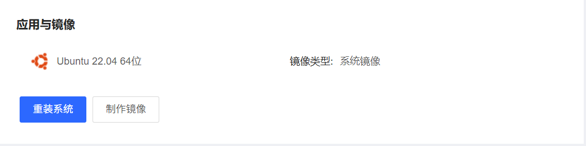
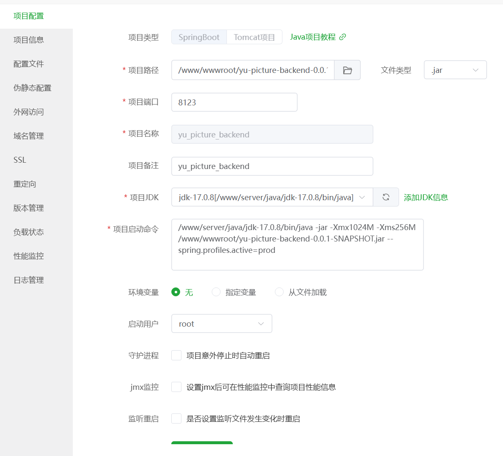

# 网站部署上线

本节重点内؜容是项目部署上线，可以独立学习，希望大家能够掌握这种快速上线项目的方法。

包括：

1. 服务器初始化
2. 部署规划
3. 安装依赖
4. 后端部署
5. 前端部署
6. 测试验证
7. 扩展知识

# 初始化服务器

首先购买一台云服务器，我选择的是[京东云](https://www.jdcloud.com/cn/productsoverview)618打折2核2G的只需49/年，其余厂商新人优惠还是比较便宜的。


然后安装Linux镜像，我这里选择的是Ubuntu：



之后再控制台页面放行几个端口号（否则无法访问）：


安装[宝塔Linux面板](https://www.bt.cn/new/index.html)：


进入面板，执行：


```Java
bt default
```


通过网页访问宝塔面板：


---

# 部署规划

在正式操作؜前后端部署前，我们要先进行一个规划，比如要部署哪些项目和服务、需要哪些依赖、占用哪些端口等。

## 部署方案

为了提高效؜率，本项目前端和后端均使用宝塔面板进行部署，可以很方便地管理服务器。

涉及到具体的部؜署方式，前端要遵循 Vue 项目的部署模式，基于 Nginx 运行；后端可以直接利用宝塔的 Java 项目管理器运行 jar 包。

## 地址规划

前端：通过 Nginx 进行转发，访问地址为 `http://{域名}`。

后端：通过 Nginx 进行转发，访问地址为 `http://{域名}/api`。实际运行在 8123 端口。JDK 建议选择 17 版本！

为什么要用 Nginx 转发？

前端和后端域名一致，保证不会出现跨域问题。

Nginx：服务器 80 端口，默认已安装。

数据库：服务器 3306 端口，默认已安装。

Redis：服务器 6379 端口，需要手动安装。

# 安装依赖

## 数据库

Mysql：


Redis：


## Java环境

要部署 Ja؜va 项目，必须安装 JDK。在宝塔面板中，可以通过下图的方式快速安装指定版本的 JDK。此处我们先安装 JDK 17：


# 后端部署

## 修改SpringBoot配置文件

修改 `application-prod` 生产环境配置，包括数据库、Redis、对象存储、阿里云百炼 AI 的 key 等，替换为上述安装依赖时指定的配置（如用户名、密码）。

注意为了性؜能，还要关闭 MyBatis Plus 的日志；为了安全，要给 Knife4j 接口文档设置用户名和密码。


```YAML
server:
  port: 8123
spring:
  # 数据库配置
  # todo 需替换配置
  datasource:
    driver-class-name: 
    url: 
    username: 
    password: 
  # Redis 配置
  # todo 需替换配置
  redis:
    database: 
    host: 
    port: 
    timeout: 
    password: 
mybatis-plus:
  configuration:
    # 生产环境关闭日志
    log-impl: ''
# 接口文档配置
knife4j:
  basic:
    enable: 
    username: 
    password: 
# 对象存储配置
cos:
  client:
    host: xxx
    secretId: xxx
    secretKey: xxx
    region: xxx
    bucket: xxx
# 阿里云 AI 配置
aliYunAi:
  apiKey: xxx

```

## 打包部署

使用maven直接进行打包：


上传 ja؜r 包到服务器，此处为了方便，就放到 web 根目录：


然后添加 Java 项目，**在项目执行命令中，必须指定生产环境的配置！** 还可以根据需要调整内存：



启动成功后，能够看到状态和端口占用如图：


## Nginx 转发

新建一个 ؜Nginx 站点，域名填写当前服务器 IP 或者自己的域名，根目录随意填写即可（只要不包含中文）：


如果访问的是后端接口（地址有 `/api` 前缀），则 Nginx 将请求转发到后端服务，对应配置代码如下：···


```Java
location /api {
  proxy_pass  http://127.0.0.1:8123;
  proxy_set_header Host $proxy_host;
  proxy_set_header X-Real-IP $remote_addr;
  proxy_set_header X-Forwarded-For $proxy_add_x_forwarded_for;
  proxy_buffering off;
  proxy_set_header Connection "";
}

```

但是，对于本项目؜，光有 HTTP 转发配置还不够！后端还需要提供 WebSocket 连接，所以也要对 WebSocket 进行转发，再给 Nginx 补充下列配置：


```Bash
# 代理 WebSocket 连接 (专门用于 WebSocket 请求)
location /api/ws {
  proxy_pass http://127.0.0.1:8123;
  proxy_http_version 1.1;
  proxy_set_header Upgrade $http_upgrade;
  proxy_set_header Connection "upgrade";
  proxy_set_header Host $host;
  proxy_set_header X-Real-IP $remote_addr;
  proxy_set_header X-Forwarded-For $proxy_add_x_forwarded_for;
  proxy_buffering off;
  proxy_read_timeout 86400s;
}
```

# 前端部署

## 修改配置

线上的前端需要请求线上的后端接口，所以需要修改 `request.ts` 文件中的请求地址为线上：


```TypeScript
// 区分开发和生产环境const DEV_BASE_URL = "http://localhost:8123";
const PROD_BASE_URL = "http://xxx";
// 创建 Axios 实例const myAxios = axios.create({
  baseURL: PROD_BASE_URL,
  timeout: 10000,
  withCredentials: true,
});
```

此外，由于本项目用到了 WebSocket，还要同步修改 `pictureEditWebSocket.ts` 文件中的 WebSocket 的连接地址：


```TypeScript
const DEV_BASE_URL = "ws://localhost:8123";
const PROD_BASE_URL = "ws://xxx";
const url = `${PROD_BASE_URL}/api/ws/picture/edit?pictureId=${this.pictureId}`
```

## 打包部署

1）参考 Vite 官网，在 `package.json` 文件中定义 `pure-build` 命令：


```SQL
{
  "scripts": {
    "dev": "vite",
    "pure-build": "vite build",
    "build": "run-p type-check \"build-only {@}\" --",
  }
}
```

为什么明明已经有 `build` 命令了，我们还要自己定义 `pure-build` 命令呢？

因为脚手架内置的 `build` 命令会执行类型检查，如果项目代码中有任何类型不规范的地方，都会导致打包失败！

2）执行 `pure-build` 命令，执行打包构建。

注意，如果 Node.js 版本较低，会构建失败，这时可以到 [官网](https://nodejs.org/zh-cn) 安装更新的版本，比如 v20.17.0 等长期支持版本。

构建成功后，可以得到用于部署的静态文件 `dist` 目录：


把 dist 目؜录下的所有文件上传到服务器上。文件较多时，建议先在本地压缩，上传压缩包到服务器后再解压。如图：


## Nginx 转发

一般来说，؜用户无法直接访问服务器上的文件，需要使用 Nginx 提供静态文件的访问能力。

修改已有站点的网站目录配置，指向前端文件根目录：


然后访问服؜务器地址（或者自己配置的域名），就能打开前端网站了：


但是经过验؜证，目前访问除了主页外的其他页面（比如 /add_picture），如果刷新页面，就会出现 404 错误。


这个问题是由于 Vue 是单页面应用（前端路由），打包后的文件只有 `index.html`，服务器上不存在对应的页面文件（比如 /add_picture.html），所以需要在 Nginx 配置转发。如果找不到某个页面文件，就加载主页 index.html 文件。

修改 Nginx 配置，补充下列代码：


```Java
location / {
  try_files $uri $uri/index.html /index.html;
}
```

