# 项目初始化

# 后端初始化

## 环境准备

1. 安装的JDK版本必须是8、11或17，不能超过17!

推荐使用11版本，因为后续可能要用到的缓存库Caffeine要求使用11版本。

1. MySQL数据库最好安装8.x版本，或者 5.7版本。

## 新建项目

在IDEA中新建项目，选择Spring Initializr模板，考虑到稳定性，此处选择创建Java 8版本的项目。

注意需要替换 Server URL 为 https://start.aliyun.com/，因为官方的 Server URL 不支持选择 Java 8。

配置如图：

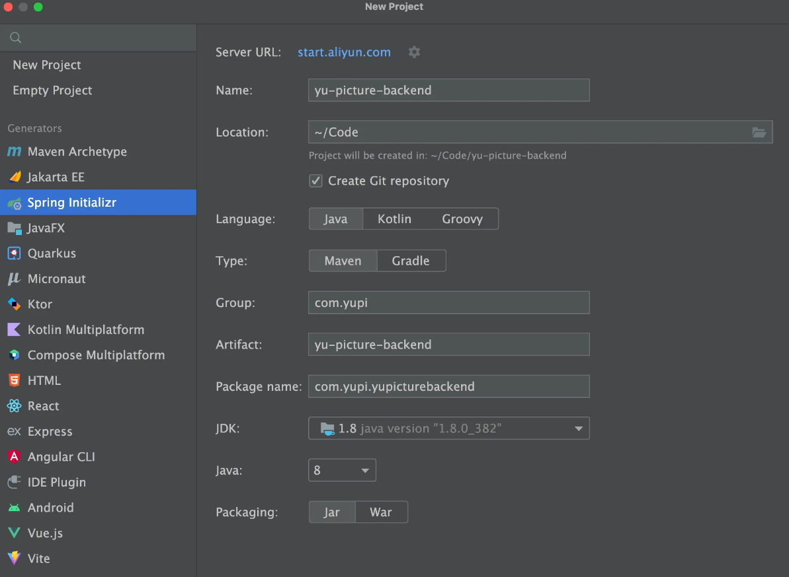

选择 Spring Boot 2.7.6 版本，可以根据自己的需要添加一些依赖，比如 Spring Web、MyBatis、MySQL、Lombok:

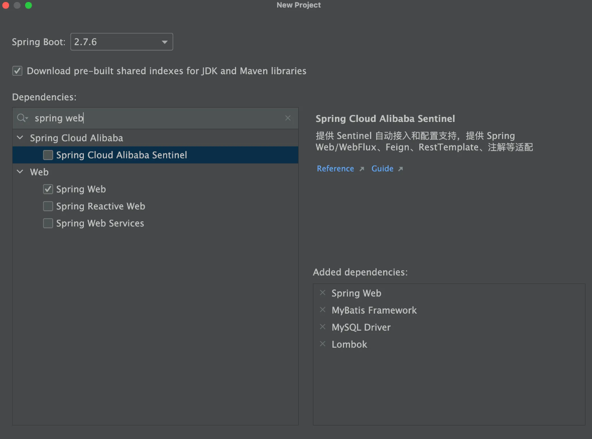

接下来配置我们需要连接的数据库，在springboot的配置文件application.yml中填写:


```YAML
server:
  port: 8123
  servlet:
    context-path: /api
spring:
  application:
    name: yu-picture-backend
  # 数据库配置
  datasource:
    driver-class-name: com.mysql.cj.jdbc.Driver
    url: jdbc:mysql://localhost:3306/yu_picture
    username: root
    password: 123456
```

项目正常启动成功

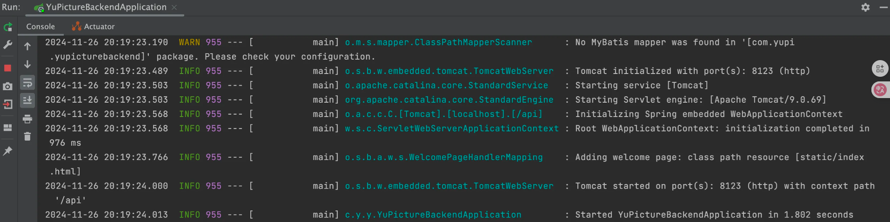

## 整合依赖

接下来我们要整合一些开发项目常用的依赖。

### MyBatis Plus 数据库操作

MyBatis Plus是MyBatis的增强工具，旨在简化开发流程。它提供了开箱即用的CRUD方法、动态查询构造器、分页插件和代码生成器等功能，大幅减少重复代码，同时保持与MyBatis原生功能的兼容性。例如，通过调用baseMapper.selectById(id)，可以直接查询数据库中的记录，而无需手动编写SQL。

参考官方文档引入:https://baomidou.com/getting-started/#spring-boot2

在 Maven 的 pom.xml 中添加依赖:


```XML
<dependency>
    <groupId>com.baomidou</groupId>
    <artifactId>mybatis-plus-boot-starter</artifactId>
    <version>3.5.9</version>
</dependency>
```

**引入Mybatis-Plus后需要将Mybatis的依赖删除，否则可能会报错**

在项目中新建mapper包，后续用于存放操作数据库的Mapper类，然后在项目启动类中添加扫描Mapper的@Mapperscan 注解:


```Java
@SpringBootApplication
@MapperScan("com.chengfu.yunpictureapi.mapper")
@EnableAspectJAutoProxy(exposeProxy = true)
public class YunPictureApiApplication {
    public static void main(String[] args) {
        SpringApplication.*run*(YunPictureApiApplication.class, args);
    }

}
```

在 application中追加配置，开启日志和逻辑删除功能：


```YAML
mybatis-plus:
  configuration:
    map-underscore-to-camel-case: false
    # 仅在开发环境开启日志
    log-impl: org.apache.ibatis.logging.stdout.StdOutImpl
  global-config:
    db-config:
      logic-delete-field: isDelete # 全局逻辑删除的实体字段名
      logic-delete-value: 1 # 逻辑已删除值（默认为 1）
      logic-not-delete-value: 0 # 逻辑未删除值（默认为 0）
```

### Hutool 工具库

Hutool 是主流的 Java 工具类库，集合了丰富的工具类，涵盖字符串处理、日期操作、文件处理、加解密、反射、正则匹配等常见功能。它的轻量化和无侵入性让开发者能够专注于业务逻辑而不必编写重复的工具代码。例如，`DateUtil.formatDate(new Date())` 可以快速将当前日期格式化为字符串。

参考官方文档引入：https://doc.hutool.cn/pages/index/#%F0%9F%8D%8A

在 Maven 的 `pom.xml` 中添加依赖：


```XML
<dependency>
    <groupId>cn.hutool</groupId>
    <artifactId>hutool-all</artifactId>
    <version>5.8.26</version>
</dependency>
```


### Knife4j 接口文档

Knife4j 是基于 Swagger 接口文档的增强工具，提供了更加友好的 API 文档界面和功能扩展，例如动态参数调试、分组文档等。它适合用于 Spring Boot 项目中，能够通过简单的配置自动生成接口文档，让开发者和前端快速了解和调试接口，提高协作效率。

参考官方文档引入：https://doc.xiaominfo.com/docs/quick-start#spring-boot-2

由于使用的是 Spring Boot 2.x，注意要选择 OpenAPI 2 的版本。

在 Maven 的 `pom.xml` 中添加依赖：


```XML
<dependency>
    <groupId>com.github.xiaoymin</groupId>
    <artifactId>knife4j-openapi2-spring-boot-starter</artifactId>
    <version>4.4.8</version>
</dependency>
```

### 其他依赖

可以按需引入其他依赖，比如 AOP 切面编程：


```XML
<dependency>
    <groupId>org.springframework.boot</groupId>
    <artifactId>spring-boot-starter-aop</artifactId>
</dependency>
```

给启动类添加注解（可选）：


```Java
@EnableAspectJAutoProxy(exposeProxy = true)
```

解释一下 `exposeProxy = true` 的作用：通过 Spring AOP 提供对当前代理对象的访问，使得可以在业务逻辑中访问到当前的代理对象。你可以在方法执行时通过 `AopContext.currentProxy()` 获取当前的代理对象。 

还有更多的依赖，后续我们随用随装。

## 通用基础代码

通用基础代码是指：无论在任何后端项目中，都可以复用的代码。这种代码一般“一辈子只用写一次”，了解作用之后复制粘贴即可，无需记忆。

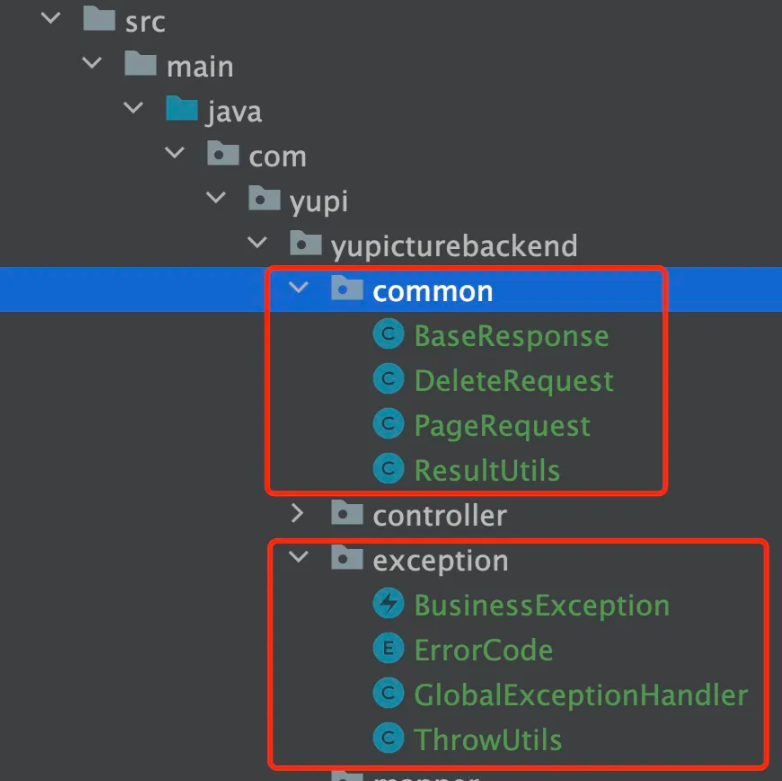

### 自定义异常

自定义错误码，对错误进行收敛，便于前端统一处理。  

💡 这里有 2 个小技巧：  

1. 自定义错误码时，建议跟主流的错误码（比如 HTTP 错误码）的含义保持一致，比如“未登录”定义为 40100，和 HTTP 401 错误（用户需要进行身份认证）保持一致，会更容易理解。  
2. 错误码不要完全连续，预留一些间隔，便于后续扩展。  

在 `exception` 包下新建错误码枚举类： 


```C++
@Getter
public enum ErrorCode {

    SUCCESS(0, "ok"),
    PARAMS_ERROR(40000, "请求参数错误"),
    NOT_LOGIN_ERROR(40100, "未登录"),
    NO_AUTH_ERROR(40101, "无权限"),
    NOT_FOUND_ERROR(40400, "请求数据不存在"),
    FORBIDDEN_ERROR(40300, "禁止访问"),
    SYSTEM_ERROR(50000, "系统内部异常"),
    OPERATION_ERROR(50001, "操作失败");

    /**
     * 状态码
     */
    private final int code;

    /**
     * 信息
     */
    private final String message;

    ErrorCode(int code, String message) {
        this.code = code;
        this.message = message;
    }

}
```

一般不建议直接抛出Java内置的RuntimeException，而是自定义一个业务异常，和内置的异常类区分开，便于定制化输出错误信息：


```Java
@Getter
public class BusinessException extends RuntimeException {

    /**
     * 错误码
     */
    private final int code;

    public BusinessException(int code, String message) {
        super(message);
        this.code = code;
    }

    public BusinessException(ErrorCode errorCode) {
        super(errorCode.getMessage());
        this.code = errorCode.getCode();
    }

    public BusinessException(ErrorCode errorCode, String message) {
        super(message);
        this.code = errorCode.getCode();
    }

}
```

为了更方便地根据情况抛出异常，可以封装一个ThrowUtils，类似断言类，简化抛异常的代码：


```TypeScript
public class ThrowUtils {

    /**
     * 条件成立则抛异常
     *
     * @param condition        条件
     * @param runtimeException 异常
     */
    public static void throwIf(boolean condition, RuntimeException runtimeException) {
        if (condition) {
            throw runtimeException;
        }
    }

    /**
     * 条件成立则抛异常
     *
     * @param condition 条件
     * @param errorCode 错误码
     */
    public static void throwIf(boolean condition, ErrorCode errorCode) {
        throwIf(condition, new BusinessException(errorCode));
    }

    /**
     * 条件成立则抛异常
     *
     * @param condition 条件
     * @param errorCode 错误码
     * @param message   错误信息
     */
    public static void throwIf(boolean condition, ErrorCode errorCode, String message) {
        throwIf(condition, new BusinessException(errorCode, message));
    }
}
```

### 响应包装类

一般情况下，每个后端接口都要返回调用码、数据、调用信息等，前端可以根据这些信息进行相应的处理。我们可以封装统一的响应结果类，便于前端统一获取这些信息。

通用响应类：


```Java
@Data
public class BaseResponse<T> implements Serializable {

    private int code;

    private T data;

    private String message;

    public BaseResponse(int code, T data, String message) {
        this.code = code;
        this.data = data;
        this.message = message;
    }

    public BaseResponse(int code, T data) {
        this(code, data, "");
    }

    public BaseResponse(ErrorCode errorCode) {
        this(errorCode.getCode(), null, errorCode.getMessage());
    }
}
```

但之后每次接口返回值时，都要手动new一个BaseResponse对象并传入参数，比较麻烦，我们可以新建一个工具类，提供成功调用和失败调用的方法，支持灵活地传参，简化调用。


```TypeScript
public class ResultUtils {

    /**
     * 成功
     *
     * @param data 数据
     * @param <T>  数据类型
     * @return 响应
     */
    public static <T> BaseResponse<T> success(T data) {
        return new BaseResponse<>(0, data, "ok");
    }

    /**
     * 失败
     *
     * @param errorCode 错误码
     * @return 响应
     */
    public static BaseResponse<?> error(ErrorCode errorCode) {
        return new BaseResponse<>(errorCode);
    }

    /**
     * 失败
     *
     * @param code    错误码
     * @param message 错误信息
     * @return 响应
     */
    public static BaseResponse<?> error(int code, String message) {
        return new BaseResponse<>(code, null, message);
    }

    /**
     * 失败
     *
     * @param errorCode 错误码
     * @return 响应
     */
    public static BaseResponse<?> error(ErrorCode errorCode, String message) {
        return new BaseResponse<>(errorCode.getCode(), null, message);
    }
}
```

### 全局异常处理器

为了防止意料之外的异常，利用AOP切面全局对业务异常和RuntimeException进行捕获:


```TypeScript
@RestControllerAdvice
@Slf4j
public class GlobalExceptionHandler {

    @ExceptionHandler(BusinessException.class)
    public BaseResponse<?> businessExceptionHandler(BusinessException e) {
        log.error("BusinessException", e);
        return ResultUtils.error(e.getCode(), e.getMessage());
    }

    @ExceptionHandler(RuntimeException.class)
    public BaseResponse<?> runtimeExceptionHandler(RuntimeException e) {
        log.error("RuntimeException", e);
        return ResultUtils.error(ErrorCode.SYSTEM_ERROR, "系统错误");
    }
}
```

### 请求包装类

对于“分页”、“删除某条数据”这类通用的请求，可以封装统一的请求包装类，用于接受前端传来的参数，之后相同参数的请求就不用专门再新建一个类了。

分页请求包装类，接受页号、页面大小、排序字段、排序顺序参数：


```Java
@Data
public class PageRequest {

    /**
     * 当前页号
     */
    private int current = 1;

    /**
     * 页面大小
     */
    private int pageSize = 10;

    /**
     * 排序字段
     */
    private String sortField;

    /**
     * 排序顺序（默认降序）
     */
    private String sortOrder = "descend";
}
```

删除请求包装类，接受要删除数据的id作为参数：


```Java
@Data
public class DeleteRequest implements Serializable {

    /**
     * id
     */
    private Long id;

    private static final long serialVersionUID = 1L;
}
```

### 全局跨域配置

跨域是指浏览器访问的URL（前端地址）和后端接口地址的域名（或端口号）不一致导致的，浏览器为了安全，默认禁止跨域请求访问。

为了开发调试方便，我们可以通过全局跨域配置，让整个项目所有的接口支持跨域，解决跨域报错。

新建config包，用于存放所有的配置相关代码。全局跨域配置代码如下：


```TypeScript
@Configuration
public class CorsConfig implements WebMvcConfigurer {

    @Override
    public void addCorsMappings(CorsRegistry registry) {
        // 覆盖所有请求
        registry.addMapping("/**")
                // 允许发送 Cookie
                .allowCredentials(true)
                // 放行哪些域名（必须用 patterns，否则 * 会和 allowCredentials 冲突）
                .allowedOriginPatterns("*")
                .allowedMethods("GET", "POST", "PUT", "DELETE", "OPTIONS")
                .allowedHeaders("*")
                .exposedHeaders("*");
    }
}
```

# 前端项目初始化

## 环境准备

前端Node.js版本必须>=18.12，这里推荐20版本。在官网安装好Node后会自动安装NPM前端包管理器。

## 新建项目

使用Vue官方推荐的脚手架create-vue快速创建Vue3的项目：https://cn.vuejs.org/guide/quick-start.html

Vue 提供了在线编码测试，可以通过 Playground 来学习Vue:https://play.vuejs.org/

在终端中输入命令：


```Java
npm create vue@latest
```

NPM会自动安装 create-vue 工具:

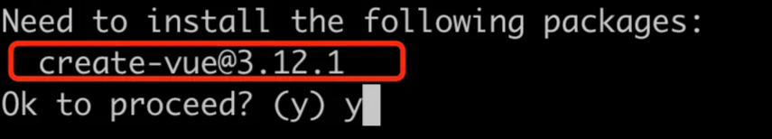

接下来按照如下选项创建项目，脚手架会自动帮我们安装VueRouter路由、Pinia全局状态管理等实用类库

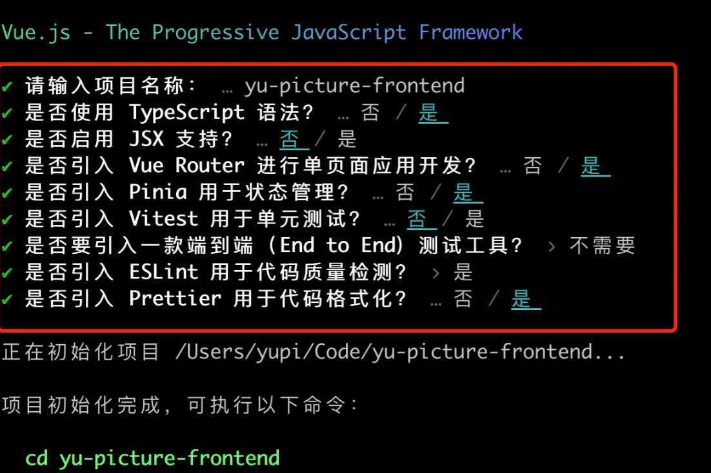

然后用WebStorm打开项目，先在终端执行npm install安装依赖，然后执行npmrundev能访问网页就成功了。

## 前端工程化

脚手架已经帮我们整合了Prettier代码美化、ESLint自动校验、TypeScript类型校验，无需再自行整合。

但是需要在webstorm里开启代码美化插件：

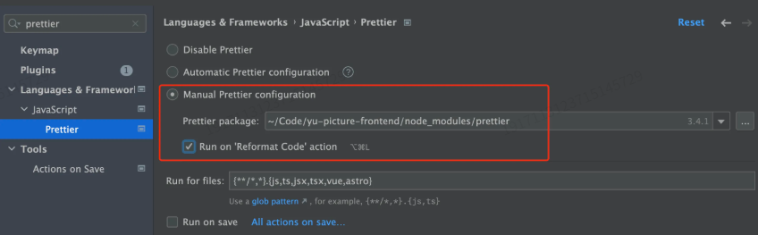

在vue文件中执行格式化快捷键，不报错，表示配置工程化成功。

修改 eslint.config.js、.prettierrc.json、tsconfig.json文件可以改变校验规则。

如果不使用脚手架，就需要自己整合这些工具：

* 代码规范:https://eslint.org/docs/latest/use/getting-started
* 代码美化:https://prettier.io/docs/en/install.html
* 直接整合:https://github.com/prettier/eslint-plugin-prettier#recommended-configuration(包括了https://github.com/prettier/eslint-config-prettier#installation)

对于前端新手来说，你不需要深入了解这些，纯当工具去使用即可，应该尽快上手项目。

## 引入组件库

引入ant-design组件库，可以根据[官方文档](https://antdv.com/docs/vue/getting-started-cn)快速上手

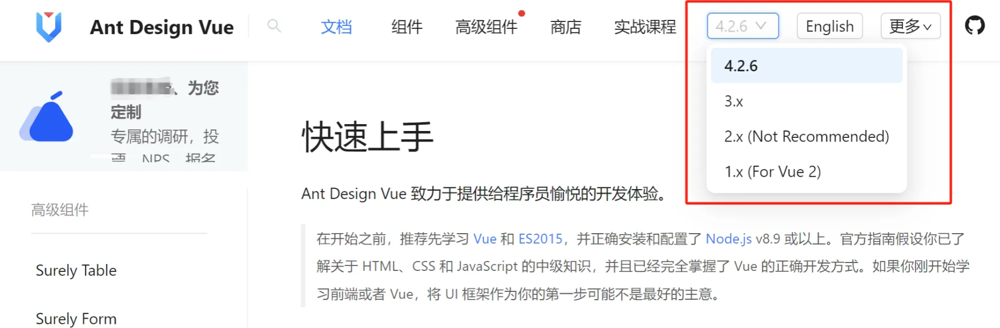

安装组件库


```Java
npm i --save ant-design-vue@4.x
```

更改全局入口文件main.ts，全局注册组件


```JavaScript
import App from './App.vue'
import router from './router'
import Antd from "ant-design-vue";
import "ant-design-vue/dist/reset.css";

const app = createApp(App)
app.use(Antd);
app.use(createPinia())
app.use(router)

app.mount('#app')
```

## 开发规范

建议遵循Vue3的组合式API(Composition AP)，而不是选项式API，开发更自由高效一些。

示例代码


```XML
<template>
  <div id="xxPage">

  </div>
</template>

<script setup lang="ts">

</script>

<style scoped>
#xxPage {
}

</style>
```

## 页面基本信息

可以修改项目根目录下的 `index.html` 文件，来定义页面的元信息，比如修改标题：


```HTML
<!DOCTYPE html>
<html lang="">
  <head>
    <meta charset="UTF-8" />
    <link rel="icon" href="/favicon.ico" />
    <meta name="viewport" content="width=device-width, initial-scale=1.0" />
    <title>修改后的标题</title>
  </head>
  <body>
    <div id="app"></div>
    <script type="module" src="/src/main.ts"></script>
  </body>
</html>
```

还可以替换 `public` 目录下默认的 `favicon` 图标为自己的，有很多现成的网站可以制作 `favicon` 图标。  

## 全局通用布局

### 基础布局结构

在 `layouts` 目录下新建一个布局 `BasicLayout.vue` ，在 `App.vue` 全局入口文件中引入。  

`App.vue` 代码如下：


```TypeScript
<template>
  <div id="app">
    <BasicLayout />
  </div>
</template>

<script setup lang="ts">
import BasicLayout from '@/layouts/BasicLayout.vue';
</script>
```

可以修改页面内的默认样式，并且移除 `main.ts` 中默认引入的 `main.css` ，防止样式污染：  


```CSS
<style>
#app {
  /* 样式内容 */
}
</style>
```

使用 `Ant Design Vue` 组件库的 `Layout` 组件，先把【上+中】布局搭建好，然后再填充内容：  

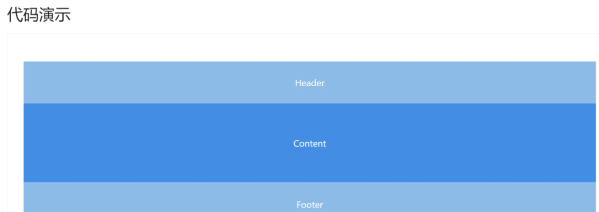

以下是按技术文档风格整理的 Markdown 内容，保留代码块、标题层级和逻辑结构：

代码如下：


```PlainText
<template>
  <div id="BasicLayout">
    <a-layout style="min-height: 100vh">
      <a-layout-header>Header</a-layout-header>
      <a-layout-content>Content</a-layout-content>
      <a-layout-footer>Footer</a-layout-footer>
    </a-layout>
  </div>
</template>

<script setup lang="ts"></script>
```

**样式**：  


```TypeScript
<style scoped>
.BasicLayout {
}
</style>
```

### 全局底部栏

通常用于展示版权信息：  


```TypeScript
<a-layout-footer class="footer">
  <a href="https://github.com/chengfushi" target="_blank"> Github By ChengFu </a>
</a-layout-footer>
```

**样式**：  


```TypeScript
<style scoped>
.BasicLayout .footer {
  background: #effeff;
  padding: 16px;
  position: fixed;
  bottom: 0;
  left: 0;
  width: 100%;
  text-align: center;
}
</style>
```

### 动态替换内容

项目使用了 Vue Router 路由库，可以在 `router/index.ts` 配置路由，能根据不同的访问地址映射到不同的文件并加载渲染。  

修改 `BasicLayout` 内部内容的代码如下：  


```TypeScript
<a-layout-content class="content">
  <RouterView />
</a-layout-content>
```

**修改样式**：要和底部栏保持一定的外边距，否则内容会被遮住：  


```TypeScript
<style scoped>
.BasicLayout .content {
  background: linear-gradient(to right, #effeff, #fff);
  margin-bottom: 28px; 
  padding: 20px;
}
</style>
```

以下是整合并转换为 Markdown 格式的内容，按技术文档逻辑梳理，保留代码、步骤和效果说明：  

### 全局顶部栏

由于项目的开发相对复杂，可以基于 **Ant Design** 的菜单组件，封装 `GlobalHeader` 全局顶部栏组件，组件统一放在 `components` 目录中。  

先直接复制现成的组件示例代码到 `GlobalHeader.vue` 中即可。  

代码演示


```HTML
<template>
  <a-menu
    v-model:selectedKeys="current"
    mode="horizontal"
    :items="items"
  />
</template>

<script setup>
import { ref } from 'vue';
import { Menu } from 'ant-design-vue';
const { SubMenu } = Menu;

const current = ref<string[]>(['1']);
const items: MenuItems[] = [
  {
    key: '1',
    label: 'Navigation One',
  },
  {
    key: '2',
    label: 'Navigation Two',
  },
  {
    key: '3',
    label: 'Navigation Three - Submenu',
    children: [
      {
        key: '3-1',
        label: 'Option 1',
      },
      {
        key: '3-2',
        label: 'Option 2',
      },
    ],
  },
  {
    key: '4',
    label: 'Navigation Four - Link',
    href: 'https://www.antdv.com',
  },
];
</script>
```

在基础布局中引入顶部栏组件


```PlainText
<template>
  <a-layout-header class="header">
    <GlobalHeader />
  </a-layout-header>
</template>

<script setup lang="ts">
import GlobalHeader from '@/components/GlobalHeader.vue';
</script>
```

修改顶部 Header 样式

清除一些默认样式（比如背景色），样式代码如下：  


```CSS
.BasicLayout .header {
  padding: 0;
  margin-bottom: 8px;
  color: unset;
  background: unset;
}
```

完善 GlobalHeader 组件，补充更多内容

1. 给菜单外包裹一层元素，用于整体控制样式


```PlainText
<template>
  <div class="global-header">
    <a-menu
      v-model:selectedKeys="current"
      mode="horizontal"
      :items="items"
    />
  </div>
</template>
```

1. 根据需求修改菜单配置（`key` 为要跳转的 URL 路径）


```PlainText
<script setup lang="ts">
import { ref } from 'vue';
import { Menu } from 'ant-design-vue';
import { HomeOutlined, UserOutlined } from '@ant-design/icons-vue';
import router from '@/router'; 

const current = ref<string[]>([router.currentRoute.value.name as string]);
const items: Menu.MenuItem[] = [
  {
    key: 'home',
    icon: () => <HomeOutlined />,
    label: '主页',
    title: '主页',
  },
  {
    key: 'about',
    icon: () => <UserOutlined />,
    label: '关于',
    title: '关于',
  },
  {
    key: 'others',
    label: (
      <a href="https://www.codefather.cn" target="_blank">
        编程导航
      </a>
    ),
    title: '编程导航',
  },
];
</script>
```

1. 完善全局顶部栏，左侧补充网站图标和标题

* 把 `logo.png` 放到 `src/assets` 目录下，替换掉原本的默认 Logo。  
* 修改 `GlobalHeader` 代码，补充 HTML 结构：  


```PlainText
<template>
  <div class="title-bar">
    <div class="logo" to="/">
      
    </div>
    <div class="title">z智图云链</div>
  </div>
  <a-menu
    v-model:selectedKeys="current"
    mode="horizontal"
    :items="items"
  />
</template>
```

其中，`RouterLink` 组件的作用是保持路由跳转（不刷新页面）。  

补充 CSS 样式


```CSS
<style scoped>
.title-bar {
  display: flex;
  align-items: center;
}

.title {
  color: black;
  font-size: 20px;
  margin-left: 10px;
}

.logo-img {
  height: 40px;
}
</style>
```

1. 完善全局导航栏，右侧展示当前用户的登录状态（临时用登录按钮替代）


```PlainText
<template>
  <div class="user-login-status">
    <a-button type="primary" href="/user/login">登录</a-button>
  </div>
</template>
```

1. 优化导航栏布局，采用栅格组件的自适应布局（左中右结构：左侧有 Logo 标题、中间放菜单、右侧放登录按钮）


```PlainText
<template>
  <a-row>
    <a-col flex="200px">
      <div class="title-bar">
        
        <div class="title">智图云链</div>
      </div>
    </a-col>
    <a-col flex="auto">
      <a-menu
        v-model:selectedKeys="current"
        mode="horizontal"
        :items="items"
      />
    </a-col>
    <a-col flex="120px">
      <div class="user-login-status">
        <a-button type="primary" href="/user/login">登录</a-button>
      </div>
    </a-col>
  </a-row>
</template>
```

效果说明

可以通过缩小浏览器窗口，观察导航条的响应式变化（如：小屏幕下布局自动调整 ）。  

以上是完整的全局顶部栏组件封装和布局优化流程，可根据实际需求调整样式、菜单配置和交互逻辑~


## 路由

目标：点击菜单项目后，可以跳转到对应的页面；并且新页面加载后，对应的菜单自动高亮。

### 修改路由配置

修改`router/index.ts`文件的`routes`配置，定义我们需要的页面路由，每个`path`对应一个`component`（要加载的组件）：


```TypeScript
routes: [
  {
    path: '/',
    name: 'home',
    component: HomeView,
  },
  {
    path: '/about',
    // route level code-splitting
    // this generates a separate chunk (About.[hash].js) for this route
    // which is lazy-loaded when the route is visited.
    component: () => import('../views/AboutView.vue'),
  },
];
```

观察上述代码，会发现`component`支持直接写入组件、或者使用`import`按需加载组件，按需加载是一种优化首次打开站点加载耗时的方式。

### 路由跳转

给`GlobalHeader`的菜单组件绑定跳转事件：


```TypeScript
import { useRouter } from 'vue-router';
const router = useRouter();

// 点击跳转事件
const defaultClick = ({ key }: { key: string }) => {
  router.push({
    path: key,
  });
};
```

**修改 HTML 模板，绑定事件**


```PlainText
<a-menu
  v-model:selectedKeys="current"
  mode="horizontal"
  @click="defaultClick"
>
  <a-menu-item key="/">Home</a-menu-item>
  <a-menu-item key="/about">About</a-menu-item>
</a-menu>
```

### 高亮同步

刷新页面后，你会发现当前的菜单并没有高亮，所以需要同步路由的更新到菜单的高亮。

**同步高亮原理**：

1. 点击菜单时，Ant Design 组件已经通过`v-model`绑定`current`变量实现了高亮。
2. 刷新页面时，需要获取到当前 URL 的路径，然后修改`current`变量的值，从而实现同步。

使用 Vue Router 的`afterEach`路由钩子实现，每次改变路由或刷新页面时都会自动更新`current`的值，从而实现高亮：


```TypeScript
const router = useRouter();
const current = ref<string[]>([]);

// 监听路由变化，更新当前选中的菜单
router.afterEach((to, from, next) => {
  current.value = [to.path];
});
```

## 请求

一般情况下，前端主要负责页面展示和动效交互，尽量避免写复杂的逻辑；当需要获取数据时，通常向后端提供的接口发送请求，再根据执行操作（比如保存数据）并响应数据的渲染。

前端如何向后端发送请求呢？最传统的方式是使用 AJAX 技术，但其代码有些复杂，我们可以使用第三方的封装库，来简化发送请求的代码，比如主流的请求工具库 Axios。

### 请求工具库

安装请求工具类 Axios，参考官方文档：https://axios-http.com/docs/intro


```Shell
npm install axios
```

### 全局自定义请求

需要自定义全局请求的拦截器，参考 Axios 官方文档，编写请求配置文件 `request.ts`，包含全局接口请求地址、超时时间、自定义请求头携带参数等。

**响应拦截器的应用场景**：我们需要对接口的**通用响应** 进行统一处理，比如从 response 中取出 data；或者根据 code 去集中处理错误，这样不用在每个接口请求中都写相同的逻辑。

比如可以在全局响应拦截器中，读取结果里的 data，并校验 code 是否合法，如果是未登录状态，则自动跳转。

**示例代码**（其中 `withCredentials: true` 一定要写，否则无法在发送请求时携带 Cookie，就无法完成登录）：


```TypeScript
import axios from 'axios'
import { message } from 'ant-design-vue'

// 创建 Axios 实例
const myAxios = axios.create({
  baseURL: 'http://localhost:8822',
  timeout: 60000,
  withCredentials: true,
})

// 全局请求拦截器
myAxios.interceptors.request.use(
  function (config) {
    // Do something before request is sent
    return config
  },
  function (error) {
    // Do something with request error
    return Promise.reject(error)
  },
)

// 全局响应拦截器
myAxios.interceptors.response.use(
  function (response) {
    const { data } = response
    // 未登录时，后端返回 40300 并且用户操作不是访问用户登录页面，则跳转登录页面
    if (data.code === 40300) {
      if (
        response.request.responseURL.includes('user/getUserLogin') &&
        window.location.pathname !== '/user/login'
      ) {
        message.warning('请先登录')
        window.location.href = `/user/login?redirect=${window.location.href}`
      }
    }
    return response
  },
  function (error) {
    // Any status codes that falls outside the range of 2xx cause this function to trigger
    // Do something with response error
    return Promise.reject(error)
  },
)

export default myAxios
```

### 自动生成请求代码

如果采用传统开发方式，针对每个请求都要单独编写代码，很麻烦。

推荐使用 **OpenAPI** 工具，直接自动生成接口：https://www.npmjs.com/package/@umijs/openapi

**按照官方文档的步骤，先安装**：


```Shell
npm i --save-dev @umijs/openapi
```

**在 “项目根目录” 新建**`**openapi.config.ts**` ，**根据自己的需要定制生成的代码** ：


```TypeScript
import { generateService } from '@umijs/openapi'

generateService({
  requestLibPath: "import request from '@/request'",
  schemaPath: 'http://localhost:8822/api/v2/api-docs',
  serversPath: './src',
})
```

**注意**：要将 `schemaPath` 改为自己后端服务提供的 Swagger 接口文档的地址。

执行 OpenAPI 的脚本（如 `openapi: "openapi:generate openapi.config.ts"`），即可自动生成请求代码，还包括 TypeScript 类型。

以后每次后端接口变更时，只要重新生成一遍就好，非常方便~ 

## 全局状态管理

什么是全局状态管理？

答：所有页面全局共享的变量，而不是局限在某一个页面中。

适合作为全局状态的数据：已登录用户信息（每个页面几乎都要用） 

Pinia 是一个主流的状态管理器，相比于 Vuex 来说使用更简单，可参考 [文档](https://pinia.vuejs.org/introduction.html) 进行引入。

### 引入 Pinia

此项目由 `create-vue` 脚手架已经帮我们整合了 Pinia，无需手动引入，直接使用即可。

### 定义状态

在 `src/stores` 目录下定义 `user` 模块，定义了用户的存储、组织获取、修改逻辑：


```TypeScript
import { defineStore } from 'pinia';
import { ref } from 'vue';

export const useLoginUserStore = defineStore('loginUser', () => {
  const loginUser = ref<any>({
    username: '未登录',
  });

  async function fetchLoginUser() {
    // todo 后面演示获取接口后，修改数据
    // const res = await getCurrentUser();
    // if (res.data.code === 0 && res.data.data) {
    //   loginUser.value = res.data.data;
    // }
  }

  function setLoginUser(newLoginUser: any) {
    loginUser.value = newLoginUser;
  }

  return { loginUser, setLoginUser, fetchLoginUser };
});
```

### 使用状态

可以直接使用 `store` 中导出的状态变量和函数。

在首次进入项目时，一般我们会先获取登录用户信息，修改 `App.vue`，编写远程获取数据代码：


```TypeScript
const loginUserStore = useLoginUserStore()
loginUserStore.fetchLoginUser()
```

在任意页面中都可以使用状态，比如 `GlobalHeader` 全局顶部组件中直接展示：


```TypeScript
{{ JSON.stringify(loginUserStore.loginUser) }}
```

修改全局顶部组件，在右侧展示登录状态：


```PlainText
<div class="user-info-stats">
  <div v-if="loginUserStore.loginUser.id">
    {{ loginUserStore.loginUser.username }} 欢迎您！
  </div>
  <div v-else>
    <a-button type="primary" href="/user/login">登录</a-button>
  </div>
</div>
```

## 页面开发流程

我们通过开发一个简易的示例页面，来了解页面开发的流程。

1. 新建src/pages目录，用于存放所有的页面文件。

然后在pages目录下新建页面文件，将所有页面按照url层级进行创建，并且页面名称尽量做到“见名知意”。

举个例子：

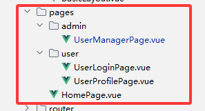

其中，/user/login 地址就对应了UserLoginPage

此处我们新建 HomePage.vue 即可。

1. 每次新建页面时，需要在router/index.ts中配置路由，比如欢迎页的路由为：


```Java
const routes: Array<RouteRecordRaw> = [
  {
    path: "/",
    name: "home",
    component: HomeView,
  },
  ...
]
```

然后在路由文件中，引入页面 HomePage:


```JavaScript
import HomePage from "@/pages/HomePage.vue";

const routes: Array<RouteRecordRaw> = [
  {
    path: "/",
    name: "home",
    component: HomePage,
  },
  ...
]
```

任意修改界面代码


```XML
<template>
  <div id="homePage">
    <h1>欢迎来到智图运链云图库，项目应用场景广泛，可作为表情包网站、设计素材网站、壁纸网站、个人云盘、企业活动相册等</h1>
  </div>
</template>
<script setup lang="ts"></script>
<style scoped></style>
```

整体效果

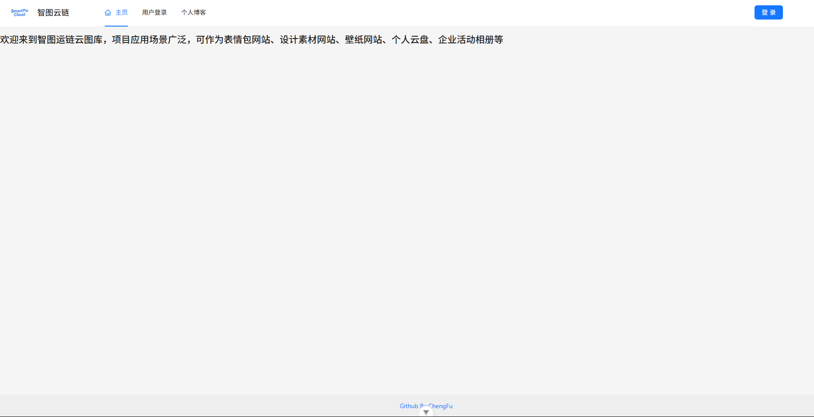

---


